# ⚡ Dynamic Form Generation

> **Goal**: Generate forms from JSON configuration at runtime.


## 📋 Table of Contents
- [🏛️ What Problem Does It Solve?](#what-problem-does-it-solve)
  - [The "CMS / Configurable UI" Problem](#the-cms--configurable-ui-problem)
- [🔬 Deep Dive: Important Classes & Directives](#deep-dive-important-classes--directives)
  - [A. The Classes (TypeScript Side)](#a-the-classes-typescript-side)
  - [B. The Directives (HTML Side)](#b-the-directives-html-side)
- [1. 🔍 How It Works (The Concept)](#1--how-it-works-the-concept)
  - [The Core Mechanism](#the-core-mechanism)
  - [📊 Dynamic Generation Flow](#dynamic-generation-flow)
- [2. 🚀 Step-by-Step Implementation Guide](#2--step-by-step-implementation-guide)
  - [Step 1: Define Config Interface](#step-1-define-config-interface)
  - [Step 2: Build Form Dynamically](#step-2-build-form-dynamically)
  - [Step 3: Render Dynamic Template](#step-3-render-dynamic-template)
- [3. 🌍 Real World Use Cases](#3--real-world-use-cases)
  - [📦 Data Flow Summary (Visual Box Diagram)](#data-flow-summary-visual-box-diagram)
- [7. ❓ Interview & Concept Questions](#7--interview--concept-questions)
  - [Q1: How do you add a control to a FormGroup at runtime?](#q1-how-do-you-add-a-control-to-a-formgroup-at-runtime)
  - [Q2: How do you remove a control dynamically?](#q2-how-do-you-remove-a-control-dynamically)
  - [Q3: How do you update validators for a dynamic field?](#q3-how-do-you-update-validators-for-a-dynamic-field)
  - [Q4: How do you handle Typed Forms with dynamic keys?](#q4-how-do-you-handle-typed-forms-with-dynamic-keys)
  - [Q5: Difference between `addControl` and `registerControl`?](#q5-difference-between-addcontrol-and-registercontrol)
  - [Q6: Can you move a control from one group to another?](#q6-can-you-move-a-control-from-one-group-to-another)
  - [Q7: (Scenario) JSON Config defines 'select' options. How to bind?](#q7-scenario-json-config-defines-select-options-how-to-bind)
  - [Q8: How to handle different validation rules from JSON?](#q8-how-to-handle-different-validation-rules-from-json)
  - [Q9: What is `FormRecord` in Angular 14+?](#q9-what-is-formrecord-in-angular-14)
  - [Q10: How do you persist the dynamic form value?](#q10-how-do-you-persist-the-dynamic-form-value)
  - [Q11: How to render a "Datepicker" vs "Text Input"?](#q11-how-to-render-a-datepicker-vs-text-input)
  - [Q12: Steps to create a "Wizard" (Multi-step form)?](#q12-steps-to-create-a-wizard-multi-step-form)
  - [Q13: How to check if a dynamic control exists?](#q13-how-to-check-if-a-dynamic-control-exists)
  - [Q14: (Scenario) Performance Issues with 500+ dynamic fields?](#q14-scenario-performance-issues-with-500-dynamic-fields)
  - [Q15: Can `formControlName` bind to a variable?](#q15-can-formcontrolname-bind-to-a-variable)
  - [Q16: How to handle dependency between dynamic fields (e.g., Country -> State)?](#q16-how-to-handle-dependency-between-dynamic-fields-eg-country---state)
  - [Q17: What if the JSON config is invalid?](#q17-what-if-the-json-config-is-invalid)
  - [Q18: How to sort the fields?](#q18-how-to-sort-the-fields)
  - [Q19: Can I use `FormBuilder` for dynamic forms?](#q19-can-i-use-formbuilder-for-dynamic-forms)
  - [Q20: How to set default values for dynamic fields?](#q20-how-to-set-default-values-for-dynamic-fields)
- [🧠 Mind Map: Quick Visual Reference](#mind-map-quick-visual-reference)

---
---

---

## 🏛️ What Problem Does It Solve?

### The "CMS / Configurable UI" Problem
*   **The Problem**: Your app creates forms for *other* apps (e.g., a Survey Builder, or a Headless CMS). You don't know the fields until runtime when you fetch a JSON schema.
*   **The Solution**: Reactive Forms are inherently dynamic. You can loop through a JSON definition and instantiate a `FormGroup` on the fly.
*   **The Benefit**: Zero code changes to add a new field. Just update the JSON in the database.

---

## 🔬 Deep Dive: Important Classes & Directives

### A. The Classes (TypeScript Side)
1.  **`FormControl` (Dynamic Creation)**:
    *   Normally we say `email: new FormControl()`. Here, we say `controls[key] = new FormControl()`.
    *   *Key Concept*: A FormGroup is just a wrapper around a Map of controls. You can `addControl` and `removeControl` at any time.

2.  **`Record<string, AbstractControl>`**:
    *   Since the key names (`firstName`, `age`) are dynamic, we often use the TypeScript `Record` or Index Signature type when building the object manually before passing it to `new FormGroup()`.

### B. The Directives (HTML Side)
1.  **`@switch` (Control Flow)**:
    *   Crucial for rendering different input types (`text`, `select`, `checkbox`) based on the string value in the config.

2.  **`[formControlName]` (Dynamic)**:
    *   Works perfectly with variables: `<input [formControlName]="field.key">`.

---

## 1. 🔍 How It Works (The Concept)

### The Core Mechanism

Instead of hardcoding form structure, we:
1. Define a configuration schema (JSON/interface)
2. Loop over the config to create FormControls dynamically
3. Build a FormGroup from these controls

### 📊 Dynamic Generation Flow

```mermaid
%%{init: {'theme':'base', 'themeVariables': { 'primaryColor':'#667eea'}}}%%
flowchart LR
    Config["📋 JSON Config"] --> Loop["🔄 Loop Fields"]
    Loop --> FC["Create FormControl"]
    FC --> FG["Build FormGroup"]
    FG --> Template["Render Template"]
    
    style Config fill:#667eea,color:#fff
    style FG fill:#764ba2,color:#fff
```



---

## 2. 🚀 Step-by-Step Implementation Guide

### Step 1: Define Config Interface

```typescript
interface FieldConfig {
    name: string;
    label: string;
    type: 'text' | 'email' | 'number' | 'select';
    required?: boolean;
    options?: string[];
}
```

### Step 2: Build Form Dynamically

```typescript
buildForm(config: FieldConfig[]): FormGroup {
    const controls: { [key: string]: FormControl } = {};
    
    config.forEach(field => {
        const validators = field.required ? [Validators.required] : [];
        controls[field.name] = new FormControl('', validators);
    });
    
    return new FormGroup(controls);
}
```

### Step 3: Render Dynamic Template

```html
@for (field of formConfig; track field.name) {
    <div class="form-group">
        <label>{{ field.label }}</label>
        
        @switch (field.type) {
            @case ('text') {
                <input type="text" [formControlName]="field.name">
            }
            @case ('select') {
                <select [formControlName]="field.name">
                    @for (opt of field.options; track opt) {
                        <option [value]="opt">{{ opt }}</option>
                    }
                </select>
            }
        }
    </div>
}
```

---

## 3. 🌍 Real World Use Cases

1. **CMS Admin Panels**: Form fields defined by content schema.
2. **Survey Builders**: Questions configured by users.
3. **Settings Pages**: Config-driven preferences.
4. **🔍 API Filter Builder**: Users add criteria row by row (e.g., "Name contains X" AND "Date > Y").
5. **⚙️ Workflow Engine**: Form changes based on the current step/status of a ticket.
6. **🧪 A/B Testing**: Serving different form layouts/fields to different users based on a flag.
7. **🔌 IoT Device Config**: Rendering controls based on the capabilities JSON reported by the device.

---

### 📦 Data Flow Summary (Visual Box Diagram)

```
┌─────────────────────────────────────────────────────────────┐
│  DYNAMIC FORM GENERATION FROM CONFIG                        │
│                                                             │
│   CONFIG SCHEMA:                                            │
│   ┌───────────────────────────────────────────────────────┐ │
│   │ const formConfig = [                                  │ │
│   │   { name: 'email', type: 'email', required: true },   │ │
│   │   { name: 'age', type: 'number', required: false },   │ │
│   │   { name: 'role', type: 'select', options: [...] }    │ │
│   │ ];                                                    │ │
│   └───────────────────────────────────────────────────────┘ │
│                                                             │
│   BUILD FORMGROUP:                                          │
│   ┌───────────────────────────────────────────────────────┐ │
│   │ buildForm(config: FieldConfig[]) {                    │ │
│   │   const controls = {};                                │ │
│   │   config.forEach(field => {                           │ │
│   │     const validators = field.required                 │ │
│   │       ? [Validators.required] : [];                   │ │
│   │     controls[field.name] = new FormControl('', validators);│ │
│   │   });                                                 │ │
│   │   return new FormGroup(controls);                     │ │
│   │ }                                                     │ │
│   └───────────────────────────────────────────────────────┘ │
│                                                             │
│   RENDER: @switch (field.type) { @case('select') {...} }   │
└─────────────────────────────────────────────────────────────┘
```

> **Key Takeaway**: Loop over JSON config to create FormControls dynamically. Use @switch for different input types!


---

## 7. ❓ Interview & Concept Questions

### Q1: How do you add a control to a FormGroup at runtime?
**A:** `form.addControl('newKey', new FormControl(''))`.

### Q2: How do you remove a control dynamically?
**A:** `form.removeControl('key')`.

### Q3: How do you update validators for a dynamic field?
**A:** `control.setValidators([...]); control.updateValueAndValidity();`

### Q4: How do you handle Typed Forms with dynamic keys?
**A:** Uses `Record<string, FormControl<type>>` or simply `FormGroup<any>` (untyped) if the keys are truly unknown. Angular 14+ `FormRecord` is specifically designed for this.

### Q5: Difference between `addControl` and `registerControl`?
**A:** `addControl` updates the value/validity of the parent. `registerControl` is an internal method that adds it without triggering updates (rarely used publicly).

### Q6: Can you move a control from one group to another?
**A:** Yes, but you must remove it from the first and add it to the second. Controls hold a reference to their parent (`.parent`), so simply reassigning isn't enough.

### Q7: (Scenario) JSON Config defines 'select' options. How to bind?
**A:** Iterate over `field.options` in the template:
```html
<select [formControlName]="field.name">
  @for (opt of field.options; track opt) { <option [value]="opt">{{opt}}</option> }
</select>
```

### Q8: How to handle different validation rules from JSON?
**A:** Map string names ('required') to actual Validators:
```typescript
const validatorMap = { required: Validators.required, email: Validators.email };
const activeValidators = field.validators.map(v => validatorMap[v]);
```

### Q9: What is `FormRecord` in Angular 14+?
**A:** A specialized `FormGroup` where all children have the same type, but keys are dynamic. Useful for generic property bags.

### Q10: How do you persist the dynamic form value?
**A:** `form.value` returns a standard JSON object. You can save this directly to a NoSQL DB or map it back to your EAV (Entity-Attribute-Value) table.

### Q11: How to render a "Datepicker" vs "Text Input"?
**A:** Use `@switch(field.type)` in the template to swap components.

### Q12: Steps to create a "Wizard" (Multi-step form)?
**A:**
1. Create one big FormGroup (or multiple).
2. Show/Hide fields based on "Step" variable.
3. Validate only current step controls before moving next.

### Q13: How to check if a dynamic control exists?
**A:** `form.contains('key')`.

### Q14: (Scenario) Performance Issues with 500+ dynamic fields?
**A:** Using Reactive Forms for massive grids is slow. Switch to a non-form approach (plain object binding) or use Virtual Scroll + reuse controls (Flyweight pattern).

### Q15: Can `formControlName` bind to a variable?
**A:** Yes! `[formControlName]="myVar"`. This is the secret sauce of dynamic forms.

### Q16: How to handle dependency between dynamic fields (e.g., Country -> State)?
**A:** Listen to `valueChanges` of the "Country" control (found via `form.get(name)`) and update the options of the "State" field configuration.

### Q17: What if the JSON config is invalid?
**A:** You need a "Schema Validation" step (e.g., using Zod or Joi) before trying to build the form, otherwise the app crashes.

### Q18: How to sort the fields?
**A:** The JSON array should be sorted. The `FormGroup` itself doesn't guarantee order, but the `@for` loop in the template follows the array order.

### Q19: Can I use `FormBuilder` for dynamic forms?
**A:** Yes, `fb.group({})` creates an empty group. Then loop and `.addControl()`.

### Q20: How to set default values for dynamic fields?
**A:** `new FormControl(config.defaultValue || '')`.

---

## 🧠 Mind Map: Quick Visual Reference


