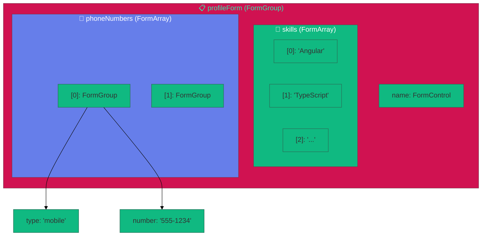
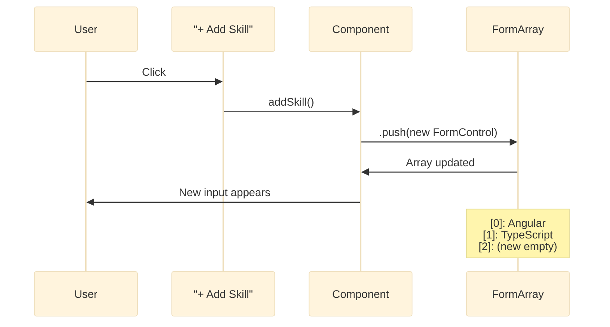
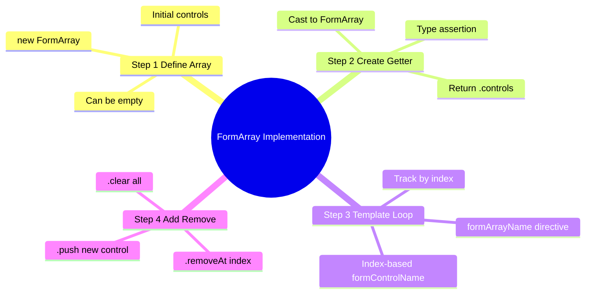
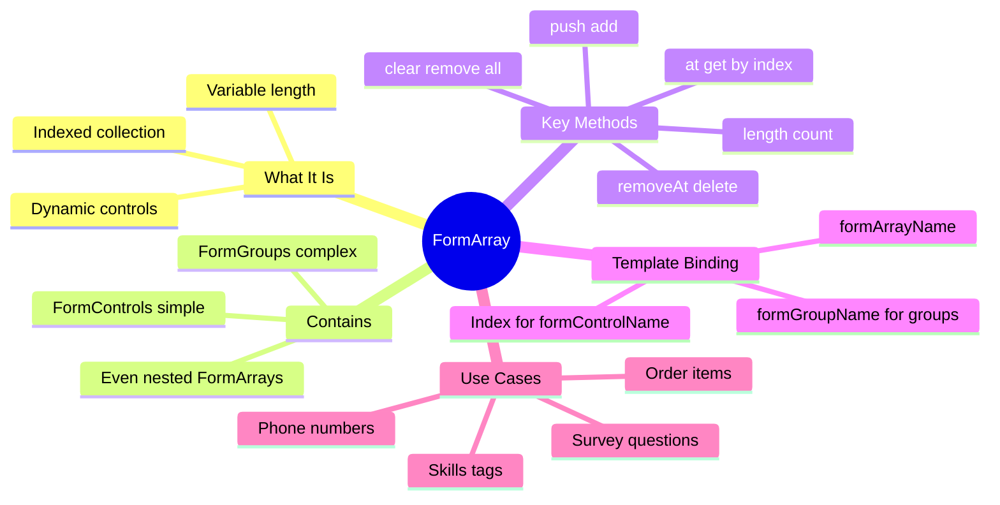

# ➕ FormArray (Dynamic Fields)

> **Goal**: Add and remove form fields dynamically at runtime using FormArray.


## 📋 Table of Contents
- [🏛️ What Problem Does It Solve?](#what-problem-does-it-solve)
  - [The "Unknown Quantity" Problem](#the-unknown-quantity-problem)
  - [The Mass Update Problem](#the-mass-update-problem)
- [🔬 Deep Dive: Important Classes & Directives](#deep-dive-important-classes--directives)
  - [A. The Classes (TypeScript Side)](#a-the-classes-typescript-side)
  - [B. The Directives (HTML Side)](#b-the-directives-html-side)
- [1. 🔍 How It Works (The Concept)](#1--how-it-works-the-concept)
  - [The Core Mechanism](#the-core-mechanism)
  - [Default vs. Optimized Behavior](#default-vs-optimized-behavior)
  - [📊 FormArray Structure](#formarray-structure)
- [2. 🚀 Step-by-Step Implementation Guide](#2--step-by-step-implementation-guide)
  - [Step 1: Create FormArray in Component](#step-1-create-formarray-in-component)
  - [Step 2: Create Getter for Easy Access](#step-2-create-getter-for-easy-access)
  - [Step 3: Bind in Template](#step-3-bind-in-template)
  - [Step 4: Implement Add/Remove Methods](#step-4-implement-addremove-methods)
  - [📊 Add/Remove Flow](#addremove-flow)
- [3. 🐛 Common Pitfalls & Debugging](#3--common-pitfalls--debugging)
  - [❌ Pitfall 1: Using formControlName with Number](#pitfall-1-using-formcontrolname-with-number)
  - [❌ Pitfall 2: Accessing FormArray without Casting](#pitfall-2-accessing-formarray-without-casting)
  - [❌ Pitfall 3: FormArray of FormGroups without formGroupName](#pitfall-3-formarray-of-formgroups-without-formgroupname)
- [4. ⚡ Performance & Architecture](#4--performance--architecture)
  - [Performance Tips](#performance-tips)
  - [Architecture Pattern: Factory Methods](#architecture-pattern-factory-methods)
- [5. 🌍 Real World Use Cases](#5--real-world-use-cases)
  - [📦 Data Flow Summary (Visual Box Diagram)](#data-flow-summary-visual-box-diagram)
  - [Q6: How do you reset a FormArray?](#q6-how-do-you-reset-a-formarray)
  - [Q7: Can a FormArray contain FormArrays?](#q7-can-a-formarray-contain-formarrays)
  - [Q8: How do you validate a FormArray (e.g., min length)?](#q8-how-do-you-validate-a-formarray-eg-min-length)
  - [Q9: Why is `[formControlName]="i"` used instead of a name string?](#q9-why-is-formcontrolnamei-used-instead-of-a-name-string)
  - [Q10: How do you perform a "Move Up / Move Down" operation?](#q10-how-do-you-perform-a-move-up--move-down-operation)
  - [Q11: (Scenario) How to efficiently patch a FormArray from an API?](#q11-scenario-how-to-efficiently-patch-a-formarray-from-an-api)
  - [Q12: How do you listen to changes in array size?](#q12-how-do-you-listen-to-changes-in-array-size)
  - [Q13: What is the `getRawValue()` behavior for FormArray?](#q13-what-is-the-getrawvalue-behavior-for-formarray)
  - [Q14: How do you handle "Select All" functionality?](#q14-how-do-you-handle-select-all-functionality)
  - [Q15: Why use `trackBy` in the `*ngFor` loop?](#q15-why-use-trackby-in-the-ngfor-loop)
  - [Q16: How to replace an entire FormArray?](#q16-how-to-replace-an-entire-formarray)
  - [Q17: Can you use `setValue` on a FormArray?](#q17-can-you-use-setvalue-on-a-formarray)
  - [Q18: (Scenario) Required at least one checkbox selected in a list.](#q18-scenario-required-at-least-one-checkbox-selected-in-a-list)
  - [Q19: How do you access the parent form from inside a FormArray item component?](#q19-how-do-you-access-the-parent-form-from-inside-a-formarray-item-component)
  - [Q20: What happens if you modify the `controls` array directly (`arr.controls.push(...)`)?](#q20-what-happens-if-you-modify-the-controls-array-directly-arrcontrolspush)
  - [Q21: How to handle very large arrays (1000+ items)?](#q21-how-to-handle-very-large-arrays-1000-items)
- [🛒 Shopping List Analogy (Easy to Remember!)](#shopping-list-analogy-easy-to-remember)
  - [📖 Story to Remember:](#story-to-remember)
  - [🎯 Quick Reference:](#quick-reference)
- [7. ❓ Interview & Concept Questions](#7--interview--concept-questions)
  - [Q1: What's the difference between FormArray and FormGroup?](#q1-whats-the-difference-between-formarray-and-formgroup)
  - [Q2: How do you add a control to a FormArray?](#q2-how-do-you-add-a-control-to-a-formarray)
  - [Q3: How do you bind a FormArray in the template?](#q3-how-do-you-bind-a-formarray-in-the-template)
  - [Q4: How do you create a FormArray of FormGroups?](#q4-how-do-you-create-a-formarray-of-formgroups)
  - [Q5 (Scenario): User can add unlimited email addresses. How?](#q5-scenario-user-can-add-unlimited-email-addresses-how)
- [🔧 Implementation Flow Mindmap](#implementation-flow-mindmap)
- [🧠 Mind Map: Quick Visual Reference](#mind-map-quick-visual-reference)

---
---

---

## 🏛️ What Problem Does It Solve?

### The "Unknown Quantity" Problem
*   **The Problem**: You need a form for "Previous Employers". One user might have 0, another might have 10. `FormGroup` requires fixed keys (`job1`, `job2`...) which is impossible to manage dynamically.
*   **The Solution**: `FormArray` acts like a standard JavaScript Array. You can `.push()` new items when the user clicks "Add" and `.removeAt(i)` when they click "Delete".
*   **The Benefit**: The form grows and shrinks with the user's input, without writing 100 conditional inputs in your HTML.

### The Mass Update Problem
*   **The Problem**: You have a list of checkboxes (e.g., "Select Permissions"). You want to validate that "at least one" is selected.
*   **The Solution**: With `FormArray`, you can apply a **Validator** to the *array itself* (e.g., `minSelected(1)`), rather than validating individual checkboxes.

---

## 🔬 Deep Dive: Important Classes & Directives

### A. The Classes (TypeScript Side)
1.  **`FormArray`**:
    *   Inherits from `AbstractControl`.
    *   *Structure*: An array of controls. `[ Control1, Control2, Control3 ]`.
    *   *Key Methods*: `.push(control)`, `.insert(index, control)`, `.removeAt(index)`, `.clear()`.
    *   *Iterability*: It has a `.controls` property which is a standard array you can loop over in templates.

2.  **`AbstractControl` (Again)**:
    *   Since `FormArray` holds `AbstractControl`s, you often need to cast them.
    *   *Pattern*: `(form.get('skills') as FormArray).controls`.

### B. The Directives (HTML Side)
1.  **`formArrayName`**:
    *   Binds the array instance to a container.
    *   *Effect*: Sets the path for children to look for indices.

2.  **`[formControlName]` (with Index)**:
    *   Inside an array, the "name" of a control is its **Index** (0, 1, 2...).
    *   *Syntax*: `[formControlName]="i"`. (Note the property binding `[]` because `i` is a variable).

---

## 1. 🔍 How It Works (The Concept)

### The Core Mechanism

`FormArray` is a collection of controls that can grow or shrink at runtime. Unlike `FormGroup` (which has fixed keys), `FormArray` is indexed numerically and can contain any number of items.

| FormGroup | FormArray |
|-----------|-----------|
| Fixed keys: `{ name, email }` | Indexed: `[0], [1], [2]...` |
| Known at compile time | Dynamic at runtime |
| Object structure | Array structure |

### Default vs. Optimized Behavior

- **Default (Hardcoded Fields)**: Fixed number of phone inputs. Can't add more.
- **Optimized (FormArray)**: User clicks "Add Phone" → new field appears. Flexible!

### 📊 FormArray Structure



---

## 2. 🚀 Step-by-Step Implementation Guide

### Step 1: Create FormArray in Component

```typescript
ngOnInit(): void {
    this.profileForm = new FormGroup({
        name: new FormControl(''),
        
        // 🛡️ FormArray of FormControls (simple values)
        skills: new FormArray([
            new FormControl('Angular'),
            new FormControl('TypeScript')
        ]),
        
        // 🛡️ FormArray of FormGroups (complex objects)
        phoneNumbers: new FormArray([
            new FormGroup({
                type: new FormControl('mobile'),
                number: new FormControl('')
            })
        ])
    });
}
```

### Step 2: Create Getter for Easy Access

```typescript
// 🛡️ CRITICAL: You need a getter to iterate over FormArray!
get skillsControls(): FormControl[] {
    return (this.profileForm.get('skills') as FormArray).controls as FormControl[];
}
```

### Step 3: Bind in Template

```html
<div formArrayName="skills">
    <!-- Iterate with index -->
    @for (control of skillsControls; track i; let i = $index) {
        <!-- 🛡️ CRITICAL: [formControlName]="i" uses the INDEX -->
        <input [formControlName]="i" placeholder="Skill">
        <button (click)="removeSkill(i)">Remove</button>
    }
</div>
<button (click)="addSkill()">+ Add Skill</button>
```

### Step 4: Implement Add/Remove Methods

```typescript
addSkill(): void {
    const skills = this.profileForm.get('skills') as FormArray;
    skills.push(new FormControl('')); // Add empty control
}

removeSkill(index: number): void {
    const skills = this.profileForm.get('skills') as FormArray;
    skills.removeAt(index); // Remove by index
}
```

### 📊 Add/Remove Flow



---

## 3. 🐛 Common Pitfalls & Debugging

### ❌ Pitfall 1: Using formControlName with Number

**Bad Code:**
```html
<!-- ❌ String "0" instead of number 0 -->
<input formControlName="0">
```

**Issue:** Works but confusing. The index should be dynamic.

**Fix:**
```html
<!-- ✅ Use property binding with index variable -->
<input [formControlName]="i">
```

---

### ❌ Pitfall 2: Accessing FormArray without Casting

**Bad Code:**
```typescript
// ❌ Error: Property 'push' does not exist on type 'AbstractControl'
this.profileForm.get('skills').push(new FormControl());
```

**Fix:**
```typescript
// ✅ Cast to FormArray first
const skills = this.profileForm.get('skills') as FormArray;
skills.push(new FormControl());
```

---

### ❌ Pitfall 3: FormArray of FormGroups without formGroupName

**Bad Code:**
```html
<div formArrayName="phones">
    @for (phone of phonesControls; track i; let i = $index) {
        <!-- ❌ Missing [formGroupName]="i" -->
        <input formControlName="number">
    }
</div>
```

**Error:** `Cannot find control with path: 'phones -> number'`

**Fix:**
```html
<div formArrayName="phones">
    @for (phone of phonesControls; track i; let i = $index) {
        <!-- ✅ Add [formGroupName]="i" wrapper -->
        <div [formGroupName]="i">
            <input formControlName="number">
        </div>
    }
</div>
```

---

## 4. ⚡ Performance & Architecture

### Performance Tips

| Tip | Why |
|-----|-----|
| Use `trackBy` with `@for` | Prevents re-rendering all items on change |
| Lazy add controls | Don't pre-create 100 empty fields |
| Disable remove when 1 item | Prevent edge cases |

### Architecture Pattern: Factory Methods

```typescript
// Create consistent FormGroup structures with a factory
private createPhoneGroup(type = 'mobile', number = ''): FormGroup {
    return new FormGroup({
        type: new FormControl(type),
        number: new FormControl(number, [Validators.required])
    });
}

addPhone(): void {
    this.phonesArray.push(this.createPhoneGroup());
}
```

---

## 5. 🌍 Real World Use Cases

1. **E-Commerce Order**: Line items array with product, quantity, price per item.
2. **Survey Builder**: Dynamic list of questions. User adds/removes questions.
3. **Resume Builder**: Multiple education entries, work experiences, skills.
4. **📊 Data Grid Editing**: An Excel-like interface where every row is editable.
5. **🏷️ Tag Manager**: "Add Tag" builds a list of strings: `['Angular', 'React', 'Vue']`.
6. **🧾 Invoice Generator**: Row items (Description, Qty, Rate, Total). Total is calculated by reducing the array.
7. **📚 Quiz App**: Questions are an array. Each question has an array of Options. (Nested FormArrays!).

---

### 📦 Data Flow Summary (Visual Box Diagram)
(diagram content remains same)

...

### Q6: How do you reset a FormArray?
**A:** `arr.clear()` removes all items. `arr.reset()` just clears values but keeps the controls.

### Q7: Can a FormArray contain FormArrays?
**A:** Yes. `FormArray<FormArray<FormControl>>`. Matrix data (rows & columns) is often modeled this way.

### Q8: How do you validate a FormArray (e.g., min length)?
**A:** Pass a validator to the constructor or `setValidators`:
```typescript
new FormArray([], [Validators.required, minLengthArray(2)])
```

### Q9: Why is `[formControlName]="i"` used instead of a name string?
**A:** Because `FormArray` is indexed numerically. The "key" is the index `0`, `1`, `2`.

### Q10: How do you perform a "Move Up / Move Down" operation?
**A:**
```typescript
const control = arr.at(index);
arr.removeAt(index);
arr.insert(newIndex, control);
```

### Q11: (Scenario) How to efficiently patch a FormArray from an API?
**A:**
1. Clear existing array (`.clear()`).
2. Loop through API data.
3. Push new Controls/Groups for each item.
4. `patchValue` is tricky because the array size must match data size first!

### Q12: How do you listen to changes in array size?
**A:** There isn't a direct "size changed" event, but `valueChanges` fires when items are added/removed.

### Q13: What is the `getRawValue()` behavior for FormArray?
**A:** Returns an array of values, including values from disabled controls inside the array.

### Q14: How do you handle "Select All" functionality?
**A:** Loop through `array.controls` and call `.patchValue({ selected: true })` on each.

### Q15: Why use `trackBy` in the `*ngFor` loop?
**A:** Crucial for performance. Without it, adding 1 item might re-render the whole list, causing inputs to lose focus.

### Q16: How to replace an entire FormArray?
**A:** `parentForm.setControl('skills', new FormArray([...]))`.

### Q17: Can you use `setValue` on a FormArray?
**A:** Only if the array length exactly matches the value array length.

### Q18: (Scenario) Required at least one checkbox selected in a list.
**A:** If checkboxes are boolean controls in an array:
`validator: (arr) => arr.value.some(v => v) ? null : { required: true }`.

### Q19: How do you access the parent form from inside a FormArray item component?
**A:** Inject `ControlContainer` in the child component.

### Q20: What happens if you modify the `controls` array directly (`arr.controls.push(...)`)?
**A:** **Don't do it.** The FormArray won't know about the change (value/validity won't update). Use `.push()` method.

### Q21: How to handle very large arrays (1000+ items)?
**A:** Reactive Forms can get slow. Consider **Virtual Scroll** and potentially not using `FormArray` for the whole dataset, or using **Signal-based forms** (future/generating custom solution).

```
┌─────────────────────────────────────────────────────────────┐
│  FORMARRAY: DYNAMIC, INDEXED COLLECTION                     │
│                                                             │
│   STRUCTURE:                                                │
│   ┌───────────────────────────────────────────────────────┐ │
│   │ skills: new FormArray([                               │ │
│   │   new FormControl('Angular'),   ← [0]                 │ │
│   │   new FormControl('TypeScript') ← [1]                 │ │
│   │ ])                                                    │ │
│   └───────────────────────────────────────────────────────┘ │
│                                                             │
│   ADD CONTROL:                                              │
│   ┌───────────────────────────────────────────────────────┐ │
│   │ User clicks "Add Skill"                               │ │
│   │        │                                              │ │
│   │        ▼                                              │ │
│   │ (skillsArray as FormArray).push(new FormControl(''))  │ │
│   │        │                                              │ │
│   │        ▼                                              │ │
│   │ [0] Angular, [1] TypeScript, [2] (new)                │ │
│   └───────────────────────────────────────────────────────┘ │
│                                                             │
│   TEMPLATE:                                                 │
│   ┌───────────────────────────────────────────────────────┐ │
│   │ <div formArrayName="skills">                          │ │
│   │   @for (skill of skillsControls; track i) {           │ │
│   │     <input [formControlName]="i">  ← INDEX!           │ │
│   │     <button (click)="removeSkill(i)">X</button>       │ │
│   │   }                                                   │ │
│   │ </div>                                                │ │
│   └───────────────────────────────────────────────────────┘ │
└─────────────────────────────────────────────────────────────┘
```

> **Key Takeaway**: FormArray uses numeric indices. Cast to FormArray to use push/removeAt. Use [formControlName]="i"!

---

## 🛒 Shopping List Analogy (Easy to Remember!)

Think of FormArray like a **shopping list on your phone**:

| Concept | Shopping List Analogy | Memory Trick |
|---------|----------------------|--------------| 
| **FormArray** | 🛒 **Shopping list**: Dynamic items you can add/remove | **"Flexible array"** |
| **FormGroup** | 📋 **Fixed form**: Name, Email, Phone (known fields) | **"Fixed fields"** |
| **.push()** | ➕ **Add item**: "Need milk!" | **"Add to list"** |
| **.removeAt()** | ❌ **Cross off**: Done with eggs | **"Remove by index"** |
| **.clear()** | 🗑️ **Start fresh**: Clear whole list | **"Remove all"** |

### 📖 Story to Remember:

> 🛒 **The Smart Shopping App**
>
> Your form is a shopping list:
>
> **Creating the list:**
> ```typescript
> skills: new FormArray([
>   new FormControl('Angular'),    // 🥛 Milk
>   new FormControl('TypeScript')  // 🥚 Eggs
> ])
> ```
>
> **Adding items:**
> ```typescript
> addSkill() {
>   skillsArray.push(new FormControl(''));  // ➕ Add to list
> }
> // "I also need bread!"
> ```
>
> **Removing items:**
> ```typescript
> removeSkill(index) {
>   skillsArray.removeAt(index);  // ❌ Cross off
> }
> // "Got the milk, done!"
> ```
>
> **List grows and shrinks dynamically!**

### 🎯 Quick Reference:
```
🛒 FormArray      = Shopping list (dynamic)
📋 FormGroup      = Fixed form (static fields)
➕ .push()        = Add item to list
❌ .removeAt(i)   = Cross off item at position
🗑️ .clear()       = Start fresh (empty list)
```

---

## 7. ❓ Interview & Concept Questions

### Q1: What's the difference between FormArray and FormGroup?
**A:** `FormGroup` has fixed, named keys. `FormArray` has indexed, dynamic controls. Use `FormGroup` when you know all fields ahead of time. Use `FormArray` when fields are added/removed at runtime.

### Q2: How do you add a control to a FormArray?
**A:** `(formArray as FormArray).push(new FormControl('value'))`.

### Q3: How do you bind a FormArray in the template?
**A:** Use `formArrayName="arrayName"` on a container, then iterate with `@for` and use `[formControlName]="index"`.

### Q4: How do you create a FormArray of FormGroups?
**A:** Each item in the array is a `new FormGroup({...})`. In the template, wrap each iteration in `[formGroupName]="i"`.

### Q5 (Scenario): User can add unlimited email addresses. How?
**A:**
```typescript
emails: new FormArray([new FormControl('')])

addEmail() {
    this.emailsArray.push(new FormControl(''));
}
```

---

## 🔧 Implementation Flow Mindmap



---

## 🧠 Mind Map: Quick Visual Reference


