# 🛡️ Strongly Typed Forms (Angular 14+)

> **Goal**: Enforce strict TypeScript checking on FormControls, preventing `any` type bugs.


## 📋 Table of Contents
- [🏛️ What Problem Does It Solve?](#what-problem-does-it-solve)
  - [The "Mystery Meat" Problem](#the-mystery-meat-problem)
  - [The "Null vs Undefined" Chaos](#the-null-vs-undefined-chaos)
- [🔬 Deep Dive: Important Classes & Directives](#deep-dive-important-classes--directives)
  - [A. The Classes (TypeScript Side)](#a-the-classes-typescript-side)
  - [B. The Directives (HTML Side)](#b-the-directives-html-side)
- [1. 🔍 How It Works (The Concept)](#1--how-it-works-the-concept)
  - [📊 Typed vs Untyped Flow](#typed-vs-untyped-flow)
- [2. 🚀 Step-by-Step Implementation Guide](#2--step-by-step-implementation-guide)
  - [Step 1: Define Your Interface](#step-1-define-your-interface)
  - [Step 2: Initialize with Types](#step-2-initialize-with-types)
  - [Step 3: Enjoy Safety](#step-3-enjoy-safety)
- [3. 🌍 Real World Use Cases](#3--real-world-use-cases)
- [7. ❓ Interview & Concept Questions](#7--interview--concept-questions)
  - [Q1: Why is `FormControl<string>` nullable by default?](#q1-why-is-formcontrolstring-nullable-by-default)
  - [Q2: What is the difference between `FormGroup` and `FormRecord`?](#q2-what-is-the-difference-between-formgroup-and-formrecord)
  - [Q3: How do you handle legacy code?](#q3-how-do-you-handle-legacy-code)
  - [Q4: Can I use `Partial<T>` for `patchValue`?](#q4-can-i-use-partialt-for-patchvalue)
  - [Q5: How do `getRawValue()` types differ from `.value`?](#q5-how-do-getrawvalue-types-differ-from-value)
  - [Q6: What happens if you assign a wrong type to `setValue()`?](#q6-what-happens-if-you-assign-a-wrong-type-to-setvalue)
  - [Q7: How do you define optional controls in a Typed FormGroup?](#q7-how-do-you-define-optional-controls-in-a-typed-formgroup)
  - [Q8: What is the difference between `new FormControl('')` and `new FormControl('', { nonNullable: true })`?](#q8-what-is-the-difference-between-new-formcontrol-and-new-formcontrol--nonnullable-true)
  - [Q9: Can you add a control dynamically to a typed `FormGroup<T>`?](#q9-can-you-add-a-control-dynamically-to-a-typed-formgroupt)
  - [Q10: How do you type a `FormArray` of complex objects?](#q10-how-do-you-type-a-formarray-of-complex-objects)
  - [Q11: What is `UntypedFormControl` and when should you use it?](#q11-what-is-untypedformcontrol-and-when-should-you-use-it)
  - [Q12: SCENARIO: Your form.reset() is setting email to null but the API expects an empty string. How do you fix it?](#q12-scenario-your-formreset-is-setting-email-to-null-but-the-api-expects-an-empty-string-how-do-you-fix-it)
  - [Q13: How does `FormBuilder.group()` differ from `NonNullableFormBuilder.group()`?](#q13-how-does-formbuildergroup-differ-from-nonnullableformbuildergroup)
  - [Q14: SCENARIO: You have a `FormRecord<FormControl<boolean>>` for feature flags. How do you iterate over all keys?](#q14-scenario-you-have-a-formrecordformcontrolboolean-for-feature-flags-how-do-you-iterate-over-all-keys)
  - [Q15: Why might `form.value` show a different type than `form.getRawValue()`?](#q15-why-might-formvalue-show-a-different-type-than-formgetrawvalue)
  - [Q16: How do you strongly type a nested FormGroup?](#q16-how-do-you-strongly-type-a-nested-formgroup)
  - [Q17: SCENARIO: The backend returns `{ age: null }` but your form expects `number`. What's the safest approach?](#q17-scenario-the-backend-returns--age-null--but-your-form-expects-number-whats-the-safest-approach)
  - [Q18: Can you use `patchValue` with Typed Forms? How does type checking work?](#q18-can-you-use-patchvalue-with-typed-forms-how-does-type-checking-work)
  - [Q19: What error do you get if you call `addControl()` on a Typed `FormGroup<T>`?](#q19-what-error-do-you-get-if-you-call-addcontrol-on-a-typed-formgroupt)
  - [Q20: SCENARIO: You're migrating a 200-line untyped form. What's the recommended incremental approach?](#q20-scenario-youre-migrating-a-200-line-untyped-form-whats-the-recommended-incremental-approach)
- [🧠 Mind Map: Quick Visual Reference](#mind-map-quick-visual-reference)

---
---

## 🏛️ What Problem Does It Solve?

### The "Mystery Meat" Problem
*   **The Problem**: In old Angular (Pre-14), `form.value` was always `any`. You could access `form.value.peperoni` even if the field was `pepperoni`. The compiler wouldn't catch it, leading to runtime bugs.
*   **The Solution**: Typed Forms (`FormGroup<Profile>`) ensure that `form.value.email` is strictly `string`.
*   **The Benefit**: Refactoring safety. If you rename a field in the interface, the compiler breaks every usage in the form so you can fix it.

### The "Null vs Undefined" Chaos
*   **The Problem**: Calling `.reset()` on a standard FormControl makes it `null`. But your interface expects `string`.
*   **The Solution**: `NonNullableFormBuilder` or `{ nonNullable: true }` ensures the value resets to the *initial value* (e.g., empty string) instead of `null`.

---

## 🔬 Deep Dive: Important Classes & Directives

### A. The Classes (TypeScript Side)
1.  **`FormControl<T>`**:
    *   Generic type is now mandatory. `new FormControl('abc')` infers `FormControl<string | null>`.
    *   *Why null?* Because standard reset behavior is null.

2.  **`NonNullableFormBuilder`**:
    *   Inject via `inject(NonNullableFormBuilder)` or `fb.nonNullable`.
    *   Creates controls where `.reset()` returns to the default value.
    *   Type becomes `FormControl<string>` (no null!).

3.  **`FormRecord<T>`**:
    *   A specialized `FormGroup` for "Open Ended" maps.
    *   Use it when you don't know the key names (e.g., "Add Skill" where user types the key), but you know the value type (e.g., `boolean`).

### B. The Directives (HTML Side)
*   No changes in HTML! The template binding `formControlName` works exactly the same. The safety happens entirely in the TypeScript compliation step.

---

## 1. 🔍 How It Works (The Concept)

### 📊 Typed vs Untyped Flow

```mermaid
%%{init: {'theme':'base', 'themeVariables': { 'primaryColor':'#667eea'}}}%%
flowchart LR
    Interface["TypeScript Interface"] -->|Defines Structure| FG["FormGroup<T>"]
    FG -->|Enforces| FC["FormControl<T>"]
    
    subgraph CompileTime ["🚧 Compile Time Checks"]
        Check1["form.value.invalidProp ❌"]
        Check2["form.patchValue({ badType: 123 }) ❌"]
    end
    
    FC -.-> Check1
    FG -.-> Check2
    
    style CompileTime fill:#fee2e2,stroke:#b91c1c,color:#000
```



---

## 2. 🚀 Step-by-Step Implementation Guide

### Step 1: Define Your Interface
```typescript
interface MyForm {
    name: FormControl<string>;
    age: FormControl<number | null>; // Nullable
}
```

### Step 2: Initialize with Types
```typescript
// Automatic Type Inference
const form = new FormGroup<MyForm>({
    name: new FormControl('', { nonNullable: true }),
    age: new FormControl(null)
});
```

### Step 3: Enjoy Safety
```typescript
form.controls.name.setValue(123); // ❌ Error: number not assignable to string
const val = form.value.name;      // ✅ val is 'string' (not any)
```

---

## 3. 🌍 Real World Use Cases

1.  **Strict API Integration**: Ensuring form output matches exactly what the backend `POST /api/user` endpoint expects.
2.  **Refactoring Large Forms**: Renaming a field in a 50-field "Tax Return" form without missing a spot.
3.  **Dynamic Feature Flags**: Using `FormRecord<boolean>` to manage a list of enabled toggles.

---

## 7. ❓ Interview & Concept Questions

### Q1: Why is `FormControl<string>` nullable by default?
**A:** Because calling `.reset()` clears the control to `null` by default. To avoid this, use `{ nonNullable: true }`.

### Q2: What is the difference between `FormGroup` and `FormRecord`?
**A:** `FormGroup` expects known keys (closed shape). `FormRecord` allows adding/removing unknown keys (open shape), but all values must share the same type.

### Q3: How do you handle legacy code?
**A:** Angular provides `UntypedFormGroup` and `UntypedFormControl` aliases which behave like the old `any` versions. Migration scripts usually convert strict forms to these during update.

### Q4: Can I use `Partial<T>` for `patchValue`?
**A:** Yes, `patchValue` naturally accepts partial objects. Typed forms check that the *properties you verify* match the correct type.

### Q5: How do `getRawValue()` types differ from `.value`?
**A:** `.value` excludes disabled controls. `getRawValue()` includes them. In Typed Forms, Angular tries to infer the correct shape for both.

### Q6: What happens if you assign a wrong type to `setValue()`?
**A:** The TypeScript compiler immediately throws an error. For example, `form.controls.email.setValue(123)` will fail because `123` is not assignable to `string`.

### Q7: How do you define optional controls in a Typed FormGroup?
**A:** Use the `?` modifier in your interface: `age?: FormControl<number | null>`. This allows the control to be absent from the group.

### Q8: What is the difference between `new FormControl('')` and `new FormControl('', { nonNullable: true })`?
**A:** The first creates `FormControl<string | null>` (reset → null). The second creates `FormControl<string>` (reset → '' initial value).

### Q9: Can you add a control dynamically to a typed `FormGroup<T>`?
**A:** No. `FormGroup<T>` has a fixed shape. Use `FormRecord<T>` for dynamic additions, or use `UntypedFormGroup` if you need old behavior.

### Q10: How do you type a `FormArray` of complex objects?
**A:** Define the item type and use `FormArray<FormGroup<ItemType>>`:
```typescript
interface OrderItem { product: FormControl<string>; qty: FormControl<number>; }
items = new FormArray<FormGroup<OrderItem>>([]);
```

### Q11: What is `UntypedFormControl` and when should you use it?
**A:** It's an alias for the old pre-Angular 14 `any`-typed control. Use it during migrations when you can't immediately type the entire form.

### Q12: SCENARIO: Your form.reset() is setting email to null but the API expects an empty string. How do you fix it?
**A:** Recreate the email control with `{ nonNullable: true }`. Now `.reset()` will return to the initial value `''` instead of `null`.

### Q13: How does `FormBuilder.group()` differ from `NonNullableFormBuilder.group()`?
**A:** `FormBuilder` creates nullable controls by default. `NonNullableFormBuilder` creates non-null controls for all fields in the group.

### Q14: SCENARIO: You have a `FormRecord<FormControl<boolean>>` for feature flags. How do you iterate over all keys?
**A:** Use `Object.keys(record.controls)` or create a getter like `get keys() { return Object.keys(this.flagsRecord.controls); }`.

### Q15: Why might `form.value` show a different type than `form.getRawValue()`?
**A:** Disabled controls are excluded from `.value` but included in `getRawValue()`. This affects the inferred type when controls can be dynamically disabled.

### Q16: How do you strongly type a nested FormGroup?
**A:** Define nested interfaces:
```typescript
interface Address { city: FormControl<string>; zip: FormControl<string>; }
interface User { name: FormControl<string>; address: FormGroup<Address>; }
```

### Q17: SCENARIO: The backend returns `{ age: null }` but your form expects `number`. What's the safest approach?
**A:** Define the control as `FormControl<number | null>`. This correctly models that the value CAN be null from the API.

### Q18: Can you use `patchValue` with Typed Forms? How does type checking work?
**A:** Yes. `patchValue` accepts `Partial<FormValue>`. The compiler still checks that provided properties match their expected types.

### Q19: What error do you get if you call `addControl()` on a Typed `FormGroup<T>`?
**A:** TypeScript error: the key must exist in the interface `T`. To add arbitrary keys, use `FormRecord` instead.

### Q20: SCENARIO: You're migrating a 200-line untyped form. What's the recommended incremental approach?
**A:** 
1. Replace `FormGroup` with `UntypedFormGroup` (no functional change).
2. Define your interface incrementally.
3. Replace `Untyped*` with typed versions one control at a time.
4. Run tests after each change.

---

## 🧠 Mind Map: Quick Visual Reference


