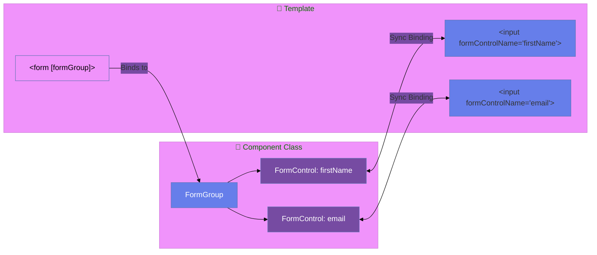
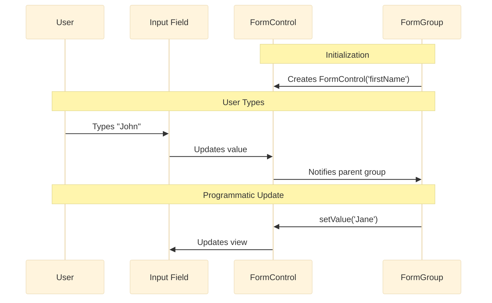
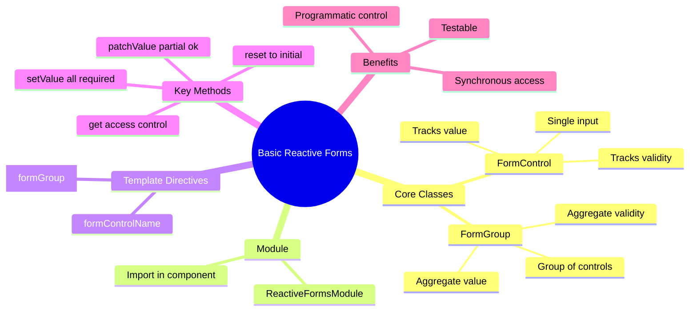

# 🎯 Use Case 1: Basic FormControl & FormGroup

> **Goal**: Master the foundation of Reactive Forms - creating and binding form controls in TypeScript.

---

## 1. 🔍 How It Works (The Concept)

### The Core Mechanism

Reactive Forms are Angular's **model-driven** approach to forms. Instead of letting the template control your form (`ngModel`), **you** control the form in your TypeScript class.

| Template Forms | Reactive Forms |
|----------------|----------------|
| `FormsModule` | `ReactiveFormsModule` |
| `[(ngModel)]` | `formControlName` |
| Implicit form model | Explicit form model |
| Template is source of truth | **Component class** is source of truth |

### Default vs. Optimized Behavior

- **Default (Template Forms)**: Angular creates FormControl instances behind the scenes when it sees `ngModel`. You have limited programmatic access.
- **Optimized (Reactive Forms)**: You explicitly create `FormControl` and `FormGroup` instances. You have **full control** over values, validation, and state.

### 📊 Data Flow Diagram



---

### 📦 Data Flow Summary (Visual Box Diagram)

```
┌─────────────────────────────────────────────────────────────┐
│  REACTIVE FORMS: MODEL-DRIVEN APPROACH                      │
│                                                             │
│   COMPONENT CLASS (Source of Truth):                        │
│   ┌───────────────────────────────────────────────────────┐ │
│   │ profileForm = new FormGroup({                         │ │
│   │   firstName: new FormControl(''),  ← FormControl      │ │
│   │   lastName: new FormControl(''),   ← FormControl      │ │
│   │   email: new FormControl('')       ← FormControl      │ │
│   │ });                                                   │ │
│   └───────────────────────────────────────────────────────┘ │
│                      │                                      │
│                      │ [formGroup]="profileForm"            │
│                      ▼                                      │
│   TEMPLATE (View):                                          │
│   ┌───────────────────────────────────────────────────────┐ │
│   │ <form [formGroup]="profileForm">                      │ │
│   │   <input formControlName="firstName">  ← Syncs value  │ │
│   │   <input formControlName="lastName">   ← Syncs value  │ │
│   │   <input formControlName="email">      ← Syncs value  │ │
│   │ </form>                                               │ │
│   └───────────────────────────────────────────────────────┘ │
│                                                             │
│   ACCESSING VALUES:                                         │
│   ┌───────────────────────────────────────────────────────┐ │
│   │ profileForm.value        → { firstName, lastName, ... }│ │
│   │ profileForm.valid        → true/false                 │ │
│   │ profileForm.get('email') → FormControl reference      │ │
│   │ setValue({...})          → Set ALL values             │ │
│   │ patchValue({...})        → Set SOME values            │ │
│   └───────────────────────────────────────────────────────┘ │
└─────────────────────────────────────────────────────────────┘
```

> **Key Takeaway**: FormGroup = container, FormControl = single field. Component class controls everything!

---

## 2. 🚀 Step-by-Step Implementation Guide

### Step 1: Import ReactiveFormsModule

```typescript
// 🛡️ CRITICAL: Import ReactiveFormsModule, NOT FormsModule!
import { ReactiveFormsModule, FormGroup, FormControl } from '@angular/forms';

@Component({
    imports: [ReactiveFormsModule] // <-- Add this!
})
```

### Step 2: Create the FormGroup in your Component

```typescript
export class BasicReactiveComponent implements OnInit {
    // Declare the form group
    profileForm!: FormGroup;

    ngOnInit(): void {
        // 🛡️ CRITICAL: Keys here MUST match formControlName in template!
        this.profileForm = new FormGroup({
            firstName: new FormControl(''),  // Initial value: ''
            lastName: new FormControl(''),
            email: new FormControl('')
        });
    }
}
```

### Step 3: Bind the FormGroup in your Template

```html
<!-- Bind the form to the FormGroup -->
<form [formGroup]="profileForm" (ngSubmit)="onSubmit()">
    
    <!-- Bind inputs to FormControls -->
    <input formControlName="firstName">
    <input formControlName="lastName">
    <input formControlName="email">
    
    <button type="submit">Submit</button>
</form>
```

### 📊 Binding Flow Visualization



---

## 3. 🐛 Common Pitfalls & Debugging

### ❌ Pitfall 1: Forgetting ReactiveFormsModule

**Bad Code:**
```typescript
@Component({
    imports: [CommonModule] // ❌ Missing ReactiveFormsModule!
})
```

**Error:** `Can't bind to 'formGroup' since it isn't a known property`

**Fix:**
```typescript
@Component({
    imports: [CommonModule, ReactiveFormsModule] // ✅ Add ReactiveFormsModule
})
```

---

### ❌ Pitfall 2: Mismatched formControlName

**Bad Code:**
```typescript
// Component
this.profileForm = new FormGroup({
    firstName: new FormControl('') // Key is 'firstName'
});

// Template
<input formControlName="first_name"> // ❌ 'first_name' doesn't match!
```

**Error:** `Cannot find control with name: 'first_name'`

**Fix:**
```html
<input formControlName="firstName"> <!-- ✅ Matches key exactly -->
```

---

### ❌ Pitfall 3: Using setValue with missing fields

**Bad Code:**
```typescript
this.profileForm.setValue({
    firstName: 'John'
    // ❌ Missing lastName and email!
});
```

**Error:** `Must supply a value for form control with name: 'lastName'`

**Fix: Use patchValue for partial updates:**
```typescript
this.profileForm.patchValue({
    firstName: 'John' // ✅ patchValue allows partial updates
});
```

---

## 4. ⚡ Performance & Architecture

### Performance Benefits

| Aspect | Benefit |
|--------|---------|
| **Synchronous Access** | `this.profileForm.value` is always up-to-date. No async waiting. |
| **Reduced Change Detection** | Form state is managed outside Angular's change detection cycle. |
| **Testability** | Test form logic with pure TypeScript, no DOM needed. |

### Architecture: Smart & Dumb Components

- **Smart Component (Container)**: Creates and manages the `FormGroup`. Handles submission.
- **Dumb Component (Presentational)**: Receives a `FormGroup` via `@Input()` and just renders it.

```typescript
// Smart Component
@Component({ template: `<app-profile-form [form]="profileForm"></app-profile-form>` })
export class ProfileContainerComponent {
    profileForm = new FormGroup({ ... });
}

// Dumb Component
@Component({ selector: 'app-profile-form', ... })
export class ProfileFormComponent {
    @Input() form!: FormGroup;
}
```

---

## 5. 🌍 Real World Use Cases

1. **User Registration Form**: First name, last name, email, password. Need programmatic control for password matching.
2. **Settings Page**: Form values loaded from API, then saved on submit. `setValue` populates the form.
3. **Multi-Step Wizard**: Split a large form into pages. Each page is a `FormGroup`. Combine at the end.

---

## 🏗️ Blueprint Analogy (Easy to Remember!)

Think of Reactive Forms like **building with blueprints**:

| Concept | Blueprint Analogy | Memory Trick |
|---------|-----------------|--------------|
| **FormGroup** | 📐 **Blueprint**: The master plan with all rooms defined | **"The master plan"** |
| **FormControl** | 🛏️ **Room spec**: Individual room requirements (size, windows) | **"Single field"** |
| **Template Forms** | 🏗️ **Building without plans**: Workers decide on the fly | **"Ad-hoc"** |
| **Reactive Forms** | 📈 **Architect's blueprint**: You design, workers follow | **"You control"** |
| **setValue/patchValue** | ✏️ **Revising plans**: Change room specs after design | **"Update the plan"** |

### 📖 Story to Remember:

> 🏗️ **The Two Construction Sites**
>
> Two builders start a house project:
>
> **Template Forms (No Blueprint):**
> ```
> Builder arrives → "What rooms do you want?"
> Owner: "Hmm, let me think... a bedroom here"
> Builder: "Okay, I'll wing it" 🤷‍♂️
> Result: Hard to predict, hard to test
> ```
>
> **Reactive Forms (With Blueprint):**
> ```
> Architect creates detailed blueprint 📐
> → Living room: 20x30 ft (FormControl)
> → Kitchen: 15x15 ft (FormControl)
> → All specs in master plan (FormGroup)
> 
> Builder: "I just follow the plan" ✅
> Result: Predictable, testable, you control everything!
> ```
>
> **You're the architect. Angular just builds what you specify.**

### 🎯 Quick Reference:
```
📐 FormGroup        = Blueprint (container for all fields)
🛏️ FormControl      = Room spec (single input control)
📈 Reactive Forms   = Architect's approach (you design)
✏️ setValue         = Revise ALL specs (complete update)
📝 patchValue       = Revise SOME specs (partial update)
```

---

## 7. ❓ Interview & Concept Questions

### Q1: What is the difference between FormControl and FormGroup?
**A:** `FormControl` tracks the value of a **single** input. `FormGroup` tracks the value of a **group** of controls. A `FormGroup` contains multiple `FormControl` instances.

### Q2: How do you access a specific control's value?
**A:** Use `formGroup.get('controlName')?.value` or `formGroup.controls['controlName'].value`.

### Q3: What is the difference between setValue and patchValue?
**A:** 
- `setValue`: Requires you to provide values for **ALL** controls. Throws error if any are missing.
- `patchValue`: Allows **partial** updates. Only updates the controls you specify.

### Q4: Why do we use ReactiveFormsModule instead of FormsModule?
**A:** `ReactiveFormsModule` provides directives like `formGroup`, `formControlName`. `FormsModule` provides `ngModel`. They are for different approaches.

### Q5: How do you test a Reactive Form?
**A:** Directly in unit tests without any DOM. Create the `FormGroup`, call `setValue`/`patchValue`, and assert on `formGroup.value` and `formGroup.valid`.

### Q6 (Scenario): Form values need to be loaded from an API. How?
**A:** Call the API in `ngOnInit`, then use `setValue` or `patchValue` to populate the form:
```typescript
ngOnInit() {
    this.userService.getProfile().subscribe(user => {
        this.profileForm.setValue(user); // or patchValue
    });
}
```

---

## 🔧 Implementation Flow Mindmap

```mermaid
mindmap
  root((Use Case 1 Implementation))
    Step 1 Setup
      Import ReactiveFormsModule
      Declare FormGroup property
    Step 2 Create Form
      new FormGroup
      new FormControl per field
      Set initial values
    Step 3 Template Binding
      [formGroup] on form tag
      formControlName on inputs
      ngSubmit for submission
    Step 4 Access Data
      formGroup.value
      formGroup.get controlName
      formGroup.valid
    Step 5 Programmatic Control
      setValue all fields
      patchValue partial
      reset form
```

---

## 🧠 Mind Map: Quick Visual Reference


