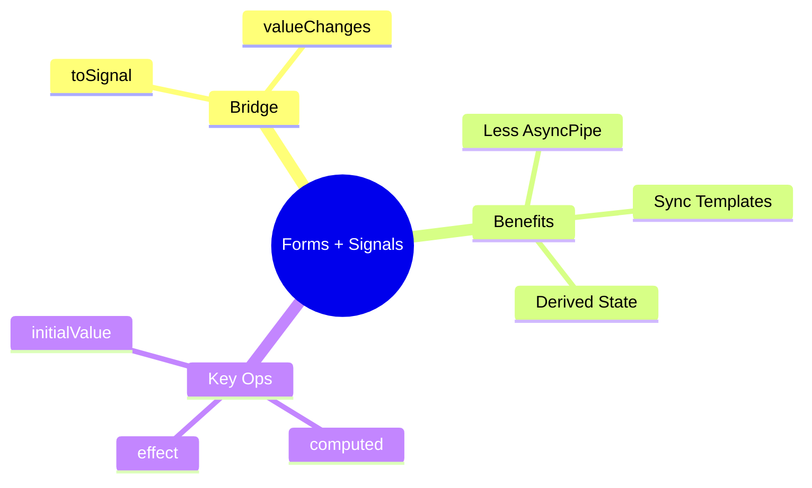

# 🚦 Use Case 10: Reactive Forms + Signals (Interop)

> **Goal**: Combine the power of Reactive Forms (Handling User Input) with the simplicity of Signals (Derived UI State).

---

## 🏛️ What Problem Does It Solve?

### The "Async Pipe Soup" Problem
*   **The Problem**: To show a simple character count in your template using standard RxJS, you traditionally use the `async` pipe multiple times or create a complex `VM$` (ViewModel) observable.
*   **The Solution**: Convert `valueChanges` to a Signal (`toSignal`). Use `computed()` for derived values.
*   **The Benefit**: Templates become synchronous-looking and cleaner (`{{ count() }}` vs `{{ count$ | async }}`). Angular handles subscription/unsubscription.

### The "Glitch-Free" State
*   **The Problem**: Combining multiple Observables (`combineLatest`) can sometimes trigger "glitches" (intermediary invalid states) or excessive emissions.
*   **The Solution**: Signals are glitch-free by design. Computed values only re-evaluate when pulled for the view.

---

## 🔬 Deep Dive: Important Functions

### 1. `toSignal(observable$, options)`
*   **Source**: `@angular/core/rxjs-interop`
*   **Purpose**: Turns a stream into a signal.
*   **Options**:
    *   `initialValue`: Vital for forms, as `valueChanges` doesn't emit the *current* value immediately upon subscription.
    *   `requireSync`: Use if you know the observable is synchronous (e.g. BehaviorSubject).

### 2. `computed(() => ...)`
*   **Purpose**: Create a read-only signal that updates whenever its dependencies change.
*   **Usage**: `isActive = computed(() => this.formSignal()?.status === 'ACTIVE')`.

### 3. `effect(() => ...)`
*   **Purpose**: Running side effects (logging, local storage, analytics) when signals change.
*   **Note**: Avoid setting form values inside effects to prevent loops.

---

## 1. 🔍 How It Works (The Concept)

```mermaid
%%{init: {'theme':'base', 'themeVariables': { 'primaryColor':'#667eea'}}}%%
flowchart LR
    User["User Input"] --> FC["FormControl"]
    FC --> Rx["valueChanges REAM"]
    Rx -->|toSignal()| Sig["Signal 'value()'"]
    
    subgraph SignalGraph ["Signal Graph"]
        Sig --> Comp1["computed(Count)"]
        Sig --> Comp2["computed(Color)"]
        Sig --> Eff["effect(Log)"]
    end
    
    Comp1 --> View["Template Update"]
    
    style Sig fill:#fcd34d,color:#000
    style Rx fill:#667eea,color:#fff
```

---

## 2. 🚀 Step-by-Step Implementation

### Step 1: Create Signal from Control
```typescript
// Don't forget initialValue!
// valueChanges only emits on strict FUTURE changes
query = toSignal(this.form.controls.search.valueChanges, { initialValue: '' });
```

### Step 2: Derive State
```typescript
// No RxJS operators needed - just normal JS code
isValidQuery = computed(() => (this.query()?.length ?? 0) > 3);
formattedQuery = computed(() => this.query()?.toUpperCase());
```

### Step 3: consume in Template
```html
 <p>Query: {{ formattedQuery() }}</p>
 <button [disabled]="!isValidQuery()">Search</button>
```

---

## 3. 🌍 Real World Use Cases

1.  **Live Previews**: MarkDown editor where typing updates a live preview panel (computed).
2.  **Shopping Cart Totals**: FormArray of items -> `toSignal` -> `computed` total price (summing items).
3.  **Dependent UI**: Show/Hide entire sections based on a "Role" dropdown, driven by signals to avoid ChangeDetection overhead.

---

## 7. ❓ Interview & Concept Questions

### Q1: Why do we need `initialValue` in `toSignal(valueChanges)`?
**A:** `valueChanges` is a strict broadcast of *changes*. It doesn't replay the *current* value. Without `initialValue`, the signal would start as `undefined` until the user types something.

### Q2: Can I bind `[formControl]` directly to a Signal?
**A:** No (not yet natively). Reactive Forms are still Model-driven (Push). Signals are Pull-based. You need the `toSignal` bridge. *Note: Angular is exploring Signal-based inputs in the future.*

### Q3: Difference between `AsyncPipe` and `toSignal`?
**A:** `AsyncPipe` subscribes in the *template*. `toSignal` subscribes in the *class*. `toSignal` allows you to create derived state (`computed`) easily in TS, which AsyncPipe makes hard.

### Q4: When does `effect()` run?
**A:** It runs asynchronously, usually after change detection. It's for side effects (DOM, Logging), not for calculation.

### Q5: Is `toSignal` a memory leak?
**A:** No. It automatically un-subscribes when the component (injection context) is destroyed.

### Q6: What happens if you call `toSignal()` outside of an injection context?
**A:** Angular throws a runtime error: "`toSignal()` requires an injection context". You must call it in the constructor, a field initializer, or pass `injector` manually.

### Q7: SCENARIO: Your `toSignal(valueChanges)` shows `undefined` before the user types. How do you fix it?
**A:** Provide an `initialValue`: `toSignal(control.valueChanges, { initialValue: control.value })`.

### Q8: Can you use `computed()` to combine multiple form control signals?
**A:** Yes. Example:
```typescript
fullName = computed(() => `${this.firstName()} ${this.lastName()}`);
```

### Q9: What is the difference between `computed()` and `effect()`?
**A:** `computed()` returns a derived value (pure function). `effect()` runs side effects (logging, API calls) and returns nothing.

### Q10: SCENARIO: You want to save form data to localStorage whenever it changes. Which should you use: `computed()` or `effect()`?
**A:** `effect()`. LocalStorage writes are side effects:
```typescript
effect(() => localStorage.setItem('form', JSON.stringify(this.formSignal())));
```

### Q11: How do you convert `statusChanges` to a Signal?
**A:** Same as valueChanges:
```typescript
status = toSignal(this.form.statusChanges, { initialValue: 'INVALID' });
```

### Q12: Can `effect()` cause infinite loops with forms?
**A:** Yes, if inside the effect you call `setValue()` which triggers `valueChanges`, which updates the signal, which re-runs the effect. Avoid modifying form values inside effects.

### Q13: What is `requireSync` option in `toSignal`?
**A:** It tells Angular the Observable is guaranteed to emit synchronously (like `BehaviorSubject`). This removes the need for `initialValue` and changes the signal type from `T | undefined` to `T`.

### Q14: SCENARIO: You have a search form and want to debounce before converting to Signal. What's the pattern?
**A:** Apply RxJS operators BEFORE `toSignal`:
```typescript
const search$ = this.form.controls.query.valueChanges.pipe(debounceTime(300));
searchSignal = toSignal(search$, { initialValue: '' });
```

### Q15: How do you handle errors in an Observable before converting to Signal?
**A:** Use `catchError` in the pipe:
```typescript
toSignal(obs$.pipe(catchError(() => of('fallback'))), { initialValue: '' });
```

### Q16: What is `toObservable()` and when would you use it?
**A:** It's the reverse bridge: Signal → Observable. Use it when you need RxJS operators (like `switchMap`) that don't exist for signals yet.

### Q17: SCENARIO: Your computed signal depends on both form value AND a route parameter. How do you structure this?
**A:** Create signals for both and combine:
```typescript
routeId = toSignal(this.route.params.pipe(map(p => p['id'])));
formValue = toSignal(this.form.valueChanges, { initialValue: {} });
combined = computed(() => ({ id: this.routeId(), data: this.formValue() }));
```

### Q18: Does `effect()` run during SSR (Server-Side Rendering)?
**A:** By default, yes. You can skip with `effect(() => {...}, { allowSignalWrites: false })` or check `isPlatformBrowser`.

### Q19: SCENARIO: You need to call an API whenever a form field changes, but only after validation passes. What's the approach?
**A:** Combine `valueChanges` with `statusChanges`:
```typescript
formValid = toSignal(this.form.statusChanges.pipe(map(s => s === 'VALID')));
effect(() => {
  if (this.formValid()) { this.apiService.validate(this.formValue()); }
});
```

### Q20: What's the advantage of using Signals over `async` pipe for derived form state?
**A:** 
1. Cleaner templates (`count()` vs `count$ | async`)
2. Easy to compose with `computed()` in TypeScript
3. Automatic subscription management
4. No multiple subscription issues

---

## 🧠 Mind Map: Quick Visual Reference


