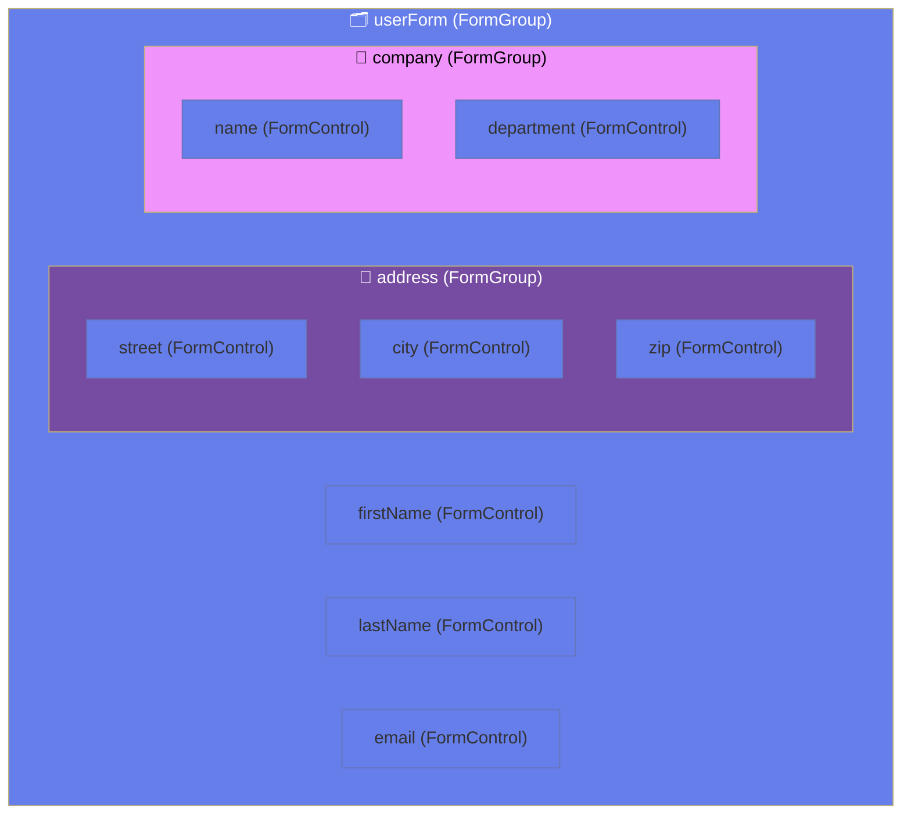
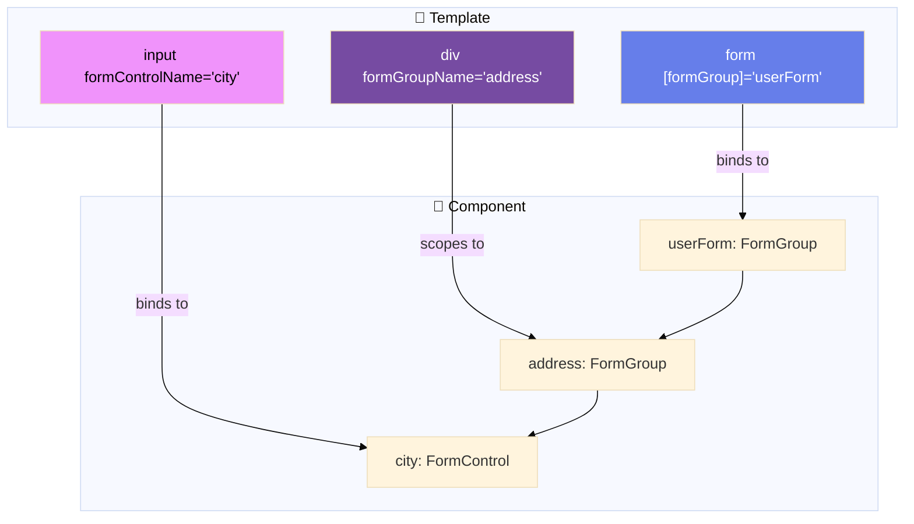
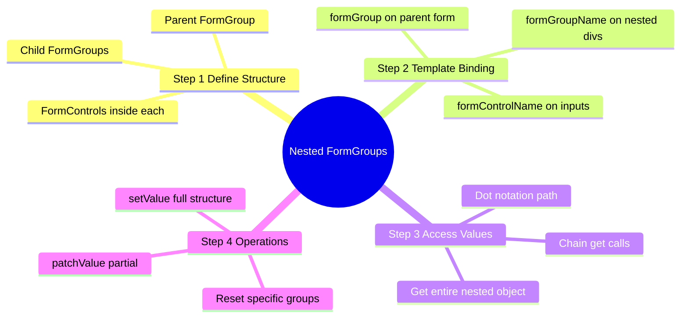
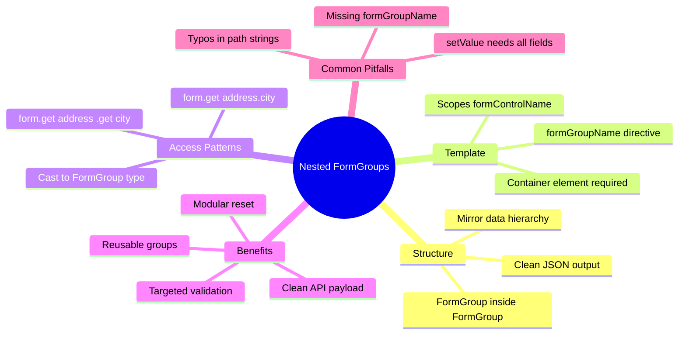

# 📦 Use Case 2: Nested FormGroups

> **Goal**: Organize complex forms with hierarchical structure. Master `formGroupName` and nested data access.

---

## 1. 🔍 How It Works (The Concept)

### The Core Mechanism

A `FormGroup` can contain other `FormGroup` instances as children. This creates a **hierarchical form model** that mirrors your data structure.

```typescript
// Form Structure
userForm = new FormGroup({
    name: new FormControl(''),       // String
    address: new FormGroup({         // Nested Object!
        street: new FormControl(''),
        city: new FormControl('')
    })
});

// Resulting Value
{
    name: "John",
    address: {
        street: "123 Main St",
        city: "New York"
    }
}
```

### Default vs. Optimized Behavior

| Flat Form (Bad) | Nested Form (Good) |
|-----------------|-------------------|
| `addressStreet`, `addressCity` | `address.street`, `address.city` |
| Can't reset just address | `form.get('address').reset()` |
| Messy API payload | Clean nested JSON |
| Hard to reuse | Address group is reusable |

### 📊 Nested Structure Visualization



---

## 2. 🚀 Step-by-Step Implementation Guide

### Step 1: Create Nested FormGroup Structure

```typescript
ngOnInit(): void {
    this.userForm = new FormGroup({
        // Top-level controls
        firstName: new FormControl(''),
        lastName: new FormControl(''),
        
        // 🛡️ CRITICAL: Nested FormGroup for address
        address: new FormGroup({
            street: new FormControl(''),
            city: new FormControl(''),
            state: new FormControl(''),
            zip: new FormControl('')
        })
    });
}
```

### Step 2: Bind Nested Groups in Template

```html
<form [formGroup]="userForm">
    <!-- Top-level controls -->
    <input formControlName="firstName">
    <input formControlName="lastName">
    
    <!-- 🛡️ CRITICAL: Use formGroupName to access nested group -->
    <div formGroupName="address">
        <!-- Now formControlName refers to controls INSIDE address -->
        <input formControlName="street">
        <input formControlName="city">
        <input formControlName="state">
        <input formControlName="zip">
    </div>
</form>
```

### Step 3: Access Nested Values

```typescript
// Option 1: Dot notation (recommended)
this.userForm.get('address.city')?.value; // "New York"

// Option 2: Chain get calls
this.userForm.get('address')?.get('city')?.value;

// Option 3: Get entire nested object
const addressValue = this.userForm.get('address')?.value;
// { street: "...", city: "...", state: "...", zip: "..." }
```

### 📊 Template Binding Flow



---

## 3. 🐛 Common Pitfalls & Debugging

### ❌ Pitfall 1: Missing formGroupName

**Bad Code:**
```html
<form [formGroup]="userForm">
    <!-- ❌ Trying to access 'street' directly from userForm -->
    <input formControlName="street">
</form>
```

**Error:** `Cannot find control with name: 'street'`

**Fix:**
```html
<form [formGroup]="userForm">
    <!-- ✅ Wrap in a div with formGroupName -->
    <div formGroupName="address">
        <input formControlName="street">
    </div>
</form>
```

---

### ❌ Pitfall 2: setValue with Missing Nested Fields

**Bad Code:**
```typescript
this.userForm.setValue({
    firstName: 'John',
    lastName: 'Doe',
    address: {
        street: '123 Main'
        // ❌ Missing city, state, zip!
    }
});
```

**Error:** `Must supply a value for form control with name: 'city'`

**Fix: Use patchValue or provide all fields:**
```typescript
// Option 1: Provide all fields
this.userForm.setValue({
    firstName: 'John',
    lastName: 'Doe',
    address: {
        street: '123 Main',
        city: 'NYC',
        state: 'NY',
        zip: '10001'
    }
});

// Option 2: Use patchValue for partial
this.userForm.patchValue({
    address: { street: '123 Main' }
});
```

---

## 4. ⚡ Performance & Architecture

### Performance Benefits

| Aspect | Benefit |
|--------|---------|
| **Modular Reset** | Reset just one section without affecting others |
| **Targeted Validation** | Check validity of just the address group |
| **Clean API Payloads** | Form value already structured for backend |

### Architecture: Reusable Form Groups

```typescript
// shared/forms/address-form.ts
export function createAddressFormGroup(): FormGroup {
    return new FormGroup({
        street: new FormControl(''),
        city: new FormControl(''),
        state: new FormControl(''),
        zip: new FormControl('')
    });
}

// user-form.component.ts
this.userForm = new FormGroup({
    name: new FormControl(''),
    billingAddress: createAddressFormGroup(),  // Reused!
    shippingAddress: createAddressFormGroup()  // Reused!
});
```

---

## 5. 🌍 Real World Use Cases

1. **User Profile Form**: Name fields + nested Address group + nested Social Links group.
2. **E-Commerce Checkout**: Billing address and Shipping address as separate nested groups.
3. **Job Application**: Personal info + Education (multiple schools) + Experience.

---

## 🗄️ Filing Cabinet Analogy (Easy to Remember!)

Think of nested FormGroups like a **filing cabinet**:

| Concept | Cabinet Analogy | Memory Trick |
|---------|-----------------|--------------|
| **FormGroup (parent)** | 🗄️ **Filing cabinet**: Contains multiple drawers | **"The container"** |
| **Nested FormGroup** | 🗃️ **Drawer**: A section within the cabinet | **"A subsection"** |
| **FormControl** | 📁 **Folder**: Individual documents/values | **"Single value"** |
| **formGroupName** | 🎯 **Drawer label**: "Open THIS drawer first" | **"Navigate to section"** |
| **get('address.city')** | 🔍 **Path**: "Cabinet → Address drawer → City folder" | **"Dot notation path"** |

### 📖 Story to Remember:

> 🗄️ **The HR Filing System**
>
> You're organizing employee records:
>
> **The Cabinet (FormGroup):**
> ```typescript
> userForm = new FormGroup({
>   name: new FormControl(''),       // 📁 Folder in cabinet
>   address: new FormGroup({          // 🗃️ Drawer in cabinet
>     street: new FormControl(''),    // 📁 Folder in drawer
>     city: new FormControl('')       // 📁 Folder in drawer
>   })
> });
> ```
>
> **Finding a folder:**
> ```
> "I need the city file"
> 1. Go to cabinet (userForm)
> 2. Open address drawer (formGroupName="address")
> 3. Grab city folder (formControlName="city")
> 
> form.get('address.city') → "NYC"
> ```
>
> **Each drawer is a section. Each folder is a field!**

### 🎯 Quick Reference:
```
🗄️ Parent FormGroup   = Filing cabinet (main container)
🗃️ Nested FormGroup   = Drawer (subsection)
📁 FormControl        = Folder (individual value)
🎯 formGroupName      = "Open this drawer"
🔍 get('a.b')         = Path to folder (dot notation)
```

---

## 7. ❓ Interview & Concept Questions

### Q1: How do you bind a nested FormGroup in the template?
**A:** Use the `formGroupName` directive on a container element. All `formControlName` directives inside will reference controls within that nested group.

### Q2: How do you access a deeply nested control's value?
**A:** Use dot notation: `form.get('address.city')?.value` or chain: `form.get('address')?.get('city')?.value`.

### Q3: Can you reset just a nested group without affecting the parent?
**A:** Yes! `form.get('address')?.reset()` resets only the address group.

### Q4: What happens if formGroupName doesn't match a key?
**A:** Angular throws: `Cannot find control with path: 'wrongName'`.

### Q5 (Scenario): You have billing and shipping addresses. How do you structure this?
**A:** Create two nested FormGroups:
```typescript
new FormGroup({
    billingAddress: new FormGroup({ street, city, zip }),
    shippingAddress: new FormGroup({ street, city, zip })
});
```

---

## 🔧 Implementation Flow Mindmap



---

## 🧠 Mind Map: Quick Visual Reference


