# 📦 Use Case 2: Nested FormGroups

> **Goal**: Organize complex forms with hierarchical structure. Master `formGroupName` and nested data access.

---

---

## 🏛️ What Problem Does It Solve?

### The "Flat Data" Mismatch
*   **The Problem**: Real APIs return nested JSON (e.g., `{ user: { address: { city: '...' } } }`).
*   **The Struggle**: If you use a flat form, you have to manually map `address_city` to `user.address.city` every time you load or save data.
*   **The Solution**: Nested FormGroups mirror your API structure exactly. `form.value` comes out as perfect JSON, ready to ship to the backend.

### The Component Reusability Issue
*   **The Problem**: You have an "Address" form that appears in User Profile, Checkout, and Company Settings. Copy-pasting the inputs is bad.
*   **The Solution**: Wrap the address logic in a `FormGroup` or a reusable component. You can plug this "Address Group" into any parent form.

---

## 🔬 Deep Dive: Important Classes & Directives

### A. The Classes (TypeScript Side)
1.  **`FormGroup` (Recursive)**:
    *   A `FormGroup` isn't just for the top level. It can contain *other* `FormGroup` instances.
    *   *Analogy*: A folder can contain files (Controls) AND other folders (Groups).
    *   *Key API*: `parentGroup.get('childGroup.controlName')`.

2.  **`AbstractControl`**:
    *   The parent class of both `FormControl` and `FormGroup`.
    *   *Why it matters*: When you use `this.form.get('address')`, the return type is `AbstractControl`, not `FormGroup`. You might need to cast it `(as FormGroup)` to access group-specific methods like `.addControl()`.

### B. The Directives (HTML Side)
1.  **`formGroupName`**:
    *   Used on a *container* element (div, fieldset) inside a form.
    *   *Effect*: Changes the "context" for all children. Any `formControlName` inside looks *relative* to this group, not the root.
    *   *Syntax*: `<div formGroupName="address">`.

2.  **`ControlContainer`**:
    *   (Advanced) Used when splitting nested groups into separate Child Components. It allows the child code to find the parent `FormGroup` directive.

---

## 1. 🔍 How It Works (The Concept)

### The Core Mechanism

A `FormGroup` can contain other `FormGroup` instances as children. This creates a **hierarchical form model** that mirrors your data structure.

```typescript
// Form Structure
userForm = new FormGroup({
    name: new FormControl(''),       // String
    address: new FormGroup({         // Nested Object!
        street: new FormControl(''),
        city: new FormControl('')
    })
});

// Resulting Value
{
    name: "John",
    address: {
        street: "123 Main St",
        city: "New York"
    }
}
```

### Default vs. Optimized Behavior

| Flat Form (Bad) | Nested Form (Good) |
|-----------------|-------------------|
| `addressStreet`, `addressCity` | `address.street`, `address.city` |
| Can't reset just address | `form.get('address').reset()` |
| Messy API payload | Clean nested JSON |
| Hard to reuse | Address group is reusable |

### 📊 Nested Structure Visualization

```mermaid
%%{init: {'theme':'base', 'themeVariables': { 'primaryColor':'#667eea'}}}%%
graph TD
    subgraph UserForm["🗂️ userForm (FormGroup)"]
        FC1["firstName (FormControl)"]
        FC2["lastName (FormControl)"]
        FC3["email (FormControl)"]
        
        subgraph AddressGroup["📍 address (FormGroup)"]
            A1["street (FormControl)"]
            A2["city (FormControl)"]
            A3["zip (FormControl)"]
        end
        
        subgraph CompanyGroup["🏢 company (FormGroup)"]
            C1["name (FormControl)"]
            C2["department (FormControl)"]
        end
    end
    
    style UserForm fill:#667eea,color:#fff
    style AddressGroup fill:#764ba2,color:#fff
    style CompanyGroup fill:#f093fb,color:#000
```



---

## 2. 🚀 Step-by-Step Implementation Guide

### Step 1: Create Nested FormGroup Structure

```typescript
ngOnInit(): void {
    this.userForm = new FormGroup({
        // Top-level controls
        firstName: new FormControl(''),
        lastName: new FormControl(''),
        
        // 🛡️ CRITICAL: Nested FormGroup for address
        address: new FormGroup({
            street: new FormControl(''),
            city: new FormControl(''),
            state: new FormControl(''),
            zip: new FormControl('')
        })
    });
}
```

### Step 2: Bind Nested Groups in Template

```html
<form [formGroup]="userForm">
    <!-- Top-level controls -->
    <input formControlName="firstName">
    <input formControlName="lastName">
    
    <!-- 🛡️ CRITICAL: Use formGroupName to access nested group -->
    <div formGroupName="address">
        <!-- Now formControlName refers to controls INSIDE address -->
        <input formControlName="street">
        <input formControlName="city">
        <input formControlName="state">
        <input formControlName="zip">
    </div>
</form>
```

### Step 3: Access Nested Values

```typescript
// Option 1: Dot notation (recommended)
this.userForm.get('address.city')?.value; // "New York"

// Option 2: Chain get calls
this.userForm.get('address')?.get('city')?.value;

// Option 3: Get entire nested object
const addressValue = this.userForm.get('address')?.value;
// { street: "...", city: "...", state: "...", zip: "..." }
```

### 📊 Template Binding Flow

```mermaid
%%{init: {'theme':'base'}}%%
flowchart TB
    subgraph Template["📄 Template"]
        Form["form [formGroup]='userForm'"]
        Div["div formGroupName='address'"]
        Input["input formControlName='city'"]
    end
    
    subgraph Component["🧠 Component"]
        UF["userForm: FormGroup"]
        AG["address: FormGroup"]
        City["city: FormControl"]
    end
    
    Form -->|"binds to"| UF
    Div -->|"scopes to"| AG
    Input -->|"binds to"| City
    
    UF --> AG
    AG --> City
    
    style Form fill:#667eea,color:#fff
    style Div fill:#764ba2,color:#fff
    style Input fill:#f093fb,color:#000
```



---

## 3. 🐛 Common Pitfalls & Debugging

### ❌ Pitfall 1: Missing formGroupName

**Bad Code:**
```html
<form [formGroup]="userForm">
    <!-- ❌ Trying to access 'street' directly from userForm -->
    <input formControlName="street">
</form>
```

**Error:** `Cannot find control with name: 'street'`

**Fix:**
```html
<form [formGroup]="userForm">
    <!-- ✅ Wrap in a div with formGroupName -->
    <div formGroupName="address">
        <input formControlName="street">
    </div>
</form>
```

---

### ❌ Pitfall 2: setValue with Missing Nested Fields

**Bad Code:**
```typescript
this.userForm.setValue({
    firstName: 'John',
    lastName: 'Doe',
    address: {
        street: '123 Main'
        // ❌ Missing city, state, zip!
    }
});
```

**Error:** `Must supply a value for form control with name: 'city'`

**Fix: Use patchValue or provide all fields:**
```typescript
// Option 1: Provide all fields
this.userForm.setValue({
    firstName: 'John',
    lastName: 'Doe',
    address: {
        street: '123 Main',
        city: 'NYC',
        state: 'NY',
        zip: '10001'
    }
});

// Option 2: Use patchValue for partial
this.userForm.patchValue({
    address: { street: '123 Main' }
});
```

---

## 4. ⚡ Performance & Architecture

### Performance Benefits

| Aspect | Benefit |
|--------|---------|
| **Modular Reset** | Reset just one section without affecting others |
| **Targeted Validation** | Check validity of just the address group |
| **Clean API Payloads** | Form value already structured for backend |

### Architecture: Reusable Form Groups

```typescript
// shared/forms/address-form.ts
export function createAddressFormGroup(): FormGroup {
    return new FormGroup({
        street: new FormControl(''),
        city: new FormControl(''),
        state: new FormControl(''),
        zip: new FormControl('')
    });
}

// user-form.component.ts
this.userForm = new FormGroup({
    name: new FormControl(''),
    billingAddress: createAddressFormGroup(),  // Reused!
    shippingAddress: createAddressFormGroup()  // Reused!
});
```

---

## 5. 🌍 Real World Use Cases

1. **User Profile Form**: Name fields + nested Address group + nested Social Links group.
2. **E-Commerce Checkout**: Billing address and Shipping address as separate nested groups.
3. **Job Application**: Personal info + Education (multiple schools) + Experience.
4. **⚙️ Complex Configuration Objects**: Modeling a `config.json` file for an application (e.g., `{ theme: { color, font }, database: { host, port } }`).
5. **🌍 Multi-Language CMS**: `title` group with `en`, `es`, `fr` controls inside. `{ title: { en: 'Hello', es: 'Hola' } }`.
6. **🏥 Medical Records**: Patient Info (Group) -> Insurance (Group) -> Emergency Contact (Group).
7. **💳 Payment Gateway**: `creditCard` group vs `paypal` group. Swapping/Disabling entire groups based on selection.

---

### 📦 Data Flow Summary (Visual Box Diagram)

```
┌─────────────────────────────────────────────────────────────┐
│  NESTED FORMGROUPS: HIERARCHICAL FORM STRUCTURE             │
│                                                             │
│   COMPONENT CLASS:                                          │
│   ┌───────────────────────────────────────────────────────┐ │
│   │ userForm = new FormGroup({                            │ │
│   │   firstName: new FormControl(''),                     │ │
│   │   lastName: new FormControl(''),                      │ │
│   │   ┌─────────────────────────────────────────────────┐ │ │
│   │   │ address: new FormGroup({  // NESTED!            │ │ │
│   │   │   street: new FormControl(''),                  │ │ │
│   │   │   city: new FormControl(''),                    │ │ │
│   │   │   zip: new FormControl('')                      │ │ │
│   │   │ })                                              │ │ │
│   │   └─────────────────────────────────────────────────┘ │ │
│   │ });                                                   │ │
│   └───────────────────────────────────────────────────────┘ │
│                                                             │
│   TEMPLATE BINDING:                                         │
│   ┌───────────────────────────────────────────────────────┐ │
│   │ <form [formGroup]="userForm">                         │ │
│   │   <input formControlName="firstName">                 │ │
│   │   <div formGroupName="address"> ← SCOPES TO NESTED    │ │
│   │     <input formControlName="street">                  │ │
│   │     <input formControlName="city">                    │ │
│   │   </div>                                              │ │
│   │ </form>                                               │ │
│   └───────────────────────────────────────────────────────┘ │
│                                                             │
│   ACCESSING: form.get('address.city')?.value               │
└─────────────────────────────────────────────────────────────┘
```

> **Key Takeaway**: Use `formGroupName` directive to scope into nested groups. Access values with dot notation!

---

## 🗄️ Filing Cabinet Analogy (Easy to Remember!)

Think of nested FormGroups like a **filing cabinet**:

| Concept | Cabinet Analogy | Memory Trick |
|---------|-----------------|--------------|
| **FormGroup (parent)** | 🗄️ **Filing cabinet**: Contains multiple drawers | **"The container"** |
| **Nested FormGroup** | 🗃️ **Drawer**: A section within the cabinet | **"A subsection"** |
| **FormControl** | 📁 **Folder**: Individual documents/values | **"Single value"** |
| **formGroupName** | 🎯 **Drawer label**: "Open THIS drawer first" | **"Navigate to section"** |
| **get('address.city')** | 🔍 **Path**: "Cabinet → Address drawer → City folder" | **"Dot notation path"** |

### 📖 Story to Remember:

> 🗄️ **The HR Filing System**
>
> You're organizing employee records:
>
> **The Cabinet (FormGroup):**
> ```typescript
> userForm = new FormGroup({
>   name: new FormControl(''),       // 📁 Folder in cabinet
>   address: new FormGroup({          // 🗃️ Drawer in cabinet
>     street: new FormControl(''),    // 📁 Folder in drawer
>     city: new FormControl('')       // 📁 Folder in drawer
>   })
> });
> ```
>
> **Finding a folder:**
> ```
> "I need the city file"
> 1. Go to cabinet (userForm)
> 2. Open address drawer (formGroupName="address")
> 3. Grab city folder (formControlName="city")
> 
> form.get('address.city') → "NYC"
> ```
>
> **Each drawer is a section. Each folder is a field!**

### 🎯 Quick Reference:
```
🗄️ Parent FormGroup   = Filing cabinet (main container)
🗃️ Nested FormGroup   = Drawer (subsection)
📁 FormControl        = Folder (individual value)
🎯 formGroupName      = "Open this drawer"
🔍 get('a.b')         = Path to folder (dot notation)
```

---

## 7. ❓ Interview & Concept Questions

### Q1: How do you bind a nested FormGroup in the template?
**A:** Use the `formGroupName` directive on a container element. All `formControlName` directives inside will reference controls within that nested group.

### Q2: How do you access a deeply nested control's value?
**A:** Use dot notation: `form.get('address.city')?.value` or chain: `form.get('address')?.get('city')?.value`.

### Q3: Can you reset just a nested group without affecting the parent?
**A:** Yes! `form.get('address')?.reset()` resets only the address group.

### Q4: What happens if formGroupName doesn't match a key?
**A:** Angular throws: `Cannot find control with path: 'wrongName'`.

### Q5 (Scenario): You have billing and shipping addresses. How do you structure this?
**A:** Create two nested FormGroups:
```typescript
new FormGroup({
    billingAddress: new FormGroup({ street, city, zip }),
    shippingAddress: new FormGroup({ street, city, zip })
});
```

### Q6: If a nested control is invalid, is the parent valid?
**A:** **No.** Validity bubbles up. If `address.city` is invalid -> `address` group is invalid -> `userForm` (root) is invalid.

### Q7: How do you validate two fields inside a nested group (e.g., Start Date < End Date)?
**A:** Apply a validator to the **Nested Group** itself (`address` group), not the root form.
```typescript
new FormGroup({ ... }, { validators: dateRangeValidator })
```

### Q8: Can you nest a FormArray inside a FormGroup?
**A:** Yes. `userForm` (Group) -> `addresses` (Array) -> `address` (Group). This is common for "Multiple Shipping Addresses".

### Q9: What is `ControlContainer` used for?
**A:** It allows a Child Component to inject the Parent's FormGroup instance, enabling you to split a large form into smaller sub-components without passing `@Input() form`.

### Q10: How do you dynamically remove a nested group?
**A:** `form.removeControl('address')`.

### Q11: Does `patchValue` work recursively?
**A:** **Yes.** If you pass `{ address: { city: 'Paris' } }`, it finds the address group, then the city control, and updates it.

### Q12: Why use `formGroupName` vs passing `[formGroup]="nestedInstance"`?
**A:** `formGroupName` is cleaner when the hierarchy is static in one template. Passing `[formGroup]` is better when using a reusable Child Component.

### Q13: (Scenario) API returns `address_street` (flat) but you use nested groups. How to handle?
**A:** You need a **Adapter/Mapper** layer.
*   *Incoming*: Map `address_street` → `{ address: { street: val } }`.
*   *Outgoing*: Map `{ address: { street: val } }` → `address_street`.
Do NOT pollute your form structure to match a messy legacy API.

### Q14: How do you disable an entire nested group?
**A:** `form.get('address')?.disable()`. This disables ALL controls inside it and excludes it from `form.value`.

### Q15: What is the return type of `form.get('address')`?
**A:** `AbstractControl | null`. You often need to cast it: `(this.form.get('address') as FormGroup)`.

### Q16: (Scenario) User has a "Billing same as Shipping" checkbox. How to implement?
**A:** Listen to checkbox change. If checked, subscribe to `shipping.valueChanges` and patch it to `billing`. Or, simply `billing.setValue(shipping.value)`.

### Q17: Can a FormGroup have NO controls?
**A:** Yes (`new FormGroup({})`). Useful as a placeholder or flexible container that gets controls added dynamically later.

### Q18: Difference between `formGroup.value` and `formGroup.getRawValue()`?
**A:** `getRawValue()` includes values of **disabled** controls. `.value` ignores disabled controls.

### Q19: How do you test a nested validator?
**A:**
```typescript
const group = new FormGroup({ ... }, myValidator);
group.patchValue({ ... });
expect(group.errors).toEqual({ myError: true });
```

### Q20: (Scenario) How to show an error if ANY field in the address group is touched and invalid?
**A:** Check `form.get('address')?.invalid && form.get('address')?.touched`.

### Q21: What happens if you duplicate a key in a FormGroup?
**A:** The last one wins (overwrites the previous one during initialization). Common copy-paste error.
```

---

## 🔧 Implementation Flow Mindmap


---

## 🧠 Mind Map: Quick Visual Reference


