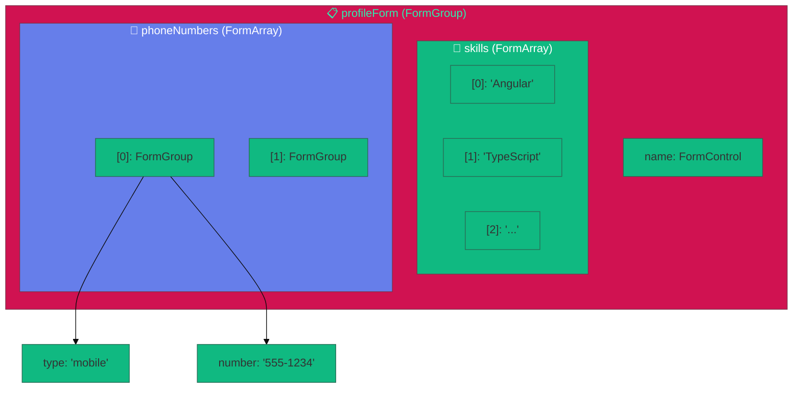
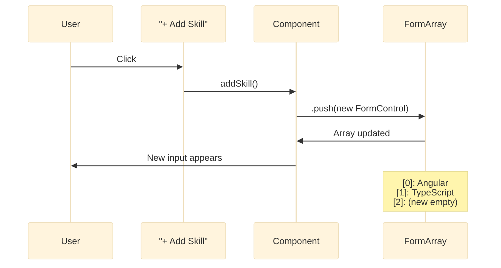
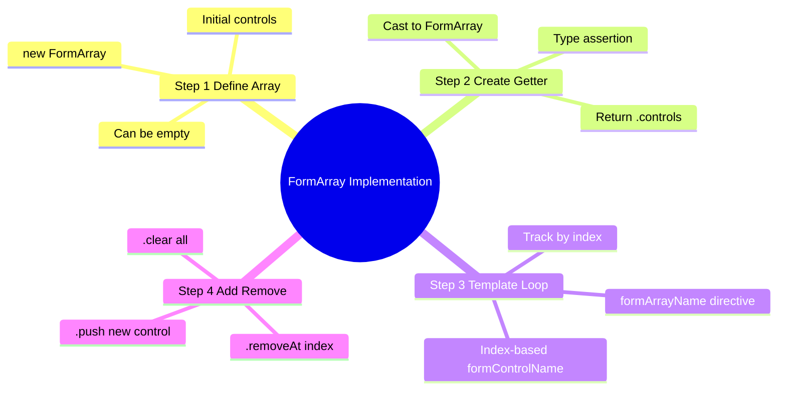
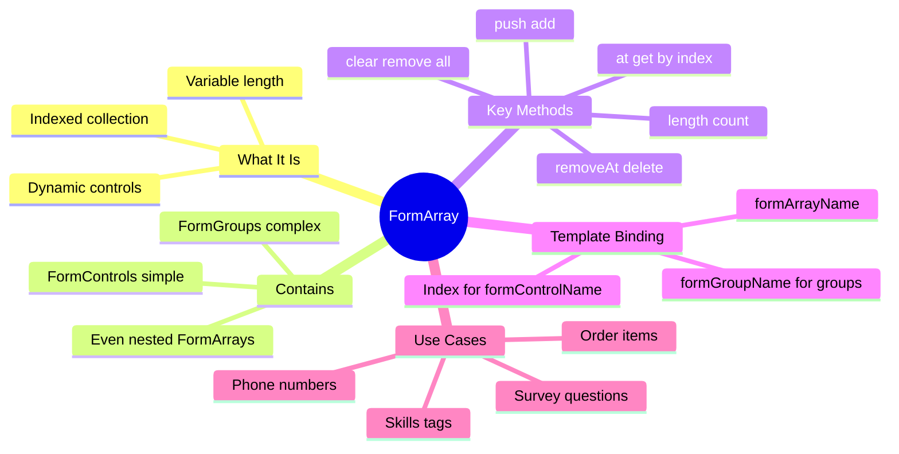

# ➕ Use Case 3: FormArray (Dynamic Fields)

> **Goal**: Add and remove form fields dynamically at runtime using FormArray.

---

## 1. 🔍 How It Works (The Concept)

### The Core Mechanism

`FormArray` is a collection of controls that can grow or shrink at runtime. Unlike `FormGroup` (which has fixed keys), `FormArray` is indexed numerically and can contain any number of items.

| FormGroup | FormArray |
|-----------|-----------|
| Fixed keys: `{ name, email }` | Indexed: `[0], [1], [2]...` |
| Known at compile time | Dynamic at runtime |
| Object structure | Array structure |

### Default vs. Optimized Behavior

- **Default (Hardcoded Fields)**: Fixed number of phone inputs. Can't add more.
- **Optimized (FormArray)**: User clicks "Add Phone" → new field appears. Flexible!

### 📊 FormArray Structure



---

## 2. 🚀 Step-by-Step Implementation Guide

### Step 1: Create FormArray in Component

```typescript
ngOnInit(): void {
    this.profileForm = new FormGroup({
        name: new FormControl(''),
        
        // 🛡️ FormArray of FormControls (simple values)
        skills: new FormArray([
            new FormControl('Angular'),
            new FormControl('TypeScript')
        ]),
        
        // 🛡️ FormArray of FormGroups (complex objects)
        phoneNumbers: new FormArray([
            new FormGroup({
                type: new FormControl('mobile'),
                number: new FormControl('')
            })
        ])
    });
}
```

### Step 2: Create Getter for Easy Access

```typescript
// 🛡️ CRITICAL: You need a getter to iterate over FormArray!
get skillsControls(): FormControl[] {
    return (this.profileForm.get('skills') as FormArray).controls as FormControl[];
}
```

### Step 3: Bind in Template

```html
<div formArrayName="skills">
    <!-- Iterate with index -->
    @for (control of skillsControls; track i; let i = $index) {
        <!-- 🛡️ CRITICAL: [formControlName]="i" uses the INDEX -->
        <input [formControlName]="i" placeholder="Skill">
        <button (click)="removeSkill(i)">Remove</button>
    }
</div>
<button (click)="addSkill()">+ Add Skill</button>
```

### Step 4: Implement Add/Remove Methods

```typescript
addSkill(): void {
    const skills = this.profileForm.get('skills') as FormArray;
    skills.push(new FormControl('')); // Add empty control
}

removeSkill(index: number): void {
    const skills = this.profileForm.get('skills') as FormArray;
    skills.removeAt(index); // Remove by index
}
```

### 📊 Add/Remove Flow



---

## 3. 🐛 Common Pitfalls & Debugging

### ❌ Pitfall 1: Using formControlName with Number

**Bad Code:**
```html
<!-- ❌ String "0" instead of number 0 -->
<input formControlName="0">
```

**Issue:** Works but confusing. The index should be dynamic.

**Fix:**
```html
<!-- ✅ Use property binding with index variable -->
<input [formControlName]="i">
```

---

### ❌ Pitfall 2: Accessing FormArray without Casting

**Bad Code:**
```typescript
// ❌ Error: Property 'push' does not exist on type 'AbstractControl'
this.profileForm.get('skills').push(new FormControl());
```

**Fix:**
```typescript
// ✅ Cast to FormArray first
const skills = this.profileForm.get('skills') as FormArray;
skills.push(new FormControl());
```

---

### ❌ Pitfall 3: FormArray of FormGroups without formGroupName

**Bad Code:**
```html
<div formArrayName="phones">
    @for (phone of phonesControls; track i; let i = $index) {
        <!-- ❌ Missing [formGroupName]="i" -->
        <input formControlName="number">
    }
</div>
```

**Error:** `Cannot find control with path: 'phones -> number'`

**Fix:**
```html
<div formArrayName="phones">
    @for (phone of phonesControls; track i; let i = $index) {
        <!-- ✅ Add [formGroupName]="i" wrapper -->
        <div [formGroupName]="i">
            <input formControlName="number">
        </div>
    }
</div>
```

---

## 4. ⚡ Performance & Architecture

### Performance Tips

| Tip | Why |
|-----|-----|
| Use `trackBy` with `@for` | Prevents re-rendering all items on change |
| Lazy add controls | Don't pre-create 100 empty fields |
| Disable remove when 1 item | Prevent edge cases |

### Architecture Pattern: Factory Methods

```typescript
// Create consistent FormGroup structures with a factory
private createPhoneGroup(type = 'mobile', number = ''): FormGroup {
    return new FormGroup({
        type: new FormControl(type),
        number: new FormControl(number, [Validators.required])
    });
}

addPhone(): void {
    this.phonesArray.push(this.createPhoneGroup());
}
```

---

## 5. 🌍 Real World Use Cases

1. **E-Commerce Order**: Line items array with product, quantity, price per item.
2. **Survey Builder**: Dynamic list of questions. User adds/removes questions.
3. **Resume Builder**: Multiple education entries, work experiences, skills.

---

### 📦 Data Flow Summary (Visual Box Diagram)

```
┌─────────────────────────────────────────────────────────────┐
│  FORMARRAY: DYNAMIC, INDEXED COLLECTION                     │
│                                                             │
│   STRUCTURE:                                                │
│   ┌───────────────────────────────────────────────────────┐ │
│   │ skills: new FormArray([                               │ │
│   │   new FormControl('Angular'),   ← [0]                 │ │
│   │   new FormControl('TypeScript') ← [1]                 │ │
│   │ ])                                                    │ │
│   └───────────────────────────────────────────────────────┘ │
│                                                             │
│   ADD CONTROL:                                              │
│   ┌───────────────────────────────────────────────────────┐ │
│   │ User clicks "Add Skill"                               │ │
│   │        │                                              │ │
│   │        ▼                                              │ │
│   │ (skillsArray as FormArray).push(new FormControl(''))  │ │
│   │        │                                              │ │
│   │        ▼                                              │ │
│   │ [0] Angular, [1] TypeScript, [2] (new)                │ │
│   └───────────────────────────────────────────────────────┘ │
│                                                             │
│   TEMPLATE:                                                 │
│   ┌───────────────────────────────────────────────────────┐ │
│   │ <div formArrayName="skills">                          │ │
│   │   @for (skill of skillsControls; track i) {           │ │
│   │     <input [formControlName]="i">  ← INDEX!           │ │
│   │     <button (click)="removeSkill(i)">X</button>       │ │
│   │   }                                                   │ │
│   │ </div>                                                │ │
│   └───────────────────────────────────────────────────────┘ │
└─────────────────────────────────────────────────────────────┘
```

> **Key Takeaway**: FormArray uses numeric indices. Cast to FormArray to use push/removeAt. Use [formControlName]="i"!

---

## 🛒 Shopping List Analogy (Easy to Remember!)

Think of FormArray like a **shopping list on your phone**:

| Concept | Shopping List Analogy | Memory Trick |
|---------|----------------------|--------------| 
| **FormArray** | 🛒 **Shopping list**: Dynamic items you can add/remove | **"Flexible array"** |
| **FormGroup** | 📋 **Fixed form**: Name, Email, Phone (known fields) | **"Fixed fields"** |
| **.push()** | ➕ **Add item**: "Need milk!" | **"Add to list"** |
| **.removeAt()** | ❌ **Cross off**: Done with eggs | **"Remove by index"** |
| **.clear()** | 🗑️ **Start fresh**: Clear whole list | **"Remove all"** |

### 📖 Story to Remember:

> 🛒 **The Smart Shopping App**
>
> Your form is a shopping list:
>
> **Creating the list:**
> ```typescript
> skills: new FormArray([
>   new FormControl('Angular'),    // 🥛 Milk
>   new FormControl('TypeScript')  // 🥚 Eggs
> ])
> ```
>
> **Adding items:**
> ```typescript
> addSkill() {
>   skillsArray.push(new FormControl(''));  // ➕ Add to list
> }
> // "I also need bread!"
> ```
>
> **Removing items:**
> ```typescript
> removeSkill(index) {
>   skillsArray.removeAt(index);  // ❌ Cross off
> }
> // "Got the milk, done!"
> ```
>
> **List grows and shrinks dynamically!**

### 🎯 Quick Reference:
```
🛒 FormArray      = Shopping list (dynamic)
📋 FormGroup      = Fixed form (static fields)
➕ .push()        = Add item to list
❌ .removeAt(i)   = Cross off item at position
🗑️ .clear()       = Start fresh (empty list)
```

---

## 7. ❓ Interview & Concept Questions

### Q1: What's the difference between FormArray and FormGroup?
**A:** `FormGroup` has fixed, named keys. `FormArray` has indexed, dynamic controls. Use `FormGroup` when you know all fields ahead of time. Use `FormArray` when fields are added/removed at runtime.

### Q2: How do you add a control to a FormArray?
**A:** `(formArray as FormArray).push(new FormControl('value'))`.

### Q3: How do you bind a FormArray in the template?
**A:** Use `formArrayName="arrayName"` on a container, then iterate with `@for` and use `[formControlName]="index"`.

### Q4: How do you create a FormArray of FormGroups?
**A:** Each item in the array is a `new FormGroup({...})`. In the template, wrap each iteration in `[formGroupName]="i"`.

### Q5 (Scenario): User can add unlimited email addresses. How?
**A:**
```typescript
emails: new FormArray([new FormControl('')])

addEmail() {
    this.emailsArray.push(new FormControl(''));
}
```

---

## 🔧 Implementation Flow Mindmap



---

## 🧠 Mind Map: Quick Visual Reference


