# ✅ Use Case 4: Built-in Validators

> **Goal**: Master Angular's built-in validators for common validation scenarios.

---

---

## 🏛️ What Problem Does It Solve?

### The "Garbage In, Garbage Out" Problem
*   **The Problem**: If you send "abcdef" as a phone number to your API, the API will crash or reject it.
*   **The Solution**: Client-side validation catches bad data *before* it leaves the browser. `Validators.pattern` ensures the phone matches a regex.
*   **The Benefit**: Saves API calls, provides instant feedback to the user ("Password too short!"), and keeps your database clean.

### The "Silent Failure" Problem
*   **The Problem**: A user makes a typo in their email but doesn't realize it until they never get the confirmation link.
*   **The Solution**: `Validators.email` flags the formatting error immediately. `touched` state ensures we don't annoy them while they are still typing.

---

## 🔬 Deep Dive: Important Classes & Directives

### A. The Classes (TypeScript Side)
1.  **`Validators`**:
    *   A static utility class full of factory functions.
    *   *Methods*: `.required`, `.min()`, `.max()`, `.email`, `.pattern()`.
    *   *Usage*: You don't "new" this class. You just call `Validators.required`.

2.  **`ValidatorFn` (The Type)**:
    *   Technically, a validator is just a function: `(control: AbstractControl) => ValidationErrors | null`.
    *   *Return Value*: If valid, return `null`. If invalid, return an object `{ errorName: true }`.

### B. The Directives (HTML Side)
1.  **`[class.invalid]` (CSS Validations)**:
    *   Not a directive per se, but the standard way to visualize errors.
    *   *Pattern*: `[class.is-invalid]="control.invalid && control.touched"`.

2.  **`form.valid` property**:
    *   The `FormGroup` aggregates ALL child statuses. If one field fails, `form.valid` is `false`.

---

## 1. 🔍 How It Works (The Concept)

### The Core Mechanism

Validators are functions that check if a control's value meets certain criteria. Angular provides built-in validators for common scenarios. When validation fails, an **errors object** is populated.

```typescript
// Applying validators
new FormControl('', [Validators.required, Validators.minLength(3)])

// Errors object when invalid
{ required: true }
{ minlength: { requiredLength: 3, actualLength: 2 } }
```

### Default vs. Optimized Behavior

| Without Validators | With Validators |
|-------------------|-----------------|
| Accept any input | Enforce rules |
| No user feedback | Clear error messages |
| Submit invalid data | Prevent bad submissions |

### 📊 Validation Flow

```mermaid
%%{init: {'theme':'base', 'themeVariables': { 'primaryColor':'#10b981'}}}%%
flowchart LR
    User["👤 User Types"] --> FC["FormControl"]
    FC --> V{"Validators Run"}
    V -->|Pass| Valid["✅ control.valid = true"]
    V -->|Fail| Invalid["❌ control.errors = { ... }"]
    Invalid --> UI["Show Error Message"]
    
    style V fill:#667eea,color:#fff
    style Valid fill:#10b981,color:#fff
    style Invalid fill:#ef4444,color:#fff
```



---

## 2. 🚀 Step-by-Step Implementation Guide

### Step 1: Import Validators

```typescript
import { Validators, FormControl, FormGroup } from '@angular/forms';
```

### Step 2: Apply Validators to Controls

```typescript
this.form = new FormGroup({
    // Single validator
    name: new FormControl('', Validators.required),
    
    // Multiple validators - use array
    email: new FormControl('', [
        Validators.required,
        Validators.email
    ]),
    
    // Numeric validators
    age: new FormControl(null, [
        Validators.min(18),
        Validators.max(100)
    ]),
    
    // Pattern (regex)
    phone: new FormControl('', Validators.pattern(/^\d{3}-\d{3}-\d{4}$/))
});
```

### Step 3: Display Errors in Template

```html
<input formControlName="email" [class.invalid]="isInvalid('email')">

@if (isInvalid('email')) {
    <div class="errors">
        @if (form.get('email')?.errors?.['required']) {
            <span>Email is required</span>
        }
        @if (form.get('email')?.errors?.['email']) {
            <span>Invalid email format</span>
        }
    </div>
}
```

### Step 4: Helper Method for Cleaner Template

```typescript
isInvalid(controlName: string): boolean {
    const control = this.form.get(controlName);
    // Show errors only if dirty or touched
    return !!(control?.invalid && (control.dirty || control.touched));
}
```

### 📊 Validators Reference Table


---

## 3. 🐛 Common Pitfalls & Debugging

### ❌ Pitfall 1: Showing Errors Immediately

**Bad Code:**
```html
<!-- Shows error before user interacts -->
@if (form.get('email')?.invalid) {
    <span>Email is required</span>
}
```

**Issue:** User sees error on page load before they've done anything!

**Fix:**
```html
<!-- Only show if dirty or touched -->
@if (form.get('email')?.invalid && form.get('email')?.touched) {
    <span>Email is required</span>
}
```

---

### ❌ Pitfall 2: Confusing min/max with minLength/maxLength

**Bad Code:**
```typescript
// ❌ Want to limit password to 8+ chars
password: new FormControl('', Validators.min(8))
```

**Issue:** `Validators.min` is for NUMBERS, not strings!

**Fix:**
```typescript
// ✅ Use minLength for string length
password: new FormControl('', Validators.minLength(8))
```

---

### ❌ Pitfall 3: Accessing Wrong Error Key

**Bad Code:**
```html
<!-- ❌ Wrong key 'minLength' (camelCase) -->
@if (form.get('name')?.errors?.['minLength']) { ... }
```

**Issue:** Error keys are lowercase: `minlength`, `maxlength`

**Fix:**
```html
<!-- ✅ Correct lowercase key -->
@if (form.get('name')?.errors?.['minlength']) { ... }
```

---

## 4. ⚡ Performance & Architecture

### Performance Tips

| Tip | Why |
|-----|-----|
| Use `updateOn: 'blur'` | Validate only when user leaves field, not on every keystroke |
| Combine validators wisely | Don't add redundant checks |
| Async validators last | Run expensive checks only if sync validators pass |

### Update Strategy

```typescript
// Validate on blur instead of change (better UX)
new FormControl('', {
    validators: [Validators.required],
    updateOn: 'blur'
});
```

---

## 5. 🌍 Real World Use Cases

1. **Registration Form**: Username (3-20 chars), email (valid format), password (8+ chars, complexity).
2. **Payment Form**: Credit card (pattern), expiry (pattern MM/YY), CVV (3-4 digits).
3. **Profile Settings**: Age (18-120), phone (pattern), website (pattern URL).
4. **🚗 VIN Validation**: Custom regex pattern for Vehicle Identification Numbers.
5. **🏢 Tax ID / SSN**: Strict pattern matching `^\d{3}-\d{2}-\d{4}$`.
6. **🔄 Username Availability**: Async validator checking the database if the handle is taken.
7. **📅 Date Ranges**: Start Date must be before End Date (Cross-field validation).

---

### 📦 Data Flow Summary (Visual Box Diagram)

```
┌─────────────────────────────────────────────────────────────┐
│  BUILT-IN VALIDATORS: FORM FIELD RULES                      │
│                                                             │
│   VALIDATOR TYPES:                                          │
│   ┌───────────────────────────────────────────────────────┐ │
│   │ Validators.required      → Field must have value      │ │
│   │ Validators.minLength(n)  → Min n characters (string)  │ │
│   │ Validators.maxLength(n)  → Max n characters (string)  │ │
│   │ Validators.min(n)        → Number >= n                │ │
│   │ Validators.max(n)        → Number <= n                │ │
│   │ Validators.email         → Valid email format         │ │
│   │ Validators.pattern(rx)   → Matches regex              │ │
│   │ Validators.requiredTrue  → Checkbox must be checked   │ │
│   └───────────────────────────────────────────────────────┘ │
│                                                             │
│   APPLYING VALIDATORS:                                      │
│   ┌───────────────────────────────────────────────────────┐ │
│   │ email: new FormControl('', [                          │ │
│   │   Validators.required,    // Multiple validators      │ │
│   │   Validators.email        // in array!                │ │
│   │ ])                                                    │ │
│   └───────────────────────────────────────────────────────┘ │
│                                                             │
│   ERRORS OBJECT:                                            │
│   ┌───────────────────────────────────────────────────────┐ │
│   │ // When invalid:                                      │ │
│   │ { required: true }                                    │ │
│   │ { minlength: { requiredLength: 8, actualLength: 3 } } │ │
│   │ { email: true }                                       │ │
│   │                                                       │ │
│   │ // When valid:                                        │ │
│   │ null                                                  │ │
│   └───────────────────────────────────────────────────────┘ │
│                                                             │
│   ⚠️ REMEMBER: Error keys are lowercase (minlength, not minLength)│
└─────────────────────────────────────────────────────────────┘
```

> **Key Takeaway**: Array for multiple validators. Check `touched/dirty` before showing errors. Error keys are lowercase!

---

## 🚪 Club Bouncer Analogy (Easy to Remember!)

Think of validators like **bouncers at a club**:

| Validator | Bouncer Rule | Memory Trick |
|-----------|-------------|--------------| 
| **required** | 🪪 **"Show ID!"**: Must have something | **"Not empty"** |
| **minLength(8)** | 📏 **"Too short!"**: Check length | **"Min chars"** |
| **email** | 📧 **"Valid email?"**: Format check | **"@ required"** |
| **min(18)** | 🔞 **"Must be 18+"**: Age check | **"Min number"** |
| **pattern** | 👔 **"Dress code"**: Specific format | **"Regex match"** |

### 📖 Story to Remember:

> 🚪 **The Club Door**
>
> Your form fields have bouncers:
>
> **Setting up the rules:**
> ```typescript
> email: new FormControl('', [
>   Validators.required,  // 🪪 "Need an email!"
>   Validators.email      // 📧 "Must look like email!"
> ]),
> age: new FormControl('', [
>   Validators.min(18)    // 🔞 "Must be 18 or older!"
> ])
> ```
>
> **Why you're rejected:**
> ```typescript
> // Bouncer tells you WHY:
> errors = {
>   required: true,           // 🪪 "No ID!"
>   email: true,              // 📧 "Invalid format!"
>   minlength: { required: 8, actual: 3 }  // 📏 "Too short!"
> }
> ```
>
> **Every bouncer reports exactly what's wrong!**

### 🎯 Quick Reference:
```
🪪 required       = "Show ID" (must have value)
📏 minLength(n)   = "Too short" (string length)
🔞 min(n)         = "Must be N+" (number value)
📧 email          = "Valid email?" (format)
👔 pattern(rx)    = "Dress code" (regex match)
```

---

## 7. ❓ Interview & Concept Questions

### Q1: How do you apply multiple validators to one control?
**A:** Pass an array: `new FormControl('', [Validators.required, Validators.email])`.

### Q2: What's the difference between `min` and `minLength`?
**A:** `min(n)` validates numeric VALUES (e.g., age >= 18). `minLength(n)` validates string LENGTH (e.g., password has 8+ characters).

### Q3: How do you prevent showing errors before user interaction?
**A:** Check `control.dirty || control.touched` before displaying errors.

### Q4: What does the errors object look like?
**A:** It's null if valid. If invalid, it contains keys like `{ required: true, minlength: { requiredLength: 3, actualLength: 2 } }`.

### Q5 (Scenario): User should only see errors after clicking Submit. How?
**A:** Call `form.markAllAsTouched()` in submit handler:
```typescript
onSubmit() {
    if (this.form.invalid) {
        this.form.markAllAsTouched(); // Now all errors show
        return;
    }
}
```

### Q6: How do you create a Custom Validator?
**A:** Create a function that takes a control and returns `ValidationErrors | null`.
```typescript
function cannotContainSpace(control: AbstractControl) {
    if (control.value.includes(' ')) return { hasSpace: true };
    return null;
}
```

### Q7: What is the sequence of validation execution?
**A:** Sync validators run first. If (and ONLY if) they pass, Async validators run next.

### Q8: How do you add a validator dynamically at runtime?
**A:** `control.setValidators([Validators.required]); control.updateValueAndValidity();`

### Q9: How do you disable validation for a control?
**A:** `control.clearValidators(); control.updateValueAndValidity();`

### Q10: Why does `control.disable()` make the form valid?
**A:** Disabled controls are excluded from validation. If a required field is disabled, the form status becomes VALID (assuming other fields are valid).

### Q11: Explain Cross-Field Validation.
**A:** Validation that depends on two fields (e.g., matching passwords). It must be attached to the **FormGroup** (parent), not individual controls.

### Q12: How do you check if a control is PENDING?
**A:** `control.status === 'PENDING'`. This happens while an Async Validator (HTTP call) is running.

### Q13: Can you pass parameters to a custom validator (e.g., `minAge(18)`)?
**A:** Yes, create a **Factory Function**:
```typescript
function minAge(age: number): ValidatorFn {
    return (control) => control.value < age ? { tooYoung: true } : null;
}
```

### Q14: How does `requiredTrue` differ from `required`?
**A:** `required` checks if value is non-empty/non-null with `Validators.required(control)`. `requiredTrue` checks if value `=== true` (useful for "Accept Terms" checkboxes).

### Q15: What regex is used by `Validators.email`?
**A:** It uses the WHATWG HTML specification regex. It's permissive (allows `a@b`). For strict business rules, use a custom Pattern validator.

### Q16: How do you get ALL errors from a FormGroup recursively?
**A:** There is no built-in method. You must loop through `form.controls`, checks its errors, and recurse if it's a group/array.

### Q17: What happens if you return `{}` (empty object) from a validator?
**A:** Valid. Any truthy object is considered an error, but usually `{ key: true }` is the standard. Angular checks properties. Actually, `null` is the only "valid" return. Wait, strictly ANY non-null return is treated as invalid.

### Q18: Difference between `setValidators` and `addValidators`?
**A:** `setValidators` overwrites ALL existing validators. `addValidators` Appends to list (Angular 12+ feature).

### Q19: How to validate a file input (e.g., max size)?
**A:** Since `FormControl` usually holds the string path (fake path), you often need a custom instruction on the `(change)` event, OR write a custom ControlValueAccessor that holds the File object.

### Q20: (Scenario) User types slowly. Async check runs too often. Fix?
**A:** Async validators don't debounce by default. You might need to implement logic inside the async validator to check `valueChanges` with `timer/debounce`.

### Q21: How to show "Saved!" success message only when valid and NOT dirty?
**A:** `form.valid && form.pristine`. This implies the form matches the initial state (or last save point if we reset it).

---

## 🔧 Implementation Flow Mindmap


---

## 🧠 Mind Map: Quick Visual Reference


