# 🛡️ Use Case 5: Custom Validators (Sync & Async)

> **Goal**: Create custom validation logic for business rules beyond built-in validators.

---

## 1. 🔍 How It Works (The Concept)

### The Core Mechanism

A validator is a **function** that receives a control and returns either `null` (valid) or a `ValidationErrors` object (invalid).

```typescript
// Validator signature
(control: AbstractControl) => ValidationErrors | null

// ValidationErrors is just an object
{ errorKey: errorValue }
```

### Sync vs Async Validators

| Sync Validators | Async Validators |
|-----------------|------------------|
| Run immediately | Return Observable/Promise |
| Block fast | Wait for response |
| Local checks | Server-side checks |
| 2nd argument | 3rd argument |

### 📊 Validator Execution Flow

```mermaid
%%{init: {'theme':'base', 'themeVariables': { 'primaryColor':'#667eea'}}}%%
flowchart TB
    Input["User Input"] --> Sync["Sync Validators"]
    Sync -->|Pass| Async["Async Validators"]
    Sync -->|Fail| Error1["Show Sync Errors"]
    Async -->|Pending| Loading["⏳ control.pending = true"]
    Loading --> Result{Response}
    Result -->|Pass| Valid["✅ Valid"]
    Result -->|Fail| Error2["Show Async Errors"]
    
    style Sync fill:#667eea,color:#fff
    style Async fill:#764ba2,color:#fff
    style Valid fill:#10b981,color:#fff
```



---

## 2. 🚀 Step-by-Step Implementation Guide

### Step 1: Create Sync Validator Function

```typescript
// Validator that rejects whitespace
function noWhitespace(control: AbstractControl): ValidationErrors | null {
    const hasWhitespace = /\s/.test(control.value);
    
    // null = valid, object = invalid
    return hasWhitespace ? { noWhitespace: true } : null;
}
```

### Step 2: Create Factory Validator (Configurable)

```typescript
// Factory pattern for customizable validators
function forbiddenName(names: string[]) {
    return (control: AbstractControl): ValidationErrors | null => {
        const isForbidden = names.includes(control.value?.toLowerCase());
        return isForbidden ? { forbiddenName: { value: control.value } } : null;
    };
}

// Usage
forbiddenName(['admin', 'root']) // Returns a validator function
```

### Step 3: Create Async Validator

```typescript
function checkUsernameAvailable(): AsyncValidatorFn {
    return (control: AbstractControl): Observable<ValidationErrors | null> => {
        // Simulate API call
        return http.get(`/api/check/${control.value}`).pipe(
            map(response => response.taken ? { usernameTaken: true } : null)
        );
    };
}
```

### Step 4: Apply to FormControl

```typescript
// Sync: 2nd arg | Async: 3rd arg
username: new FormControl('',
    [Validators.required, noWhitespace, forbiddenName(['admin'])], // Sync
    [checkUsernameAvailable()]  // Async
)
```

### 📊 Validator Registration


---

## 3. 🐛 Common Pitfalls & Debugging

### ❌ Pitfall 1: Forgetting to Return null for Valid

**Bad Code:**
```typescript
function noSpaces(control): ValidationErrors | null {
    if (/\s/.test(control.value)) {
        return { noSpaces: true };
    }
    // ❌ Forgot return null!
}
```

**Issue:** Returns `undefined` instead of `null`, may cause issues.

**Fix:**
```typescript
function noSpaces(control): ValidationErrors | null {
    return /\s/.test(control.value) ? { noSpaces: true } : null; // ✅
}
```

---

### ❌ Pitfall 2: Async Validator Not Returning Observable

**Bad Code:**
```typescript
function checkAvailable(control): ValidationErrors | null {
    // ❌ This is a sync validator signature!
    const taken = checkApi(control.value);
    return taken ? { taken: true } : null;
}
```

**Fix:**
```typescript
function checkAvailable(): AsyncValidatorFn {
    return (control) => {
        return of(control.value).pipe( // ✅ Returns Observable
            switchMap(val => checkApi(val)),
            map(taken => taken ? { taken: true } : null)
        );
    };
}
```

---

### ❌ Pitfall 3: Async Validators Running on Every Keystroke

**Issue:** Hammering the server with requests.

**Fix: Use `updateOn: 'blur'`:**
```typescript
username: new FormControl('', {
    validators: [Validators.required],
    asyncValidators: [checkAvailable()],
    updateOn: 'blur' // Only validate when user leaves field
})
```

---

## 4. ⚡ Performance & Architecture

### Performance Tips

| Tip | Why |
|-----|-----|
| `updateOn: 'blur'` | Reduce API calls |
| Debounce async | Wait for user to stop typing |
| Cancel previous | Use `switchMap` to abort stale requests |
| Run sync first | Async only runs if sync passes |

### Debounced Async Validator

```typescript
function debouncedCheck(): AsyncValidatorFn {
    return (control) => control.valueChanges.pipe(
        debounceTime(300),
        switchMap(val => checkApi(val)),
        map(taken => taken ? { taken: true } : null),
        first() // Complete after first emission
    );
}
```

---

## 5. 🌍 Real World Use Cases

1. **Username Availability**: Async check if username is taken.
2. **Credit Card Luhn**: Sync validator for card number checksum.
3. **Password Strength**: Multiple sync checks (uppercase, number, special char).

---

## 6. 📝 The Analogy: "The Security Checkpoint" 🛂

Think of validators like an **airport security checkpoint**:

- **Sync Validators** = Metal detector (instant check)
- **Async Validators** = Background check (takes time, queries database)
- **Order matters**: You must pass metal detector BEFORE background check runs
- **Pending state** = "Please wait while we verify your identity"

---

## 7. ❓ Interview & Concept Questions

### Q1: What's the signature of a sync validator?
**A:** `(control: AbstractControl) => ValidationErrors | null`

### Q2: How do async validators differ from sync?
**A:** Async return `Observable<ValidationErrors | null>` or `Promise`. They're passed as the 3rd argument to FormControl and run AFTER sync validators pass.

### Q3: How do you create a configurable validator?
**A:** Use a factory function:
```typescript
function minAge(age: number) {
    return (control) => control.value < age ? { minAge: { required: age } } : null;
}
```

### Q4: What is `control.pending`?
**A:** It's `true` while async validators are running. Use it to show loading states.

### Q5 (Scenario): Check if email exists in database. How?
**A:**
```typescript
email: new FormControl('',
    [Validators.email],
    [this.emailExistsValidator()] // Async
)

emailExistsValidator(): AsyncValidatorFn {
    return (control) => this.http.get(`/api/email-check/${control.value}`)
        .pipe(map(exists => exists ? { emailExists: true } : null));
}
```

---

## 🔧 Implementation Flow Mindmap


---

## 🧠 Mind Map: Quick Visual Reference


