# 🛡️ Use Case 5: Custom Validators (Sync & Async)

> **Goal**: Create custom validation logic for business rules beyond built-in validators.

---

---

## 🏛️ What Problem Does It Solve?

### The "Specific Business Rule" Problem
*   **The Problem**: Built-in validators (`required`, `email`) are generic. Your app has specific rules: "Username cannot contain 'admin'", or "StartDate must be a Tuesday".
*   **The Solution**: Custom Validators allow you to write *any* JavaScript logic to validate a field.
*   **The Benefit**: You encapsulate business logic in reusable functions, keeping your component clean.

### The "Server-Side Check" Problem
*   **The Problem**: You can't know if "user123" is taken without checking the database.
*   **The Solution**: Async Validators (`AsyncValidatorFn`) allow you to make HTTP calls. Angular waits for the result before making the form valid.

---

## 🔬 Deep Dive: Important Classes & Directives

### A. The Types (TypeScript Side)
1.  **`ValidationErrors`**:
    *   The return type of a validator. Use a simple object key to indicate failure.
    *   *Standard*: `{ myErrorKey: true }` or `{ myErrorKey: { expected: 'x', actual: 'y' } }`.

2.  **`AsyncValidatorFn`**:
    *   Signature: `(control: AbstractControl) => Observable<ValidationErrors | null>`.
    *   *Key difference*: Must finish (complete) the Observable. Usually use `.pipe(first())` or `.pipe(take(1))` if your source doesn't complete automatically (like an HTTP call usually does).

### B. The Directives (HTML Side)
1.  **`[class.pending]`**:
    *   Use this to show a spinner when `control.status === 'PENDING'`.

---

## 1. 🔍 How It Works (The Concept)

### The Core Mechanism

A validator is a **function** that receives a control and returns either `null` (valid) or a `ValidationErrors` object (invalid).

```typescript
// Validator signature
(control: AbstractControl) => ValidationErrors | null

// ValidationErrors is just an object
{ errorKey: errorValue }
```

### Sync vs Async Validators

| Sync Validators | Async Validators |
|-----------------|------------------|
| Run immediately | Return Observable/Promise |
| Block fast | Wait for response |
| Local checks | Server-side checks |
| 2nd argument | 3rd argument |

### 📊 Validator Execution Flow

```mermaid
%%{init: {'theme':'base', 'themeVariables': { 'primaryColor':'#667eea'}}}%%
flowchart TB
    Input["User Input"] --> Sync["Sync Validators"]
    Sync -->|Pass| Async["Async Validators"]
    Sync -->|Fail| Error1["Show Sync Errors"]
    Async -->|Pending| Loading["⏳ control.pending = true"]
    Loading --> Result{Response}
    Result -->|Pass| Valid["✅ Valid"]
    Result -->|Fail| Error2["Show Async Errors"]
    
    style Sync fill:#667eea,color:#fff
    style Async fill:#764ba2,color:#fff
    style Valid fill:#10b981,color:#fff
```



---

## 2. 🚀 Step-by-Step Implementation Guide

### Step 1: Create Sync Validator Function

```typescript
// Validator that rejects whitespace
function noWhitespace(control: AbstractControl): ValidationErrors | null {
    const hasWhitespace = /\s/.test(control.value);
    
    // null = valid, object = invalid
    return hasWhitespace ? { noWhitespace: true } : null;
}
```

### Step 2: Create Factory Validator (Configurable)

```typescript
// Factory pattern for customizable validators
function forbiddenName(names: string[]) {
    return (control: AbstractControl): ValidationErrors | null => {
        const isForbidden = names.includes(control.value?.toLowerCase());
        return isForbidden ? { forbiddenName: { value: control.value } } : null;
    };
}

// Usage
forbiddenName(['admin', 'root']) // Returns a validator function
```

### Step 3: Create Async Validator

```typescript
function checkUsernameAvailable(): AsyncValidatorFn {
    return (control: AbstractControl): Observable<ValidationErrors | null> => {
        // Simulate API call
        return http.get(`/api/check/${control.value}`).pipe(
            map(response => response.taken ? { usernameTaken: true } : null)
        );
    };
}
```

### Step 4: Apply to FormControl

```typescript
// Sync: 2nd arg | Async: 3rd arg
username: new FormControl('',
    [Validators.required, noWhitespace, forbiddenName(['admin'])], // Sync
    [checkUsernameAvailable()]  // Async
)
```

### 📊 Validator Registration


---

## 3. 🐛 Common Pitfalls & Debugging

### ❌ Pitfall 1: Forgetting to Return null for Valid

**Bad Code:**
```typescript
function noSpaces(control): ValidationErrors | null {
    if (/\s/.test(control.value)) {
        return { noSpaces: true };
    }
    // ❌ Forgot return null!
}
```

**Issue:** Returns `undefined` instead of `null`, may cause issues.

**Fix:**
```typescript
function noSpaces(control): ValidationErrors | null {
    return /\s/.test(control.value) ? { noSpaces: true } : null; // ✅
}
```

---

### ❌ Pitfall 2: Async Validator Not Returning Observable

**Bad Code:**
```typescript
function checkAvailable(control): ValidationErrors | null {
    // ❌ This is a sync validator signature!
    const taken = checkApi(control.value);
    return taken ? { taken: true } : null;
}
```

**Fix:**
```typescript
function checkAvailable(): AsyncValidatorFn {
    return (control) => {
        return of(control.value).pipe( // ✅ Returns Observable
            switchMap(val => checkApi(val)),
            map(taken => taken ? { taken: true } : null)
        );
    };
}
```

---

### ❌ Pitfall 3: Async Validators Running on Every Keystroke

**Issue:** Hammering the server with requests.

**Fix: Use `updateOn: 'blur'`:**
```typescript
username: new FormControl('', {
    validators: [Validators.required],
    asyncValidators: [checkAvailable()],
    updateOn: 'blur' // Only validate when user leaves field
})
```

---

## 4. ⚡ Performance & Architecture

### Performance Tips

| Tip | Why |
|-----|-----|
| `updateOn: 'blur'` | Reduce API calls |
| Debounce async | Wait for user to stop typing |
| Cancel previous | Use `switchMap` to abort stale requests |
| Run sync first | Async only runs if sync passes |

### Debounced Async Validator

```typescript
function debouncedCheck(): AsyncValidatorFn {
    return (control) => control.valueChanges.pipe(
        debounceTime(300),
        switchMap(val => checkApi(val)),
        map(taken => taken ? { taken: true } : null),
        first() // Complete after first emission
    );
}
```

---

## 5. 🌍 Real World Use Cases

1. **Username Availability**: Async check if username is taken.
2. **Credit Card Luhn**: Sync validator for card number checksum.
3. **Password Strength**: Multiple sync checks (uppercase, number, special char).
4. **🤬 Profanity Filter**: Reject specific words from a list in comments or bios.
5. **📍 Zip Code Match**: Async check if Zip Code matches the selected State/City (verifying address).
6. **🎟️ Coupon Code**: Async check to verify if a promo code is valid and active on the backend.
7. **🆔 Unique ID**: Checking if an Employee ID or SKU already exists in the inventory system.

---

### 📦 Data Flow Summary (Visual Box Diagram)

```
┌─────────────────────────────────────────────────────────────┐
│  CUSTOM VALIDATORS: SYNC & ASYNC                            │
│                                                             │
│   SYNC VALIDATOR (2nd argument):                            │
│   ┌───────────────────────────────────────────────────────┐ │
│   │ function noWhitespace(control: AbstractControl) {     │ │
│   │   return /\s/.test(control.value)                     │ │
│   │     ? { noWhitespace: true }  // ❌ Invalid            │ │
│   │     : null;                   // ✅ Valid              │ │
│   │ }                                                     │ │
│   └───────────────────────────────────────────────────────┘ │
│                                                             │
│   ASYNC VALIDATOR (3rd argument):                           │
│   ┌───────────────────────────────────────────────────────┐ │
│   │ function checkAvailable(): AsyncValidatorFn {         │ │
│   │   return (control) => http.get('/check')              │ │
│   │     .pipe(                                            │ │
│   │       map(taken => taken ? { taken: true } : null)    │ │
│   │     );                                                │ │
│   │ }                                                     │ │
│   │ // Returns Observable<ValidationErrors | null>        │ │
│   └───────────────────────────────────────────────────────┘ │
│                                                             │
│   APPLYING:                                                 │
│   ┌───────────────────────────────────────────────────────┐ │
│   │ new FormControl('',                                   │ │
│   │   [syncValidator1, syncValidator2],  // 2nd = sync    │ │
│   │   [asyncValidator]                   // 3rd = async   │ │
│   │ )                                                     │ │
│   └───────────────────────────────────────────────────────┘ │
│                                                             │
│   EXECUTION ORDER: Sync passes first → Then async runs     │
└─────────────────────────────────────────────────────────────┘
```

> **Key Takeaway**: Sync = 2nd arg, returns object|null. Async = 3rd arg, returns Observable. Sync must pass first!

---

## 🛂 Airport Security Analogy (Easy to Remember!)

Think of validators like an **airport security checkpoint**:

| Concept | Security Analogy | Memory Trick |
|---------|------------------|--------------| 
| **Sync validators** | 🚶 **Metal detector**: Instant check, you walk through | **"Immediate"** |
| **Async validators** | 🔍 **Background check**: Takes time, queries database | **"API call"** |
| **Order** | ⬇️ **Sequence**: Must pass metal detector BEFORE background check | **"Sync first"** |
| **control.pending** | ⏳ **"Please wait"**: Verification in progress | **"Loading state"** |
| **Error object** | 🚨 **Alert**: Why you can't pass (knife detected, watch list) | **"Validation errors"** |

### 📖 Story to Remember:

> 🛂 **Going Through Security**
>
> Your input is a traveler:
>
> **Metal Detector (Sync):**
> ```typescript
> function noSpaces(control) {
>   return /\s/.test(control.value) ? { noSpaces: true } : null;
> }
> // Instant check! ⚡
> ```
>
> **Background Check (Async):**
> ```typescript
> function usernameAvailable(): AsyncValidatorFn {
>   return (control) => http.get(`/check/${control.value}`).pipe(
>     map(taken => taken ? { taken: true } : null)
>   );
> }
> // "Please wait while we verify..." ⏳
> ```
>
> **Only if you pass BOTH, you board the plane!**

### 🎯 Quick Reference:
```
🚶 Sync validator   = Metal detector (instant)
🔍 Async validator  = Background check (API)
⬇️ Order           = Sync must pass first
⏳ pending          = "Please wait..."
🚨 errors           = Why blocked
```

---

## 7. ❓ Interview & Concept Questions

### Q1: What's the signature of a sync validator?
**A:** `(control: AbstractControl) => ValidationErrors | null`

### Q2: How do async validators differ from sync?
**A:** Async return `Observable<ValidationErrors | null>` or `Promise`. They're passed as the 3rd argument to FormControl and run AFTER sync validators pass.

### Q3: How do you create a configurable validator?
**A:** Use a factory function:
```typescript
function minAge(age: number) {
    return (control) => control.value < age ? { minAge: { required: age } } : null;
}
```

### Q4: What is `control.pending`?
**A:** It's `true` while async validators are running. Use it to show loading states.

### Q5 (Scenario): Check if email exists in database. How?
**A:**
```typescript
email: new FormControl('',
    [Validators.email],
    [this.emailExistsValidator()] // Async
)

emailExistsValidator(): AsyncValidatorFn {
    return (control) => this.http.get(`/api/email-check/${control.value}`)
        .pipe(map(exists => exists ? { emailExists: true } : null));
}
```

### Q6: What is a "Factory Validator"?
**A:** A function that returns a validator function. It allows you to pass parameters (like `minAge(18)`), creating a closure.

### Q7: Why must an Async Validator return an Observable that completes?
**A:** Angular subscribes to the validator. If it never completes, the form status hangs in `PENDING` forever. HTTP Observables complete automatically, but custom subjects might need `.pipe(first())`.

### Q8: Can a validator access other controls?
**A:** Yes, if the validator is attached to the **FormGroup** (parent), it can access `group.get('otherControl')`. If attached to a FormControl, it can check `control.parent` (but this is brittle).

### Q9: How do you manually set an error on a control?
**A:** `control.setErrors({ myError: true })`.

### Q10: How do you clear a specific error manually?
**A:** `control.setErrors(null)` clears ALL errors. To clear just one, you must merge:
```typescript
const errors = { ...control.errors };
delete errors['myError'];
control.setErrors(Object.keys(errors).length ? errors : null);
```

### Q11: (Scenario) Async validator runs too often.
**A:** Use `timer` or `debounceTime` inside the validator to delay the HTTP call.

### Q12: What happens if both Sync and Async validators fail?
**A:** Sync runs first. If it fails, the Async validator is **cancelled/skipped** for performance. The control is invalid immediately.

### Q13: Can you reuse a validator across different projects?
**A:** Yes! Validators are just pure functions. Put them in a `shared/validators` folder.

### Q14: How do you unit test a custom validator?
**A:** Call the function with a mock control object:
```typescript
const result = myValidator(new FormControl('invalid'));
expect(result).toEqual({ error: true });
```

### Q15: Why might `control.parent` be null inside a validator?
**A:** If the control is created standalone (`new FormControl(...)`) and not yet added to a FormGroup when the validator first runs.

### Q16: How do you combine multiple Async Validators?
**A:** Pass them as an array. They run in parallel (forkJoin style) by default.

### Q17: What does `Validators.compose()` do?
**A:** Merges multiple validtors into one function. Angular does this internally when you pass an array.

### Q18: (Scenario) How to validate that a list (FormArray) has unique values?
**A:** Custom Validator on the FormArray. Loop through controls, check for duplicates using a Set.

### Q19: Explain `ValidationErrors` type relationship with `any`.
**A:** It acts like `Record<string, any>`. The value is usually `true` or an object, but technically can be anything truthy.

### Q20: How do you show a "User not found" error that comes from the backend AFTER submit?
**A:** In the `subscribe` error block, manually call `form.get('user').setErrors({ notFound: true })`.

### Q21: Can you use Dependency Injection in a custom validator function?
**A:** Not directly (it's a plain function). You must pass the service AS AN ARGUMENT to the factory function (e.g., `createMyValidator(myService)`), or use a class-based structure, or an Async Validator class.

---

## 🔧 Implementation Flow Mindmap


---

## 🧠 Mind Map: Quick Visual Reference


