# 🔗 Use Case 6: Cross-Field Validation

> **Goal**: Validate fields that depend on each other using group-level validators.

---

## 1. 🔍 How It Works (The Concept)

### The Core Mechanism

Cross-field validators are applied to a `FormGroup` instead of a `FormControl`. They receive the entire group and can compare multiple fields.

```typescript
// Applied to FormGroup, not FormControl!
new FormGroup({
    password: new FormControl(''),
    confirmPassword: new FormControl('')
}, { validators: [passwordMatchValidator] })
```

### Field vs Cross-Field Validation

| Field Validation | Cross-Field Validation |
|------------------|----------------------|
| One control | Multiple controls |
| Applied to FormControl | Applied to FormGroup |
| `control.errors` | `group.errors` |
| Required, minLength | Password match, date range |

### 📊 Validation Scope

```mermaid
%%{init: {'theme':'base', 'themeVariables': { 'primaryColor':'#667eea'}}}%%
graph TD
    subgraph FormGroup["📋 FormGroup (validators: [passwordMatch])"]
        P["password: FormControl"]
        CP["confirmPassword: FormControl"]
    end
    
    V["passwordMatchValidator(group)"]
    FormGroup --> V
    V --> P
    V --> CP
    V -->|"Compares"| Result{Match?}
    Result -->|Yes| Valid["✅ null"]
    Result -->|No| Error["❌ { passwordMismatch: true }"]
    Error --> FormGroup
    
    style FormGroup fill:#667eea,color:#fff
```



---

## 2. 🚀 Step-by-Step Implementation Guide

### Step 1: Create Cross-Field Validator

```typescript
function passwordMatchValidator(group: AbstractControl): ValidationErrors | null {
    const password = group.get('password')?.value;
    const confirm = group.get('confirmPassword')?.value;
    
    // Only validate if both have values
    if (!password || !confirm) return null;
    
    return password === confirm ? null : { passwordMismatch: true };
}
```

### Step 2: Apply to FormGroup

```typescript
this.form = new FormGroup({
    password: new FormControl(''),
    confirmPassword: new FormControl('')
}, {
    validators: [passwordMatchValidator] // 🛡️ Group-level validator!
});
```

### Step 3: Display Error in Template

```html
<!-- Check error on the FORM, not the control -->
@if (form.hasError('passwordMismatch')) {
    <div class="error">Passwords do not match</div>
}
```

### 📊 Error Location Comparison


---

## 3. 🐛 Common Pitfalls & Debugging

### ❌ Pitfall 1: Checking Error on Wrong Object

**Bad Code:**
```html
<!-- ❌ Error is on group, not control! -->
@if (form.get('confirmPassword')?.hasError('passwordMismatch')) {
    <div>Passwords don't match</div>
}
```

**Issue:** `passwordMismatch` is on the group, not the control.

**Fix:**
```html
<!-- ✅ Check the form (group) for cross-field errors -->
@if (form.hasError('passwordMismatch')) {
    <div>Passwords don't match</div>
}
```

---

### ❌ Pitfall 2: Not Accessing Child Controls Properly

**Bad Code:**
```typescript
function dateRange(group): ValidationErrors | null {
    const start = group.startDate; // ❌ Wrong!
    const end = group.endDate;
}
```

**Fix:**
```typescript
function dateRange(group): ValidationErrors | null {
    const start = group.get('startDate')?.value; // ✅ Use .get()
    const end = group.get('endDate')?.value;
}
```

---

## 4. ⚡ Performance & Architecture

### When to Use Cross-Field Validation

| Scenario | Use Cross-Field? |
|----------|-----------------|
| Password confirmation | ✅ Yes |
| Date range (start < end) | ✅ Yes |
| At least one of X or Y filled | ✅ Yes |
| Email format | ❌ No (field-level) |

### Nested Group Validation

```typescript
// Apply validator to nested group only
this.form = new FormGroup({
    datesGroup: new FormGroup({
        start: new FormControl(''),
        end: new FormControl('')
    }, { validators: [dateRangeValidator] }) // Scoped to dates only
});
```

---

## 5. 🌍 Real World Use Cases

1. **Password Confirmation**: New password vs confirm password.
2. **Date Range**: Check-in must be before check-out.
3. **Quantity Limits**: Min quantity ≤ max quantity.

---

## 6. 📝 The Analogy: "The Team Captain" 🏆

Think of a cross-field validator like a **team captain**:

- **Field validators** = Individual player stats (height, weight)
- **Cross-field validator** = Captain checking team chemistry
- The captain looks at the WHOLE TEAM (group) to make decisions
- "These two players don't work well together" = `{ mismatch: true }`

---

## 7. ❓ Interview & Concept Questions

### Q1: Where are cross-field errors stored?
**A:** On the `FormGroup`, not individual controls. Access via `group.errors` or `group.hasError('key')`.

### Q2: How do you apply a cross-field validator?
**A:** Pass it to the FormGroup options: `new FormGroup({...}, { validators: [myValidator] })`.

### Q3: Can you have both field and cross-field validators?
**A:** Yes! Field validators on controls, cross-field on the group. Both run.

### Q4 (Scenario): Validate that either email OR phone is provided.
**A:**
```typescript
function contactRequired(group): ValidationErrors | null {
    const email = group.get('email')?.value;
    const phone = group.get('phone')?.value;
    return (email || phone) ? null : { noContact: true };
}
```

---

## 🧠 Mind Map: Quick Visual Reference


