# ⚡ Use Case 7: Dynamic Form Generation

> **Goal**: Generate forms from JSON configuration at runtime.

---

## 1. 🔍 How It Works (The Concept)

### The Core Mechanism

Instead of hardcoding form structure, we:
1. Define a configuration schema (JSON/interface)
2. Loop over the config to create FormControls dynamically
3. Build a FormGroup from these controls

### 📊 Dynamic Generation Flow

```mermaid
%%{init: {'theme':'base', 'themeVariables': { 'primaryColor':'#667eea'}}}%%
flowchart LR
    Config["📋 JSON Config"] --> Loop["🔄 Loop Fields"]
    Loop --> FC["Create FormControl"]
    FC --> FG["Build FormGroup"]
    FG --> Template["Render Template"]
    
    style Config fill:#667eea,color:#fff
    style FG fill:#764ba2,color:#fff
```



---

## 2. 🚀 Step-by-Step Implementation Guide

### Step 1: Define Config Interface

```typescript
interface FieldConfig {
    name: string;
    label: string;
    type: 'text' | 'email' | 'number' | 'select';
    required?: boolean;
    options?: string[];
}
```

### Step 2: Build Form Dynamically

```typescript
buildForm(config: FieldConfig[]): FormGroup {
    const controls: { [key: string]: FormControl } = {};
    
    config.forEach(field => {
        const validators = field.required ? [Validators.required] : [];
        controls[field.name] = new FormControl('', validators);
    });
    
    return new FormGroup(controls);
}
```

### Step 3: Render Dynamic Template

```html
@for (field of formConfig; track field.name) {
    <div class="form-group">
        <label>{{ field.label }}</label>
        
        @switch (field.type) {
            @case ('text') {
                <input type="text" [formControlName]="field.name">
            }
            @case ('select') {
                <select [formControlName]="field.name">
                    @for (opt of field.options; track opt) {
                        <option [value]="opt">{{ opt }}</option>
                    }
                </select>
            }
        }
    </div>
}
```

---

## 3. 🌍 Real World Use Cases

1. **CMS Admin Panels**: Form fields defined by content schema.
2. **Survey Builders**: Questions configured by users.
3. **Settings Pages**: Config-driven preferences.

---

### 📦 Data Flow Summary (Visual Box Diagram)

```
┌─────────────────────────────────────────────────────────────┐
│  DYNAMIC FORM GENERATION FROM CONFIG                        │
│                                                             │
│   CONFIG SCHEMA:                                            │
│   ┌───────────────────────────────────────────────────────┐ │
│   │ const formConfig = [                                  │ │
│   │   { name: 'email', type: 'email', required: true },   │ │
│   │   { name: 'age', type: 'number', required: false },   │ │
│   │   { name: 'role', type: 'select', options: [...] }    │ │
│   │ ];                                                    │ │
│   └───────────────────────────────────────────────────────┘ │
│                                                             │
│   BUILD FORMGROUP:                                          │
│   ┌───────────────────────────────────────────────────────┐ │
│   │ buildForm(config: FieldConfig[]) {                    │ │
│   │   const controls = {};                                │ │
│   │   config.forEach(field => {                           │ │
│   │     const validators = field.required                 │ │
│   │       ? [Validators.required] : [];                   │ │
│   │     controls[field.name] = new FormControl('', validators);│ │
│   │   });                                                 │ │
│   │   return new FormGroup(controls);                     │ │
│   │ }                                                     │ │
│   └───────────────────────────────────────────────────────┘ │
│                                                             │
│   RENDER: @switch (field.type) { @case('select') {...} }   │
└─────────────────────────────────────────────────────────────┘
```

> **Key Takeaway**: Loop over JSON config to create FormControls dynamically. Use @switch for different input types!

---

## 🧠 Mind Map: Quick Visual Reference


