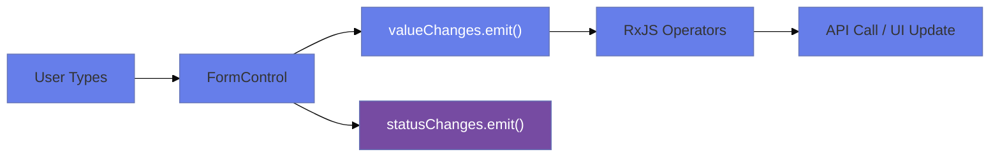
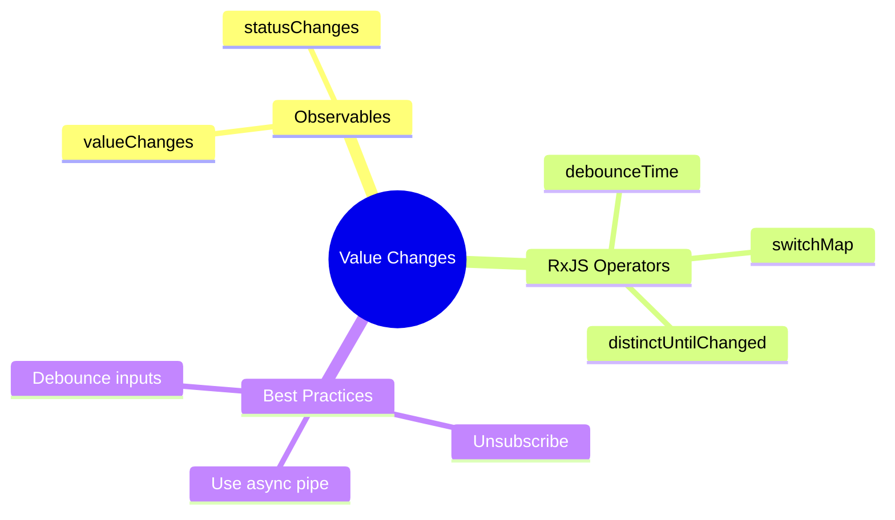

# 📡 Use Case 8: Value Changes & Status Observables

> **Goal**: React to form value and status changes using RxJS.

---

---

## 🏛️ What Problem Does It Solve?

### The "Spammy Events" Problem
*   **The Problem**: A user types "Angular" into a search box. This fires 7 events (A, An, Ang...). If you call the API on every keystroke, you kill your server.
*   **The Solution**: `valueChanges` is an Observable. You can use RxJS operators like `debounceTime(300)` to wait until they stop typing.

### The "Side Effect" Problem
*   **The Problem**: When "Country" changes, you need to clear "State" and fetch new states. Doing this in `(change)` handlers in the HTML is messy and hard to test.
*   **The Solution**: Subscribe to `country.valueChanges` in your component. This keeps logic in TypeScript and allows for complex async flows (`switchMap`).

---

## 🔬 Deep Dive: Important Classes & Directives

### A. The Observable Streams
1.  **`valueChanges`**:
    *   Emits the *new value* every time the control changes (via UI or `setValue`).
    *   *Gotcha*: If you call `setValue()` inside a `valueChanges` subscription, you might create an **Infinite Loop**.

2.  **`statusChanges`**:
    *   Emits: `'VALID' | 'INVALID' | 'PENDING' | 'DISABLED'`.
    *   *Usage*: Perfect for showing/hiding global error banners or disable buttons.

### B. The Configuration
1.  **`{ emitEvent: false }`**:
    *   The Secret Weapon. When calling `setValue(val, { emitEvent: false })`, the `valueChanges` Observable will **NOT** fire. Use this to update the form silently without triggering your subscribers.

---

## 1. 🔍 How It Works (The Concept)

### The Core Mechanism

Every `FormControl` and `FormGroup` exposes:
- `valueChanges: Observable<any>` - Emits on value change
- `statusChanges: Observable<string>` - Emits VALID, INVALID, PENDING

### 📊 Observable Flow



---

## 2. 🚀 Step-by-Step Implementation

### Subscribe to Value Changes

```typescript
this.form.get('search')!.valueChanges.pipe(
    debounceTime(300),
    distinctUntilChanged()
).subscribe(value => {
    this.searchService.search(value); // API call
});
```

### Subscribe to Status Changes

```typescript
this.form.get('email')!.statusChanges.subscribe(status => {
    console.log(status); // 'VALID', 'INVALID', 'PENDING'
});
```

### 🛡️ Always Unsubscribe!

```typescript
ngOnDestroy(): void {
    this.subscription.unsubscribe();
}
```

---

## 3. 🌍 Real World Use Cases

1. **Search-as-you-type**: Debounce API calls.
2. **Auto-save**: Save form on value change.
3. **Conditional UI**: Show/hide based on status.
4. **🏝️ Cascading Dropdowns**: Select Country -> Filter States. Select State -> Filter Cities.
5. **↩️ Undo/Redo**: Push every valueChange emission into a history stack.
6. **🔒 Password Strength Meter**: Calculate strength score as user types (without validation error).
7. **⏱️ Form Timer**: Measure how long it takes for a user to complete the form (first change to submit).

---

### 📦 Data Flow Summary (Visual Box Diagram)

```
┌─────────────────────────────────────────────────────────────┐
│  valueChanges & statusChanges OBSERVABLES                   │
│                                                             │
│   EVERY FormControl/FormGroup HAS:                          │
│   ┌───────────────────────────────────────────────────────┐ │
│   │ control.valueChanges: Observable<any>                 │ │
│   │ control.statusChanges: Observable<'VALID'|'INVALID'|'PENDING'>│ │
│   └───────────────────────────────────────────────────────┘ │
│                                                             │
│   COMMON PATTERN (type-ahead search):                       │
│   ┌───────────────────────────────────────────────────────┐ │
│   │ this.form.get('search')!.valueChanges.pipe(           │ │
│   │   debounceTime(300),      // Wait 300ms after typing  │ │
│   │   distinctUntilChanged(), // Skip if same value       │ │
│   │   switchMap(q => this.api.search(q))  // Cancel prev  │ │
│   │ ).subscribe(results => this.results = results);       │ │
│   └───────────────────────────────────────────────────────┘ │
│                                                             │
│   STATUS CHANGES:                                           │
│   ┌───────────────────────────────────────────────────────┐ │
│   │ statusChanges.subscribe(status => {                   │ │
│   │   if (status === 'PENDING') showSpinner();            │ │
│   │   if (status === 'VALID') hideErrors();               │ │
│   │ });                                                   │ │
│   └───────────────────────────────────────────────────────┘ │
│                                                             │
│   ⚠️ ALWAYS UNSUBSCRIBE in ngOnDestroy!                    │
└─────────────────────────────────────────────────────────────┘
```

> **Key Takeaway**: Use `valueChanges` for type-ahead/auto-save. Use `statusChanges` for loading states. Always unsubscribe!


---

## 7. ❓ Interview & Concept Questions

### Q1: What does `emitEvent: false` do?
**A:** prevents `valueChanges` and `statusChanges` from firing when you call `setValue` or `patchValue`. Essential for preventing infinite loops.

### Q2: How do you prevent Infinite Loops in `valueChanges`?
**A:** If you subscribe to `control.valueChanges` and inside the callback you call `control.setValue()`, it triggers `valueChanges` again... forever. Fix: `control.setValue(val, { emitEvent: false })`.

### Q3: Why use `distinctUntilChanged()`?
**A:** If the user types 'A', then backspaces, then types 'A' again rapidly, or if you patch the same value programmatically, you don't want to re-trigger heavy logic. This operator ignores identical consecutive emissions.

### Q4: What is the difference between `pairwise()` and `startWith()`?
**A:**
*   `startWith(initial)`: Emits an initial value so your stream runs immediately.
*   `pairwise()`: Emits the *previous* and *current* value `[prev, curr]`. Useful for comparing changes.

### Q5: Does `valueChanges` emit when the control is Disabled?
**A:** **Method dependent.**
*   `control.disable()` emits valueChanges? **Yes** (rarely used but enabling/disabling triggers updates).
*   Typically, disabled controls are excluded from `form.value`, but `valueChanges` might still fire if you programmatically set value. Note: `statusChanges` definitely fires.

### Q6: How do you auto-save a form?
**A:** subscribe to `form.valueChanges.pipe(debounceTime(1000), switchMap(val => api.save(val)))`.

### Q7: Why use `switchMap` for search?
**A:** Pass 'A' -> Request 1. Pass 'AB' -> Request 2. If Request 1 comes back LATE, it might overwrite Request 2. `switchMap` cancels Request 1 automatically.

### Q8: What happens if I forget to unsubscribe?
**A:** **Memory Leak.** The subscription keeps the component alive even after navigation. Use `takeUntilDestroyed` (Angular 16+) or `AsyncPipe`.

### Q9: Can I listen to `valueChanges` of a specific nested control?
**A:** Yes. `form.get('address.city').valueChanges`.

### Q10: How to detect *which* control caused the form change?
**A:** Native `valueChanges` on FormGroup doesn't tell you "who" changed. You must subscribe to individual controls or use a library wrapper.

### Q11: Does `valueChanges` emit invalid values?
**A:** **Yes.** It emits the value regardless of validity. Check `form.valid` inside the subscription if you only want valid saves.

### Q12: How to trigger `valueChanges` manually?
**A:** `control.updateValueAndValidity()`.

### Q13: What is the generic type of `valueChanges`?
**A:** `Observable<T>`. In typed forms, T is the type of the control's value. In untyped, it's `Observable<any>`.

### Q14: (Scenario) User selects Country. State dropdown loads. How?
**A:**
```typescript
countryCtrl.valueChanges.pipe(switchMap(id => stateApi.get(id)))
.subscribe(states => this.states = states);
```

### Q15: How to format the value *before* it reaches the model?
**A:** Reactive Forms don't have "parsers" like Template forms (`ngModel`). You usually handle this in the `(blur)` event or verify it's messy in `valueChanges`.

### Q16: Can I use `async` pipe with `valueChanges`?
**A:** Yes! `<div>{{ nameControl.valueChanges | async }}</div>`. Handles unsubscription automatically.

### Q17: Why might `valueChanges` not fire when I type?
**A:** Maybe `updateOn: 'blur'` is set? Or you are not binding correctly `[formControl]`.

### Q18: Difference between `statusChanges` and checking `form.invalid`?
**A:** `statusChanges` is a **stream** (push). `form.invalid` is a **property** (pull). Use stream for side effects.

### Q19: How to log ALL form changes for debugging?
**A:** `form.valueChanges.subscribe(console.log)`.

### Q20: If I have `debounceTime(300)`, and I submit immediately, do I get the latest value?
**A:** The *stream* is delayed, but `form.value` (property) is synchronous and instant. Submit handler uses `form.value`, so yes, you get the latest.

---

## 🧠 Mind Map: Quick Visual Reference


