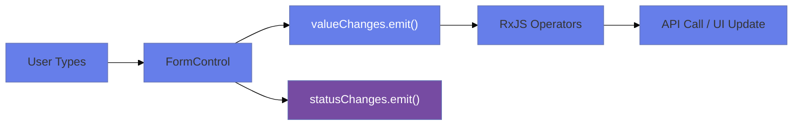
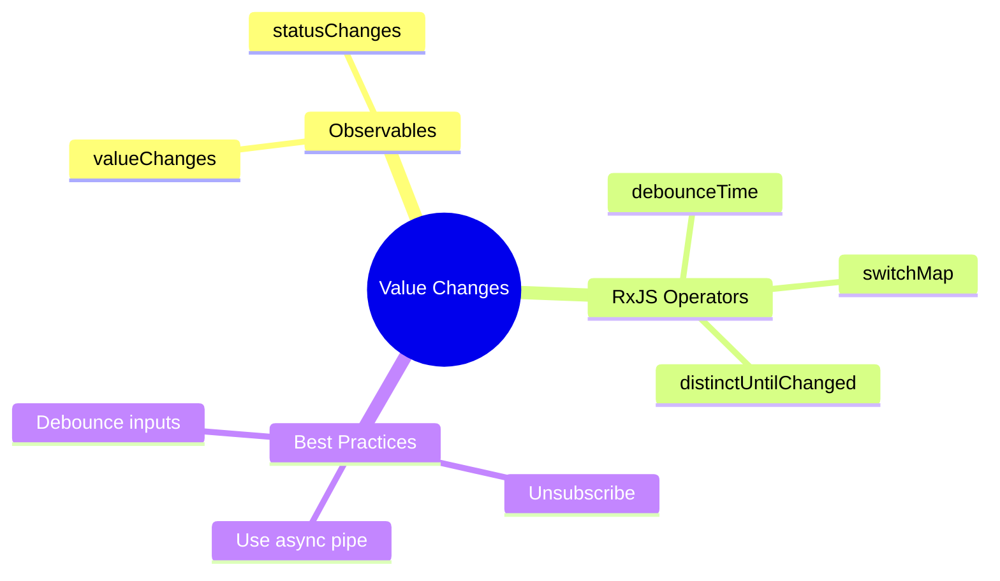

# 📡 Use Case 8: Value Changes & Status Observables

> **Goal**: React to form value and status changes using RxJS.

---

## 1. 🔍 How It Works (The Concept)

### The Core Mechanism

Every `FormControl` and `FormGroup` exposes:
- `valueChanges: Observable<any>` - Emits on value change
- `statusChanges: Observable<string>` - Emits VALID, INVALID, PENDING

### 📊 Observable Flow



---

## 2. 🚀 Step-by-Step Implementation

### Subscribe to Value Changes

```typescript
this.form.get('search')!.valueChanges.pipe(
    debounceTime(300),
    distinctUntilChanged()
).subscribe(value => {
    this.searchService.search(value); // API call
});
```

### Subscribe to Status Changes

```typescript
this.form.get('email')!.statusChanges.subscribe(status => {
    console.log(status); // 'VALID', 'INVALID', 'PENDING'
});
```

### 🛡️ Always Unsubscribe!

```typescript
ngOnDestroy(): void {
    this.subscription.unsubscribe();
}
```

---

## 3. 🌍 Real World Use Cases

1. **Search-as-you-type**: Debounce API calls.
2. **Auto-save**: Save form on value change.
3. **Conditional UI**: Show/hide based on status.

---

## 🧠 Mind Map: Quick Visual Reference


