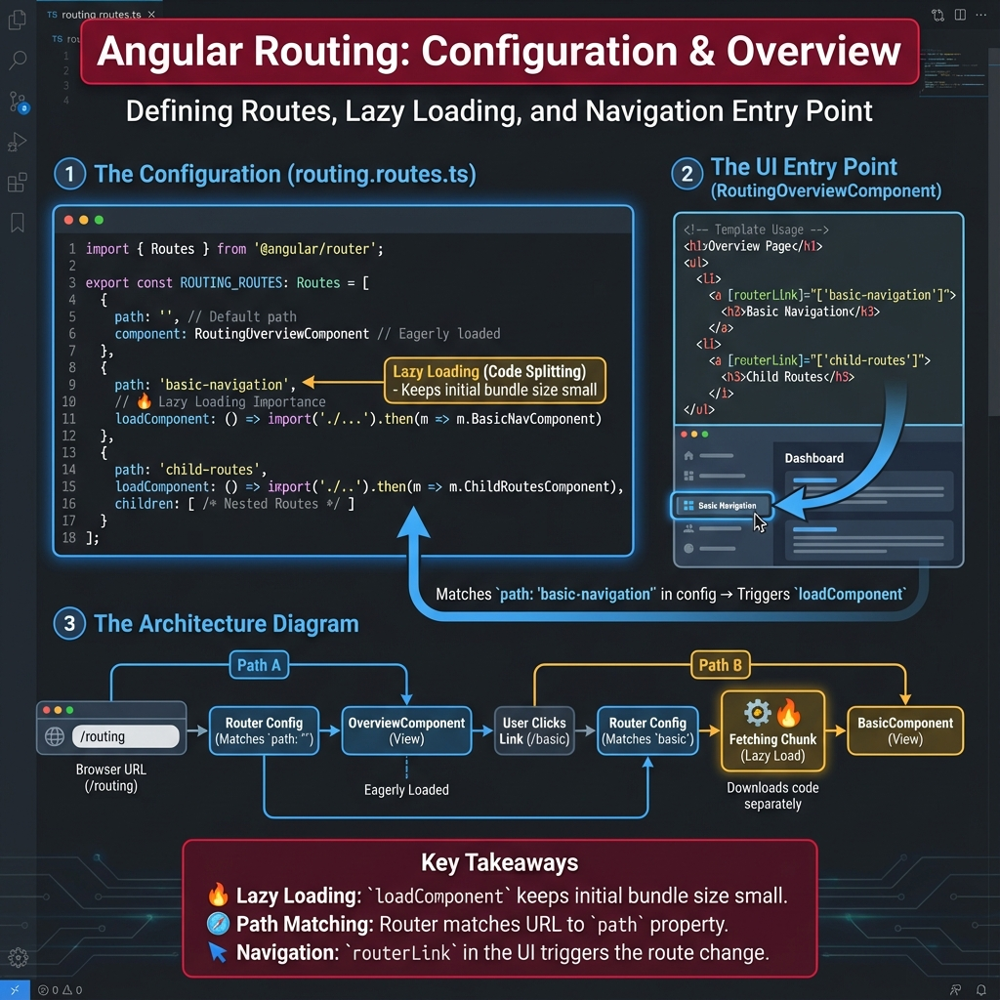

# 🧭 Angular Routing Feature

This module demonstrates various Angular Router features, organized into specific use cases.

## 📂 Configuration Overview

The routing logic is defined in [routing.routes.ts](./routing.routes.ts). It uses a central `Routes` configuration that defines paths and maps them to components.

### key Concepts Highlighted:

1.  **Lazy Loading**: We use `loadComponent: () => import(...)` to load feature components only when needed, reducing the initial bundle size.
2.  **Child Routes**: Nested routes are used for more complex layouts (see `child-routes`).
3.  **Parameters**: Routing supports dynamic segments (`:id`) and query parameters.
4.  **Overview Component**: The [RoutingOverviewComponent](./routing-overview.component.ts) serves as the entry point, providing navigation links to all sub-features.

## 🚀 Use Cases Covered

*   **Basic Navigation**: Fundamental `routerLink` usage.
*   **Route Parameters**: Extracting variables from the URL path.
*   **Query Parameters**: Handling URL query strings for filtering/sorting.
*   **Child Routes**: Nested navigation structures.
*   **Programmatic Navigation**: Using the `Router` service API.
