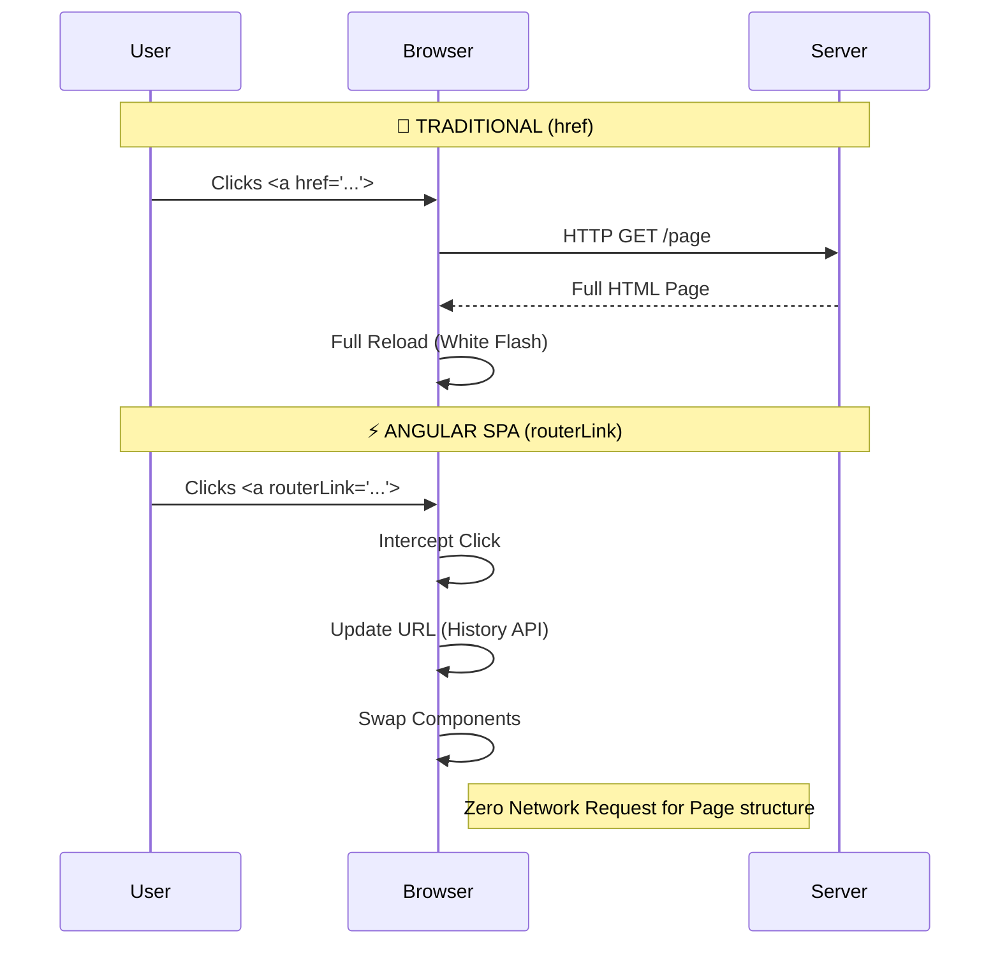
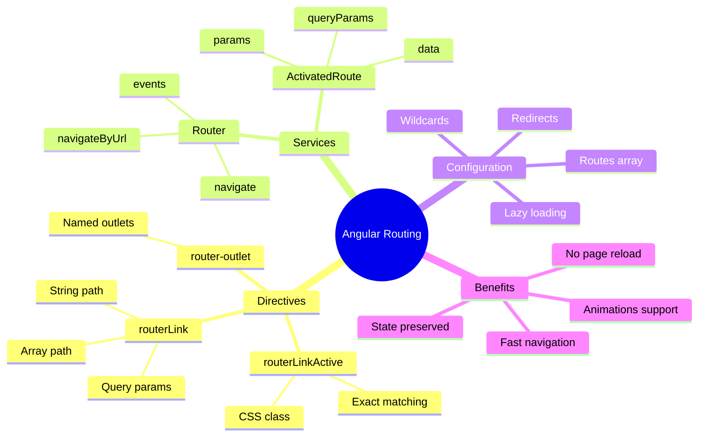

# 🧭 Angular Basic Navigation


## 📋 Table of Contents
- [🔍 How It Works (The Concept)](#how-it-works-the-concept)
  - [Mermaid Diagram: SPA vs MPA Navigation](#mermaid-diagram-spa-vs-mpa-navigation)
- [🚀 Step-by-Step Implementation Guide](#step-by-step-implementation-guide)
  - [1. Simple Navigation Link](#1-simple-navigation-link)
    - [[Provider] Navigation Component](#provider-navigation-component)
  - [2. Active Route Styling](#2-active-route-styling)
- [🐛 Common Pitfalls & Debugging](#common-pitfalls--debugging)
  - [1. The Missing Import](#1-the-missing-import)
  - [2. Path Syntax Confusion](#2-path-syntax-confusion)
- [⚡ Performance & Architecture](#performance--architecture)
- [🌍 Real World Use Cases](#real-world-use-cases)
  - [📦 Data Flow Summary (Visual Box Diagram)](#data-flow-summary-visual-box-diagram)
- [🏪 Magic House Analogy (Easy to Remember!)](#magic-house-analogy-easy-to-remember)
  - [📖 Story to Remember:](#story-to-remember)
  - [🎯 Quick Reference:](#quick-reference)
- [❓ Interview & Concept Questions](#interview--concept-questions)
- [🎯 What Problem Does This Solve?](#what-problem-does-this-solve)
  - [The Problem: Full Page Reloads Kill User Experience](#the-problem-full-page-reloads-kill-user-experience)
  - [How SPA Routing Solves This](#how-spa-routing-solves-this)
- [📚 Key Classes & Types Explained](#key-classes--types-explained)
  - [1. `RouterLink` Directive](#1-routerlink-directive)
  - [2. `RouterLinkActive` Directive](#2-routerlinkactive-directive)
  - [3. `Router` Service](#3-router-service)
  - [4. `<router-outlet>` Component](#4-router-outlet-component)
- [❓ Complete Interview Questions (25+)](#complete-interview-questions-25)
  - [Basic Navigation Questions](#basic-navigation-questions)
  - [Route Configuration Questions](#route-configuration-questions)
  - [Active State Questions](#active-state-questions)
  - [Programmatic Navigation Questions](#programmatic-navigation-questions)
  - [Scenario Questions](#scenario-questions)
  - [Advanced Questions](#advanced-questions)
- [🧠 Mind Map](#mind-map)

---
This guide covers the fundamentals of navigation in Angular Single Page Applications (SPAs).

## 🔍 How It Works (The Concept)

In a traditional multi-page application (MPA), clicking a link causes the browser to request a completely new HTML page from the server. This results in a visible "white flash" and re-downloads all assets (CSS, JS).

**Angular Client-Side Routing** intercepts the URL change. When you navigate:
1.  **URL updates** in the browser address bar (history API).
2.  **Router** matches the URL to a configured path.
3.  **Router** destroys the old component and creates the new one.
4.  **No server request** is made for the HTML page itself (though API calls might happen).

### Mermaid Diagram: SPA vs MPA Navigation




## 🚀 Step-by-Step Implementation Guide

### 1. Simple Navigation Link

Instead of `href`, use `routerLink`.

#### [Provider] Navigation Component
```typescript
// 🛡️ CRITICAL: Import RouterLink in standalone components (or RouterModule in modules)
import { RouterLink } from '@angular/router';

@Component({
  imports: [RouterLink], // <--- Don't forget this!
  template: `
    <!-- GOOD: Single Page App Navigation -->
    <a routerLink="/dashboard">Go to Dashboard</a>

    <!-- BAD: Causes full page reload -->
    <a href="/dashboard">Go to Dashboard</a>
  `
})
export class NavComponent {}
```

### 2. Active Route Styling

Highlight the current menu item using `routerLinkActive`.

```typescript
import { RouterLink, RouterLinkActive } from '@angular/router';

@Component({
  imports: [RouterLink, RouterLinkActive],
  template: `
    <nav>
      <!-- 'active-link' class added when URL is /home -->
      <!-- [routerLinkActiveOptions]="{exact: true}" prevents /home from matching /home/details -->
      <a routerLink="/home" 
         routerLinkActive="active-link"
         [routerLinkActiveOptions]="{exact: true}">
         Home
      </a>

      <!-- 'active-link' class added when URL starts with /users (e.g., /users, /users/1) -->
      <a routerLink="/users" 
         routerLinkActive="active-link">
         Users
      </a>
    </nav>
  `
})
export class NavComponent {}
```

## 🐛 Common Pitfalls & Debugging

### 1. The Missing Import
A common error is the link not working and no error in console, but the URL doesn't update or it does a full reload (if href fallback exists).

**Bad Example:**
```typescript
@Component({
  standalone: true,
  // imports: [], <--- MISSING RouterLink
  template: `<a routerLink="/home">Home</a>`
})
// Result: routerLink is treated as a plain attribute, does nothing.
```

**Good Example:**
```typescript
@Component({
  standalone: true,
  imports: [RouterLink], // ✅ IMPORTED
  template: `<a routerLink="/home">Home</a>`
})
```

### 2. Path Syntax Confusion
*   `routerLink="/path"` (Absolute): Starts from root (`/`).
*   `routerLink="path"` (Relative): Appends to current URL.
*   `routerLink="../path"` (Relative): Goes up one level.

## ⚡ Performance & Architecture

*   **Zero-Latency Navigation**: Because the JS bundle is already loaded, switching views is near-instantaneous (unless data fetching is blocking).
*   **Lazy Loading**: Combine routing with `loadChildren` or `loadComponent` to fetch code chunks only when needed (verified in this feature module's setup!).

## 🌍 Real World Use Cases

1.  **Main App Shell**: Top navigation bar (Home, About, Settings) that remains persistent while content changes.
2.  **Sidebar Menus**: Dashboard sidebars highlighting the active section (e.g., "Analytics" vs "Reports").
3.  **Breadcrumbs**: Navigation trails showing current location hierarchy.

### 📦 Data Flow Summary (Visual Box Diagram)

```
┌─────────────────────────────────────────────────────────────┐
│  SPA NAVIGATION: routerLink vs href                         │
│                                                             │
│   TRADITIONAL (href) - Full Page Reload:                    │
│   ┌───────────────────────────────────────────────────────┐ │
│   │ User clicks <a href="/about">                         │ │
│   │        │                                              │ │
│   │        ▼ Browser fetches NEW HTML page                │ │
│   │        ▼ Downloads ALL assets again                   │ │
│   │        ▼ Re-runs ALL JavaScript                       │ │
│   │        ▼ WHITE FLASH! 😫                              │ │
│   └───────────────────────────────────────────────────────┘ │
│                                                             │
│   ANGULAR SPA (routerLink) - Component Swap:                │
│   ┌───────────────────────────────────────────────────────┐ │
│   │ User clicks <a routerLink="/about">                   │ │
│   │        │                                              │ │
│   │        ▼ Router intercepts click                      │ │
│   │        ▼ Updates URL via History API                  │ │
│   │        ▼ Destroys old component                       │ │
│   │        ▼ Creates new component                        │ │
│   │        ▼ INSTANT! No page reload! 🚀                  │ │
│   └───────────────────────────────────────────────────────┘ │
│                                                             │
│   KEY DIRECTIVES:                                           │
│   ┌───────────────────────────────────────────────────────┐ │
│   │ routerLink="/path"     → Navigate to path             │ │
│   │ routerLinkActive="cls" → Add class when active        │ │
│   │ <router-outlet>        → Where component renders      │ │
│   └───────────────────────────────────────────────────────┘ │
└─────────────────────────────────────────────────────────────┘
```

> **Key Takeaway**: Use `routerLink` NOT `href` for SPA navigation. The app stays loaded, only components change!

## 🏪 Magic House Analogy (Easy to Remember!)

Think of routing like a **magic house that rearranges itself**:

| Concept | Magic House Analogy | Memory Trick |
|---------|--------------------| --------------|
| **SPA (Angular)** | 🏪 **Magic house**: Furniture changes, you stay inside | **"Never leave"** |
| **MPA (Traditional)** | 🏠🏠 **Different houses**: Walk outside to enter new house | **"Full journey"** |
| **routerLink** | 🔘 **Magic button**: Press to rearrange room instantly | **"Instant change"** |
| **href** | 🚶 **Walk to new house**: Leave, travel, enter (full reload) | **"Long trip"** |
| **router-outlet** | 🎨 **The stage**: Where furniture appears/disappears | **"Display area"** |

### 📖 Story to Remember:

> 🏪 **Two Ways to Visit Rooms**
>
> You're in your living room and want to go to the kitchen:
>
> **Traditional Website (href - walk outside):**
> ```
> 1. Leave living room 🚶
> 2. Exit house 🚪
> 3. Walk around to kitchen door 🏭
> 4. Enter kitchen (wait for house to rebuild)
> 5. Wait for furniture to load... ⏳
> 
> Result: WHITE FLASH. Everything reloads. Slow! 🐢
> ```
>
> **Angular SPA (routerLink - magic button):**
> ```
> 1. Press the "Kitchen" button 🔘
> 2. *POOF* ✨
> 3. Living room furniture vanishes
> 4. Kitchen furniture appears instantly
> 
> Result: NO FLASH. Same house, new room. Fast! 🚀
> ```
>
> **You never leave the house. The house transforms around you!**

### 🎯 Quick Reference:
```
🏪 SPA              = Magic house (one app, many views)
🔘 routerLink        = Magic button (instant room change)
🚶 href              = Walk to new house (full reload)
🎨 router-outlet     = Stage where components appear
✨ routerLinkActive  = "You are here" sign (highlight current)
```

## ❓ Interview & Concept Questions

1.  **Q: Why use `routerLink` over `href` in Angular?**
    *   A: `href` triggers a full page reload, re-bootstrapping the app. `routerLink` uses the History API to change the URL and swapping components without reloading resources.
2.  **Q: How do you style the currently active link?**
    *   A: Use the `routerLinkActive="className"` directive.
3.  **Q: What does `[routerLinkActiveOptions]="{exact: true}"` do?**
    *   A: It ensures the class is applied only if the URL matches exactly, not just partially (e.g., prevents "Home" link being active when at "/home/details").
4.  **Q: Can `routerLink` take an array?**
    *   A: Yes! `<a [routerLink]="['/user', userId, 'details']">` builds the path dynamically.

---

## 🎯 What Problem Does This Solve?

### The Problem: Full Page Reloads Kill User Experience

**Without SPA Routing (BAD):**
```html
<!-- Traditional multi-page navigation -->
<a href="/about">About</a>
<a href="/contact">Contact</a>

<!-- What happens:
1. Browser requests new HTML from server
2. Downloads all CSS, JS again
3. Re-executes all JavaScript
4. White flash while loading
5. User context/state is lost!
-->
```

**Problems:**
1. **Slow navigation**: Full page reload takes seconds
2. **Lost state**: Form data, scroll position, etc. is lost
3. **Wasted bandwidth**: Re-downloads unchanged assets
4. **Poor UX**: White flash between pages
5. **No transitions**: Can't animate between views

### How SPA Routing Solves This

**With Angular Router (GOOD):**
```html
<!-- SPA navigation - no reload! -->
<a routerLink="/about">About</a>
<a routerLink="/contact">Contact</a>

<!-- What happens:
1. Router intercepts click
2. Updates URL via History API
3. Destroys old component
4. Creates new component
5. INSTANT! No page reload!
-->
```

| Problem | Router Solution |
|---------|-----------------|
| Slow navigation | **Instant**: Component swap in milliseconds |
| Lost state | **Preserved**: App state stays intact |
| Wasted bandwidth | **Efficient**: No re-download of assets |
| White flash | **Smooth**: No page refresh |
| No transitions | **Animations**: Can animate route changes |

---

## 📚 Key Classes & Types Explained

### 1. `RouterLink` Directive

```typescript
import { RouterLink } from '@angular/router';

// Simple string path
<a routerLink="/home">Home</a>

// Array for dynamic paths
<a [routerLink]="['/user', userId]">User Details</a>

// With query params
<a [routerLink]="['/search']" [queryParams]="{q: 'angular'}">Search</a>
```

**Key Properties:**
| Property | Purpose |
|----------|---------|
| `routerLink` | Target path (string or array) |
| `queryParams` | Query string parameters |
| `fragment` | URL hash fragment |
| `queryParamsHandling` | 'merge' or 'preserve' |

---

### 2. `RouterLinkActive` Directive

```typescript
import { RouterLinkActive } from '@angular/router';

<a routerLink="/home" 
   routerLinkActive="active"
   [routerLinkActiveOptions]="{exact: true}">
   Home
</a>
```

**Options:**
- `exact: true` - Only match if path matches exactly
- Default (false) - Match if path starts with this route

---

### 3. `Router` Service

```typescript
import { Router } from '@angular/router';

private router = inject(Router);

// Programmatic navigation
this.router.navigate(['/user', userId]);
this.router.navigateByUrl('/dashboard');

// With options
this.router.navigate(['/home'], { 
    queryParams: { returnUrl: '/dashboard' },
    replaceUrl: true  // Don't add to history
});
```

---

### 4. `<router-outlet>` Component

```html
<!-- Where routed components render -->
<router-outlet></router-outlet>

<!-- Named outlets -->
<router-outlet name="sidebar"></router-outlet>
```

---

## ❓ Complete Interview Questions (25+)

### Basic Navigation Questions

**Q5: What's the difference between routerLink and router.navigate()?**
> A: `routerLink` is a directive for template navigation (declarative). `router.navigate()` is a service method for programmatic navigation (imperative).

**Q6: How do you navigate with query parameters?**
> A:
> ```html
> <a [routerLink]="['/search']" [queryParams]="{q: 'angular', page: 1}">
> ```
> Or programmatically:
> ```typescript
> this.router.navigate(['/search'], { queryParams: { q: 'angular' } });
> ```

**Q7: How do you preserve query params during navigation?**
> A: Use `queryParamsHandling`:
> ```html
> <a routerLink="/next" queryParamsHandling="preserve">
> ```

**Q8: What's the difference between absolute and relative paths?**
> A:
> - Absolute (`/path`): Starts from root
> - Relative (`path`): Appends to current URL
> - Parent relative (`../path`): Goes up one level

---

### Route Configuration Questions

**Q9: How do you configure basic routes?**
> A:
> ```typescript
> const routes: Routes = [
>     { path: '', component: HomeComponent },
>     { path: 'about', component: AboutComponent },
>     { path: '**', component: NotFoundComponent }  // Wildcard
> ];
> ```

**Q10: What does the wildcard route (**) do?**
> A: Catches all unmatched URLs. Must be last in the routes array.

**Q11: How do you set up routing in a standalone app?**
> A:
> ```typescript
> // app.config.ts
> export const appConfig: ApplicationConfig = {
>     providers: [provideRouter(routes)]
> };
> ```

---

### Active State Questions

**Q12: Why might routerLinkActive not work as expected?**
> A: Common issues:
> - Missing import of `RouterLinkActive`
> - Path matching is too broad (use `exact: true`)
> - CSS class not defined

**Q13: How do you apply multiple classes when active?**
> A:
> ```html
> <a routerLink="/home" routerLinkActive="active highlighted bold">
> ```

**Q14: Can you use routerLinkActive without routerLink?**
> A: No, `routerLinkActive` requires `routerLink` on the same or parent element.

---

### Programmatic Navigation Questions

**Q15: How do you navigate after a form submission?**
> A:
> ```typescript
> onSubmit() {
>     this.service.saveData().subscribe(() => {
>         this.router.navigate(['/success']);
>     });
> }
> ```

**Q16: How do you go back to the previous page?**
> A: Inject `Location` and call `back()`:
> ```typescript
> import { Location } from '@angular/common';
> private location = inject(Location);
> 
> goBack() { this.location.back(); }
> ```

**Q17: How do you replace the current history entry?**
> A:
> ```typescript
> this.router.navigate(['/new'], { replaceUrl: true });
> ```

---

### Scenario Questions

**Q18: Create a navigation menu with active highlighting.**
> A:
> ```html
> <nav>
>     <a routerLink="/home" routerLinkActive="active" 
>        [routerLinkActiveOptions]="{exact: true}">Home</a>
>     <a routerLink="/products" routerLinkActive="active">Products</a>
>     <a routerLink="/about" routerLinkActive="active">About</a>
> </nav>
> ```

**Q19: How do you pass data during navigation?**
> A: Using state:
> ```typescript
> this.router.navigate(['/details'], { 
>     state: { item: this.selectedItem } 
> });
> 
> // In target component
> const state = this.router.getCurrentNavigation()?.extras.state;
> ```

**Q20: How do you redirect after login?**
> A:
> ```typescript
> login() {
>     this.authService.login().subscribe(() => {
>         const returnUrl = this.route.snapshot.queryParams['returnUrl'] || '/';
>         this.router.navigateByUrl(returnUrl);
>     });
> }
> ```

---

### Advanced Questions

**Q21: How do you handle route animations?**
> A: Use Angular animations with route data:
> ```typescript
> { path: 'home', component: HomeComponent, data: { animation: 'HomePage' } }
> ```

**Q22: What is the difference between navigate() and navigateByUrl()?**
> A:
> - `navigate(['/path', param])`: Array-based, easier for dynamic paths
> - `navigateByUrl('/path/param')`: String-based, for complete URLs

**Q23: How do you detect navigation events?**
> A:
> ```typescript
> this.router.events.pipe(
>     filter(e => e instanceof NavigationEnd)
> ).subscribe((e: NavigationEnd) => {
>     console.log('Navigated to:', e.url);
> });
> ```

**Q24: How do you cancel navigation programmatically?**
> A: Use a route guard and return `false` or use `router.events` with `NavigationStart`.

**Q25: How do you scroll to top on navigation?**
> A: Configure scrolling behavior:
> ```typescript
> provideRouter(routes, 
>     withInMemoryScrolling({ scrollPositionRestoration: 'top' })
> )
> ```

---

## 🧠 Mind Map



