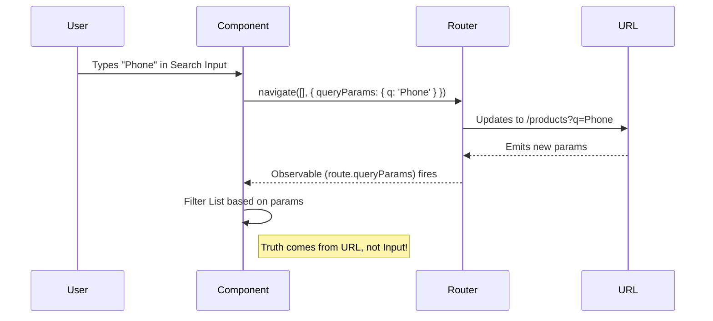

# 🔍 Angular Query Parameters


## 📋 Table of Contents
- [🔍 How It Works (The Concept)](#how-it-works-the-concept)
  - [Mermaid Diagram: State Synchronization](#mermaid-diagram-state-synchronization)
- [🚀 Step-by-Step Implementation Guide](#step-by-step-implementation-guide)
  - [1. Setting Query Parameters](#1-setting-query-parameters)
  - [2. Reading Query Parameters](#2-reading-query-parameters)
- [🐛 Common Pitfalls & Debugging](#common-pitfalls--debugging)
  - [1. Losing Existing Params](#1-losing-existing-params)
  - [2. Infinite Loops](#2-infinite-loops)
- [⚡ Performance & Architecture](#performance--architecture)
- [🌍 Real World Use Cases](#real-world-use-cases)
  - [📦 Data Flow Summary (Visual Box Diagram)](#data-flow-summary-visual-box-diagram)
- [📌 Sticky Notes Analogy (Easy to Remember!)](#sticky-notes-analogy-easy-to-remember)
  - [📖 Story to Remember:](#story-to-remember)
  - [🎯 Quick Reference:](#quick-reference)
- [❓ Interview & Concept Questions](#interview--concept-questions)

---
This guide demonstrates how to manage component state (like filters and sorting) using URL Query Parameters.

## 🔍 How It Works (The Concept)

Query Parameters are the optional key-value pairs at the end of a URL (after the `?`).
Example: `/products?category=shoes&sort=price_asc`

**Why use them?**
*   **Shareable URLs**: Users can copy/paste the URL and see the exact same filtered view.
*   **History Support**: Hitting "Back" undoes the last filter change.
*   **Bookmarking**: Users can bookmark specific search results.

### Mermaid Diagram: State Synchronization



## 🚀 Step-by-Step Implementation Guide

### 1. Setting Query Parameters
Use the `Router.navigate` method (or `routerLink`) with the `queryParams` property.

```typescript
// Update URL when user types
updateSearch(term: string) {
  this.router.navigate([], {
    relativeTo: this.route, // Stay on current route
    queryParams: { 
      q: term, 
      page: 1 // Reset page on search
    },
    queryParamsHandling: 'merge' // 🛡️ CRITICAL: Keep other params (like 'sort')
  });
}
```

### 2. Reading Query Parameters
Listen to the `queryParams` Observable to update your UI.

```typescript
ngOnInit() {
  this.route.queryParams.subscribe(params => {
    this.searchTerm = params['q'] || '';
    this.currentPage = Number(params['page']) || 1;
    this.loadData(); // Re-fetch data based on new params
  });
}
```

## 🐛 Common Pitfalls & Debugging

### 1. Losing Existing Params
If you navigate without `queryParamsHandling: 'merge'`, you wipe out all other parameters!

*   **Scenario**: URL is `?sort=date&q=angular`. Use modifies search.
*   **Bad**: `navigate(..., { queryParams: { q: 'react' } })` -> Result: `?q=react` (Sort lost!)
*   **Good**: `navigate(..., { queryParamsHandling: 'merge' })` -> Result: `?sort=date&q=react`

### 2. Infinite Loops
Be careful not to update the URL in response to a URL change if that update triggers another URL change. The `DistinctUntilChanged` operator in RxJS can help here.

## ⚡ Performance & Architecture

*   **Deep Linking**: By moving state to the URL, you make your app "Deep Linkable". This is a core requirement for almost any enterprise dashboard or e-commerce site.
*   **replaceUrl**: For inputs like search bars, consider `replaceUrl: true` so the user's back button history isn't 100 entries long (one for each letter typed).

## 🌍 Real World Use Cases

1.  **Search Results**: Google search results (e.g., `?q=angular+routing`).
2.  **Dashboards**: Date range filters (`?start=2023-01-01&end=2023-12-31`).
3.  **Pagination**: Page numbers (`?page=2&limit=50`).

### 📦 Data Flow Summary (Visual Box Diagram)

```
┌─────────────────────────────────────────────────────────────┐
│  QUERY PARAMETERS: OPTIONAL URL STATE                       │
│                                                             │
│   URL STRUCTURE:                                            │
│   ┌───────────────────────────────────────────────────────┐ │
│   │ /products?category=shoes&sort=price&page=2            │ │
│   │          └────────── Query Params ───────────┘        │ │
│   └───────────────────────────────────────────────────────┘ │
│                                                             │
│   SETTING (with merge):                                     │
│   ┌───────────────────────────────────────────────────────┐ │
│   │ router.navigate([], {                                 │ │
│   │   queryParams: { page: 3 },                           │ │
│   │   queryParamsHandling: 'merge'  // KEEP existing!     │ │
│   │ });                                                   │ │
│   │                                                       │ │
│   │ Before: ?category=shoes&page=2                        │ │
│   │ After:  ?category=shoes&page=3  // Only page changed  │ │
│   └───────────────────────────────────────────────────────┘ │
│                                                             │
│   READING:                                                  │
│   ┌───────────────────────────────────────────────────────┐ │
│   │ route.queryParams.subscribe(params => {               │ │
│   │   this.category = params['category'];                 │ │
│   │   this.page = Number(params['page']) || 1;            │ │
│   │   this.loadData();  // Refresh on any param change    │ │
│   │ });                                                   │ │
│   └───────────────────────────────────────────────────────┘ │
│                                                             │
│   🎯 BENEFITS: Shareable URLs, Browser back works, Bookmarks│
└─────────────────────────────────────────────────────────────┘
```

> **Key Takeaway**: Query params = optional state after `?`. Use `queryParamsHandling: 'merge'` to keep existing params!

## 📌 Sticky Notes Analogy (Easy to Remember!)

Think of Query Parameters like **sticky notes on a file folder**:

| Concept | Sticky Note Analogy | Memory Trick |
|---------|--------------------|--------------| 
| **Route path** | 📁 **File folder**: "/products" is "Product Records" | **"The page"** |
| **Query params** | 📌 **Sticky notes**: Instructions attached to folder | **"?key=value"** |
| **merge** | 📝 **Add note**: Keep existing notes, add new one | **"Combine params"** |
| **preserve** | 🔒 **Keep all**: Don't change the notes | **"Carry over"** |
| **Share URL** | 📤 **Hand folder**: Anyone sees same organized view | **"Shareable state"** |

### 📖 Story to Remember:

> 📌 **The Office Filing System**
>
> URLs are file folders with instructions:
>
> **Attaching notes:**
> ```typescript
> // /products is the folder
> // ? adds sticky notes!
> 
> /products?category=shoes&sort=price
> //         📌 "Shoes only"
> //                    📌 "Sort by price"
> ```
>
> **Updating notes:**
> ```typescript
> router.navigate([], {
>   queryParams: { q: 'sneakers' },
>   queryParamsHandling: 'merge'  // 📝 Add note, keep others!
> });
> 
> // Before: ?category=shoes&sort=price
> // After:  ?category=shoes&sort=price&q=sneakers
> ```
>
> **Hand the folder to anyone - they see the same view!**

### 🎯 Quick Reference:
```
📁 Route          = File folder (the page)
📌 ?key=value     = Sticky notes (filters)
📝 merge          = Add note, keep others
🔒 preserve       = Keep all notes unchanged
📤 Share URL      = Hand folder with instructions
```

## ❓ Interview & Concept Questions

1.  **Q: How do you preserve query params when navigating to a *different* route?**
    *   A: Use `queryParamsHandling: 'preserve'`.
2.  **Q: What is the difference between `merge` and `preserve`?**
    *   A: `merge` updates specified keys and keeps others. `preserve` keeps all current keys and ignores new ones in the navigation command (unless they conflict? No, usually preserve just carries them over).
3.  **Q: Can I use `routerLink` to set query params?**
    *   A: Yes! `<a routerLink="/search" [queryParams]="{ q: 'term' }">`.
