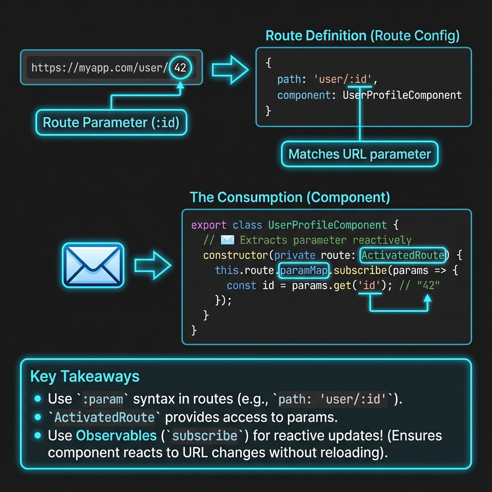

# 🆔 Angular Route Parameters


## 📋 Table of Contents
- [🔍 How It Works (The Concept)](#how-it-works-the-concept)
  - [Mermaid Diagram: Reading Parameters](#mermaid-diagram-reading-parameters)
- [🚀 Step-by-Step Implementation Guide](#step-by-step-implementation-guide)
  - [1. Define the Parameterized Route](#1-define-the-parameterized-route)
  - [2. Link to the Route](#2-link-to-the-route)
  - [3. Read the Parameter (Observable Approach)](#3-read-the-parameter-observable-approach)
- [🐛 Common Pitfalls & Debugging](#common-pitfalls--debugging)
  - [1. String vs. Number](#1-string-vs-number)
  - [2. Snapshot vs. Observable](#2-snapshot-vs-observable)
- [⚡ Performance & Architecture](#performance--architecture)
- [🌍 Real World Use Cases](#real-world-use-cases)
  - [📦 Data Flow Summary (Visual Box Diagram)](#data-flow-summary-visual-box-diagram)
- [📬 Mailbox Address Analogy (Easy to Remember!)](#mailbox-address-analogy-easy-to-remember)
  - [📖 Story to Remember:](#story-to-remember)
  - [🎯 Quick Reference:](#quick-reference)
- [❓ Interview & Concept Questions](#interview--concept-questions)
- [❓ Additional Interview Questions (20+)](#additional-interview-questions-20)
  - [Basic Questions](#basic-questions)
  - [Snapshot vs Observable Questions](#snapshot-vs-observable-questions)
  - [Multiple Parameters Questions](#multiple-parameters-questions)
  - [Navigation Questions](#navigation-questions)
  - [Scenario Questions](#scenario-questions)
  - [Advanced Questions](#advanced-questions)

---
This guide explains how to pass data between pages using dynamic URL segments.

## 🔍 How It Works (The Concept)

Route parameters are placeholders in your URL definition (e.g., `/user/:id`). They act like variables that the Angular Router fills in.

*   **Required**: The route won't match if the parameter is missing.
*   **Dynamic**: The same component displays different data based on the parameter.

### Mermaid Diagram: Reading Parameters




```mermaid
graph LR
    A[URL: /user/42] -->|Router Matches| B(Route Definition: /user/:id)
    B -->|Extracts| C{ActivatedRoute}
    C -->|Exposes| D[snapshot.paramMap]
    C -->|Exposes| E[paramMap Observable]
    
    D -->|Get 'id'| F[Value: 42 (String)]
    E -->|Subscribe 'id'| F
```

## 🚀 Step-by-Step Implementation Guide

### 1. Define the Parameterized Route
In your routes file, use a colon `:` to denote a parameter.
```typescript
{ 
  path: 'user/:id', // <--- :id is the parameter
  component: UserProfileComponent 
}
```

### 2. Link to the Route
Pass an array to `routerLink`. The second item fills the parameter.
```typescript
<!-- Result: /user/123 -->
<a [routerLink]="['/user', 123]">View User 123</a>
```

### 3. Read the Parameter (Observable Approach)
This is the **recommended** way. It handles changes if the user navigates from `/user/1` to `/user/2` without leaving the component.

```typescript
// 🛡️ CRITICAL: Import ActivatedRoute
import { ActivatedRoute } from '@angular/router';

export class UserProfileComponent {
  userId$: Observable<string | null>;

  constructor(private route: ActivatedRoute) {
    // updates automatically when URL changes
    this.userId$ = this.route.paramMap.pipe(
      map(params => params.get('id')) 
    );
  }
}
```

## 🐛 Common Pitfalls & Debugging

### 1. String vs. Number
Route parameters are **ALWAYS strings**.
*   **Bad**: `if (id === 5)` (might fail if id is "5")
*   **Good**: `const id = Number(params.get('id'));`

### 2. Snapshot vs. Observable
Using `snapshot` only reads the parameter **once** when the component is created.
```typescript
// ⚠️ BAD if you navigate from /user/1 to /user/2
// The component is reused, so ngOnInit doesn't run again!
const id = this.route.snapshot.paramMap.get('id'); 
```
**Fix:** Use `.paramMap.subscribe()` (or `AsyncPipe`) to react to changes.

## ⚡ Performance & Architecture

*   **Component Reuse**: Angular defaults to reusing the component instance if only the route parameters change (e.g., Next/Previous user buttons). This saves performance but requires you to use Observables to detect changes.

## 🌍 Real World Use Cases

1.  **Product Details**: `/products/pixel-8-pro`
2.  **Order History**: `/orders/ORD-99283`
3.  **User Profiles**: `/profile/vijay`

### 📦 Data Flow Summary (Visual Box Diagram)

```
┌─────────────────────────────────────────────────────────────┐
│  ROUTE PARAMETERS: DYNAMIC URL SEGMENTS                     │
│                                                             │
│   DEFINING:                                                 │
│   ┌───────────────────────────────────────────────────────┐ │
│   │ { path: 'user/:id', component: UserComponent }        │ │
│   │              ↑ :id is a variable placeholder          │ │
│   └───────────────────────────────────────────────────────┘ │
│                                                             │
│   NAVIGATING:                                               │
│   ┌───────────────────────────────────────────────────────┐ │
│   │ <a [routerLink]="['/user', 42]">User 42</a>           │ │
│   │                           ↓                           │ │
│   │ URL becomes: /user/42                                 │ │
│   └───────────────────────────────────────────────────────┘ │
│                                                             │
│   READING:                                                  │
│   ┌───────────────────────────────────────────────────────┐ │
│   │ SNAPSHOT (one-time read):                             │ │
│   │ const id = route.snapshot.paramMap.get('id');         │ │
│   │ ⚠️ Doesn't update if navigating /user/42 → /user/43   │ │
│   │                                                       │ │
│   │ OBSERVABLE (reactive - RECOMMENDED):                  │ │
│   │ route.paramMap.subscribe(params => {                  │ │
│   │   const id = params.get('id');  // Updates!           │ │
│   │ });                                                   │ │
│   └───────────────────────────────────────────────────────┘ │
│                                                             │
│   ⚠️ REMEMBER: Route params are ALWAYS strings!            │
└─────────────────────────────────────────────────────────────┘
```

> **Key Takeaway**: Use `:param` in route definition. Prefer paramMap Observable for reactive updates!

## 📬 Mailbox Address Analogy (Easy to Remember!)

Think of route parameters like **mailbox addresses**:

| Concept | Mailbox Analogy | Memory Trick |
|---------|----------------|--------------| 
| **Route path** | 🛣️ **Street name**: "/users" is Main Street | **"The base route"** |
| **:id parameter** | 📬 **House number**: #42 on Main Street | **"The variable part"** |
| **ActivatedRoute** | 📨 **Mailman's log**: Shows current house details | **"Route info"** |
| **paramMap** | 📝 **Address card**: Extract number from "Main St #42" | **"Read the parameter"** |
| **Observable** | 🔔 **Doorbell notification**: Alerts when address changes | **"React to changes"** |

### 📖 Story to Remember:

> 📬 **The Mailman's Route**
>
> You're a mailman (component) on Main Street:
>
> **Defining the Route:**
> ```typescript
> { path: 'user/:id', component: UserComponent }
> // "Main Street, with house numbers"
> ```
>
> **Navigating to a House:**
> ```html
> <a [routerLink]="['/user', 42]">House 42</a>
> <!-- Result: /user/42 -->
> ```
>
> **Reading the Address:**
> ```typescript
> // Snapshot = look at address ONCE
> const id = route.snapshot.paramMap.get('id');  // "42"
> 
> // Observable = get NOTIFIED when you move houses
> route.paramMap.subscribe(params => {
>   const id = params.get('id');  // Updates automatically!
> });
> ```
>
> **Same street ("/user"), different houses (:id)!**

### 🎯 Quick Reference:
```
🛣️ path: 'x/:id'   = Street with house numbers
📬 :id             = Variable house number
📨 ActivatedRoute   = Mailman's current info
📝 paramMap.get('id') = Read the house number
🔔 paramMap$        = Notifications when address changes
```

## ❓ Interview & Concept Questions

1.  **Q: valid parameter names?**
    *   A: Alphanumeric characters (e.g., `:id`, `:username`).
2.  **Q: What happens if I use snapshot and navigate to the same route with different ID?**
    *   A: The data won't update because the component isn't destroyed/recreated. The snapshot remains stale. Be "Reactive"!

---

## ❓ Additional Interview Questions (20+)

### Basic Questions

**Q3: What's the syntax for defining a route parameter?**
> A: Use colon prefix: `{ path: 'user/:id', component: UserComponent }`.

**Q4: How do you pass dynamic values to routerLink?**
> A: Array syntax: `[routerLink]="['/user', userId]"`.

**Q5: What type are route parameters?**
> A: Always strings! Use `Number()` or `+` to convert.

**Q6: What's the difference between paramMap and params?**
> A: `paramMap` is Map-based (use `.get()`); `params` is object (deprecated).

---

### Snapshot vs Observable Questions

**Q7: When to use snapshot?**
> A: When component is destroyed/recreated on navigation (not reused).

**Q8: When to use paramMap Observable?**
> A: When same component is reused with different params (e.g., /user/1 → /user/2).

**Q9: How do you subscribe to param changes?**
> A: `route.paramMap.subscribe(params => params.get('id'))`.

**Q10: What's the danger of snapshot?**
> A: Stale data if component is reused - value won't update.

---

### Multiple Parameters Questions

**Q11: How do you define multiple parameters?**
> A: `{ path: 'user/:id/post/:postId', component: ... }`.

**Q12: How do you read multiple parameters?**
> A: `params.get('id')` and `params.get('postId')`.

**Q13: Can parameters be optional?**
> A: No, required params must be in URL. Use query params for optional.

---

### Navigation Questions

**Q14: How do you navigate programmatically with params?**
> A: `router.navigate(['/user', 42])` or `router.navigateByUrl('/user/42')`.

**Q15: How do you use relative navigation with params?**
> A: `router.navigate(['..', 'other'])` from current route.

**Q16: How do you preserve query params when navigating?**
> A: `router.navigate(['/user', 42], { queryParamsHandling: 'preserve' })`.

---

### Scenario Questions

**Q17: Product detail page with product/:slug.**
> A: Define route, use paramMap to fetch product by slug.

**Q18: Previous/Next navigation on same component.**
> A: Use paramMap Observable to react to ID changes.

**Q19: Parse integer ID from string param.**
> A: `const id = +params.get('id')` or `Number(params.get('id'))`.

**Q20: Handle null/undefined parameter.**
> A: Check with optional chaining: `params.get('id') ?? 'default'`.

---

### Advanced Questions

**Q21: What's matrix parameters?**
> A: Secondary params in URL: `/user/42;details=true`. Access via `paramMap`.

**Q22: How does component reuse work?**
> A: Angular reuses component if only params change. Set `onSameUrlNavigation` for control.

**Q23: How do you force component reload on param change?**
> A: Use Observable subscription or custom RouteReuseStrategy.

