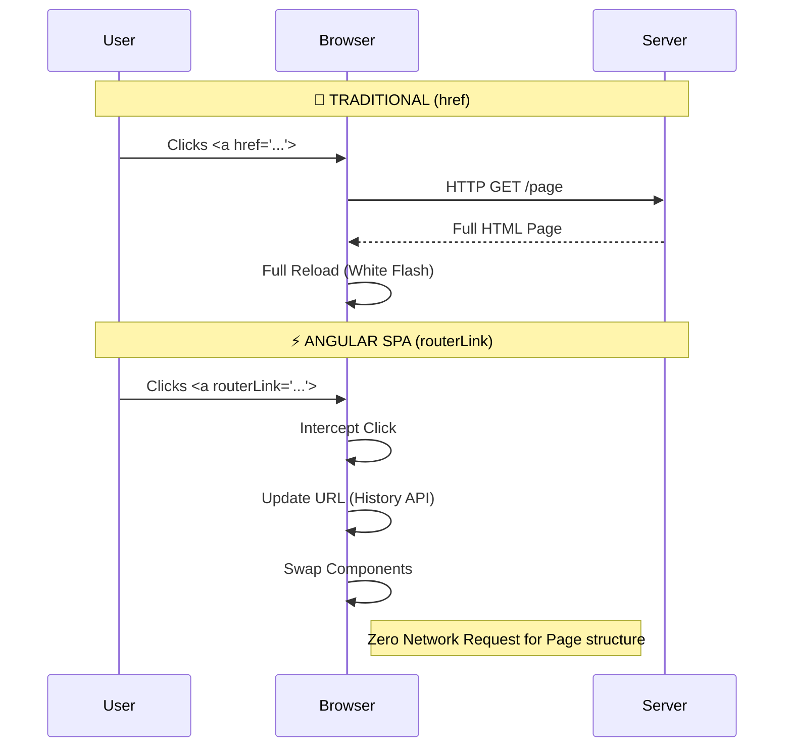

# 🧭 Angular Basic Navigation

This guide covers the fundamentals of navigation in Angular Single Page Applications (SPAs).

## 🔍 How It Works (The Concept)

In a traditional multi-page application (MPA), clicking a link causes the browser to request a completely new HTML page from the server. This results in a visible "white flash" and re-downloads all assets (CSS, JS).

**Angular Client-Side Routing** intercepts the URL change. When you navigate:
1.  **URL updates** in the browser address bar (history API).
2.  **Router** matches the URL to a configured path.
3.  **Router** destroys the old component and creates the new one.
4.  **No server request** is made for the HTML page itself (though API calls might happen).

### Mermaid Diagram: SPA vs MPA Navigation



## 🚀 Step-by-Step Implementation Guide

### 1. Simple Navigation Link

Instead of `href`, use `routerLink`.

#### [Provider] Navigation Component
```typescript
// 🛡️ CRITICAL: Import RouterLink in standalone components (or RouterModule in modules)
import { RouterLink } from '@angular/router';

@Component({
  imports: [RouterLink], // <--- Don't forget this!
  template: `
    <!-- GOOD: Single Page App Navigation -->
    <a routerLink="/dashboard">Go to Dashboard</a>

    <!-- BAD: Causes full page reload -->
    <a href="/dashboard">Go to Dashboard</a>
  `
})
export class NavComponent {}
```

### 2. Active Route Styling

Highlight the current menu item using `routerLinkActive`.

```typescript
import { RouterLink, RouterLinkActive } from '@angular/router';

@Component({
  imports: [RouterLink, RouterLinkActive],
  template: `
    <nav>
      <!-- 'active-link' class added when URL is /home -->
      <!-- [routerLinkActiveOptions]="{exact: true}" prevents /home from matching /home/details -->
      <a routerLink="/home" 
         routerLinkActive="active-link"
         [routerLinkActiveOptions]="{exact: true}">
         Home
      </a>

      <!-- 'active-link' class added when URL starts with /users (e.g., /users, /users/1) -->
      <a routerLink="/users" 
         routerLinkActive="active-link">
         Users
      </a>
    </nav>
  `
})
export class NavComponent {}
```

## 🐛 Common Pitfalls & Debugging

### 1. The Missing Import
A common error is the link not working and no error in console, but the URL doesn't update or it does a full reload (if href fallback exists).

**Bad Example:**
```typescript
@Component({
  standalone: true,
  // imports: [], <--- MISSING RouterLink
  template: `<a routerLink="/home">Home</a>`
})
// Result: routerLink is treated as a plain attribute, does nothing.
```

**Good Example:**
```typescript
@Component({
  standalone: true,
  imports: [RouterLink], // ✅ IMPORTED
  template: `<a routerLink="/home">Home</a>`
})
```

### 2. Path Syntax Confusion
*   `routerLink="/path"` (Absolute): Starts from root (`/`).
*   `routerLink="path"` (Relative): Appends to current URL.
*   `routerLink="../path"` (Relative): Goes up one level.

## ⚡ Performance & Architecture

*   **Zero-Latency Navigation**: Because the JS bundle is already loaded, switching views is near-instantaneous (unless data fetching is blocking).
*   **Lazy Loading**: Combine routing with `loadChildren` or `loadComponent` to fetch code chunks only when needed (verified in this feature module's setup!).

## 🌍 Real World Use Cases

1.  **Main App Shell**: Top navigation bar (Home, About, Settings) that remains persistent while content changes.
2.  **Sidebar Menus**: Dashboard sidebars highlighting the active section (e.g., "Analytics" vs "Reports").
3.  **Breadcrumbs**: Navigation trails showing current location hierarchy.

## 📝 The Analogy

Think of an **MPA (Traditional)** like visiting different **houses**. To go to the next house, you have to leave the current one, walk down the street, and enter the new one (Full Reload).

Think of an **SPA (Angular)** like a **magic house** with a changing room. You stay in the same house (App), but the furniture and decorations (Components) instantly rearrange themselves around you when you press a button.

## ❓ Interview & Concept Questions

1.  **Q: Why use `routerLink` over `href` in Angular?**
    *   A: `href` triggers a full page reload, re-bootstrapping the app. `routerLink` uses the History API to change the URL and swapping components without reloading resources.
2.  **Q: How do you style the currently active link?**
    *   A: Use the `routerLinkActive="className"` directive.
3.  **Q: What does `[routerLinkActiveOptions]="{exact: true}"` do?**
    *   A: It ensures the class is applied only if the URL matches exactly, not just partially (e.g., prevents "Home" link being active when at "/home/details").
4.  **Q: Can `routerLink` take an array?**
    *   A: Yes! `<a [routerLink]="['/user', userId, 'details']">` builds the path dynamically.
