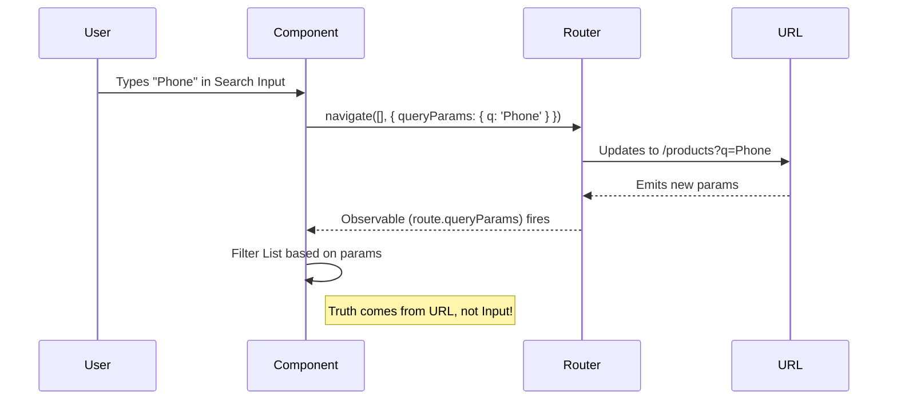

# 🔍 Angular Query Parameters

This guide demonstrates how to manage component state (like filters and sorting) using URL Query Parameters.

## 🔍 How It Works (The Concept)

Query Parameters are the optional key-value pairs at the end of a URL (after the `?`).
Example: `/products?category=shoes&sort=price_asc`

**Why use them?**
*   **Shareable URLs**: Users can copy/paste the URL and see the exact same filtered view.
*   **History Support**: Hitting "Back" undoes the last filter change.
*   **Bookmarking**: Users can bookmark specific search results.

### Mermaid Diagram: State Synchronization



## 🚀 Step-by-Step Implementation Guide

### 1. Setting Query Parameters
Use the `Router.navigate` method (or `routerLink`) with the `queryParams` property.

```typescript
// Update URL when user types
updateSearch(term: string) {
  this.router.navigate([], {
    relativeTo: this.route, // Stay on current route
    queryParams: { 
      q: term, 
      page: 1 // Reset page on search
    },
    queryParamsHandling: 'merge' // 🛡️ CRITICAL: Keep other params (like 'sort')
  });
}
```

### 2. Reading Query Parameters
Listen to the `queryParams` Observable to update your UI.

```typescript
ngOnInit() {
  this.route.queryParams.subscribe(params => {
    this.searchTerm = params['q'] || '';
    this.currentPage = Number(params['page']) || 1;
    this.loadData(); // Re-fetch data based on new params
  });
}
```

## 🐛 Common Pitfalls & Debugging

### 1. Losing Existing Params
If you navigate without `queryParamsHandling: 'merge'`, you wipe out all other parameters!

*   **Scenario**: URL is `?sort=date&q=angular`. Use modifies search.
*   **Bad**: `navigate(..., { queryParams: { q: 'react' } })` -> Result: `?q=react` (Sort lost!)
*   **Good**: `navigate(..., { queryParamsHandling: 'merge' })` -> Result: `?sort=date&q=react`

### 2. Infinite Loops
Be careful not to update the URL in response to a URL change if that update triggers another URL change. The `DistinctUntilChanged` operator in RxJS can help here.

## ⚡ Performance & Architecture

*   **Deep Linking**: By moving state to the URL, you make your app "Deep Linkable". This is a core requirement for almost any enterprise dashboard or e-commerce site.
*   **replaceUrl**: For inputs like search bars, consider `replaceUrl: true` so the user's back button history isn't 100 entries long (one for each letter typed).

## 🌍 Real World Use Cases

1.  **Search Results**: Google search results (e.g., `?q=angular+routing`).
2.  **Dashboards**: Date range filters (`?start=2023-01-01&end=2023-12-31`).
3.  **Pagination**: Page numbers (`?page=2&limit=50`).

## 📝 The Analogy

Think of Query Parameters like **Sticky Notes on a File Folder**.
The File Folder (Route) is "Employee Records".
The Query Params are notes attached to it: "Only the ones from IT Department" (`?dept=IT`) and "Sort by Name" (`?sort=name`).
Anyone you hand the folder to sees the exact same organized view because the instructions are attached to the outside.

## ❓ Interview & Concept Questions

1.  **Q: How do you preserve query params when navigating to a *different* route?**
    *   A: Use `queryParamsHandling: 'preserve'`.
2.  **Q: What is the difference between `merge` and `preserve`?**
    *   A: `merge` updates specified keys and keeps others. `preserve` keeps all current keys and ignores new ones in the navigation command (unless they conflict? No, usually preserve just carries them over).
3.  **Q: Can I use `routerLink` to set query params?**
    *   A: Yes! `<a routerLink="/search" [queryParams]="{ q: 'term' }">`.
