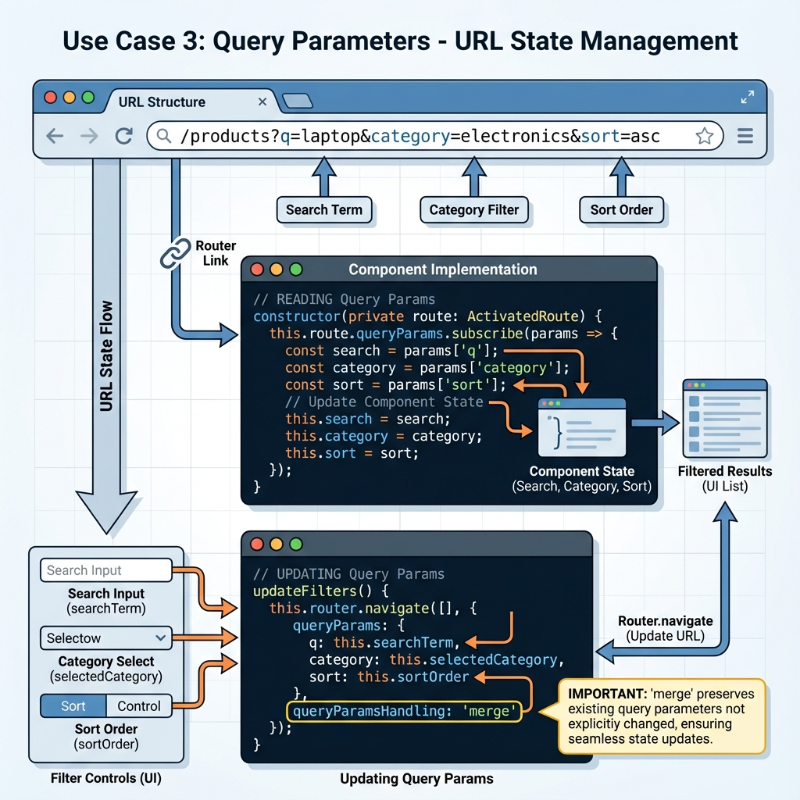

# 🔗 Use Case 3: Query Parameters

> **💡 Key Concept**: Query parameters allow you to pass optional data through the URL without affecting the route path. Perfect for filters, search, pagination, and tabs.

---

## 🖼️ Visual Flow



## 🎯 When to Use Query Parameters

- **Search & Filters**: Product filtering, search queries
- **Pagination**: Page numbers, items per page
- **UI State**: Active tab, sort order, view mode
- **Shareable Links**: Users can bookmark or share the exact filtered state

## 📝 Implementation

### Reading Query Parameters

```typescript
constructor(private route: ActivatedRoute) {
  // Subscribe to query parameter changes
  this.route.queryParams.subscribe(params => {
    this.searchTerm = params['q'] || '';
    this.category = params['category'] || '';
    this.sortOrder = params['sort'] || 'asc';
    
    // Perform filtering/search
    this.filterProducts();
  });
}
```

### Updating Query Parameters

```typescript
updateFilters() {
  this.router.navigate([], {
    relativeTo: this.route,
    queryParams: {
      q: this.searchTerm || null,      // null removes param
      category: this.selectedCategory,
      sort: this.sortOrder
    },
    queryParamsHandling: 'merge',  // Keep other params
    replaceUrl: true                // Don't add to history
  });
}
```

## 🔑 Key Properties

| Property | Purpose |
|----------|---------|
| `queryParams` | Object containing parameter key-value pairs |
| `queryParamsHandling: 'merge'` | Preserve existing params, update only specified ones |
| `queryParamsHandling: 'preserve'` | Keep all existing params unchanged |
| `replaceUrl: true` | Replace current history entry instead of adding new one |

## ⚠️ Common Patterns

**URL State as Single Source of Truth:**
```typescript
// ✅ Good: URL drives component state
this.route.queryParams.pipe(
  map(params => this.applyFilters(params))
).subscribe();

// ❌ Bad: Component state and URL can get out of sync
this.searchTerm = 'laptop';  // URL doesn't know about this
```
