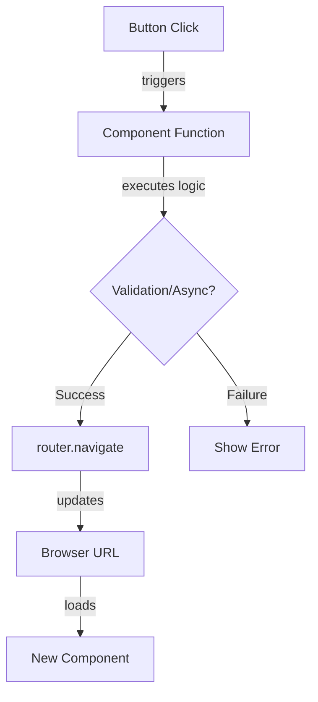

# 💻 Angular Programmatic Navigation

This guide shows how to navigate using TypeScript logic instead of HTML templates.


## 🔍 How It Works (The Concept)

While `routerLink` is declarative (HTML), `Router.navigate()` is imperative (TypeScript).
Use programmatic navigation when:
1.  **Form Submission**: Navigate after saving data.
2.  **Auth Logic**: Redirect to Login if unauthorized.
3.  **Complex Logic**: Navigate only if a condition is met.

### Mermaid Diagram: Navigation Flow



## 🚀 Step-by-Step Implementation Guide

### 1. Inject the RouterService
You need the `Router` service to trigger navigation.

```typescript
import { Router } from '@angular/router';

@Component({...})
export class MyComponent {
  // Inject Router in constructor
  constructor(private router: Router) {}
}
```

### 2. Navigate with `navigate()` (Array Syntax)
This is the standard and safest method. It accepts an array of path segments.

```typescript
saveAndExit() {
  // Saves data...
  // Then navigates to /products/123
  this.router.navigate(['/products', 123]); 
}

// Relative Navigation
this.router.navigate(['../list'], { relativeTo: this.route });
```

### 3. Navigate with `navigateByUrl()` (String Syntax)
Use this if you have a full string URL (e.g., from an API response).

```typescript
// ⚠️ Less safe: You must handle encoding yourself
this.router.navigateByUrl('/products/123?sort=asc');
```

## 🐛 Common Pitfalls & Debugging

### 1. `this` Context
If you call navigation inside a callback (like `setTimeout` or `subscribe`), ensure `this` refers to the component. Arrow functions `() => {}` handle this automatically.

### 2. Relative Navigation Error
If you try to use `../` without providing the `relativeTo` option, it defaults to the root!

**Bad**: `this.router.navigate(['../sibling'])` -> Tries to go to `/sibling` (Root)
**Good**: `this.router.navigate(['../sibling'], { relativeTo: this.route })`

## ⚡ Performance & Architecture

*   **Guards**: Note that programmatic navigation effectively checks Route Guards (`canDeactivate`, `canActivate`). If a guard returns `false`, the Promise returned by `navigate()` resolves to `false`.
*   **Promise-based**: `navigate()` returns a Promise. You can await it to do cleanup *after* the navigation starts (or fails).

## 🌍 Real World Use Cases

1.  **Login Redirect**: After successful login, redirect user to their dashboard or the page they originally requested.
2.  **Wizard "Next" Button**: Validate the current step's form; if valid, navigate to `step/2`.
3.  **Timeout Logout**: Automatically redirect to the login screen after 15 minutes of inactivity.

### 📦 Data Flow Summary (Visual Box Diagram)

```
┌─────────────────────────────────────────────────────────────┐
│  PROGRAMMATIC NAVIGATION: router.navigate()                 │
│                                                             │
│   INJECT ROUTER:                                            │
│   ┌───────────────────────────────────────────────────────┐ │
│   │ constructor(private router: Router) {}                │ │
│   └───────────────────────────────────────────────────────┘ │
│                                                             │
│   NAVIGATE METHODS:                                         │
│   ┌───────────────────────────────────────────────────────┐ │
│   │ // Array syntax (RECOMMENDED)                         │ │
│   │ router.navigate(['/products', 123]);                  │ │
│   │ // Result: /products/123                              │ │
│   │                                                       │ │
│   │ // Relative navigation                                │ │
│   │ router.navigate(['../edit'], { relativeTo: this.route })│ │
│   │                                                       │ │
│   │ // String syntax (less safe)                          │ │
│   │ router.navigateByUrl('/products/123?sort=asc');       │ │
│   └───────────────────────────────────────────────────────┘ │
│                                                             │
│   COMMON USE:                                               │
│   ┌───────────────────────────────────────────────────────┐ │
│   │ async onSave() {                                      │ │
│   │   await this.saveData();                              │ │
│   │   this.router.navigate(['/success']);  // After save! │ │
│   │ }                                                     │ │
│   └───────────────────────────────────────────────────────┘ │
└─────────────────────────────────────────────────────────────┘
```

> **Key Takeaway**: Use `router.navigate([])` for logic-based navigation. Use `relativeTo` for relative paths!

## 📝 The Analogy

*   **routerLink** is like a **Signpost**. It just sits there pointing the way.
*   **router.navigate()** is like a **Taxi Driver**. You get in, tell them where to go ("Take me to the airport!"), and they drive you there. You can also tell them *when* to leave.

## ❓ Interview & Concept Questions

1.  **Q: Return type of `router.navigate()`?**
    *   A: `Promise<boolean>`. Resolves `true` if navigation succeeds, `false` if cancelled/failed.
2.  **Q: Difference between `navigate` and `navigateByUrl`?**
    *   A: `navigate` takes an array of segments (URL creation handled by Angular). `navigateByUrl` expects a complete string path. Use `navigate` whenever possible.
3.  **Q: How do I pass "hidden" data during navigation?**
    *   A: You can use the `state` property in `NavigationExtras`: `this.router.navigate(['/target'], { state: { hiddenData: 123 } })`.
