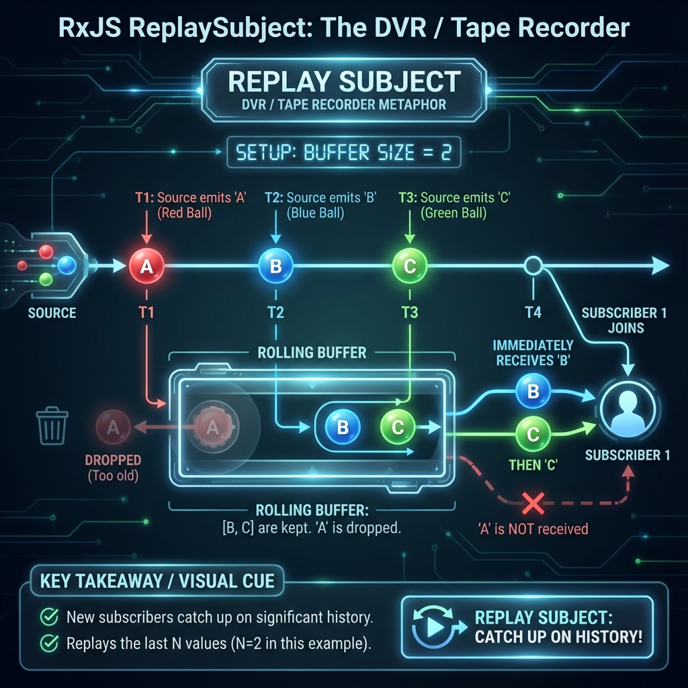

# 🔄 ReplaySubject (The Recorder)

> **💡 Analogy**: Think of `ReplaySubject` like a **DVR / Tape Recorder**. It plays back the *recent history* (last N moments) to anyone who tunes in.

---

## 🖼️ Visualizing the Flow (Marble Diagram)



## 🔑 Key Concepts

1.  **Buffer Size**: Defines how many previous values to keep (e.g., `new ReplaySubject(2)` keeps the last 2).
2.  **History**: New subscribers receive the buffered history immediately.
3.  **No Default Value**: Unlike BehaviorSubject, it only replays *emitted* values.

---

## 📝 Code Example

```typescript
// 1. Create with Buffer Size = 2
const subject = new ReplaySubject<string>(2);

// 2. Source emits 3 values
subject.next('A');
subject.next('B');
subject.next('C');
// Buffer now has: ['B', 'C'] ('A' dropped because buffer is 2)

// 3. Subscriber 1 joins
subject.subscribe(val => console.log('Sub 1:', val));
// Output: Sub 1: B
// Output: Sub 1: C
```

---

## ⚠️ When to use?
- **Caching**: When you want to cache the last few API responses or user actions.
- **History Tracking**: When new components need to see *what just happened*.
