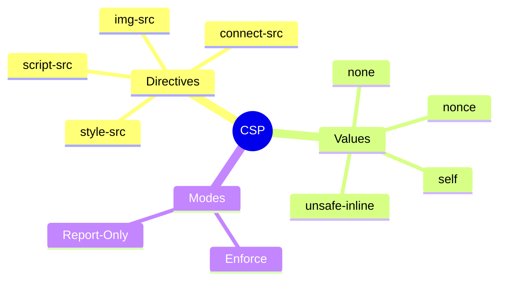

# 🛡️ Content Security Policy (CSP)

> **Goal**: Implement CSP to prevent XSS and data injection attacks.


## 📋 Table of Contents
- [1. 🔍 What is CSP?](#1--what-is-csp)
  - [Example Header](#example-header)
- [2. 🚀 CSP Directives](#2--csp-directives)
  - [Special Values](#special-values)
- [3. ❓ Interview Questions](#3--interview-questions)
  - [Basic Questions](#basic-questions)
    - [Q1: Why is CSP considered defense-in-depth?](#q1-why-is-csp-considered-defense-in-depth)
    - [Q2: What's the problem with 'unsafe-inline' in script-src?](#q2-whats-the-problem-with-unsafe-inline-in-script-src)
  - [Scenario-Based Questions](#scenario-based-questions)
    - [Scenario 1: Angular with CSP](#scenario-1-angular-with-csp)
    - [Scenario 2: Report Only Mode](#scenario-2-report-only-mode)
  - [📦 Data Flow Summary (Visual Box Diagram)](#data-flow-summary-visual-box-diagram)
- [🚧 Gated Community Analogy (Easy to Remember!)](#gated-community-analogy-easy-to-remember)
- [🧠 Mind Map](#mind-map)

---
---

## 1. 🔍 What is CSP?

**Content Security Policy** is an HTTP header that tells browsers which sources of content are allowed. It's a powerful defense-in-depth against XSS.

### Example Header

```
Content-Security-Policy: 
    default-src 'self'; 
    script-src 'self' https://cdn.example.com;
    style-src 'self' 'unsafe-inline';
    img-src 'self' data: https:;
```

---

## 2. 🚀 CSP Directives

| Directive | Controls | Example |
|-----------|----------|---------|
| `default-src` | Fallback for all | `'self'` |
| `script-src` | JavaScript sources | `'self' 'unsafe-inline'` |
| `style-src` | CSS sources | `'self' https://fonts.googleapis.com` |
| `img-src` | Image sources | `'self' data: https:` |
| `connect-src` | XHR, fetch, WebSocket | `'self' https://api.example.com` |
| `font-src` | Font files | `'self' https://fonts.gstatic.com` |
| `frame-src` | iframe sources | `'none'` |

### Special Values

| Value | Meaning |
|-------|---------|
| `'self'` | Same origin only |
| `'none'` | Block all |
| `'unsafe-inline'` | Allow inline scripts (avoid!) |
| `'unsafe-eval'` | Allow eval() (avoid!) |
| `nonce-xyz` | Allow specific inline with nonce |

---

## 3. ❓ Interview Questions

### Basic Questions

#### Q1: Why is CSP considered defense-in-depth?
**Answer:** Even if an XSS vulnerability exists, CSP can prevent the attack from executing by blocking inline scripts or scripts from unauthorized sources.

#### Q2: What's the problem with 'unsafe-inline' in script-src?
**Answer:** It allows ALL inline scripts, which defeats the purpose of CSP for XSS prevention. An attacker's injected `<script>` would execute.

---

### Scenario-Based Questions

#### Scenario 1: Angular with CSP
**Question:** Angular uses inline styles. How do you implement strict CSP?

**Answer:**
```typescript
// Use nonces for inline styles
Content-Security-Policy: style-src 'self' 'nonce-abc123';

// Or configure Angular to use external CSS
// In angular.json:
"inlineStyleLanguage": "css",
"optimization": {
    "styles": {
        "inlineCritical": false
    }
}
```

#### Scenario 2: Report Only Mode
**Question:** How do you test CSP without breaking your app?

**Answer:**
```
Content-Security-Policy-Report-Only: 
    default-src 'self';
    report-uri /csp-report-endpoint;
```
This logs violations without blocking, perfect for testing.

---

### 📦 Data Flow Summary (Visual Box Diagram)

```
┌─────────────────────────────────────────────────────────────┐
│  CSP: BROWSER CONTENT RESTRICTIONS                          │
│                                                             │
│   HTTP HEADER:                                              │
│   ┌───────────────────────────────────────────────────────┐ │
│   │ Content-Security-Policy:                              │ │
│   │   default-src 'self';                // Same origin   │ │
│   │   script-src 'self' https://cdn.com; // JS sources    │ │
│   │   style-src 'self' 'unsafe-inline';  // CSS sources   │ │
│   │   img-src 'self' data: https:;       // Image sources │ │
│   └───────────────────────────────────────────────────────┘ │
│                                                             │
│   COMMON VALUES:                                            │
│   ┌───────────────────────────────────────────────────────┐ │
│   │ 'self'          = Same origin only                    │ │
│   │ 'none'          = Block all                           │ │
│   │ 'unsafe-inline' = Allow inline (⚠️ avoid for scripts!)│ │
│   │ 'nonce-xyz'     = Allow specific inline with nonce    │ │
│   └───────────────────────────────────────────────────────┘ │
│                                                             │
│   TEST MODE (report only):                                  │
│   ┌───────────────────────────────────────────────────────┐ │
│   │ Content-Security-Policy-Report-Only: ...              │ │
│   │ Logs violations but doesn't block                     │ │
│   └───────────────────────────────────────────────────────┘ │
└─────────────────────────────────────────────────────────────┘
```

> **Key Takeaway**: CSP = whitelist of allowed content sources. Never use 'unsafe-inline' for scripts. Test with Report-Only first!

---

## 🚧 Gated Community Analogy (Easy to Remember!)


Think of CSP like a **gated community**:

| Concept | Analogy | Meaning |
|---------|---------|---------|
| **No CSP** | 🏠 **Open Door** | Strangers (malicious scripts) walk right in |
| **CSP Header** | 📋 **Guest List** | Only listed names (domains) are allowed |
| **'self'** | 👤 **Resident** | Your own code is always allowed |
| **'nonce'** | 🎫 **Singe-use Pass** | Special pass for one specific script |

## 🧠 Mind Map


