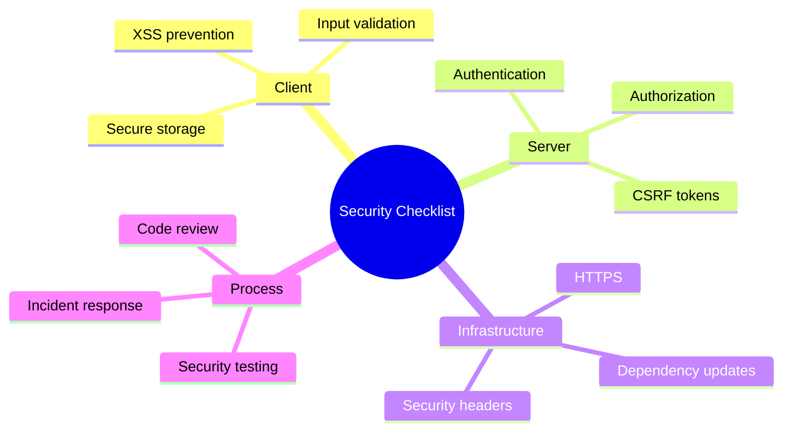

# 📋 Security Checklist

> **Goal**: Comprehensive security checklist for Angular applications.


## 📋 Table of Contents
- [1. 🛡️ Angular Security Checklist](#1--angular-security-checklist)
  - [XSS Prevention](#xss-prevention)
  - [Authentication](#authentication)
  - [CSRF Protection](#csrf-protection)
  - [CSP](#csp)
  - [Input Validation](#input-validation)
  - [Dependencies](#dependencies)
- [👨‍✈️ Pilot's Pre-Flight Analogy (Easy to Remember!)](#pilots-pre-flight-analogy-easy-to-remember)
- [2. ❓ Interview Questions](#2--interview-questions)
  - [Scenario-Based Questions](#scenario-based-questions)
    - [Scenario 1: Security Review](#scenario-1-security-review)
    - [Scenario 2: Security Incident](#scenario-2-security-incident)
  - [Quick Reference](#quick-reference)
    - [HTTP Security Headers](#http-security-headers)
    - [OWASP Top 10 (Quick)](#owasp-top-10-quick)
  - [📦 Data Flow Summary (Visual Box Diagram)](#data-flow-summary-visual-box-diagram)
- [🧠 Mind Map](#mind-map)

---
---

## 1. 🛡️ Angular Security Checklist

### XSS Prevention
- [ ] Use Angular's default template escaping
- [ ] Avoid `bypassSecurityTrust*` unless absolutely necessary
- [ ] Use DOMPurify for user HTML content
- [ ] Never use `innerHTML` with user input

### Authentication
- [ ] Store access tokens in memory, not localStorage
- [ ] Use HttpOnly cookies for refresh tokens
- [ ] Implement token refresh before expiry
- [ ] Add idle timeout for sensitive apps

### CSRF Protection
- [ ] Enable Angular's XSRF handling
- [ ] Use SameSite cookies
- [ ] Validate origin/referer headers server-side

### CSP
- [ ] Implement Content-Security-Policy header
- [ ] Avoid 'unsafe-inline' and 'unsafe-eval'
- [ ] Use nonces for necessary inline scripts
- [ ] Set up CSP reporting

### Input Validation
- [ ] Validate all inputs client AND server-side
- [ ] Use parameterized queries (prevent SQL injection)
- [ ] Whitelist allowed values
- [ ] Validate file uploads thoroughly

### Dependencies
- [ ] Run `npm audit` regularly
- [ ] Keep Angular and dependencies updated
- [ ] Review third-party libraries

- [ ] Review third-party libraries

---

## 👨‍✈️ Pilot's Pre-Flight Analogy (Easy to Remember!)


Think of a security review like a **pilot's pre-flight checklist**:

| Checklist Item | Pilot Analogy | Why it matters |
|----------------|---------------|----------------|
| **XSS Sanitization** | 🧳 **Luggage Scan** | Prevents dangerous cargo (scripts) |
| **CSRF Tokens** | 🤝 **Identity Check** | Verifies authorized personnel |
| **CSP Headers** | 📋 **Flight Plan** | Restricts unauthorized routes/sources |
| **HttpOnly Cookies** | 🔒 **Cockpit Lock** | Prevents passenger access to controls |

---

## 2. ❓ Interview Questions

### Scenario-Based Questions

#### Scenario 1: Security Review
**Question:** You're reviewing a PR. What security issues do you look for?

**Answer:**
1. **XSS**: Any `innerHTML`, `bypassSecurityTrust*`, or user input in templates
2. **Hardcoded secrets**: API keys, passwords in code
3. **Missing validation**: Input not validated before use
4. **Insecure storage**: Tokens in localStorage
5. **Missing error handling**: Stack traces exposed to users
6. **Insecure dependencies**: Outdated packages with CVEs

#### Scenario 2: Security Incident
**Question:** A user reports seeing another user's data. How do you respond?

**Answer:**
1. **Contain**: Disable affected feature if possible
2. **Investigate**: Check logs for unauthorized access patterns
3. **Identify**: Find the vulnerability (broken access control?)
4. **Fix**: Patch the code
5. **Notify**: Inform affected users if data was exposed
6. **Document**: Post-mortem for future prevention

---

### Quick Reference

#### HTTP Security Headers

```
Content-Security-Policy: default-src 'self';
Strict-Transport-Security: max-age=31536000; includeSubDomains
X-Content-Type-Options: nosniff
X-Frame-Options: DENY
X-XSS-Protection: 1; mode=block
Referrer-Policy: strict-origin-when-cross-origin
```

#### OWASP Top 10 (Quick)

| # | Risk | Angular Mitigation |
|---|------|-------------------|
| 1 | Broken Access Control | Route guards, server auth |
| 2 | Cryptographic Failures | HTTPS, secure storage |
| 3 | Injection | Template escaping, validation |
| 4 | Insecure Design | Threat modeling |
| 5 | Security Misconfiguration | CSP, HTTP headers |
| 6 | Vulnerable Components | npm audit, updates |
| 7 | Auth Failures | Secure token handling |
| 8 | Data Integrity | Input validation |
| 9 | Logging Failures | Proper error handling |
| 10 | SSRF | URL validation |

---

### 📦 Data Flow Summary (Visual Box Diagram)

```
┌─────────────────────────────────────────────────────────────┐
│  ANGULAR SECURITY CHECKLIST                                 │
│                                                             │
│   XSS PREVENTION:                                           │
│   ┌───────────────────────────────────────────────────────┐ │
│   │ ✅ Use Angular's default template escaping             │ │
│   │ ❌ Avoid bypassSecurityTrust* unless necessary         │ │
│   │ ❌ Never use innerHTML with user input                 │ │
│   └───────────────────────────────────────────────────────┘ │
│                                                             │
│   AUTHENTICATION:                                           │
│   ┌───────────────────────────────────────────────────────┐ │
│   │ ✅ Access tokens in memory                             │ │
│   │ ✅ Refresh tokens in HttpOnly cookies                  │ │
│   │ ✅ Implement token refresh before expiry               │ │
│   │ ❌ Never store tokens in localStorage                  │ │
│   └───────────────────────────────────────────────────────┘ │
│                                                             │
│   DEPENDENCIES:                                             │
│   ┌───────────────────────────────────────────────────────┐ │
│   │ npm audit                  // Check vulnerabilities   │ │
│   │ npm update                 // Keep packages updated   │ │
│   │ Review third-party code    // Verify library safety   │ │
│   └───────────────────────────────────────────────────────┘ │
│                                                             │
│   HTTP HEADERS: CSP, HSTS, X-Frame-Options, X-XSS-Protection│
└─────────────────────────────────────────────────────────────┘
```

> **Key Takeaway**: Trust Angular's escaping. Tokens in memory. Run npm audit regularly. Add security headers on server!

---

## 🧠 Mind Map


