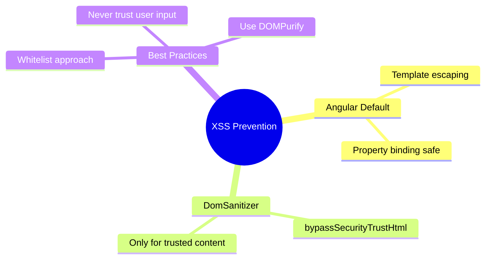

# 🛡️ Use Case 1: XSS Prevention

> **Goal**: Understand and prevent Cross-Site Scripting (XSS) attacks in Angular.

---

## 1. 🔍 What is XSS?

**Cross-Site Scripting (XSS)** is an attack where malicious scripts are injected into trusted websites. The attacker's script runs in the victim's browser with full access to cookies, sessions, and DOM.

### Types of XSS

| Type | Description | Example |
|------|-------------|---------|
| **Stored XSS** | Script stored in database | Blog comment with `<script>` |
| **Reflected XSS** | Script in URL parameter | `?search=<script>alert(1)</script>` |
| **DOM XSS** | Script manipulates DOM | `innerHTML = userInput` |

---

## 2. 🚀 Angular's Built-in Protection

Angular automatically sanitizes values before inserting them into DOM:

```typescript
// ✅ SAFE - Angular escapes HTML
<p>{{ userInput }}</p>
// <script>alert('xss')</script> → displayed as text, not executed

// ✅ SAFE - Also escaped
<p [innerText]="userInput"></p>

// ⚠️ DANGEROUS - Bypasses sanitization
<p [innerHTML]="userInput"></p>
```

### DomSanitizer

When you MUST use raw HTML:

```typescript
import { DomSanitizer, SafeHtml } from '@angular/platform-browser';

constructor(private sanitizer: DomSanitizer) {}

// Only for TRUSTED content
trustedHtml: SafeHtml = this.sanitizer.bypassSecurityTrustHtml(
    '<b>Trusted HTML</b>'
);
```

---

## 3. ❓ Interview Questions

### Basic Questions

#### Q1: How does Angular prevent XSS attacks by default?
**Answer:** Angular automatically escapes values in templates. When you use `{{ value }}` or property binding, Angular treats the value as TEXT, not HTML. Special characters like `<`, `>`, `&` are converted to their HTML entity equivalents.

#### Q2: What is the DomSanitizer and when should you use it?
**Answer:** DomSanitizer is Angular's service for marking content as trusted. Use it ONLY when:
1. Content comes from a trusted source (your own CMS)
2. You've already sanitized the content server-side
3. Never for user-generated content

---

### Scenario-Based Questions

#### Scenario 1: Blog Comments
**Question:** Users can post comments with basic formatting (bold, italic). How do you allow HTML formatting safely?

**Answer:**
```typescript
// Use a whitelist approach with a library like DOMPurify
import DOMPurify from 'dompurify';

sanitizeComment(html: string): SafeHtml {
    // Only allow specific tags
    const clean = DOMPurify.sanitize(html, {
        ALLOWED_TAGS: ['b', 'i', 'u', 'a'],
        ALLOWED_ATTR: ['href']
    });
    return this.sanitizer.bypassSecurityTrustHtml(clean);
}
```

#### Scenario 2: User Avatar URL
**Question:** Users can set a custom avatar URL. How do you prevent XSS via the URL?

**Answer:**
```typescript
// Validate URL format
isValidUrl(url: string): boolean {
    try {
        const parsed = new URL(url);
        return ['http:', 'https:'].includes(parsed.protocol);
    } catch {
        return false;
    }
}

// Use in template with validation

```

---

## 🧠 Mind Map


