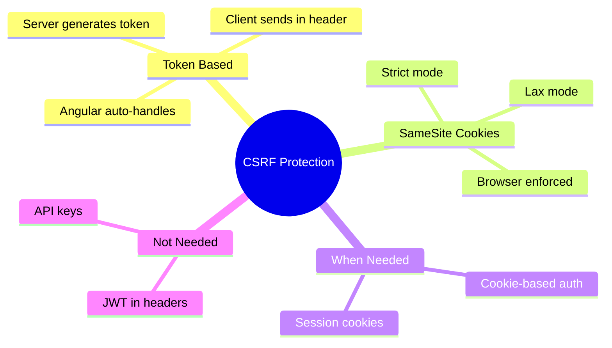

# 🔒 Use Case 2: CSRF Protection

> **Goal**: Understand and implement CSRF (Cross-Site Request Forgery) protection.

---

## 1. 🔍 What is CSRF?

**CSRF** tricks a user's browser into making unwanted requests to a site where they're authenticated.

### Attack Flow

```
1. User logs into bank.com (session cookie set)
2. User visits evil.com (different tab)
3. evil.com contains: <form action="bank.com/transfer" method="POST">
4. Form auto-submits, browser includes bank.com cookies
5. Bank processes transfer thinking it's legitimate!
```

---

## 2. 🚀 Protection Strategies

### CSRF Tokens

Server generates unique token, client must include it:

```typescript
// Angular HttpClient + XSRF
provideHttpClient(
    withXsrfConfiguration({
        cookieName: 'XSRF-TOKEN',    // Cookie from server
        headerName: 'X-XSRF-TOKEN'   // Header to send back
    })
)
```

### SameSite Cookies

Modern browser protection:

```typescript
// Server sets cookie with SameSite attribute
Set-Cookie: session=abc123; SameSite=Strict; Secure; HttpOnly
```

| SameSite Value | Behavior |
|----------------|----------|
| `Strict` | Never sent cross-site |
| `Lax` | Sent on top-level navigation |
| `None` | Always sent (requires Secure) |

---

## 3. ❓ Interview Questions

### Basic Questions

#### Q1: How does CSRF differ from XSS?
**Answer:**
| Attack | Target | How It Works |
|--------|--------|--------------|
| XSS | User's browser | Inject malicious script |
| CSRF | Server | Trick browser into making request |

#### Q2: How does Angular protect against CSRF?
**Answer:** Angular's HttpClient automatically:
1. Reads CSRF token from cookie (XSRF-TOKEN)
2. Adds it as header (X-XSRF-TOKEN) on mutating requests
3. Server validates token matches session

---

### Scenario-Based Questions

#### Scenario 1: API Without Cookie Auth
**Question:** Your API uses Bearer tokens (JWT) instead of cookies. Do you need CSRF protection?

**Answer:** No! CSRF only works because browsers automatically send cookies. Bearer tokens in Authorization headers are NOT automatically sent, so CSRF is not possible.

#### Scenario 2: Custom CSRF Header
**Question:** Your backend uses a different header name for CSRF. How do you configure Angular?

**Answer:**
```typescript
provideHttpClient(
    withXsrfConfiguration({
        cookieName: 'MY-CSRF-COOKIE',
        headerName: 'X-MY-CSRF-TOKEN'
    })
)
```

---

### 📦 Data Flow Summary (Visual Box Diagram)

```
┌─────────────────────────────────────────────────────────────┐
│  CSRF PROTECTION: SECRET TOKEN                              │
│                                                             │
│   THE ATTACK:                                               │
│   ┌───────────────────────────────────────────────────────┐ │
│   │ 1. User logs into bank.com (session cookie set)       │ │
│   │ 2. User visits evil.com                               │ │
│   │ 3. evil.com: <form action="bank.com/transfer">        │ │
│   │ 4. Browser includes bank.com cookies automatically!   │ │
│   │ 5. Bank thinks it's legitimate → Money transferred! ❌│ │
│   └───────────────────────────────────────────────────────┘ │
│                                                             │
│   THE PROTECTION:                                           │
│   ┌───────────────────────────────────────────────────────┐ │
│   │ Server sets CSRF token in cookie                      │ │
│   │ Angular reads token from XSRF-TOKEN cookie            │ │
│   │ Angular sends token in X-XSRF-TOKEN header            │ │
│   │ Server validates: header === cookie                   │ │
│   │ evil.com can't read cookie → Can't set header! ✅     │ │
│   └───────────────────────────────────────────────────────┘ │
│                                                             │
│   ANGULAR SETUP:                                            │
│   ┌───────────────────────────────────────────────────────┐ │
│   │ provideHttpClient(                                    │ │
│   │   withXsrfConfiguration({                             │ │
│   │     cookieName: 'XSRF-TOKEN',                         │ │
│   │     headerName: 'X-XSRF-TOKEN'                        │ │
│   │   })                                                  │ │
│   │ )                                                     │ │
│   └───────────────────────────────────────────────────────┘ │
└─────────────────────────────────────────────────────────────┘
```

> **Key Takeaway**: CSRF uses cookies (auto-sent). CSRF token = secret only real site knows. JWT = no cookie, no CSRF risk!

---

## 🤝 Secret Handshake Analogy (Easy to Remember!)

Think of CSRF protection like a **secret handshake**:

| Concept | Handshake Analogy | Memory Trick |
|---------|------------------|--------------| 
| **CSRF Attack** | 🎭 **Impersonator**: Someone pretends to be you | **"Identity theft"** |
| **Session cookie** | 🪪 **Name badge**: Browser shows it automatically | **"Auto-sent"** |
| **CSRF token** | 🤝 **Secret handshake**: Only YOU know the moves | **"Hidden proof"** |
| **X-XSRF-TOKEN** | 🤫 **Whispered password**: Header with the secret | **"Verify identity"** |
| **SameSite** | 🚧 **Club members only**: Cookie stays on this site | **"No cross-site"** |

### 📖 Story to Remember:

> 🤝 **The Secret Club**
>
> CSRF attack is like someone stealing your name badge:
>
> **The Problem:**
> ```
> 1. You log into bank.com (get name badge 🪪)
> 2. You visit evil.com (still wearing badge)
> 3. evil.com makes request to bank.com
> 4. Browser shows your badge automatically
> 5. Bank thinks it's really you! 😱
> ```
>
> **The Solution - Secret Handshake:**
> ```typescript
> provideHttpClient(
>   withXsrfConfiguration({
>     cookieName: 'XSRF-TOKEN',    // 🤝 Server teaches handshake
>     headerName: 'X-XSRF-TOKEN'   // 🤫 You prove you know it
>   })
> )
> 
> // evil.com doesn't know the handshake!
> // Request rejected: "Wrong moves!" 🚫
> ```

### 🎯 Quick Reference:
```
🎭 CSRF Attack    = Impersonator (fake you)
🪪 Session cookie = Name badge (auto-sent)
🤝 CSRF token     = Secret handshake
🤫 X-XSRF-TOKEN   = Whispered password
🚧 SameSite       = Members only rule
```

---

## 🧠 Mind Map


