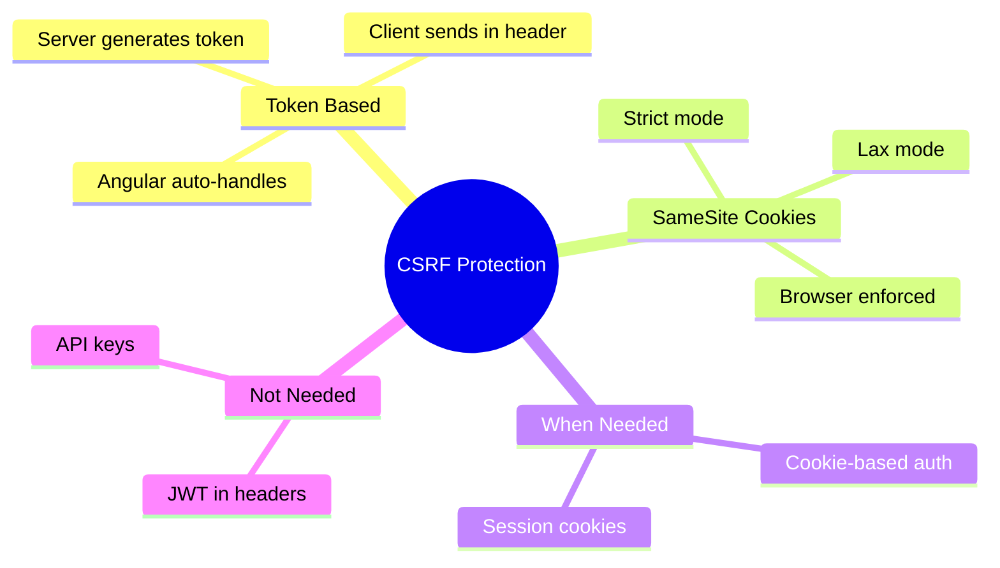

# 🔒 Use Case 2: CSRF Protection

> **Goal**: Understand and implement CSRF (Cross-Site Request Forgery) protection.

---

## 1. 🔍 What is CSRF?

**CSRF** tricks a user's browser into making unwanted requests to a site where they're authenticated.

### Attack Flow

```
1. User logs into bank.com (session cookie set)
2. User visits evil.com (different tab)
3. evil.com contains: <form action="bank.com/transfer" method="POST">
4. Form auto-submits, browser includes bank.com cookies
5. Bank processes transfer thinking it's legitimate!
```

---

## 2. 🚀 Protection Strategies

### CSRF Tokens

Server generates unique token, client must include it:

```typescript
// Angular HttpClient + XSRF
provideHttpClient(
    withXsrfConfiguration({
        cookieName: 'XSRF-TOKEN',    // Cookie from server
        headerName: 'X-XSRF-TOKEN'   // Header to send back
    })
)
```

### SameSite Cookies

Modern browser protection:

```typescript
// Server sets cookie with SameSite attribute
Set-Cookie: session=abc123; SameSite=Strict; Secure; HttpOnly
```

| SameSite Value | Behavior |
|----------------|----------|
| `Strict` | Never sent cross-site |
| `Lax` | Sent on top-level navigation |
| `None` | Always sent (requires Secure) |

---

## 3. ❓ Interview Questions

### Basic Questions

#### Q1: How does CSRF differ from XSS?
**Answer:**
| Attack | Target | How It Works |
|--------|--------|--------------|
| XSS | User's browser | Inject malicious script |
| CSRF | Server | Trick browser into making request |

#### Q2: How does Angular protect against CSRF?
**Answer:** Angular's HttpClient automatically:
1. Reads CSRF token from cookie (XSRF-TOKEN)
2. Adds it as header (X-XSRF-TOKEN) on mutating requests
3. Server validates token matches session

---

### Scenario-Based Questions

#### Scenario 1: API Without Cookie Auth
**Question:** Your API uses Bearer tokens (JWT) instead of cookies. Do you need CSRF protection?

**Answer:** No! CSRF only works because browsers automatically send cookies. Bearer tokens in Authorization headers are NOT automatically sent, so CSRF is not possible.

#### Scenario 2: Custom CSRF Header
**Question:** Your backend uses a different header name for CSRF. How do you configure Angular?

**Answer:**
```typescript
provideHttpClient(
    withXsrfConfiguration({
        cookieName: 'MY-CSRF-COOKIE',
        headerName: 'X-MY-CSRF-TOKEN'
    })
)
```

---

## 🧠 Mind Map


