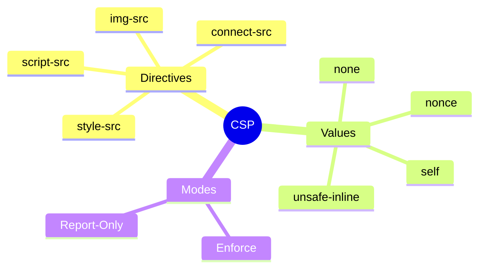

# 🛡️ Use Case 3: Content Security Policy (CSP)

> **Goal**: Implement CSP to prevent XSS and data injection attacks.

---

## 1. 🔍 What is CSP?

**Content Security Policy** is an HTTP header that tells browsers which sources of content are allowed. It's a powerful defense-in-depth against XSS.

### Example Header

```
Content-Security-Policy: 
    default-src 'self'; 
    script-src 'self' https://cdn.example.com;
    style-src 'self' 'unsafe-inline';
    img-src 'self' data: https:;
```

---

## 2. 🚀 CSP Directives

| Directive | Controls | Example |
|-----------|----------|---------|
| `default-src` | Fallback for all | `'self'` |
| `script-src` | JavaScript sources | `'self' 'unsafe-inline'` |
| `style-src` | CSS sources | `'self' https://fonts.googleapis.com` |
| `img-src` | Image sources | `'self' data: https:` |
| `connect-src` | XHR, fetch, WebSocket | `'self' https://api.example.com` |
| `font-src` | Font files | `'self' https://fonts.gstatic.com` |
| `frame-src` | iframe sources | `'none'` |

### Special Values

| Value | Meaning |
|-------|---------|
| `'self'` | Same origin only |
| `'none'` | Block all |
| `'unsafe-inline'` | Allow inline scripts (avoid!) |
| `'unsafe-eval'` | Allow eval() (avoid!) |
| `nonce-xyz` | Allow specific inline with nonce |

---

## 3. ❓ Interview Questions

### Basic Questions

#### Q1: Why is CSP considered defense-in-depth?
**Answer:** Even if an XSS vulnerability exists, CSP can prevent the attack from executing by blocking inline scripts or scripts from unauthorized sources.

#### Q2: What's the problem with 'unsafe-inline' in script-src?
**Answer:** It allows ALL inline scripts, which defeats the purpose of CSP for XSS prevention. An attacker's injected `<script>` would execute.

---

### Scenario-Based Questions

#### Scenario 1: Angular with CSP
**Question:** Angular uses inline styles. How do you implement strict CSP?

**Answer:**
```typescript
// Use nonces for inline styles
Content-Security-Policy: style-src 'self' 'nonce-abc123';

// Or configure Angular to use external CSS
// In angular.json:
"inlineStyleLanguage": "css",
"optimization": {
    "styles": {
        "inlineCritical": false
    }
}
```

#### Scenario 2: Report Only Mode
**Question:** How do you test CSP without breaking your app?

**Answer:**
```
Content-Security-Policy-Report-Only: 
    default-src 'self';
    report-uri /csp-report-endpoint;
```
This logs violations without blocking, perfect for testing.

---

## 🧠 Mind Map


