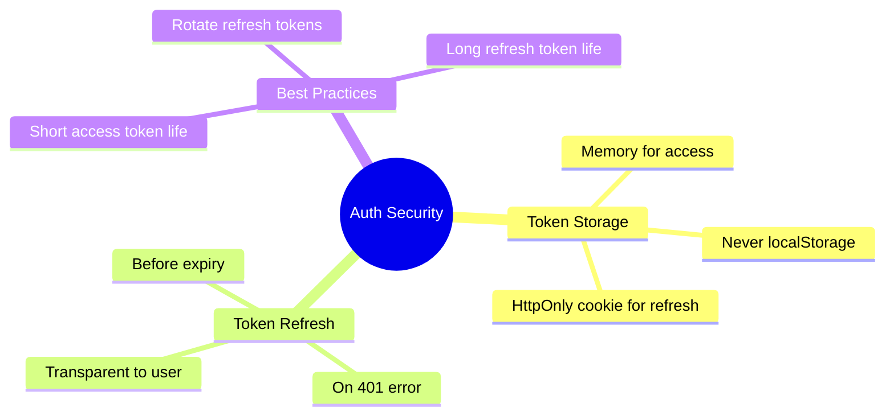

# 🔐 Use Case 4: Authentication Security

> **Goal**: Implement secure authentication patterns in Angular.

---

## 1. 🔍 Key Concepts

### Token Types

| Token | Storage | Use Case |
|-------|---------|----------|
| **Access Token** | Memory | Short-lived, API access |
| **Refresh Token** | HttpOnly Cookie | Long-lived, get new access token |
| **JWT** | Either | Self-contained claims |

### Storage Security

| Storage | XSS Vulnerable | CSRF Vulnerable |
|---------|----------------|-----------------|
| localStorage | ✅ Yes | ❌ No |
| sessionStorage | ✅ Yes | ❌ No |
| Cookies | ❌ No (HttpOnly) | ✅ Yes |
| Memory | ❌ No | ❌ No |

---

## 2. 🚀 Best Practices

### Secure Token Handling

```typescript
// Store access token in memory (service)
@Injectable({ providedIn: 'root' })
export class AuthService {
    private accessToken: string | null = null;
    
    setToken(token: string): void {
        this.accessToken = token;
        // Refresh token should be HttpOnly cookie from server
    }
    
    getToken(): string | null {
        return this.accessToken;
    }
}
```

### Token Refresh Flow

```typescript
// Interceptor handles 401
catchError(error => {
    if (error.status === 401) {
        return this.authService.refreshToken().pipe(
            switchMap(newToken => {
                const retryReq = req.clone({
                    headers: req.headers.set('Authorization', `Bearer ${newToken}`)
                });
                return next(retryReq);
            })
        );
    }
    return throwError(() => error);
})
```

---

## 3. ❓ Interview Questions

### Basic Questions

#### Q1: Why shouldn't you store JWTs in localStorage?
**Answer:** localStorage is accessible via JavaScript, making it vulnerable to XSS attacks. If an attacker injects a script, they can steal the token.

#### Q2: What's the difference between authentication and authorization?
**Answer:**
| Concept | Question Answered | Example |
|---------|-------------------|---------|
| Authentication | Who are you? | Login with username/password |
| Authorization | What can you do? | Admin can delete, user can read |

---

### Scenario-Based Questions

#### Scenario 1: Silent Token Refresh
**Question:** Access token expires in 15 minutes. How do you refresh without interrupting user?

**Answer:**
```typescript
// 1. Set timer before expiry
const expiresIn = jwtDecode(token).exp * 1000 - Date.now();
setTimeout(() => this.refreshToken(), expiresIn - 60000); // 1 min before

// 2. Or intercept 401 and retry
this.authService.refreshToken().pipe(
    switchMap(() => this.retryRequest(req))
);
```

#### Scenario 2: Remember Me
**Question:** User checks "Remember Me". How do you implement this securely?

**Answer:**
- Use longer-lived refresh token (e.g., 30 days)
- Store refresh token as HttpOnly, Secure, SameSite cookie
- Access token still short-lived in memory
- On page reload, use refresh token to get new access token

---

### 📦 Data Flow Summary (Visual Box Diagram)

```
┌─────────────────────────────────────────────────────────────┐
│  AUTH SECURITY: TOKEN STORAGE & REFRESH                     │
│                                                             │
│   TOKEN TYPES:                                              │
│   ┌───────────────────────────────────────────────────────┐ │
│   │ Access Token:  Short-lived (15min), in memory         │ │
│   │ Refresh Token: Long-lived (30 days), HttpOnly cookie  │ │
│   └───────────────────────────────────────────────────────┘ │
│                                                             │
│   STORAGE SECURITY:                                         │
│   ┌───────────────────────────────────────────────────────┐ │
│   │ localStorage:    ❌ XSS vulnerable (JS can read!)     │ │
│   │ sessionStorage:  ❌ XSS vulnerable                    │ │
│   │ HttpOnly Cookie: ✅ XSS safe, but CSRF risk           │ │
│   │ Memory:          ✅ Safest (but lost on refresh)      │ │
│   └───────────────────────────────────────────────────────┘ │
│                                                             │
│   REFRESH FLOW (on 401):                                    │
│   ┌───────────────────────────────────────────────────────┐ │
│   │ catchError(error => {                                 │ │
│   │   if (error.status === 401) {                         │ │
│   │     return authService.refreshToken().pipe(           │ │
│   │       switchMap(newToken => retryRequest(newToken))   │ │
│   │     );                                                │ │
│   │   }                                                   │ │
│   │ })                                                    │ │
│   └───────────────────────────────────────────────────────┘ │
│                                                             │
│   SILENT REFRESH: Set timer before expiry (exp - 60s)      │
└─────────────────────────────────────────────────────────────┘
```

> **Key Takeaway**: Access token in memory, refresh token in HttpOnly cookie. Never store tokens in localStorage!

---

## 🏦 Vault vs. Wallet Analogy (Easy to Remember!)


Think of secure storage like a **bank vault vs. a wallet**:

| Concept | Analogy | Security Level |
|---------|---------|----------------|
| **localStorage** | 👖 **Back Pocket/Wallet** | ❌ Easy to pickpocket (XSS access) |
| **HttpOnly Cookie** | 🏦 **Bank Vault** | ✅ Locked steel door (No JS access) |
| **Memory** | 🤲 **Hands** | ✅ Safe but lost if you drop it (refresh) |

---

## 🧠 Mind Map


