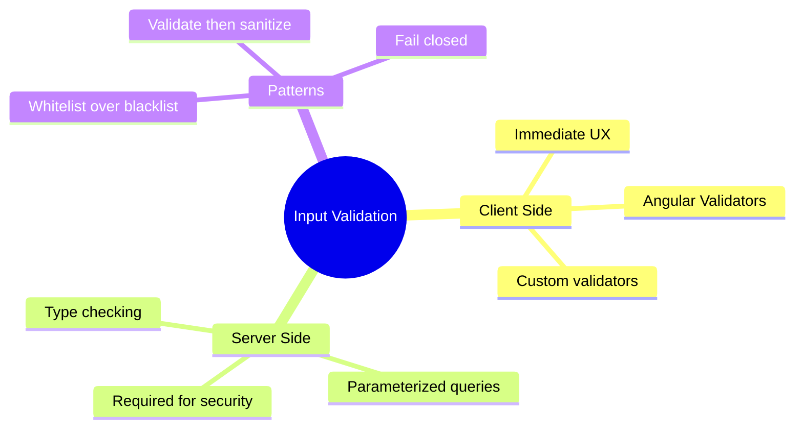

# ✅ Use Case 5: Input Validation

> **Goal**: Implement comprehensive input validation for security and UX.

---

## 1. 🔍 Why Validate?

### Defense in Depth

| Layer | Purpose |
|-------|---------|
| **Client-side** | UX, immediate feedback |
| **Server-side** | Security (never trust client) |
| **Database** | Data integrity constraints |

---

## 2. 🚀 Validation Patterns

### Angular Validators

```typescript
this.form = this.fb.group({
    email: ['', [Validators.required, Validators.email]],
    password: ['', [
        Validators.required,
        Validators.minLength(8),
        Validators.pattern(/^(?=.*[A-Z])(?=.*[0-9])/)
    ]],
    username: ['', [Validators.required], [this.usernameValidator]]
});
```

### Custom Validators

```typescript
// Sync validator
function noSpecialChars(control: AbstractControl): ValidationErrors | null {
    const forbidden = /[<>\"'&]/.test(control.value);
    return forbidden ? { specialChars: true } : null;
}

// Async validator (check server)
function uniqueUsername(userService: UserService) {
    return (control: AbstractControl): Observable<ValidationErrors | null> => {
        return userService.checkUsername(control.value).pipe(
            map(exists => exists ? { usernameTaken: true } : null)
        );
    };
}
```

---

## 3. ❓ Interview Questions

### Basic Questions

#### Q1: Why is client-side validation not enough?
**Answer:** Client-side validation can be bypassed. Attackers can:
- Disable JavaScript
- Modify requests with browser dev tools
- Send requests directly (curl, Postman)

Server-side validation is REQUIRED for security.

#### Q2: What's the difference between sanitization and validation?
**Answer:**
| Concept | Action | Example |
|---------|--------|---------|
| Validation | Reject bad input | "Contains HTML" → Error |
| Sanitization | Clean bad input | "<script>" → "&lt;script&gt;" |

---

### Scenario-Based Questions

#### Scenario 1: SQL Injection Prevention
**Question:** User inputs a search term. How do you prevent SQL injection?

**Answer:**
1. **Client**: Validate format, reject suspicious patterns
2. **Server**: Use parameterized queries (NEVER string concatenation)
```typescript
// ❌ NEVER
query = `SELECT * FROM users WHERE name = '${input}'`

// ✅ ALWAYS
query = `SELECT * FROM users WHERE name = ?`
db.query(query, [input])
```

#### Scenario 2: File Upload Validation
**Question:** Users can upload profile pictures. What validations are needed?

**Answer:**
```typescript
// Client-side
const allowedTypes = ['image/jpeg', 'image/png', 'image/gif'];
const maxSize = 5 * 1024 * 1024; // 5MB

if (!allowedTypes.includes(file.type)) {
    this.error = 'Invalid file type';
    return;
}

if (file.size > maxSize) {
    this.error = 'File too large';
    return;
}

// Server-side (CRITICAL)
// - Verify MIME type by reading file header (not extension)
// - Scan for malware
// - Store outside web root
// - Generate new filename (don't use user's filename)
```

---

## 🧠 Mind Map


