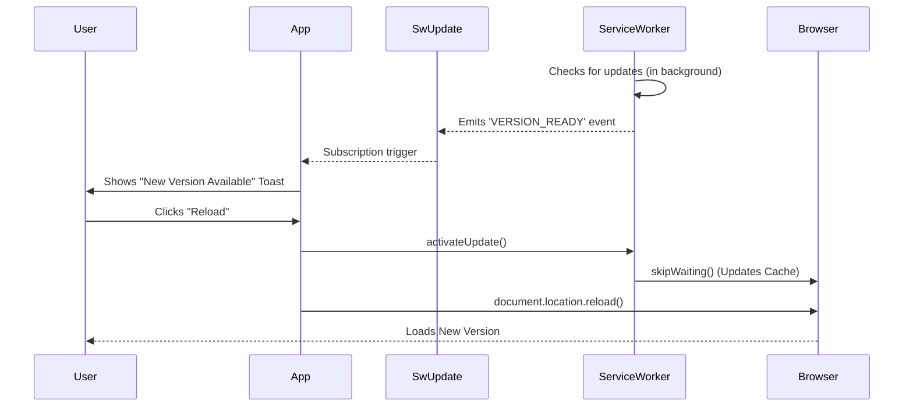

# 🔄 Angular SwUpdate Service

This guide explains how to notify users when a new version of your PWA is active.

## 🎯 What Problem Does It Solve?

### The Problem
When you deploy a new version of your Progressive Web App (PWA), users who already have your app open continue to use the **old cached version**. This creates several issues:

1. **Stale Features**: Users miss out on new features and improvements
2. **Bug Persistence**: Critical bug fixes don't reach active users
3. **Inconsistent Experience**: Different users see different versions of your app
4. **Broken Functionality**: API changes might break the old cached version
5. **Security Vulnerabilities**: Security patches don't apply until manual refresh

**Traditional Web**: Simple refresh loads new version  
**Service Worker Apps**: Old version stays active until ALL tabs are closed (could be days/weeks!)

### How SwUpdate Solves It

The `SwUpdate` service provides a **programmatic way** to:

1. **Detect**: Know when a new version is available and ready
2. **Notify**: Inform users with a custom UI (toast, banner, modal)
3. **Control**: Give users choice when to update (not forced)
4. **Activate**: Smoothly transition to the new version when they're ready

### Benefits

✅ **User-Friendly**: No jarring auto-reloads, users control when to update  
✅ **Immediate Updates**: Critical fixes can be applied without waiting for tab closure  
✅ **Better UX**: Custom notification UI matches your app design  
✅ **Data Safety**: Users can save their work before reloading  
✅ **Transparency**: Users understand what's happening with clear messaging

## 🔍 How It Works (The Concept)

Service Workers cache your application files. When you deploy a new version:
1.  Browser downloads the new SW in the background.
2.  New SW sees updated hash codes for assets.
3.  New SW enters "Waiting" state (to avoid breaking the running app).
4.  **Problem**: User is still looking at the OLD version until they close all tabs.
5.  **Solution**: `SwUpdate` allows us to detect this state and force a reload.

### Mermaid Diagram: Update Flow



## 🚀 Step-by-Step Implementation Guide

### 1. Inject SwUpdate
Check if the service worker is enabled (`updates.isEnabled`) to avoid errors in dev mode.

```typescript
import { SwUpdate, VersionReadyEvent } from '@angular/service-worker';

constructor(private updates: SwUpdate) {
  if (this.updates.isEnabled) {
    this.initUpdateListener();
  }
}
```

### 2. Listen for Updates
Filter the `versionUpdates` stream for the `VERSION_READY` event.

```typescript
import { filter } from 'rxjs';

initUpdateListener() {
  this.updates.versionUpdates
    .pipe(filter((evt): evt is VersionReadyEvent => evt.type === 'VERSION_READY'))
    .subscribe(evt => {
      // Show your custom toast/snackbar here
      this.showPrompt = true;
    });
}
```

### 3. Activate and Reload
When the user clicks "Reload", tell the Service Worker to perform the swap and then reload the page.

```typescript
reloadApp() {
  this.updates.activateUpdate().then(() => {
    document.location.reload();
  });
}
```

## 📚 Detailed API & Class Explanations

### 1. SwUpdate Service

**Type**: Injectable Service  
**Module**: `@angular/service-worker`

The `SwUpdate` service is Angular's interface to the Service Worker update mechanism.

#### Key Properties:

**`isEnabled: boolean`**
- **Purpose**: Indicates if Service Worker is available and enabled
- **Why Check It**: Service Workers are disabled in development mode (`ng serve`) and unsupported browsers
- **Usage**: Always wrap update logic in `if (this.updates.isEnabled) { ... }`

**`versionUpdates: Observable<VersionEvent>`**
- **Type**: Observable stream of version-related events
- **Events Emitted**:
  - `VERSION_DETECTED`: New version found (downloading in background)
  - `VERSION_READY`: New version fully downloaded and ready to activate
  - `VERSION_INSTALLATION_FAILED`: Download/installation failed
  - `NO_NEW_VERSION_DETECTED`: Check completed, no update available
- **Usage**: Subscribe and filter for specific event types

#### Key Methods:

**`activateUpdate(): Promise<boolean>`**
- **Purpose**: Tells the waiting Service Worker to take control immediately
- **Returns**: Promise that resolves to `true` if update activated, `false` if none available
- **Side Effect**: Makes the new SW active, but doesn't reload the page
- **Critical**: Must call `document.location.reload()` after to load new assets

**`checkForUpdate(): Promise<boolean>`**
- **Purpose**: Manually trigger update check (beyond automatic checks)
- **Returns**: Promise that resolves to `true` if update found
- **Use Case**: Long-running apps (kiosks) that need periodic checks

---

### 2. VersionReadyEvent Interface

```typescript
interface VersionReadyEvent {
  type: 'VERSION_READY';
  currentVersion: {
    hash: string;      // Hash of currently active version
    appData?: any;     // Optional metadata from ngsw-config.json
  };
  latestVersion: {
    hash: string;      // Hash of newly downloaded version
    appData?: any;     // Optional metadata from ngsw-config.json
  };
}
```

**Why It Matters**:
- `hash`: Unique identifier for each build (auto-generated by Angular CLI)
- `appData`: Custom metadata you can add to track version numbers, release notes, etc.
- Used for logging, analytics, or displaying "What's New" dialogs

---

### 3. Type Guard Pattern

```typescript
.pipe(filter((evt): evt is VersionReadyEvent => evt.type === 'VERSION_READY'))
```

**What Is This Syntax?**

This is a **TypeScript Type Guard with Type Predicate**.

- `(evt): evt is VersionReadyEvent` - Type predicate return type
- `=> evt.type === 'VERSION_READY'` - Runtime check

**Why Use It?**

Without type guard:
```typescript
.subscribe(evt => {
  console.log(evt.currentVersion.hash); // ❌ Error: Property doesn't exist on VersionEvent
})
```

With type guard:
```typescript
.subscribe(evt => {
  console.log(evt.currentVersion.hash); // ✅ TypeScript knows it's VersionReadyEvent
})
```

**How It Works**:
1. RxJS `filter` operator uses the function to filter events
2. TypeScript recognizes the `evt is VersionReadyEvent` return type
3. After the filter, TypeScript narrows the type from `VersionEvent` to `VersionReadyEvent`

---

### 4. document.location.reload()

**Type**: Browser DOM API  
**Purpose**: Hard refresh the page, clearing JavaScript state

**Why Not `window.location.reload()`?**
- `document.location` is more explicit (works in web workers)
- `window.location` is more common but essentially equivalent
- Both perform a full page reload

**What Happens**:
1. Browser discards all JavaScript state (variables, React/Angular components)
2. Browser requests `index.html` from the server/cache
3. Service Worker intercepts and serves **new version** from updated cache
4. New JS/CSS bundles are loaded and executed

## 🐛 Common Pitfalls & Debugging

### 1. "It doesn't work in `ng serve`!"
Angular Service Workers are **disabled** by default in dev mode. You **must** run a production build to test this.
1.  `ng build`
2.  `http-server -p 8080 -c-1 dist/your-app`

### 2. Update Loop
Don't call `activateUpdate()` automatically without user consent. It might reload the page while the user is filling out a form, causing data loss!

## ⚡ Performance & Architecture

*   **Check Strategy**: By default, SW checks for updates on page load. You can also poll manually using `checkForUpdate()` (e.g., every hour) for long-running apps like Kiosks.
*   **Safety**: The Service Worker ensures that the user *never* gets a broken mix of old HTML and new JS. It's all-or-nothing.

## 🌍 Real World Use Cases

### 1. News & Social Media Apps
**Scenario**: Breaking news or new content available  
**Implementation**:
```typescript
updates.versionUpdates.subscribe(evt => {
  this.toastService.show({
    message: '📰 New stories available - Click to refresh',
    action: 'Reload',
    onAction: () => this.reloadApp()
  });
});
```
**Why**: Users expect fresh content and instant access to breaking news

### 2. Trading & Financial Platforms
**Scenario**: Critical bug fixes or security patches  
**Implementation**:
```typescript
updates.versionUpdates.subscribe(evt => {
  // Check if update is critical (via appData in ngsw-config.json)
  if (evt.latestVersion.appData?.critical) {
    this.modalService.showForceUpdate({
      title: 'Critical Security Update',
      message: 'Please reload to apply important security fixes',
      countdown: 30 // Auto-reload in 30 seconds
    });
  }
});
```
**Why**: Security vulnerabilities must be patched immediately, can't wait for user to close tabs

### 3. SaaS Dashboards & Business Apps
**Scenario**: New feature rollouts with release notes  
**Implementation**:
```typescript
updates.versionUpdates.subscribe(evt => {
  const releaseNotes = evt.latestVersion.appData?.releaseNotes;
  this.notificationService.show({
    title: 'New Features Available! 🎉',
    message: releaseNotes || 'Update includes improvements and fixes',
    actions: ['View Changes', 'Update Now', 'Later']
  });
});
```
**Why**: Users want to know what's new and choose when to update

### 4. E-Commerce Platforms
**Scenario**: Cart API changes or payment flow updates  
**Implementation**:
```typescript
// If major version change detected
if (this.isMajorUpdate(evt)) {
  // Wait for user to complete checkout first
  this.checkoutService.onComplete$.pipe(take(1)).subscribe(() => {
    this.showUpdatePrompt();
  });
} else {
  this.showUpdatePrompt();
}
```
**Why**: Don't disrupt active checkout flows with updates

### 5. Kiosk & Long-Running Apps
**Scenario**: Stores, museums, public terminals that run 24/7  
**Implementation**:
```typescript
constructor(updates: SwUpdate) {
  if (updates.isEnabled) {
    // Check for updates every hour
    interval(3600000).subscribe(() => {
      updates.checkForUpdate();
    });
    
    // Auto-update during off-hours (e.g., 2 AM - 5 AM)
    updates.versionUpdates.subscribe(evt => {
      const hour = new Date().getHours();
      if (hour >= 2 && hour <= 5) {
        this.updates.activateUpdate().then(() => {
          document.location.reload();
        });
      } else {
        this.scheduleUpdateForOffHours();
      }
    });
  }
}
```
**Why**: Apps never close naturally, need scheduled maintenance windows

### 6. Progressive Web Apps (PWAs) on Mobile
**Scenario**: Installed PWAs on user's home screen  
**Implementation**:
```typescript
// Detect if running as installed PWA
const isStandalone = window.matchMedia('(display-mode: standalone)').matches;

if (isStandalone) {
  updates.versionUpdates.subscribe(evt => {
    this.showNativeStylePrompt({
      icon: '/assets/icons/update.png',
      title: 'Update Available',
      message: 'Tap to get the latest version'
    });
  });
}
```
**Why**: Installed PWAs behave like native apps, users expect app-store-like update prompts

## ❓ Interview & Concept Questions

### Basic Concepts (1-5)

**Q1: What is the SwUpdate service in Angular?**  
**A**: SwUpdate is an Angular service that provides a programmatic interface to detect and manage Service Worker updates. It allows you to notify users when a new version of the PWA is available and control when to activate the new version. It's part of `@angular/service-worker` package.

**Q2: Why doesn't just refreshing the page load the new version in a PWA?**  
**A**: In a traditional web app, refreshing loads new files from the server. In a PWA with Service Worker:
- Old Service Worker continues serving cached files
- New SW downloads in background but enters "waiting" state
- Old SW stays active until ALL tabs/windows are closed
- This could take days/weeks if users keep tabs open
- SwUpdate gives programmatic control to activate the new version without waiting

**Q3: What does `updates.isEnabled` check for?**  
**A**: It checks if:
- Service Workers are supported by the browser
- Service Worker is enabled in the Angular app (not disabled)
- App is running in production mode (SWs are disabled in `ng serve` dev mode)

Always wrap update logic in `if (updates.isEnabled)` to prevent errors in unsupported environments.

**Q4: What is the VERSION_READY event?**  
**A**: VERSION_READY is an event emitted by `SwUpdate.versionUpdates` when:
- A new version has been fully downloaded by the Service Worker
- The new SW is in "waiting" state, ready to activate
- Contains `currentVersion` and `latestVersion` metadata including hash and optional appData

It's the signal to show your "Update Available" prompt to users.

**Q5: What happens when you call `activateUpdate()`?**  
**A**: 
1. Tells the waiting Service Worker to call `skipWaiting()`
2. New SW takes control immediately (becomes active)
3. Cache is switched to new version
4. **Does NOT reload the page** - you must call `document.location.reload()` manually
5. Returns a Promise<boolean> (true if update activated, false if none available)

### Intermediate Implementation (6-12)

**Q6: How do you filter for VERSION_READY events specifically?**  
**A**: Use RxJS `filter` operator with a TypeScript type guard:
```typescript
updates.versionUpdates
  .pipe(filter((evt): evt is VersionReadyEvent => evt.type === 'VERSION_READY'))
  .subscribe(evt => {
    // TypeScript now knows evt is VersionReadyEvent
    console.log(evt.currentVersion.hash);
  });
```
The type guard `evt is VersionReadyEvent` narrows the type from generic `VersionEvent`.

**Q7: Why do we need `document.location.reload()` after `activateUpdate()`?**  
**A**: Because:
- `activateUpdate()` only switches which SW is active (changes cache control)
- The old JavaScript/CSS is still loaded in memory and executing
- Need a hard refresh to discard old JS and fetch new bundles from updated cache
- Without reload, users see new SW but old code running (inconsistent state)

**Q8: What are all the event types in `versionUpdates` observable?**  
**A**:
- `VERSION_DETECTED`: New version found, downloading in background
- `VERSION_READY`: New version downloaded and ready to activate
- `VERSION_INSTALLATION_FAILED`: Download or installation failed
- `NO_NEW_VERSION_DETECTED`: Check completed, no update found

Filter for the specific event you need.

**Q9: How would you implement an opt-in vs. forced update?**  
**A**:
```typescript
// Opt-in (user choice)
showUpdatePrompt() {
  this.snackBar.open('Update available', 'Reload').onAction()
    .subscribe(() => this.reloadApp());
}

// Forced update (critical security)
updates.versionUpdates.subscribe(evt => {
  if (evt.latestVersion.appData?.critical) {
    // Show countdown modal, auto-reload after 30s
    this.showCountdownModal(30).finally(() => this.reloadApp());
  }
});
```

**Q10: How do you add custom metadata (like version number) to version events?**  
**A**: In `ngsw-config.json`, add `appData`:
```json
{
  "appData": {
    "version": "2.0.1",
    "releaseNotes": "Bug fixes and performance improvements",
    "critical": false
  }
}
```
Access via `evt.latestVersion.appData.version`.

**Q11: How can a long-running app (kiosk) check for updates periodically?**  
**A**: Use RxJS `interval` with `checkForUpdate()`:
```typescript
import { interval } from 'rxjs';

constructor(updates: SwUpdate) {
  if (updates.isEnabled) {
    // Check every hour (3600000ms)
    interval(3600000).subscribe(() => {
      updates.checkForUpdate();
    });
  }
}
```

**Q12: What's the difference between `checkForUpdate()` and automatic checks?**  
**A**:
- **Automatic checks**: SW checks on navigation/page load (default behavior)
- **`checkForUpdate()`**: Manual/programmatic trigger
- Use manual for: long-running apps, periodic checks, button-triggered checks
- Returns Promise<boolean> indicating if update was found

### Advanced Scenarios & Architecture (13-18)

**Q13: Why should you NOT auto-reload without user consent?**  
**A**: 
- **Data Loss**: User might be filling out a form
- **Bad UX**: Jarring interruption during active work
- **Trust**: Users lose confidence if app reloads unexpectedly
- **Best Practice**: Always give users control (except critical security updates with warnings)

**Q14: How would you implement "Update on Checkout Complete"?**  
**A**:
```typescript
private updatePending = false;

updates.versionUpdates.subscribe(() => {
  if (this.isCheckoutActive()) {
    this.updatePending = true; // Wait
  } else {
    this.showUpdatePrompt();
  }
});

checkoutService.onComplete$.subscribe(() => {
  if (this.updatePending) {
    this.showUpdatePrompt();
    this.updatePending = false;
  }
});
```

**Q15: Explain the type guard syntax `(evt): evt is VersionReadyEvent =>`**  
**A**:
- `(evt)`: Parameter
- `: evt is VersionReadyEvent`: **Type predicate** return type
- `=> evt.type === 'VERSION_READY'`: Runtime boolean check
- **How it works**: TypeScript sees the predicate and narrows the type after the filter
- **Benefit**: Get IntelliSense for VersionReadyEvent-specific properties (currentVersion, latestVersion)

**Q16: How do Service Worker updates work with A/B testing or canary deployments?**  
**A**: 
- **Challenge**: Different users might get different SW versions simultaneously
- **Solution**: Use `appData` to track deployment channel
```json
"appData": { "channel": "canary", "version": "2.1.0-beta" }
```
- Backend can track which SW version made API requests (via custom headers)
- Monitor error rates per SW version
- Roll back by deploying old SW hash if needed

**Q17: What happens if `activateUpdate()` is called but no update is available?**  
**A**: 
- Returns a Promise that resolves to `false`
- No error is thrown
- Page reload still happens if you call `document.location.reload()` unconditionally
- **Best practice**: Check the return value or only call after VERSION_READY event

**Q18: How would you show a "What's New" dialog with version details?**  
**A**:
```typescript
updates.versionUpdates
  .pipe(filter((evt): evt is VersionReadyEvent => evt.type === 'VERSION_READY'))
  .subscribe(evt => {
    const releaseNotes = evt.latestVersion.appData?.releaseNotes || [];
    this.dialog.open(WhatsNewComponent, {
      data: {
        version: evt.latestVersion.appData?.version,
        features: releaseNotes,
        onUpdate: () => this.reloadApp()
      }
    });
  });
```

### Debugging & Testing (19-25)

**Q19: How do you test SwUpdate in development mode?**  
**A**: You can't fully test in `ng serve` because SW is disabled. Instead:
1. `ng build` (production build)
2. `npx http-server -p 8080 -c-1 dist/your-app` (serve with no cache)
3. Make changes to your code
4. `ng build` again (creates new version with different hash)
5. Refresh the served app - SW detects new version
6. Check DevTools > Application > Service Workers

**Q20: Why isn't my VERSION_READY event firing?**  
**A**: Common causes:
- Not in production build (SWs disabled in dev)
- No actual changes detected (same hash)
- SW not registered properly in `app.config.ts`
- Browser doesn't support Service Workers
- Using private/incognito mode (some browsers limit SW)
- Check `updates.isEnabled` returns true

**Q21: How do you debug what version is currently active?**  
**A**:
```typescript
updates.versionUpdates.subscribe(evt => {
  if (evt.type === 'VERSION_READY') {
    console.log('Current:', evt.currentVersion.hash);
    console.log('Latest:', evt.latestVersion.hash);
  }
});

// Or check in DevTools:
// Application > Service Workers > see active SW script hash
```

**Q22: What is the "skipWaiting" phase in Service Worker lifecycle?**  
**A**:
1. **Installing**: New SW downloads and installs
2. **Waiting**: New SW waits for old SW to be released (all tabs closed)
3. **`skipWaiting()`**: Called by `activateUpdate()`, forces immediate activation
4. **Activating**: New SW takes control
5. **Activated**: New SW now serves all requests

Without `skipWaiting()`, users must close ALL tabs for the update.

**Q23: How do you handle update failures?**  
**A**:
```typescript
updates.versionUpdates
  .pipe(filter(evt => evt.type === 'VERSION_INSTALLATION_FAILED'))
  .subscribe(evt => {
    console.error('Update failed:', evt);
    this.errorService.log('SW Update Failed', evt);
    // Show user-friendly message
    this.snackBar.open('Update failed. Please try again later.', 'OK');
  });
```

**Q24: Can you roll back to a previous version using SwUpdate?**  
**A**: No, SwUpdate doesn't support rollback. To rollback:
1. Deploy the old version again (re-deploy old build to server)
2. SW will detect it as a "new" version (different hash)
3. Users will get the rollback as an update
4. **Prevention**: Use canary deployments and gradual rollouts

**Q25: How does SwUpdate interact with browser caching (Cache-Control headers)?**  
**A**:
- **Service Worker cache**: Controlled by `ngsw-config.json`, managed by SW
- **Browser HTTP cache**: Traditional browser cache (Cache-Control headers)
- SW intercepts requests BEFORE browser cache
- Best practice: Serve `ngsw.json` and SW script with `Cache-Control: no-cache` (always check for updates)
- App files can be aggressively cached (SW handles versioning)

---

### 📦 Data Flow Summary (Visual Box Diagram)

```
┌─────────────────────────────────────────────────────────────┐
│  SERVICE WORKER UPDATES: SwUpdate                           │
│                                                             │
│   UPDATE FLOW:                                              │
│   ┌───────────────────────────────────────────────────────┐ │
│   │ 1. SW checks for updates (background)                 │ │
│   │ 2. New SW downloads, enters "Waiting" state           │ │
│   │ 3. SwUpdate emits VERSION_READY event                 │ │
│   │ 4. App shows "New Version Available" toast            │ │
│   │ 5. User clicks "Reload"                               │ │
│   │ 6. activateUpdate() + document.location.reload()      │ │
│   └───────────────────────────────────────────────────────┘ │
│                                                             │
│   IMPLEMENTATION:                                           │
│   ┌───────────────────────────────────────────────────────┐ │
│   │ if (this.updates.isEnabled) {                         │ │
│   │   this.updates.versionUpdates.pipe(                   │ │
│   │     filter((evt): evt is VersionReadyEvent =>         │ │
│   │       evt.type === 'VERSION_READY')                   │ │
│   │   ).subscribe(() => this.showPrompt = true);          │ │
│   │ }                                                     │ │
│   │                                                       │ │
│   │ reloadApp() {                                         │ │
│   │   this.updates.activateUpdate().then(() =>            │ │
│   │     document.location.reload());                      │ │
│   │ }                                                     │ │
│   └───────────────────────────────────────────────────────┘ │
│                                                             │
│   ⚠️ Must test with production build (ng build + http-server)│
└─────────────────────────────────────────────────────────────┘
```

> **Key Takeaway**: SwUpdate notifies you of new versions. Always get user consent before reloading! Doesn't work in dev mode.

