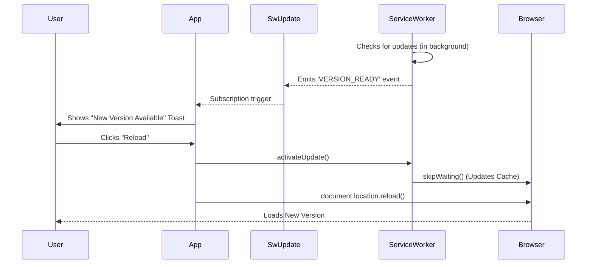

# 🔄 Angular SwUpdate Service

This guide explains how to notify users when a new version of your PWA is active.

## 🔍 How It Works (The Concept)

Service Workers cache your application files. When you deploy a new version:
1.  Browser downloads the new SW in the background.
2.  New SW sees updated hash codes for assets.
3.  New SW enters "Waiting" state (to avoid breaking the running app).
4.  **Problem**: User is still looking at the OLD version until they close all tabs.
5.  **Solution**: `SwUpdate` allows us to detect this state and force a reload.

### Mermaid Diagram: Update Flow



## 🚀 Step-by-Step Implementation Guide

### 1. Inject SwUpdate
Check if the service worker is enabled (`updates.isEnabled`) to avoid errors in dev mode.

```typescript
import { SwUpdate, VersionReadyEvent } from '@angular/service-worker';

constructor(private updates: SwUpdate) {
  if (this.updates.isEnabled) {
    this.initUpdateListener();
  }
}
```

### 2. Listen for Updates
Filter the `versionUpdates` stream for the `VERSION_READY` event.

```typescript
import { filter } from 'rxjs';

initUpdateListener() {
  this.updates.versionUpdates
    .pipe(filter((evt): evt is VersionReadyEvent => evt.type === 'VERSION_READY'))
    .subscribe(evt => {
      // Show your custom toast/snackbar here
      this.showPrompt = true;
    });
}
```

### 3. Activate and Reload
When the user clicks "Reload", tell the Service Worker to perform the swap and then reload the page.

```typescript
reloadApp() {
  this.updates.activateUpdate().then(() => {
    document.location.reload();
  });
}
```

## 🐛 Common Pitfalls & Debugging

### 1. "It doesn't work in `ng serve`!"
Angular Service Workers are **disabled** by default in dev mode. You **must** run a production build to test this.
1.  `ng build`
2.  `http-server -p 8080 -c-1 dist/your-app`

### 2. Update Loop
Don't call `activateUpdate()` automatically without user consent. It might reload the page while the user is filling out a form, causing data loss!

## ⚡ Performance & Architecture

*   **Check Strategy**: By default, SW checks for updates on page load. You can also poll manually using `checkForUpdate()` (e.g., every hour) for long-running apps like Kiosks.
*   **Safety**: The Service Worker ensures that the user *never* gets a broken mix of old HTML and new JS. It's all-or-nothing.

## 🌍 Real World Use Cases

1.  **News Apps**: "New stories available - Click to refresh."
2.  **Trading Platforms**: Critical bug fixes need to be pushed immediately.
3.  **Kiosks**: Auto-update when the store is closed (polling check).

## ❓ Interview & Concept Questions

1.  **Q: What is the `ngsw-config.json` file?**
    *   A: Configuration file that tells the Angular SW builder which files to cache and which strategies (performance vs freshness) to use.
2.  **Q: Why do we need `document.location.reload()`?**
    *   A: Because the JavaScript for the old version is already loaded in memory. We need a hard refresh to fetch the new CSS/JS bundles from the updated cache.
