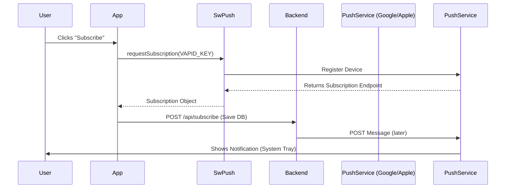

# 📲 Push Notifications

This guide explains how `SwPush` connects your Angular app to the Web Push ecosystem.

## 🔍 How It Works (The Concept)

Push notifications works even when the app is **closed**.
1.  **Subscribe**: App asks user for permission + gets a unique ID from the Browser Vendor (Google/Mozilla/Apple).
2.  **Save**: App sends this ID to your Backend.
3.  **Trigger**: Backend sends a message to the Browser Vendor.
4.  **Display**: Browser wakes up your Service Worker, which displays the notification.

### Mermaid Diagram: Push Flow



## 🚀 Step-by-Step Implementation Guide

### 1. Generate VAPID Keys
You need a key pair to identify your server to the push service.
```bash
npx web-push generate-vapid-keys
```

### 2. Request Subscription
Ask the user for permission.

```typescript
import { SwPush } from '@angular/service-worker';

subscribe() {
  this.swPush.requestSubscription({
    serverPublicKey: 'YOUR_PUBLIC_KEY_STRING'
  })
  .then(sub => this.api.sendToBackend(sub))
  .catch(err => console.error("Could not subscribe", err));
}
```

### 3. Handle Clicks
Listen for when a user clicks the notification.

```typescript
this.swPush.notificationClicks.subscribe(({ action, notification }) => {
    window.open(notification.data.url);
});
```

## 🐛 Common Pitfalls & Debugging

### 1. "It says Permission Denied"
*   Cause: User previously clicked "Block".
*   Fix: Reset permissions in chrome://settings/content/notifications.

### 2. "Invalid VAPID Key"
*   Cause: Public key format is wrong or doesn't match the Private key on the server. Mismatch is fatal.

## ⚡ Performance & Architecture

*   **VAPID**: "Voluntary Application Server Identification". It prevents hackers from sending spam to your users if they guess the endpoint URL.
*   **Payload Size**: Keep payloads small (4kb max). Send only ID/Title, fetch details when app opens.

## 🌍 Real World Use Cases

1.  **Social Media**: "Someone liked your post."
2.  **E-commerce**: "Your order has shipped!"
3.  **Calendar**: "Meeting in 15 minutes."
