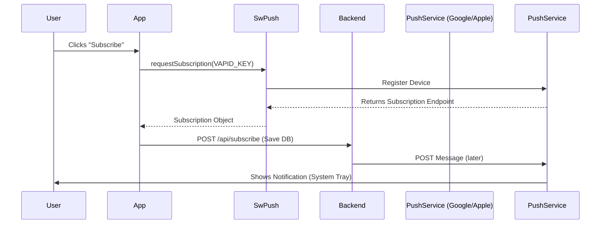

# 📲 Push Notifications

This guide explains how `SwPush` connects your Angular app to the Web Push ecosystem.

## 🎯 What Problem Does It Solve?

### The Problem
Traditional web apps can only engage users when they have the app open:

1. **No Re-engagement**: Can't notify users about new content when app is closed
2. **Lost Users**: Users forget about your app after closing it
3. **No Real-time Alerts**: Can't notify about urgent events (messages, orders, etc.)
4. **Email Dependency**: Must rely on slow, easily ignored emails
5. **Missed Opportunities**: Can't capitalize on time-sensitive offers or updates

**Native Apps**: Can push notifications anytime  
**Traditional Web**: Can only show alerts when app is open

### How SwPush & Web Push Solves It

Enables **notification delivery even when your PWA is closed**:

1. **Cross-Tab Notifications**: Works even if all browser tabs are closed
2. **System-Level**: Notifications appear in OS notification center
3. **Actionable**: Users can click to open specific pages
4. **Persistent**: Notifications remain until dismissed
5. **Secure**: VAPID keys prevent spam/unauthorized pushes

### Benefits

✅ **Re-engagement**: Bring users back to your app  
✅ **Real-time**: Instant delivery of urgent information  
✅ **Native-like UX**: PWAs feel like native mobile apps  
✅ **Cross-platform**: Works on desktop and mobile  
✅ **Permission-based**: Users control what they receive

## 🔍 How It Works (The Concept)

Push notifications works even when the app is **closed**.
1.  **Subscribe**: App asks user for permission + gets a unique ID from the Browser Vendor (Google/Mozilla/Apple).
2.  **Save**: App sends this ID to your Backend.
3.  **Trigger**: Backend sends a message to the Browser Vendor.
4.  **Display**: Browser wakes up your Service Worker, which displays the notification.

### Mermaid Diagram: Push Flow



## 🚀 Step-by-Step Implementation Guide

### 1. Generate VAPID Keys
You need a key pair to identify your server to the push service.
```bash
npx web-push generate-vapid-keys
```

### 2. Request Subscription
Ask the user for permission.

```typescript
import { SwPush } from '@angular/service-worker';

subscribe() {
  this.swPush.requestSubscription({
    serverPublicKey: 'YOUR_PUBLIC_KEY_STRING'
  })
  .then(sub => this.api.sendToBackend(sub))
  .catch(err => console.error("Could not subscribe", err));
}
```

### 3. Handle Clicks
Listen for when a user clicks the notification.

```typescript
this.swPush.notificationClicks.subscribe(({ action, notification }) => {
    window.open(notification.data.url);
});
```

## 📚 Detailed API & Class Explanations

### 1. SwPush Service

**Type**: Injectable Service  
**Module**: `@angular/service-worker`  
**Purpose**: Angular's interface to Web Push API

#### Key Properties:

**`isEnabled: boolean`**
- Checks if push notifications are supported and enabled
- False in: development mode, unsupported browsers, no HTTPS
- Always check before calling push methods

**`notificationClicks: Observable<{action: string, notification: NotificationOptions}>`**
- Emits when user clicks a notification
- Provides notification data and action button clicked
- Use to navigate or perform actions based on click

**`subscription: Observable<PushSubscription | null>`**
- Current subscription status
- Emits subscription object or null if not subscribed

#### Key Methods:

**`requestSubscription(options: {serverPublicKey: string}): Promise<PushSubscription>`**
- Requests permission from user
- Returns unique subscription endpoint
- **serverPublicKey**: Your VAPID public key (Base64 URL-encoded)

**`unsubscribe(): Promise<void>`**
- Unsubscribes from push notifications
- Revokes permission
- Must inform your backend to remove subscription

---

### 2. PushSubscription Object

**Structure**:
```typescript
interface PushSubscription {
  endpoint: string;          // Unique URL for this device
  expirationTime: number | null;
  keys: {
    p256dh: string;         // Encryption key
    auth: string;            // Authentication secret
  };
  toJSON(): PushSubscriptionJSON;
}
```

**What to Send to Backend**:
```typescript
const subscription = await swPush.requestSubscription({ ... });

// Send entire subscription object to your server
this.http.post('/api/subscribe', subscription.toJSON()).subscribe();
```

**Backend stores**: endpoint + keys to send notifications later

---

### 3. VAPID (Voluntary Application Server Identification)

**Purpose**: Proves your server is authorized to send pushes

** How It Works**:
1. Generate key pair: Public + Private
2. Frontend uses public key in `requestSubscription()`
3. Backend signs messages with private key
4. Push service verifies signature

**Generate Keys**:
```bash
npx web-push generate-vapid-keys

# Output:
# Public Key:  BEl62iUYgUivxIkv69yViEuiBIa-Ib9-SkvMeAtA3LFgDzkrxZJjSgSnfckjBJuBkr3qBUYIHBQFLXYp5Nksh8U
# Private Key: VCgGb-qRbQhQiW8qDOp_vWGKNvEhWVKZPLMXd3W4JB4
```

**Security**:
- **Public key**: Safe to embed in client code
- **Private key**: NEVER expose, keep server-side only
- Prevents spam (only you can send notifications)

---

### 4. Push Service Providers

**What Are They?**
Browser vendors run push servers:

- **Chrome/Edge**: Firebase Cloud Messaging (FCM)
- **Firefox**: Mozilla Push Service
- **Safari**: Apple Push Notification Service (APNS)

**Your backend doesn't send directly to browsers**:
```
Your Server → Push Service (FCM/Mozilla/APNS) → User's Browser
```

**Why?**
- Handles delivery even if browser is closed
- Manages encryption
- Server doesn't need user's IP address

---

### 5. Notification Payload Structure

**Frontend receives**:
```typescript
interface NotificationOptions {
  title: string;              // "New Message!"
  body?: string;              // "John sent you a message"
  icon?: string;              // Logo URL
  badge?: string;             // Small icon
  image?: string;             // Large image
  data?: any;                 // Custom data
  actions?: NotificationAction[];  // Action buttons
  requireInteraction?: boolean;    // Don't auto-dismiss
  tag?: string;               // Group similar notifications
  renotify?: boolean;
  silent?: boolean;
}
```

**Backend sends (example with web-push library)**:
```javascript
const payload = JSON.stringify({
  notification: {
    title: "New Order #1234",
    body: "Your order has been shipped!",
    icon: "/assets/icons/icon-192.png",
    data: { url: "/orders/1234" },
    actions: [
      { action: "view", title: "View Order" },
      { action: "dismiss", title: "Dismiss" }
    ]
  }
});

webpush.sendNotification(subscription, payload);
```

**Size Limit**: 4KB max payload

---

### 6. Service Worker's Role

**In ngsw-worker.js** (Angular's SW handles this automatically):

```javascript
// SW receives push event
self.addEventListener('push', (event) => {
  const data = event.data.json();
  
  event.waitUntil(
    self.registration.showNotification(data.title, data.options)
  );
});

// User clicks notification
self.addEventListener('notificationclick', (event) => {
  event.notification.close();
  
  // Open app to specific URL
  event.waitUntil(
    clients.openWindow(event.notification.data.url)
  );
});
```

**Angular's SwPush abstracts this for you**

## 🐛 Common Pitfalls & Debugging

### 1. "It says Permission Denied"
*   Cause: User previously clicked "Block".
*   Fix: Reset permissions in chrome://settings/content/notifications.

### 2. "Invalid VAPID Key"
*   Cause: Public key format is wrong or doesn't match the Private key on the server. Mismatch is fatal.

## ⚡ Performance & Architecture

*   **VAPID**: "Voluntary Application Server Identification". It prevents hackers from sending spam to your users if they guess the endpoint URL.
*   **Payload Size**: Keep payloads small (4kb max). Send only ID/Title, fetch details when app opens.

## 🌍 Real World Use Cases

### 1. Social Media Engagement
**Scenario**: Notify users of interactions  
**Implementation**:
```typescript
// Backend sends when someone likes/comments
const payload = {
  notification: {
    title: "Sarah liked your post",
    body: "'Amazing sunset photo!'",
    icon: "/assets/sarah-avatar.jpg",
    badge: "/assets/badge-like.png",
    data: { url: "/posts/12345", type: "like" },
    actions: [
      { action: "view", title: "View Post" },
      { action: "reply", title: "Reply" }
    ]
  }
};

// Frontend handles click
swPush.notificationClicks.subscribe(({ action, notification }) => {
  if (action === "view") {
    this.router.navigate([notification.data.url]);
  } else if (action === "reply") {
    this.openReplyDialog(notification.data);
  }
});
```
**Why**: Drive engagement, bring users back to app

### 2. E-Commerce Order Updates
**Scenario**: Shipping, delivery, and order status  
**Implementation**:
```typescript
// Different stages send different notifications
const orderStatuses = {
  shipped: {
    title: "Order #1234 Shipped! 📦",
    body: "Your order is on the way. Track it now.",
    data: { orderId: "1234", action: "track" },
    requireInteraction: false  // Auto-dismiss OK
  },
  delivered: {
    title: "Order #1234 Delivered! ✅",
    body: "Please confirm receipt and rate your experience.",
    data: { orderId: "1234", action: "review" },
    requireInteraction: true  // User must interact
  }
};
```
**Why**: Keep customers informed, increase satisfaction

### 3. Calendar & Meeting Reminders
**Scenario**: Time-sensitive event notifications  
**Implementation**:
```typescript
// Schedule push 15 min before meeting
const payload = {
  notification: {
    title: "Meeting in 15 minutes",
    body: "Q4 Planning Session with John, Sarah",
    icon: "/assets/calendar-icon.png",
    tag: "meeting-reminder-456",  // Prevent duplicates
    requireInteraction: true,
    data: {
      meetingId: "456",
      joinUrl: "/meetings/456/join"
    },
    actions: [
      { action: "join", title: "Join Now" },
      { action: "snooze", title: "Remind in 5 min" }
    ]
  }
};
```
**Why**: Ensure users don't miss important meetings

### 4. News & Breaking Alerts
**Scenario**: Urgent news delivery  
**Implementation**:
```typescript
// Only send for breaking news
if (article.priority === "breaking") {
  const payload = {
    notification: {
      title: "🚨 BREAKING NEWS",
      body: article.headline,
      image: article.imageUrl,
      tag: "breaking-news",      // Replace previous breaking news
      renotify: true,             // Alert again if tag exists
      vibrate: [200, 100, 200],   // Vibration pattern
      data: { url: `/news/${article.id}` }
    }
  };
}
```
**Why**: Immediate delivery of time-critical information

### 5. Messaging Apps
**Scenario**: New message notifications  
**Implementation**:
```typescript
// Group by conversation
const payload = {
  notification: {
    title: "John Doe",
    body: "Hey, are you free for lunch?",
    icon: "/assets/users/john-avatar.jpg",
    badge: "/assets/message-badge.png",
    tag: `chat-${conversationId}`,  // Group messages
    renotify: false,                 // Don't alert for same convo
    data: {
      conversationId: "789",
      messageCount: 3                // Show badge count
    },
    actions: [
      { action: "reply", title: "Reply" },
      { action: "mark-read", title: "Mark as Read" }
    ]
  }
};
```
**Why**: Real-time communication, like native messaging apps

### 6. Background Sync Completion
**Scenario**: Notify when offline actions complete  
**Implementation**:
```typescript
// Service worker completes background sync
self.addEventListener('sync', (event) => {
  if (event.tag === 'upload-photos') {
    event.waitUntil(
      uploadPhotos().then(() => {
        // Notify user of completion
        self.registration.showNotification('Upload Complete!', {
          body: '12 photos uploaded successfully.',
          icon: '/assets/upload-success.png',
          data: { url: '/photos' }
        });
      })
    );
  }
});
```
**Why**: Keep users informed of background operations

## ❓ Interview & Concept Questions

### Basic Concepts (1-5)

**Q1: What is SwPush and how does it differ from regular browser notifications?**  
**A**: `SwPush` is Angular's service for Web Push API. Differences:
- **Regular notifications**: Only work when app is open, use `Notification` API
- **SwPush/Web Push**: Work even when app is closed, use Service Worker
- SwPush manages subscriptions, handles push events from server
- Requires backend infrastructure to send notifications

**Q2: What is VAPID and why is it required?**  
**A**: VAPID = Voluntary Application Server Identification
- **Purpose**: Proves your server is authorized to send push notifications
- **How**: Uses public/private key cryptography
- **Why required**: Prevents spam and unauthorized notifications
- **Security**: Private key stays on server, public key embeds in client
- **Generate**: `npx web-push generate-vapid-keys`

**Q3: What information does a PushSubscription contain?**  
**A**:
```typescript
{
  endpoint: "https://fcm.googleapis.com/fcm/send/...",  // Unique URL
  keys: {
    p256dh: "BNcR...",  // Public encryption key
    auth: "tBHIt..."     // Authentication secret
  },
  expirationTime: null
}
```
- **endpoint**: Where to send push messages
- **keys**: For encrypting payload
- **Send entire object to backend** to save for later

**Q4: What's the maximum payload size for push notifications?**  
**A**: **4KB maximum**
- **Why**: Designed for small, actionable messages
- **Best practice**: Send only ID/title, fetch details when app opens
- **Example**: Don't send entire email, just "New email from John" + emailId

**Q5: Do push notifications work on all browsers?**  
**A**:
- ✅ **Chrome/Edge**: Full support (desktop + Android)
- ✅ **Firefox**: Full support (desktop + Android)
- ✅ **Safari**: Supports on macOS 13+ and iOS 16.4+
- ❌ **Safari (older)**: Limited/no support
- ❌ **iOS Chrome**: Uses Safari engine, same limitations
- **Check**: `swPush.isEnabled`

### Intermediate Implementation (6-12)

**Q6: How do you unsubscribe from push notifications?**  
**A**:
```typescript
// Frontend
this.swPush.unsubscribe().then(() => {
  console.log('Unsubscribed');
  // Notify backend to remove subscription
  this.http.delete('/api/subscribe').subscribe();
});

// Backend: Remove from database
db.subscriptions.delete({ userId: currentUser.id });
```
**Critical**: Must remove from backend DB to stop sending

**Q7: How do notification actions work?**  
**A**:
```typescript
// Backend includes actions
actions: [
  { action: "like", title: "Like", icon: "/icons/like.png" },
  { action: "reply", title: "Reply" }
]

// Frontend handles clicks
swPush.notificationClicks.subscribe(({ action, notification }) => {
  switch(action) {
    case "like":
      this.likePost(notification.data.postId);
      break;
    case "reply":
      this.openReplyDialog(notification.data);
      break;
    default:
      // Click on notification body (no action button)
      window.open(notification.data.url);
  }
});
```

**Q8: What is the 'tag' property and when should you use it?**  
**A**: Groups/replaces notifications with same tag:
```typescript
tag: "chat-conversation-123"  // Same tag = replaces previous
```
**Use cases**:
- **Messaging**: Replace "3 new messages" with "5 new messages"
- **News**: Replace old breaking news with latest
- **Progress**: Update "Uploading 50%" → "Uploading 100%"
**Without tag**: Each notification stacks separately

**Q9: How do you request permission for notifications?**  
**A**: `swPush.requestSubscription()` automatically requests permission:
```typescript
try {
  const sub = await this.swPush.requestSubscription({
    serverPublicKey: VAPID_PUBLIC_KEY
  });
  // Permission granted, subscription created
} catch (error) {
  // Permission denied or error
  console.error('Notification permission denied');
}
```
**Browser shows**: "Allow [yoursite.com] to send notifications?"

**Q10: Can you send notifications without a backend?**  
**A**: **No**, Web Push requires:
1. **Backend server**: To send push messages to Push Service
2. **Push Service** (FCM/Mozilla/APNS): Intermediary
3. **Service Worker**: Receives and displays notification

**Why**: Security and delivery guarantees
**Workaround**: Use services like Firebase Cloud Messaging (managed backend)

**Q11: What's the difference between requireInteraction and persistent?**  
**A**:
```typescript
requireInteraction: true   // Don't auto-dismiss, user MUST interact
requireInteraction: false  // Auto-dismiss after ~5 seconds
```
**Use `true` for**: Critical alerts, actions needed
**Use `false` for**: FYI notifications, non-urgent
**Note**: "persistent" is not a standard property

**Q12: How do you check current notification permission status?**  
**A**:
```typescript
const permission = Notification.permission;
// "granted", "denied", or "default" (not asked yet)

if (permission === "granted") {
  // Can subscribe
} else if (permission === "denied") {
  // User rejected, can't ask again (must reset in browser settings)
} else {
  // Can request permission
}
```

### Advanced Scenarios (13-20)

**Q13: How would you implement notification batching for multiple messages?**  
**A**:
```typescript
// Backend strategy: Group notifications
const messages = await getUnreadMessages(userId);
if (messages.length > 1) {
  // Batch notification
  await sendNotification({
    title: `${messages.length} new messages`,
    body: `From ${messages[0].sender} and others`,
    tag: "messages-batch",
    data: { type: "batch", messageIds: messages.map(m => m.id) }
  });
} else {
  // Individual notification
  await sendNotification({
    title: messages[0].sender,
    body: messages[0].preview,
    tag: `message-${messages[0].id}`
  });
}
```

**Q14: How do you handle notification click when app is already open?**  
**A**: Use `notificationClicks` observable:
```typescript
swPush.notificationClicks.subscribe(({ notification }) => {
  // Check if app is focused
  if (document.hasFocus()) {
    // Navigate within current tab
    this.router.navigate([notification.data.url]);
  } else {
    // Open in new tab or focus existing
    window.focus();
    this.router.navigate([notification.data.url]);
  }
});
```

**Q15: How do you implement notification badges (unread count)?**  
**A**: Use the `badge` property:
```typescript
// Backend tracks unread count
const unreadCount = await getUnreadCount(userId);

await sendNotification({
  title: "New message",
  body: messageText,
  badge: `/assets/badge-${Math.min(unreadCount, 99)}.png`,  // Badge icons
  data: { unreadCount }
});

// Or use Navigator Badge API (experimental)
navigator.setAppBadge(unreadCount);  // Shows number on app icon
```

**Q16: What happens if user has multiple devices subscribed?**  
**A**: Each device gets a separate subscription:
```typescript
// Backend DB structure
subscriptions: [
  { userId: "123", deviceId: "phone", endpoint: "...", keys: {...} },
  { userId: "123", deviceId: "laptop", endpoint: "...", keys: {...} }
]

// Send to all devices
const userSubs = await db.subscriptions.find({ userId });
userSubs.forEach(sub => sendNotification(sub, payload));

// Or send to most recent device only
const latestSub = await db.subscriptions.findOne({ userId }, { sort: { createdAt: -1 } });
sendNotification(latestSub, payload);
```

**Q17: How do you implement notification preferences/categories?**  
**A**:
```typescript
// Backend stores preferences
interface NotificationPrefs {
  userId: string;
  categories: {
    messages: boolean;
    likes: boolean;
    comments: boolean;
    news: boolean;
  };
}

// Check before sending
const prefs = await getPreferences(userId);
if (prefs.categories.messages && notification.type === "message") {
  await sendNotification(subscription, payload);
} else {
  console.log('User disabled this notification type');
}
```

**Q18: Can you send silent notifications (no alert)?**  
**A**: Yes, with `silent: true`:
```typescript
silent: true  // No sound/vibration, but still displayed
```
**Use cases**:
- Update data in background
- Increment badge  count
- Non-urgent updates
**Note**: User still sees notification in tray

**Q19: How do you handle subscription expiration?**  
**A**:
```typescript
// Check expiration
swPush.subscription.subscribe(sub => {
  if (sub && sub.expirationTime) {
    const expiry = new Date(sub.expirationTime);
    const now = new Date();
    
    if (expiry <= now) {
      // Re-subscribe
      this.resubscribe();
    }
  }
});

// Handle push service errors (subscription expired)
// Backend gets 410 Gone response when sending to expired subscription
if (response.statusCode === 410) {
  await db.subscriptions.delete({ endpoint });
}
```

**Q20: What are common security considerations?**  
**A**:
1. **VAPID keys**: Never expose private key client-side
2. **HTTPS only**: Push only works on secure origins
3. **Validate payloads**: Backend should validate/sanitize notification content
4. **Rate limiting**: Prevent spam from your own backend
5. **User consent**: Always explain what notifications will contain
6. **Unsubscribe option**: Make it easy to opt-out
7. **Endpoint security**: Treat subscription endpoints as sensitive data

---

### 📦 Data Flow Summary (Visual Box Diagram)

```
┌─────────────────────────────────────────────────────────────┐
│  PUSH NOTIFICATIONS                                         │
│                                                             │
│   FLOW:                                                     │
│   ┌───────────────────────────────────────────────────────┐ │
│   │ 1. App: swPush.requestSubscription(VAPID_KEY)         │ │
│   │ 2. Browser: Asks user permission                      │ │
│   │ 3. Push Service (Google/Apple): Returns subscription  │ │
│   │ 4. App: POST subscription to your Backend             │ │
│   │ 5. Later: Backend → Push Service → Browser → User     │ │
│   └───────────────────────────────────────────────────────┘ │
│                                                             │
│   IMPLEMENTATION:                                           │
│   ┌───────────────────────────────────────────────────────┐ │
│   │ // Subscribe                                          │ │
│   │ swPush.requestSubscription({ serverPublicKey: VAPID })│ │
│   │   .then(sub => api.save(sub))                         │ │
│   │                                                       │ │
│   │ // Handle clicks                                      │ │
│   │ swPush.notificationClicks.subscribe(({ notification })│ │
│   │   => window.open(notification.data.url));             │ │
│   └───────────────────────────────────────────────────────┘ │
│                                                             │
│   VAPID: Generate with `npx web-push generate-vapid-keys`  │
└─────────────────────────────────────────────────────────────┘
```

> **Key Takeaway**: Push notifications work even when app is closed! Use VAPID keys for security. Keep payload < 4kb!

