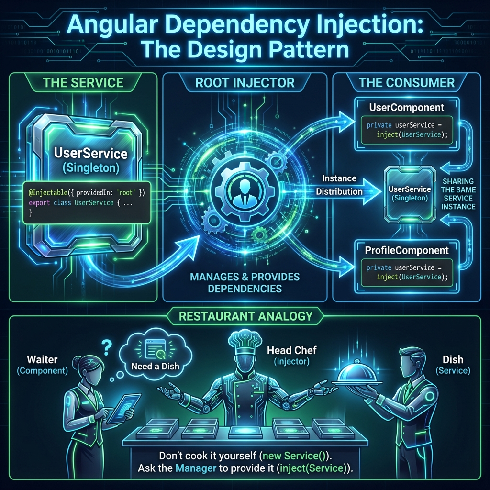
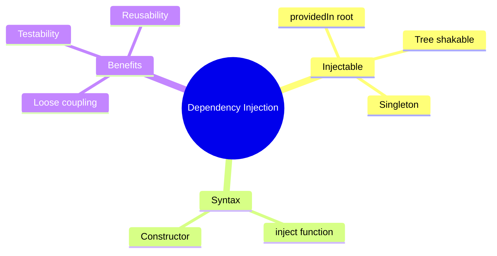

# 💉 Basic Dependency Injection

> **💡 Lightbulb Moment**: DI lets Angular create services for you and inject them - you just declare what you need!


## 📋 Table of Contents
- [1. 🔍 What is Dependency Injection?](#1--what-is-dependency-injection)
- [2. 🚀 Creating Injectable Services](#2--creating-injectable-services)
  - [Using in Components](#using-in-components)
- [3. ❓ Interview Questions](#3--interview-questions)
  - [Basic Questions](#basic-questions)
    - [Q1: What is providedIn: 'root'?](#q1-what-is-providedin-root)
    - [Q2: inject() vs constructor injection - when to use which?](#q2-inject-vs-constructor-injection---when-to-use-which)
    - [Q3: What makes a class injectable?](#q3-what-makes-a-class-injectable)
  - [Scenario-Based Questions](#scenario-based-questions)
    - [Scenario: Service Not Found Error](#scenario-service-not-found-error)
- [🍳 Restaurant Kitchen Analogy (Easy to Remember!)](#restaurant-kitchen-analogy-easy-to-remember)
  - [📖 Story to Remember:](#story-to-remember)
  - [🎯 Quick Reference:](#quick-reference)
- [🧠 Mind Map](#mind-map)
- [🎯 What Problem Does This Solve?](#what-problem-does-this-solve)
  - [The Problem: Tight Coupling Makes Code Hard to Test and Maintain](#the-problem-tight-coupling-makes-code-hard-to-test-and-maintain)
  - [How DI Solves This](#how-di-solves-this)
- [📚 Key Classes & Types Explained](#key-classes--types-explained)
  - [1. `@Injectable()` Decorator](#1-injectable-decorator)
  - [2. `inject()` Function](#2-inject-function)
  - [3. Constructor Injection (Classic)](#3-constructor-injection-classic)
  - [4. `providers` Array](#4-providers-array)
  - [5. Injection Tokens](#5-injection-tokens)
- [🌍 Real-World Use Cases](#real-world-use-cases)
  - [1. HTTP Service Layer](#1-http-service-layer)
  - [2. Authentication Guard](#2-authentication-guard)
  - [3. Logger Service](#3-logger-service)
  - [4. State Management Service](#4-state-management-service)
  - [5. Configuration Service](#5-configuration-service)
- [❓ Complete Interview Questions (25+)](#complete-interview-questions-25)
  - [Basic Conceptual Questions](#basic-conceptual-questions)
  - [Scope & Lifecycle Questions](#scope--lifecycle-questions)
  - [Testing Questions](#testing-questions)
  - [Advanced Questions](#advanced-questions)
  - [Scenario Questions](#scenario-questions)
  - [Best Practice Questions](#best-practice-questions)

---
---

## 1. 🔍 What is Dependency Injection?



A design pattern where classes receive dependencies from external sources rather than creating them.

```typescript
// WITHOUT DI - tightly coupled
export class UserComponent {
    private http = new HttpClient(...);  // Creating dependency manually
}

// WITH DI - loose coupling
export class UserComponent {
    constructor(private http: HttpClient) {}  // Angular provides it
}
```

---

## 2. 🚀 Creating Injectable Services

```typescript
@Injectable({
    providedIn: 'root'  // Singleton, available everywhere
})
export class UserService {
    private http = inject(HttpClient);
    
    getUsers(): Observable<User[]> {
        return this.http.get<User[]>('/api/users');
    }
}
```

### Using in Components
```typescript
@Component({...})
export class UsersComponent {
    private userService = inject(UserService);  // Modern syntax
    
    // OR using constructor
    constructor(private userService: UserService) {}  // Classic syntax
}
```

---

## 3. ❓ Interview Questions

### Basic Questions

#### Q1: What is providedIn: 'root'?
**Answer:** Creates a single instance (singleton) available throughout the entire application. Tree-shakable - if not used, it's removed from bundle.

#### Q2: inject() vs constructor injection - when to use which?
**Answer:**
| inject() | Constructor |
|----------|-------------|
| Field initializer | Constructor body |
| Works everywhere | Class context only |
| Modern (Angular 14+) | Classic |
| Required for inject in inherited classes | Traditional pattern |

#### Q3: What makes a class injectable?
**Answer:** The `@Injectable()` decorator. It tells Angular this class can have dependencies injected.

---

### Scenario-Based Questions

#### Scenario: Service Not Found Error
**Question:** You inject a service but get "NullInjectorError: No provider for X". Why?

**Answer:** The service isn't registered. Fix:
```typescript
// Option 1: providedIn in service
@Injectable({ providedIn: 'root' })

// Option 2: providers array in component/module
@Component({
    providers: [MyService]
})
```

---

## 🍳 Restaurant Kitchen Analogy (Easy to Remember!)


Think of Dependency Injection like a **restaurant kitchen**:
| Concept | Kitchen Analogy | Memory Trick |
|---------|----------------|--------------| 
| **Service** | 👨‍🍳 **Specialized chef**: Makes one type of dish (API calls, auth, etc.) | **"Expert at one thing"** |
| **DI** | 🍽️ **Kitchen manager**: Assigns chefs to stations, you just ask | **"Manager provides"** |
| **inject()** | 📋 **"I need the sushi chef"**: Ask and receive | **"Request dependency"** |
| **providedIn: 'root'** | 👨‍🍳 **Head chef**: One for entire restaurant, available everywhere | **"Singleton chef"** |
| **providers: [Service]** | 👨‍🍳 **Private chef**: One per table/station (component-level) | **"Instance per scope"** |

### 📖 Story to Remember:

> 🍳 **The Restaurant Kitchen**
>
> You're running a restaurant (your app):
>
> **Without DI (do everything yourself):**
> ```typescript
> class WaiterComponent {
>   // Waiter must learn to cook! 😰
>   private chef = new SushiChef();  // Creates own chef
>   private oven = new Oven();       // Buys own equipment
> }
> ```
>
> **With DI (professional kitchen):**
> ```typescript
> class WaiterComponent {
>   // Just ask the kitchen manager
>   private chef = inject(SushiChef);  // Manager provides the chef!
>   // No need to know how chef was trained
> }
> ```
>
> **The waiter doesn't cook. The waiter asks for a chef. The manager (DI) provides one.**

### 🎯 Quick Reference:
```
👨‍🍳 @Injectable()    = "I'm a chef you can request"
🍽️ inject()          = "Kitchen, send me the sushi chef"
👨‍🍳 providedIn:root  = One head chef for whole restaurant (singleton)
👨‍🍳 providers: []    = Private chef for this table (new instance)
```

---

## 🧠 Mind Map



---

## 🎯 What Problem Does This Solve?

### The Problem: Tight Coupling Makes Code Hard to Test and Maintain

**Without Dependency Injection (BAD):**
```typescript
export class UserComponent {
    private http = new HttpClient(...configs);  // Must know how to create
    private logger = new LoggerService();       // Creates its own
    private cache = new CacheService();         // Creates its own
    
    // Problems:
    // 1. Must know how to construct each dependency
    // 2. Can't swap implementations for testing
    // 3. Changes in dependency = changes in all consumers
    // 4. Creating same service multiple times = wasted memory
}

// Testing is nightmare:
const component = new UserComponent();  // No way to mock http!
```

**Problems:**
1. **Tight coupling**: Component knows how to create dependencies
2. **Hard to test**: Can't substitute mocks
3. **No singleton**: Each class creates its own instance
4. **Violates SRP**: Component responsible for creating dependencies

### How DI Solves This

**With Dependency Injection (GOOD):**
```typescript
export class UserComponent {
    private http = inject(HttpClient);      // Angular provides it
    private logger = inject(LoggerService); // Angular provides it
    private cache = inject(CacheService);   // Angular provides it
    
    // Component just uses them - doesn't know how they're created!
}

// Testing is easy:
TestBed.configureTestingModule({
    providers: [{ provide: HttpClient, useClass: MockHttpClient }]
});
// Now http is a mock!
```

| Problem | DI Solution |
|---------|-------------|
| Tight coupling | **Loose coupling**: Angular creates and provides dependencies |
| Hard to test | **Easy mocking**: Swap providers in tests |
| No singleton | **Singleton by default**: `providedIn: 'root'` |
| Manual creation | **Automatic**: Angular Injector handles instantiation |

---

## 📚 Key Classes & Types Explained

### 1. `@Injectable()` Decorator

```typescript
@Injectable({
    providedIn: 'root'  // Where to register
})
export class DataService { }
```

**providedIn Options:**
| Value | Scope | Instance |
|-------|-------|----------|
| `'root'` | Application-wide | Singleton |
| `'platform'` | Across multiple apps | Singleton |
| `'any'` | Each lazy module | New instance per module |
| Component | Component tree | New instance per component |

---

### 2. `inject()` Function

```typescript
import { inject } from '@angular/core';

// Modern syntax (Angular 14+)
private http = inject(HttpClient);
private service = inject(MyService);

// With optional
private optional = inject(OptionalService, { optional: true });

// In functions (must be in injection context)
function createHandler() {
    const http = inject(HttpClient);  // Works in field initializers, constructors
}
```

**Benefits over constructor injection:**
- Works in field initializers
- Required for functional guards/resolvers
- Cleaner for classes with many dependencies

---

### 3. Constructor Injection (Classic)

```typescript
@Component({...})
export class MyComponent {
    constructor(
        private http: HttpClient,
        private router: Router,
        private userService: UserService
    ) { }
}
```

**When to use:**
- Legacy codebases
- When you need access in constructor body
- Team preference for explicit parameters

---

### 4. `providers` Array

```typescript
@Component({
    providers: [MyService]  // New instance for this component tree
})
export class MyComponent { }

// Or in app config
export const appConfig: ApplicationConfig = {
    providers: [
        provideRouter(routes),
        provideHttpClient()
    ]
};
```

---

### 5. Injection Tokens

```typescript
import { InjectionToken } from '@angular/core';

// For non-class dependencies
export const API_URL = new InjectionToken<string>('API_URL');

// Provide value
providers: [
    { provide: API_URL, useValue: 'https://api.example.com' }
]

// Inject
private apiUrl = inject(API_URL);
```

---

## 🌍 Real-World Use Cases

### 1. HTTP Service Layer
```typescript
@Injectable({ providedIn: 'root' })
export class UserService {
    private http = inject(HttpClient);
    
    getUsers(): Observable<User[]> {
        return this.http.get<User[]>('/api/users');
    }
}
```

### 2. Authentication Guard
```typescript
export const authGuard: CanActivateFn = () => {
    const authService = inject(AuthService);
    const router = inject(Router);
    
    if (authService.isAuthenticated()) {
        return true;
    }
    return router.parseUrl('/login');
};
```

### 3. Logger Service
```typescript
@Injectable({ providedIn: 'root' })
export class LoggerService {
    log(message: string): void {
        console.log(`[APP] ${new Date().toISOString()}: ${message}`);
    }
    
    error(error: Error): void {
        console.error('[APP ERROR]', error);
    }
}
```

### 4. State Management Service
```typescript
@Injectable({ providedIn: 'root' })
export class CartService {
    private items = signal<CartItem[]>([]);
    readonly items$ = this.items.asReadonly();
    
    addItem(item: CartItem): void {
        this.items.update(items => [...items, item]);
    }
}
```

### 5. Configuration Service
```typescript
export const APP_CONFIG = new InjectionToken<AppConfig>('APP_CONFIG');

@Injectable({ providedIn: 'root' })
export class ConfigService {
    private config = inject(APP_CONFIG);
    
    get apiUrl(): string { return this.config.apiUrl; }
    get env(): string { return this.config.environment; }
}
```

---

## ❓ Complete Interview Questions (25+)

### Basic Conceptual Questions

**Q4: What is Dependency Injection?**
> A: A design pattern where a class receives its dependencies from external sources rather than creating them itself.

**Q5: What does @Injectable() do?**
> A: Marks a class as available to the Angular DI system. Without it, Angular can't inject dependencies into the class.

**Q6: What's the difference between inject() and constructor injection?**
> A:
> - `inject()`: Works in field initializers, required for functional code
> - Constructor: Works in constructor body, classic pattern

**Q7: When is a service instantiated?**
> A: When it's first requested (lazy). If never injected, it's never created (tree-shaking).

**Q8: Can you inject a service into another service?**
> A: Yes! Services can have their own dependencies injected.

---

### Scope & Lifecycle Questions

**Q9: What's the default lifecycle of a root-provided service?**
> A: Singleton - one instance for the entire application, lives until app is destroyed.

**Q10: How do you create a new service instance per component?**
> A: Add to component's providers array:
> ```typescript
> @Component({ providers: [MyService] })
> ```

**Q11: What happens if you provide a service in both root and component?**
> A: Component gets its own instance, overriding the root instance for that component tree.

**Q12: What is hierarchical injection?**
> A: Child components can access parent's providers. Closer providers take precedence.

---

### Testing Questions

**Q13: How do you mock a service in tests?**
> A:
> ```typescript
> TestBed.configureTestingModule({
>     providers: [
>         { provide: UserService, useValue: mockUserService }
>     ]
> });
> ```

**Q14: What is `useClass` vs `useValue` vs `useFactory`?**
> A:
> - `useClass`: Provide a different class implementation
> - `useValue`: Provide a specific value/object
> - `useFactory`: Create instance via factory function

**Q15: How do you test a service in isolation?**
> A: Create directly with mocked dependencies:
> ```typescript
> const mockHttp = jasmine.createSpyObj('HttpClient', ['get']);
> const service = new UserService(mockHttp);
> ```

---

### Advanced Questions

**Q16: What is an InjectionToken?**
> A: A token used to inject non-class values (strings, objects, configs).

**Q17: What is the difference between @Self, @SkipSelf, @Host?**
> A:
> - `@Self()`: Only look in current injector
> - `@SkipSelf()`: Start from parent injector
> - `@Host()`: Stop at host component boundary

**Q18: What is forRoot/forChild pattern?**
> A: Convention for modules to provide services only once (root) or multiple times (feature modules).

**Q19: What is tree-shaking for services?**
> A: Unused services with `providedIn: 'root'` are removed from the bundle.

**Q20: How do you create a multi-provider?**
> A:
> ```typescript
> providers: [
>     { provide: HTTP_INTERCEPTORS, useClass: AuthInterceptor, multi: true },
>     { provide: HTTP_INTERCEPTORS, useClass: LogInterceptor, multi: true }
> ]
> ```

---

### Scenario Questions

**Q21: Service works in app but not in lazy module. Why?**
> A: The service might be provided in a feature module that loads after the lazy module. Use `providedIn: 'root'` instead.

**Q22: You need different API URLs for staging vs production. How?**
> A: Use an InjectionToken with environment-based value:
> ```typescript
> { provide: API_URL, useValue: environment.apiUrl }
> ```

**Q23: How would you implement a logging service that can be disabled in production?**
> A: Factory provider based on environment:
> ```typescript
> {
>     provide: LoggerService,
>     useFactory: () => environment.production ? new NoOpLogger() : new ConsoleLogger()
> }
> ```

**Q24: Service A depends on Service B, B depends on A. What happens?**
> A: Circular dependency error at runtime. Break the cycle using forwardRef or restructure.

**Q25: How do you make a service available only in a specific lazy-loaded module?**
> A: Provide it in the module using `providedIn: LazyModule` or add to the module's providers array.

---

### Best Practice Questions

**Q26: Should services have state?**
> A: Root services can hold app-wide state. Component-level services can hold component-specific state.

**Q27: When should you NOT use providedIn: 'root'?**
> A: When you need per-component instances or when the service is only used in one lazy module.

**Q28: How do you share data between sibling components?**
> A: Use a shared service injected in their parent, or use a root-level state service.

