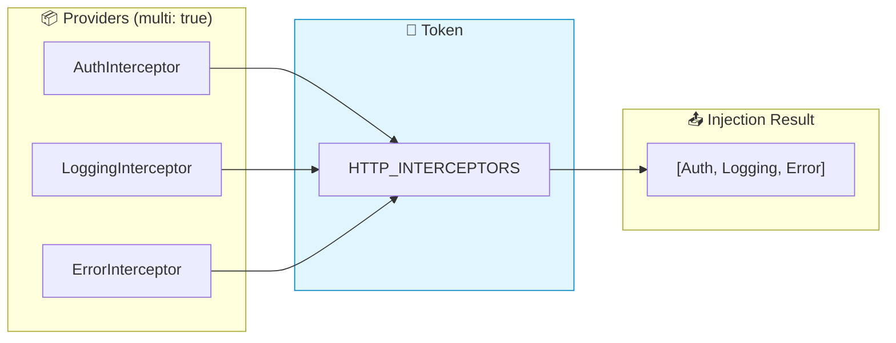
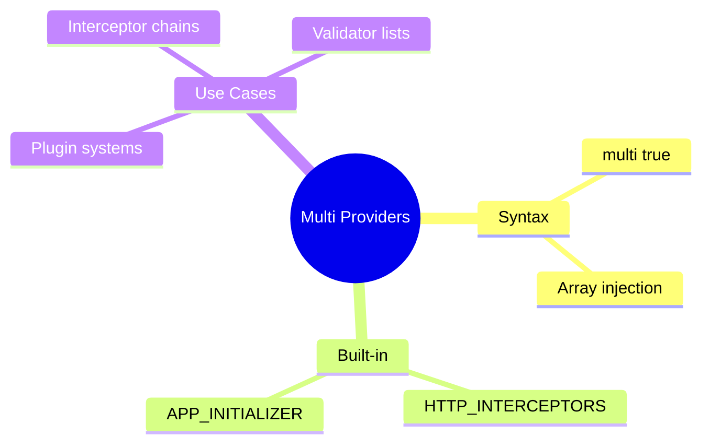

# 🔄 Multi Providers (Plugin System)

> **💡 Goal**: Implement a modular Plugin System where multiple features can register themselves to a single `APP_PLUGINS` token using `multi: true`.


## 📋 Table of Contents
- [1. 📂 File Structure](#1--file-structure)
- [2. 📝 The Code Explained](#2--the-code-explained)
  - [Step 1: The Contract (`plugin.model.ts`)](#step-1-the-contract-pluginmodelts)
  - [Step 2: The Token (`plugin.token.ts`)](#step-2-the-token-plugintokents)
  - [Step 3: The Implementations (`plugin.implementations.ts`)](#step-3-the-implementations-pluginimplementationsts)
  - [Step 4: The Multi Provider (`multi-provider-example.component.ts`)](#step-4-the-multi-provider-multi-provider-examplecomponentts)
  - [Step 5: Usage](#step-5-usage)
  - [📊 Data Flow Diagram](#data-flow-diagram)
  - [📦 Data Flow Summary (Visual Box Diagram)](#data-flow-summary-visual-box-diagram)
- [3. 🛡️ The Problem & Solution](#3--the-problem--solution)
  - [The Problem: "The Overwrite" ⚔️](#the-problem-the-overwrite)
  - [The Solution: "The Collection" 🤲](#the-solution-the-collection)
  - [Why & When to use it?](#why--when-to-use-it)
- [4. 🏗️ Architecture & Performance](#4--architecture--performance)
  - [Architecture View: The "Plugin Pattern"](#architecture-view-the-plugin-pattern)
  - [Performance View ⚡](#performance-view)
- [5. 🌍 Real-World Applications](#5--real-world-applications)
  - [1. HTTP Interceptors (`HTTP_INTERCEPTORS`)](#1-http-interceptors-http_interceptors)
  - [2. App Initialization (`APP_INITIALIZER`)](#2-app-initialization-app_initializer)
  - [3. Form Validation (`NG_VALIDATORS`)](#3-form-validation-ng_validators)
  - [4. Custom Plugin Systems](#4-custom-plugin-systems)
- [❓ Complete Interview Questions (20+)](#complete-interview-questions-20)
  - [Basic Questions](#basic-questions)
  - [Scenario-Based Questions](#scenario-based-questions)
  - [Advanced Questions](#advanced-questions)
- [🧠 Mind Map](#mind-map)

---
---

## 1. 📂 File Structure

```
use-case-8/
├── plugin.model.ts             # AppPlugin Interface
├── plugin.token.ts             # InjectionToken<AppPlugin[]>
├── plugin.implementations.ts   # Analytics, Logger, Theme plugins
├── multi-provider-example.component.ts # Main component consuming plugins
└── guide.md                    # This documentation
```

---

## 2. 📝 The Code Explained

### Step 1: The Contract (`plugin.model.ts`)
We define a common interface for all plugins.

```typescript
export interface AppPlugin {
    name: string;
    init(): void;
}
```

### Step 2: The Token (`plugin.token.ts`)
We define the token that will hold an **Array** of plugins.

```typescript
export const APP_PLUGINS = new InjectionToken<AppPlugin[]>('APP_PLUGINS');
```

### Step 3: The Implementations (`plugin.implementations.ts`)
We create multiple services that implement `AppPlugin`.

```typescript
@Injectable() export class AnalyticsPlugin implements AppPlugin { ... }
@Injectable() export class LoggerPlugin implements AppPlugin { ... }
@Injectable() export class ThemePlugin implements AppPlugin { ... }
```

### Step 4: The Multi Provider (`multi-provider-example.component.ts`)
We provide multiple classes for the **SAME** token using `multi: true`.

```typescript
providers: [
    { provide: APP_PLUGINS, useClass: AnalyticsPlugin, multi: true },
    { provide: APP_PLUGINS, useClass: LoggerPlugin, multi: true },
    { provide: APP_PLUGINS, useClass: ThemePlugin, multi: true }
]
```

### Step 5: Usage
We inject the token and get an array!

```typescript
constructor(@Inject(APP_PLUGINS) public plugins: AppPlugin[]) {
    this.plugins.forEach(p => p.init());
}
```

### 📊 Data Flow Diagram



### 📦 Data Flow Summary (Visual Box Diagram)

```
┌─────────────────────────────────────────────────────────────┐
│  MULTI PROVIDERS (one token, many values)                   │
│                                                             │
│   WITHOUT multi: true (LAST WINS)                           │
│   ┌───────────────────────────────────────────────────────┐ │
│   │ providers: [                                          │ │
│   │   { provide: Logger, useClass: FileLogger },          │ │
│   │   { provide: Logger, useClass: ConsoleLogger }        │ │
│   │ ]                                                     │ │
│   │                                                       │ │
│   │ inject(Logger) → ConsoleLogger (overwrote FileLogger!)│ │
│   └───────────────────────────────────────────────────────┘ │
│                                                             │
│   WITH multi: true (ALL COLLECTED)                          │
│   ┌───────────────────────────────────────────────────────┐ │
│   │ providers: [                                          │ │
│   │   { provide: HTTP_INTERCEPTORS,                       │ │
│   │     useClass: AuthInterceptor, multi: true },   ──┐   │ │
│   │                                                   │   │ │
│   │   { provide: HTTP_INTERCEPTORS,                   │   │ │
│   │     useClass: LoggingInterceptor, multi: true },──│   │ │
│   │                                                   │   │ │
│   │   { provide: HTTP_INTERCEPTORS,                   │   │ │
│   │     useClass: ErrorInterceptor, multi: true }  ───│   │ │
│   │ ]                                                 │   │ │
│   │                                                   │   │ │
│   │                                                   ▼   │ │
│   │ inject(HTTP_INTERCEPTORS) →                           │ │
│   │   [AuthInterceptor, LoggingInterceptor, ErrorInterceptor]│
│   │                                                       │ │
│   │ // ALL THREE! Returned as array                       │ │
│   └───────────────────────────────────────────────────────┘ │
│                                                             │
│   COMMON ANGULAR MULTI TOKENS:                              │
│   ┌───────────────────────────────────────────────────────┐ │
│   │ HTTP_INTERCEPTORS  → Interceptor chain                │ │
│   │ APP_INITIALIZER    → Startup tasks (wait for all)     │ │
│   │ ROUTES             → Child routes in lazy modules     │ │
│   │ NG_VALIDATORS      → Form validators                  │ │
│   └───────────────────────────────────────────────────────┘ │
└─────────────────────────────────────────────────────────────┘
```

**Multi Provider Use Cases:**
1. **Interceptor chains**: Each interceptor handles different concern
2. **Plugin systems**: Features register handlers dynamically
3. **Validators**: Multiple validation rules for forms
4. **Initializers**: Multiple async startup tasks

> **Key Takeaway**: `multi: true` collects ALL providers into an array instead of overwriting. Essential for plugin-like patterns!

---

---

## 3. 🛡️ The Problem & Solution

### The Problem: "The Overwrite" ⚔️
Without `multi: true`, Dependency Injection is a "Last One Wins" game.
If multiple providers try to provide the **SAME** token, the last one registered overwrites all previous ones.

*   **Scenario**: You have a `Logger` token.
*   **Module A** provides `FileLogger`.
*   **Module B** provides `ConsoleLogger`.
*   **Result**: The app only uses `ConsoleLogger`. `FileLogger` is lost. 😱

### The Solution: "The Collection" 🤲
With `multi: true`, Angular changes its behavior:
1.  It does **not** overwrite.
2.  It **collects** all providers into an Array.
3.  It injects `Array<T>` instead of just `T`.

### Why & When to use it?
*   **✅ Extensibility (Open/Closed Principle)**: You can extend the application's behavior (add a new plugin/interceptor) *without modifying* the core code. Just provide a new token!
*   **✅ Decoupling**: The core system (e.g., the Dashboard) doesn't need to know *which* plugins exist. It just asks for "All Plugins".
*   **✅ Distributed Configuration**: Different feature modules can contribute to a central configuration (like routes or validators) without knowing about each other.

---

## 4. 🏗️ Architecture & Performance

### Architecture View: The "Plugin Pattern"
This pattern enables a **Modular Architecture**.
*   **Core Module**: Defines the Token (`APP_PLUGINS`) and the Interface (`AppPlugin`).
*   **Feature Modules**: Provide implementations (`AnalyticsPlugin`, `ThemePlugin`).
*   **Benefit**: You can add/remove features by simply adding/removing their providers. No other code changes needed!

### Performance View ⚡
*   **Creation Cost**: Very low. Angular simply pushes instances into an array.
*   **Memory**: Depends on the *number* of plugins. Since they are usually Singletons, it's efficient.
*   **Runtime**: Iterating over an array (e.g., `plugins.forEach`) is extremely fast.
*   **⚠️ Caution**: If you have a `multi` provider that performs heavy work in its `init()` or constructor, and you have *many* of them, it can slow down startup.
    *   **Tip**: Keep the constructors lightweight. Do heavy work lazily.

---

## 5. 🌍 Real-World Applications

When do we actually use this in a real project?

### 1. HTTP Interceptors (`HTTP_INTERCEPTORS`)
This is the most common use case. You want to "chain" multiple interceptors to handle different aspects of HTTP requests.
*   **AuthInterceptor**: Adds the Bearer token.
*   **LoggingInterceptor**: Logs the request time.
*   **ErrorInterceptor**: Catches 401/500 errors globally.

```typescript
providers: [
  { provide: HTTP_INTERCEPTORS, useClass: AuthInterceptor, multi: true },
  { provide: HTTP_INTERCEPTORS, useClass: LoggingInterceptor, multi: true }
]
```

### 2. App Initialization (`APP_INITIALIZER`)
You might have multiple setup tasks that need to run before the app starts.
*   **ConfigService**: Load settings from a JSON file.
*   **AuthService**: Check if the user is already logged in.
*   **LanguageService**: Load translations.

```typescript
providers: [
  { 
    provide: APP_INITIALIZER, 
    useFactory: (config: ConfigService) => () => config.load(), 
    deps: [ConfigService], 
    multi: true 
  },
  { 
    provide: APP_INITIALIZER, 
    useFactory: (auth: AuthService) => () => auth.checkLogin(), 
    deps: [AuthService], 
    multi: true 
  }
]
```
Angular waits for ALL of these to complete (if they return Promises/Observables) before bootstrapping the app.

### 3. Form Validation (`NG_VALIDATORS`)
When you create a custom validator directive (like `appForbiddenName`), you need to register it with Angular's built-in validators. You don't want to *replace* the built-in ones (required, minLength), you want to *add* to them.

```typescript
providers: [{ 
  provide: NG_VALIDATORS, 
  useExisting: ForbiddenValidatorDirective, 
  multi: true 
}]
```

### 4. Custom Plugin Systems
As shown in this example! If you are building a dashboard where different modules (Sales, HR, IT) need to register widgets or menu items dynamically, `multi: true` is the perfect solution.

---

---

## ❓ Complete Interview Questions (20+)

### Basic Questions

**Q1: What does `multi: true` do?**
> A: Tells Angular to accumulate providers for a token into an Array, rather than overwriting.

**Q2: What type is injected when using `multi: true`?**
> A: An Array of values (e.g., `AppPlugin[]`).

**Q3: Common built-in multi tokens?**
> A: `HTTP_INTERCEPTORS`, `APP_INITIALIZER`, `NG_VALIDATORS`.

**Q4: Does order matter in multi providers?**
> A: Yes, the array order matches the registration order (Module import order).

**Q5: Can I mix multi and non-multi providers for same token?**
> A: No. It's either a multi-token or it isn't. Mixing causes errors.

---

### Scenario-Based Questions

**Q6: Scenario: Plugin System.**
> A: Use `multi: true` to allow modules to register plugins. Inject `PluginToken[]`.

**Q7: Scenario: Validation.**
> A: `NG_VALIDATORS` uses multi to verify all validators pass.

**Q8: Scenario: Interceptors.**
> A: `HTTP_INTERCEPTORS` uses multi to chain requests.

**Q9: Scenario: Feature extension.**
> A: Add new functionality without touching core code by finding the multi-token and adding a provider.

**Q10: Scenario: Startup config.**
> A: `APP_INITIALIZER` runs multiple implementation functions in parallel (or sequence depending on how you wait).

---

### Advanced Questions

**Q11: Can I remove a multi provider?**
> A: Hard. Generally additive only.

**Q12: How to enforce order?**
> A: Control module import order.

**Q13: Can multi providers rely on each other?**
> A: No, they are peers in the array. One cannot easily depend on another in the same array during creation.

**Q14: Performance of multi providers?**
> A: Iterating the array is fast. Instantiating many services might take time.

**Q15: What if one fails?**
> A: Depends on consumption. If you `forEach` and one throws, loop breaks.

**Q16: Can I use `useFactory` in multi?**
> A: Yes!

**Q17: `useValue` in multi?**
> A: Yes!

**Q18: What is `NG_VALUE_ACCESSOR`?**
> A: A multi token? No, actually usually single per component. Wait, validators are multi.

**Q19: How to debug multi providers?**
> A: Inspect the injected array to see what's inside.

**Q20: Is `multi: true` default?**
> A: No, default is false (overwrite).

---

## 🧠 Mind Map


