# 🏭 useFactory Provider

> **💡 Lightbulb Moment**: useFactory lets you create dependencies dynamically based on runtime conditions!


## 📋 Table of Contents
- [1. 🔍 What is useFactory?](#1--what-is-usefactory)
- [2. 🚀 Factory with Dependencies](#2--factory-with-dependencies)
  - [📊 Data Flow Diagram](#data-flow-diagram)
  - [📦 Data Flow Summary (Visual Box Diagram)](#data-flow-summary-visual-box-diagram)
- [🎯 What Problem Does This Solve?](#what-problem-does-this-solve)
  - [The Problem: Static Dependencies are Rigid](#the-problem-static-dependencies-are-rigid)
  - [How useFactory Solves This](#how-usefactory-solves-this)
- [📚 Key Classes & Types Explained](#key-classes--types-explained)
  - [1. `FactoryProvider`](#1-factoryprovider)
  - [2. Factory Function](#2-factory-function)
- [🌍 Real-World Use Cases](#real-world-use-cases)
  - [1. Environment-Specific Services](#1-environment-specific-services)
  - [2. Conditional Logger](#2-conditional-logger)
  - [3. Settings Initialization relying on Authenticated User](#3-settings-initialization-relying-on-authenticated-user)
  - [4. Legacy Code Integration](#4-legacy-code-integration)
  - [5. Dynamic Feature Flags](#5-dynamic-feature-flags)
- [❓ Complete Interview Questions (20+)](#complete-interview-questions-20)
  - [Basic Questions](#basic-questions)
  - [Scenario-Based Questions](#scenario-based-questions)
  - [Advanced Questions](#advanced-questions)
- [🎰 Vending Machine Analogy (Easy to Remember!)](#vending-machine-analogy-easy-to-remember)
  - [📖 Story to Remember:](#story-to-remember)
  - [🎯 Quick Reference:](#quick-reference)
- [🧠 Mind Map](#mind-map)

---
---

## 1. 🔍 What is useFactory?

A factory function that returns the dependency value.

```typescript
providers: [
    {
        provide: Logger,
        useFactory: () => {
            return environment.production ? new ProductionLogger() : new DebugLogger();
        }
    }
]
```

---

## 2. 🚀 Factory with Dependencies

```typescript
providers: [
    {
        provide: DataService,
        useFactory: (http: HttpClient, config: AppConfig) => {
            return new DataService(http, config.apiUrl);
        },
        deps: [HttpClient, APP_CONFIG]  // Dependencies passed to factory
    }
]
```

### 📊 Data Flow Diagram

```mermaid
flowchart LR
    subgraph Deps["🔧 Dependencies"]
        D1["HttpClient"]
        D2["APP_CONFIG"]
    end
    
    subgraph Factory["🏭 Factory Function"]
        Logic["if (config.isProd) {...}"]
    end
    
    subgraph Result["📦 Result"]
        Service["DataService instance"]
    end
    
    D1 --> Factory
    D2 --> Factory
    Factory --> Service
    
    style Factory fill:#fff3e0,stroke:#ff6f00
```



### 📦 Data Flow Summary (Visual Box Diagram)

```
┌─────────────────────────────────────────────────────────────┐
│  useFactory PROVIDER                                        │
│                                                             │
│   ① DEFINE FACTORY PROVIDER                                 │
│   ┌───────────────────────────────────────────────────────┐ │
│   │ providers: [                                          │ │
│   │   {                                                   │ │
│   │     provide: Logger,                                  │ │
│   │     useFactory: (isProd: boolean) => {                │ │
│   │       //                                              │ │
│   │       // 🏭 Factory runs at INJECTION TIME            │ │
│   │       //                                              │ │
│   │       if (isProd) {                                   │ │
│   │         return new ProductionLogger();  // 🔴         │ │
│   │       } else {                                        │ │
│   │         return new DebugLogger();       // 🟢         │ │
│   │       }                                               │ │
│   │     },                                                │ │
│   │     deps: [IS_PRODUCTION]  // ← Factory dependencies  │ │
│   │   }                                                   │ │
│   │ ]                                                     │ │
│   └───────────────────────────────────────────────────────┘ │
│                                                             │
│   ② AT INJECTION TIME                                       │
│   ┌───────────────────────────────────────────────────────┐ │
│   │                                                       │ │
│   │  deps: [IS_PRODUCTION]                                │ │
│   │        │                                              │ │
│   │        ▼                                              │ │
│   │  Angular injects: true                                │ │
│   │        │                                              │ │
│   │        ▼                                              │ │
│   │  Factory((isProd = true)) => ProductionLogger         │ │
│   │        │                                              │ │
│   │        ▼                                              │ │
│   │  inject(Logger) receives: ProductionLogger instance   │ │
│   │                                                       │ │
│   └───────────────────────────────────────────────────────┘ │
│                                                             │
│   useFactory vs useValue:                                   │
│   ┌───────────────────────────────────────────────────────┐ │
│   │ useValue:   📦 Static, same every time                │ │
│   │ useFactory: 🏭 Dynamic, runs logic to decide          │ │
│   │ useClass:   🏗️ Creates instance of specified class    │ │
│   └───────────────────────────────────────────────────────┘ │
└─────────────────────────────────────────────────────────────┘
```

**useFactory Use Cases:**
1. **Environment-based**: Different loggers for dev/prod
2. **Feature flags**: Enable/disable features dynamically
3. **Complex initialization**: Services needing setup logic
4. **Conditional dependencies**: Based on runtime config

> **Key Takeaway**: `useFactory` lets you run code to DECIDE what instance to create. Use `deps` to inject other services into your factory!

---

## 🎯 What Problem Does This Solve?

### The Problem: Static Dependencies are Rigid
**Without useFactory (BAD):**
```typescript
// Service rigidly creates its own dependencies or they must be static
@Injectable()
export class Logger {
    // Logic inside constructor? Hard to test and tightly coupled.
    constructor() {
        this.type = environment.prod ? 'prod' : 'dev'; // ❌ Side effect in constructor
    }
}
```

**Problems:**
1.  **No Runtime Flexibility**: Can't easily swap the *entire class* based on a condition managed outside.
2.  **Hard to Mock**: If logic is inside, testing different states is harder.
3.  **Complex Creation**: Sometimes creating a service requires 5 steps or data from another service.

### How useFactory Solves This
**With useFactory (GOOD):**
```typescript
// ✅ Decision logic moved to configuration
useFactory: (config) => config.isProd ? new ProdLogger() : new DevLogger()
```

| Problem | useFactory Solution |
|---------|---------------------|
| Rigid implementations | **Polymorphism**: Return *different classes* matching the same interface. |
| Complex setup | **Builder Pattern**: Run arbitrary code to prepare the service before returning it. |
| Runtime config | **Dependency Access**: Inject config services (`deps`) to make decisions. |

---

## 📚 Key Classes & Types Explained

### 1. `FactoryProvider`
```typescript
{
  provide: MyService,
  useFactory:Function,
  deps: Array<Token>
}
```
*   **`provide`**: The token being configured.
*   **`useFactory`**: The function that returns the instance.
*   **`deps`**: **CRITICAL**. An array of tokens to be resolved and passed as arguments to the factory function.

### 2. Factory Function
```typescript
(dependency1, dependency2) => { return new Service(dependency1); }
```
*   **Args**: Match the order of `deps`.
*   **Return**: Must match the type of the `provide` token.

---

## 🌍 Real-World Use Cases

### 1. Environment-Specific Services
Switching between a real API service and a mock service based on an environment flag.
```typescript
{
  provide: ApiService,
  useFactory: (env: EnvService) => env.isProd ? new HttpApiService() : new MockApiService(),
  deps: [EnvService]
}
```

### 2. Conditional Logger
Returning `console.log` in dev, but sending logs to a server (Splunk/ELK) in prod.
```typescript
{
  provide: LoggerService,
  useFactory: (config) => config.enableRemoteLogging ? new RemoteLogger() : new ConsoleLogger(),
  deps: [AppConfig]
}
```

### 3. Settings Initialization relying on Authenticated User
Loading user-specific settings only after auth is confirmed.
```typescript
{
  provide: UserSettings,
  useFactory: (auth: AuthService, http: HttpClient) => {
      const user = auth.currentUser;
      return new UserSettings(user, http); 
  },
  deps: [AuthService, HttpClient]
}
```

### 4. Legacy Code Integration
Wrapping a legacy global object/library that isn't an Angular service.
```typescript
{
  provide: JQUERY,
  useFactory: () => window['$'] // accessing global variable
}
```

### 5. Dynamic Feature Flags
Enabling/Disabling entire feature modules by providing null or a dummy implementation.

---

## ❓ Complete Interview Questions (20+)

### Basic Questions

**Q1: What is the purpose of `useFactory`?**
> A: To dynamically create a dependency instance using a function, allowing for runtime logic and calculations.

**Q2: What is the `deps` property?**
> A: An array of injection tokens that Angular resolves and passes as arguments to the factory function.

**Q3: Does the order in `deps` matter?**
> A: Yes! It must exactly match the order of arguments in the factory function.

**Q4: Can a factory function be asynchronous?**
> A: No, `useFactory` must return the value synchronously (unless you are using `APP_INITIALIZER`, where it can return a Promise/Observable).

**Q5: What happens if I forget a dependency in `deps`?**
> A: The factory function will receive `undefined` for that argument (or less arguments), likely causing a runtime crash.

---

### Scenario-Based Questions

**Q6: Scenario: You need to read a config file before creating a service. How?**
> A: Use `APP_INITIALIZER` with `useFactory` to load the config first. Then use another `useFactory` for the service that depends on that loaded config.

**Q7: Scenario: Passing static data to a factory?**
> A: You can't pass data directly to `deps`. You must wrap the static data in an `InjectionToken` (using `useValue`) and inject that token.

**Q8: Scenario: Choosing between 3 different implementations?**
> A: A simple switch/case inside the factory function handles this easily.

**Q9: Scenario: Returning an existing instance?**
> A: Yes, a factory can return a singleton stored elsewhere, though `useExisting` is preferred for aliasing.

**Q10: Scenario: Using a factory to wrap a 3rd party library constructor?**
> A: Perfect use case. `useFactory: () => new ThirdPartyLib(config)`.

---

### Advanced Questions

**Q11: Can `useFactory` return a primitive value?**
> A: Yes, if the token is an `InjectionToken<primitive>`.

**Q12: Is the factory function run every time?**
> A: No! Services are singletons (by default). The factory runs **once** when the service is first requested.

**Q13: How do you unit test a provider using `useFactory`?**
> A: You can export the factory function separately and test it as a pure function, passing mock dependencies manually.

**Q14: Difference between `useFactory` and `useClass`?**
> A: `useClass` lets Angular instantiate the class (automatic constructor Injection). `useFactory` forces YOU to instantiate it (manual control).

**Q15: Can I do HTTP calls inside `useFactory`?**
> A: You *start* them, but you can't *wait* for them (sync return). For async setup, use `APP_INITIALIZER`.

**Q16: Can I use `inject()` inside a factory function instead of `deps`?**
> A: In modern Angular (v14+), yes! You can run `inject(Token)` inside the factory function since it runs in an injection context.

**Q17: If I use `inject()` inside factory, do I need `deps`?**
> A: No, you can omit `deps` if you use `inject()`, but `deps` is still useful for explicit documentation.

**Q18: How does Tree Shaking work with `useFactory`?**
> A: If the token is `providedIn: 'root'`, it's tree-shakable. The factory code is kept only if used.

**Q19: Can a factory return null?**
> A: Yes, if the token type allows it/is optional.

**Q20: What is a "Multi-Provider" vs Factory?**
> A: Factory creates ONE instance. Multi-provider creates an ARRAY of instances. They are orthogonal concepts (you can have a multi-provider that uses a factory).

---

## 🎰 Vending Machine Analogy (Easy to Remember!)

Think of useFactory like a **smart vending machine**:

| Concept | Vending Machine Analogy | Memory Trick |
|---------|------------------------|--------------| 
| **useFactory** | 🎰 **Vending machine**: Makes choices based on input | **"Dynamic creation"** |
| **Factory function** | ⚙️ **Machine logic**: Decides what to dispense | **"Decision function"** |
| **deps array** | 🪙 **Coins/buttons**: What machine needs to decide | **"Dependencies"** |
| **Return value** | 🥤 **Product dispensed**: The service you get | **"Instance created"** |
| **useValue** | 📦 **Pre-packaged box**: Same item every time | **"Static value"** |

### 📖 Story to Remember:

> 🎰 **The Smart Vending Machine**
>
> Your app needs a logger service:
>
> **Factory decides what you get:**
> ```typescript
> {
>   provide: Logger,
>   useFactory: (isProd: boolean) => {
>     // Machine checks: "Production mode?"
>     return isProd 
>       ? new ProductionLogger()   // 🔴 Red can
>       : new DebugLogger();       // 🟢 Green can
>   },
>   deps: [IS_PRODUCTION]  // 🪙 Coins inserted
> }
> ```
>
> **Machine makes the decision, not you!**

### 🎯 Quick Reference:
```
🎰 useFactory     = Vending machine (dynamic)
📦 useValue       = Pre-packaged (static)
⚙️ Factory fn     = Decision logic
🪙 deps           = Inputs needed
🥤 Return         = Service dispensed
```

---

## 🧠 Mind Map


