# 💉 Use Case 1: Basic Service & Dependency Injection

> **Goal**: Master the fundamental concept of Angular's Dependency Injection - creating injectable services and sharing state across components without prop drilling.

---

## 1. 🔍 How It Works (The Concept)

### The Mechanism
Angular's **Dependency Injection (DI)** is a design pattern where a class receives its dependencies from external sources rather than creating them itself. When you mark a class with `@Injectable()`, Angular's DI system can:
1. **Create** an instance of that class
2. **Manage** its lifecycle
3. **Inject** it into any component that needs it

### Default vs. Optimized Behavior

| Aspect | Without DI (Manual) | With DI (Optimized) |
|--------|---------------------|---------------------|
| **Instance Creation** | Each component creates its own instance | Angular creates and manages instances |
| **State Sharing** | Must pass data through @Input/@Output chains | Direct access to shared state |
| **Testing** | Hard to mock dependencies | Easy to swap with mock services |
| **Coupling** | Components know HOW to create dependencies | Components only know WHAT they need |

### 📊 Data Flow Diagram

```mermaid
flowchart TB
    subgraph Angular["🅰️ Angular DI Container"]
        Injector["Injector<br/>🔧 Creates & Manages"]
        Service["DataService<br/>📦 Single Instance"]
    end
    
    subgraph Components["📱 Components"]
        Parent["👨‍💼 Parent Component"]
        ChildA["👶 Child A"]
        ChildB["👶 Child B"]
    end
    
    Injector -->|"Creates once"| Service
    Service -.->|"Injects same instance"| Parent
    Service -.->|"Injects same instance"| ChildA
    Service -.->|"Injects same instance"| ChildB
    
    Parent <-->|"Shared State"| ChildA
    Parent <-->|"Shared State"| ChildB
    
    style Angular fill:#e1f5fe,stroke:#0288d1,stroke-width:2px
    style Service fill:#fff3e0,stroke:#ff6f00,stroke-width:2px
    style Parent fill:#e8f5e9,stroke:#388e3c
    style ChildA fill:#fce4ec,stroke:#c2185b
    style ChildB fill:#fce4ec,stroke:#c2185b
```



---

---

## 2. 🛡️ The Problem & Solution

### The Problem: "Prop Drilling Hell" 📉
Without Dependency Injection, sharing state between distant components is painful.
*   **Scenario**: A deep child component needs data from the root.
*   **Without DI**: You must pass data through **every single layer** via `@Input()` and `@Output()`, even if intermediate components don't use it.
*   **Result**: Tightly coupled components, brittle code, and "Prop Drilling".

### The Solution: "Teleportation" ⚡
Dependency Injection acts like a teleportation device.
*   **Concept**: You register a service in a central place (Injector).
*   **Result**: Any component, anywhere in the tree, can simply "ask" for it (Constructor Injection).
*   **Benefit**: Zero coupling between intermediate components. Data jumps straight to where it's needed.

---

## 3. 🚀 Step-by-Step Implementation Guide

### Step 1: Create the Injectable Service

```typescript
// data.service.ts
import { Injectable } from '@angular/core';

/**
 * 🛡️ CRITICAL: @Injectable decorator marks this class for DI
 * providedIn: 'root' creates a SINGLETON for the entire application
 */
@Injectable({
    providedIn: 'root'  // 🛡️ CRITICAL: App-wide singleton
})
export class DataService {
    // 🛡️ CRITICAL: Private state - only accessible via methods
    private messages: string[] = [];
    
    /**
     * Add a message to shared state
     * All components see this change immediately
     */
    addMessage(message: string): void {
        this.messages.push(message);
        console.log(`[DataService] Added: "${message}"`);
    }
    
    /**
     * Get all messages
     * Returns a copy to prevent external mutation
     */
    getMessages(): string[] {
        return [...this.messages];  // 🛡️ CRITICAL: Return copy for immutability
    }
    
    /**
     * Clear all messages
     */
    clearMessages(): void {
        this.messages = [];
    }
}
```

### Step 2: Inject into Parent Component (Consumer)

```typescript
// parent.component.ts
import { Component } from '@angular/core';
import { DataService } from './data.service';

@Component({
    selector: 'app-parent',
    template: `
        <input [(ngModel)]="newMessage" placeholder="Enter message">
        <button (click)="addMessage()">Add</button>
        <ul>
            <li *ngFor="let msg of messages">{{ msg }}</li>
        </ul>
        <app-child></app-child>
    `
})
export class ParentComponent {
    newMessage = '';
    
    /**
     * 🛡️ CRITICAL: Constructor Injection
     * Angular's DI system automatically provides the DataService instance
     * 'private' keyword creates a class property automatically
     */
    constructor(private dataService: DataService) {
        console.log('[Parent] DataService injected');
    }
    
    addMessage(): void {
        this.dataService.addMessage(`[Parent] ${this.newMessage}`);
        this.newMessage = '';
    }
    
    get messages(): string[] {
        return this.dataService.getMessages();
    }
}
```

### Step 3: Inject into Child Component (Same Instance!)

```typescript
// child.component.ts
import { Component } from '@angular/core';
import { DataService } from './data.service';

@Component({
    selector: 'app-child',
    template: `
        <h4>Child sees {{ messages.length }} messages</h4>
        <button (click)="addMessage()">Add from Child</button>
    `
})
export class ChildComponent {
    /**
     * 🛡️ CRITICAL: This receives the SAME instance as Parent!
     * No @Input/@Output needed for data sharing
     */
    constructor(private dataService: DataService) {
        console.log('[Child] Same DataService instance!');
    }
    
    addMessage(): void {
        this.dataService.addMessage('[Child] Hello from child!');
    }
    
    get messages(): string[] {
        return this.dataService.getMessages();
    }
}
```

### 📊 Implementation Flow Diagram

```mermaid
sequenceDiagram
    participant Angular as 🅰️ Angular
    participant DI as 🔧 DI Container
    participant Service as 📦 DataService
    participant Parent as 👨‍💼 Parent
    participant Child as 👶 Child
    
    Note over Angular: App Bootstrap
    Angular->>DI: Register DataService
    DI->>Service: Create singleton instance
    
    Note over Parent: Component Creation
    Parent->>DI: Request DataService
    DI-->>Parent: Return existing instance
    
    Note over Child: Component Creation
    Child->>DI: Request DataService
    DI-->>Child: Return SAME instance
    
    Note over Parent,Child: Runtime
    Parent->>Service: addMessage("Hello")
    Service-->>Service: messages.push()
    Child->>Service: getMessages()
    Service-->>Child: ["Hello"] ✅ Sees parent's message!
```



---

## 3. 🐛 Common Pitfalls & Debugging

### ❌ Pitfall 1: Forgetting `@Injectable()` Decorator

**Bad Code:**
```typescript
// ❌ Missing @Injectable decorator
export class DataService {
    getData() { return 'data'; }
}
```

**Error:**
```
Error: No provider for DataService!
```

**Good Code:**
```typescript
// ✅ Properly decorated
@Injectable({ providedIn: 'root' })
export class DataService {
    getData() { return 'data'; }
}
```

**Why it fails:** Angular's DI system can only inject classes marked with `@Injectable()`. Without it, Angular doesn't know this class is meant to be injected.

---

### ❌ Pitfall 2: Creating Instance Manually

**Bad Code:**
```typescript
export class ParentComponent {
    // ❌ Manually creating instance - defeats DI purpose!
    private dataService = new DataService();
}
```

**Good Code:**
```typescript
export class ParentComponent {
    // ✅ Let Angular inject it
    constructor(private dataService: DataService) {}
}
```

**Why it fails:** Manual instantiation creates a NEW instance, breaking the singleton pattern. Components won't share state.

---

### ❌ Pitfall 3: Mutating Returned Arrays Directly

**Bad Code:**
```typescript
// In service
getMessages(): string[] {
    return this.messages;  // ❌ Returns reference!
}

// In component
const msgs = this.dataService.getMessages();
msgs.push('Hacked!');  // ❌ Mutates service's internal state!
```

**Good Code:**
```typescript
// In service
getMessages(): string[] {
    return [...this.messages];  // ✅ Returns copy
}
```

**Why it fails:** Returning the actual array reference allows components to bypass service methods and mutate state directly, breaking encapsulation.

---

## 4. ⚡ Performance & Architecture

### Performance Benefits

| Aspect | Impact | Big O |
|--------|--------|-------|
| **Instance Creation** | Service created once at startup | O(1) |
| **Memory Usage** | Single instance shared across all consumers | O(1) vs O(n) |
| **Injection Lookup** | Near-instant (cached reference) | O(1) |
| **Tree-Shaking** | Unused services removed from bundle | Reduced bundle size |

### Architecture Patterns

```mermaid
flowchart LR
    subgraph Presentation["📱 Presentation Layer"]
        Smart["🧠 Smart Components<br/>(Inject Services)"]
        Dumb["📦 Dumb Components<br/>(Only @Input/@Output)"]
    end
    
    subgraph Business["⚙️ Business Layer"]
        Services["🛠️ Services<br/>(Business Logic)"]
    end
    
    subgraph Data["💾 Data Layer"]
        HTTP["🌐 HttpClient"]
        Storage["📁 LocalStorage"]
    end
    
    Smart --> Services
    Smart --> Dumb
    Services --> HTTP
    Services --> Storage
    
    style Smart fill:#e3f2fd,stroke:#1565c0
    style Dumb fill:#fff3e0,stroke:#ef6c00
    style Services fill:#e8f5e9,stroke:#2e7d32
```



**Best Practices:**
- **Smart Components**: Inject services, orchestrate logic
- **Dumb Components**: Pure presentation, receive data via @Input
- **Services**: Contain business logic, HTTP calls, state management

---

## 5. 🌍 Real World Use Cases

### 1. 🔐 Authentication Service
```typescript
@Injectable({ providedIn: 'root' })
export class AuthService {
    private currentUser: User | null = null;
    
    login(credentials: Credentials): Observable<User> { ... }
    logout(): void { ... }
    isAuthenticated(): boolean { return !!this.currentUser; }
}
```
- Navbar, guards, and profile components all share the same auth state

### 2. 🛒 Shopping Cart Service
```typescript
@Injectable({ providedIn: 'root' })
export class CartService {
    private items: CartItem[] = [];
    
    addItem(item: CartItem): void { ... }
    getTotal(): number { ... }
    checkout(): Observable<Order> { ... }
}
```
- Product cards, cart badge, checkout page all share cart state

### 3. 🌐 Global Configuration Service
```typescript
@Injectable({ providedIn: 'root' })
export class ConfigService {
    readonly apiUrl: string;
    readonly featureFlags: FeatureFlags;
    
    constructor() {
        this.apiUrl = environment.apiUrl;
        this.featureFlags = environment.features;
    }
}
```
- All HTTP services, feature toggles read from single config source

---

## 6. 📝 The Analogy: "The Company Cafeteria" 🍽️

Imagine a company building:

| Without DI | With DI |
|------------|---------|
| Each employee brings their own kitchen appliances to their desk | There's ONE cafeteria everyone shares |
| 100 employees = 100 microwaves, fridges | 1 cafeteria = 1 set of appliances |
| No coordination on food | Central menu, shared supplies |
| Each desk is cluttered | Desks stay clean |

**The `@Injectable` service is like the cafeteria:**
- **One location** (singleton) that everyone uses
- **Shared resources** (state) accessible to all
- **Central management** (encapsulated logic)
- **No duplication** of equipment (memory efficient)

---

## 7. ❓ Interview & Concept Questions

### Core Concepts

**Q1: What is Dependency Injection in Angular?**
> **A:** DI is a design pattern where Angular's injector creates and provides dependencies to classes rather than classes creating their own dependencies. This promotes loose coupling, testability, and reusability.

**Q2: What does `providedIn: 'root'` mean?**
> **A:** It registers the service at the application root level, creating a **singleton** instance that's shared across the entire app. It's also **tree-shakable** - if the service isn't used, it won't be included in the bundle.

### Debugging

**Q3: Why would you get "No provider for MyService" error?**
> **A:** This occurs when:
> 1. Missing `@Injectable()` decorator
> 2. Service not in any `providers` array
> 3. Missing `providedIn` option
> 4. Trying to inject before service is registered

**Q4: How can you verify two components share the same service instance?**
> **A:** Add a unique ID to the service in its constructor and log it from both components. If IDs match, they share the same instance.

### Implementation

**Q5: What's the difference between constructor injection and property injection?**
> **A:** Constructor injection (`constructor(private svc: MyService)`) is preferred because:
> - Dependencies are immediately available
> - Required dependencies are enforced
> - Easier to test (dependencies are explicit)

### Performance

**Q6: How does `providedIn: 'root'` help with tree-shaking?**
> **A:** When using `providedIn: 'root'`, Angular knows the service is "shakable". If no component imports and uses the service, the bundler removes it entirely from the production build.

### Architecture

**Q7: Should every class be a service?**
> **A:** No. Use services for:
> - **Shared state** across components
> - **Business logic** that doesn't belong in components
> - **External integrations** (HTTP, WebSocket)
> - Pure utility classes can be static methods or plain functions

### Scenario-Based

**Q8: You have 5 nested components. The deepest needs data from the root. How do you pass it?**
> **A:** Instead of prop drilling through 5 levels of @Input, inject a shared service at both the root and deepest component. The root sets the data, the deepest reads it directly.

**Q9: Two sibling components need to communicate. They don't have a parent-child relationship. How?**
> **A:** Use a shared service with:
> - A **BehaviorSubject** to hold state
> - One sibling calls `service.updateData()`
> - Other sibling subscribes to `service.data$`

**Q10: How would you make a service available only to a specific feature module?**
> **A:** Either:
> 1. Remove `providedIn: 'root'` and add to the module's `providers` array
> 2. Use `providedIn: MyFeatureModule` (but this has caveats with lazy loading)
> 3. Provide at component level with `providers: [MyService]`
