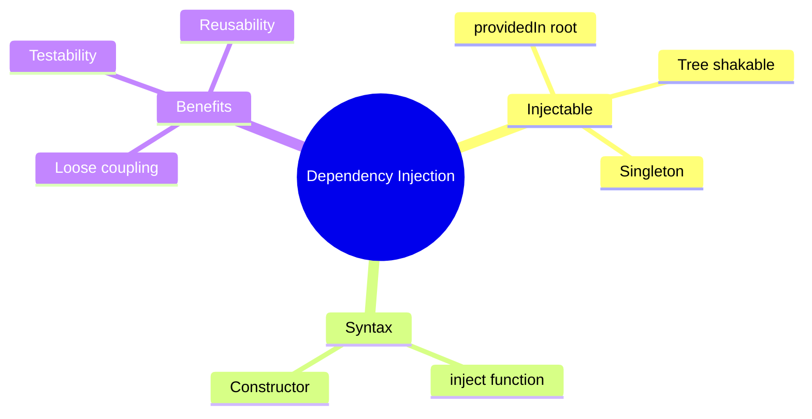

# 💉 Use Case 1: Basic Dependency Injection

> **💡 Lightbulb Moment**: DI lets Angular create services for you and inject them - you just declare what you need!

---

## 1. 🔍 What is Dependency Injection?

A design pattern where classes receive dependencies from external sources rather than creating them.

```typescript
// WITHOUT DI - tightly coupled
export class UserComponent {
    private http = new HttpClient(...);  // Creating dependency manually
}

// WITH DI - loose coupling
export class UserComponent {
    constructor(private http: HttpClient) {}  // Angular provides it
}
```

---

## 2. 🚀 Creating Injectable Services

```typescript
@Injectable({
    providedIn: 'root'  // Singleton, available everywhere
})
export class UserService {
    private http = inject(HttpClient);
    
    getUsers(): Observable<User[]> {
        return this.http.get<User[]>('/api/users');
    }
}
```

### Using in Components
```typescript
@Component({...})
export class UsersComponent {
    private userService = inject(UserService);  // Modern syntax
    
    // OR using constructor
    constructor(private userService: UserService) {}  // Classic syntax
}
```

---

## 3. ❓ Interview Questions

### Basic Questions

#### Q1: What is providedIn: 'root'?
**Answer:** Creates a single instance (singleton) available throughout the entire application. Tree-shakable - if not used, it's removed from bundle.

#### Q2: inject() vs constructor injection - when to use which?
**Answer:**
| inject() | Constructor |
|----------|-------------|
| Field initializer | Constructor body |
| Works everywhere | Class context only |
| Modern (Angular 14+) | Classic |
| Required for inject in inherited classes | Traditional pattern |

#### Q3: What makes a class injectable?
**Answer:** The `@Injectable()` decorator. It tells Angular this class can have dependencies injected.

---

### Scenario-Based Questions

#### Scenario: Service Not Found Error
**Question:** You inject a service but get "NullInjectorError: No provider for X". Why?

**Answer:** The service isn't registered. Fix:
```typescript
// Option 1: providedIn in service
@Injectable({ providedIn: 'root' })

// Option 2: providers array in component/module
@Component({
    providers: [MyService]
})
```

---

## 🧠 Mind Map


