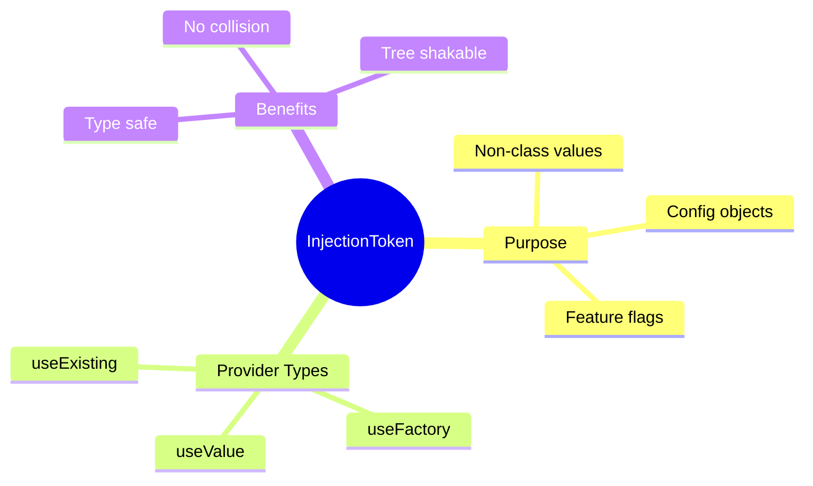

# 🎯 Use Case 2: Injection Tokens

> **💡 Lightbulb Moment**: InjectionToken lets you inject non-class values like strings, objects, or functions!

---

## 1. 🔍 What are Injection Tokens?

Tokens for injecting non-class dependencies (config objects, feature flags, etc.)

```typescript
import { InjectionToken } from '@angular/core';

export const API_URL = new InjectionToken<string>('API Base URL');
export const APP_CONFIG = new InjectionToken<AppConfig>('Application Config');
```

---

## 2. 🚀 Providing Token Values

```typescript
// app.config.ts
export const appConfig: ApplicationConfig = {
    providers: [
        { provide: API_URL, useValue: 'https://api.example.com' },
        { provide: APP_CONFIG, useValue: { theme: 'dark', locale: 'en' } }
    ]
};
```

### Using in Service/Component
```typescript
@Injectable({ providedIn: 'root' })
export class ApiService {
    private apiUrl = inject(API_URL);
    
    getData() {
        return this.http.get(`${this.apiUrl}/data`);
    }
}
```

---

## 3. ❓ Interview Questions

### Basic Questions

#### Q1: Why use InjectionToken instead of string token?
**Answer:** Strings can collide. InjectionToken is unique and type-safe:
```typescript
// ❌ String tokens can collide
{ provide: 'API_URL', useValue: 'http://...' }

// ✅ InjectionToken is unique
export const API_URL = new InjectionToken<string>('API_URL');
{ provide: API_URL, useValue: 'http://...' }
```

#### Q2: Can InjectionToken have a default value?
**Answer:** Yes! Using factory:
```typescript
export const DEBUG_MODE = new InjectionToken<boolean>('Debug Mode', {
    providedIn: 'root',
    factory: () => false  // Default value
});
```

---

### Scenario-Based Questions

#### Scenario: Environment-Based Config
**Question:** Inject different API URLs for dev/prod.

**Answer:**
```typescript
// environment.ts
export const API_URL = new InjectionToken<string>('API URL');

// app.config.ts
providers: [
    { provide: API_URL, useValue: environment.apiUrl }
]
```

---

## 🧠 Mind Map


