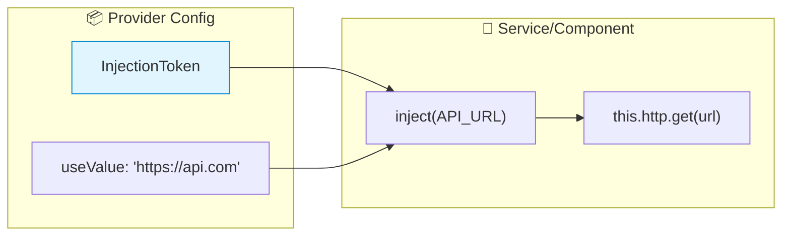
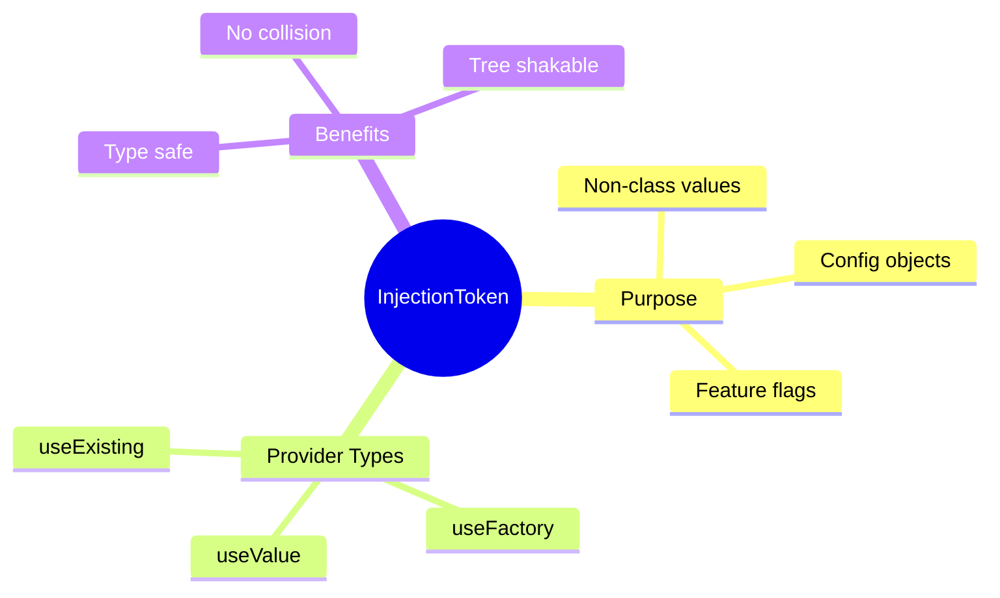

# 🎯 Use Case 2: Injection Tokens

> **💡 Lightbulb Moment**: InjectionToken lets you inject non-class values like strings, objects, or functions!

---

## 1. 🔍 What are Injection Tokens?

Tokens for injecting non-class dependencies (config objects, feature flags, etc.)

```typescript
import { InjectionToken } from '@angular/core';

export const API_URL = new InjectionToken<string>('API Base URL');
export const APP_CONFIG = new InjectionToken<AppConfig>('Application Config');
```

---

## 2. 🚀 Providing Token Values

```typescript
// app.config.ts
export const appConfig: ApplicationConfig = {
    providers: [
        { provide: API_URL, useValue: 'https://api.example.com' },
        { provide: APP_CONFIG, useValue: { theme: 'dark', locale: 'en' } }
    ]
};
```

### Using in Service/Component
```typescript
@Injectable({ providedIn: 'root' })
export class ApiService {
    private apiUrl = inject(API_URL);
    
    getData() {
        return this.http.get(`${this.apiUrl}/data`);
    }
}
```

### 📊 Data Flow Diagram



### 📦 Data Flow Summary (Visual Box Diagram)

```
┌─────────────────────────────────────────────────────────────┐
│  INJECTION TOKEN SYSTEM                                     │
│                                                             │
│   ① DEFINE TOKEN (Unique Key)                               │
│   ┌───────────────────────────────────────────────────────┐ │
│   │ export const API_URL = new InjectionToken<string>(    │ │
│   │   'API Base URL'  // Description for debugging        │ │
│   │ );                                                    │ │
│   │                                                       │ │
│   │ // Token is unique object reference, not a string!    │ │
│   │ // Two tokens with same name are DIFFERENT tokens     │ │
│   └───────────────────────────────────────────────────────┘ │
│          │                                                  │
│          ▼                                                  │
│   ② PROVIDE VALUE (app.config.ts)                           │
│   ┌───────────────────────────────────────────────────────┐ │
│   │ providers: [                                          │ │
│   │   { provide: API_URL, useValue: 'https://api.com' }   │ │
│   │ ]                                                     │ │
│   │                                                       │ │
│   │ // "When someone asks for API_URL token,              │ │
│   │ //  give them this string value"                      │ │
│   └───────────────────────────────────────────────────────┘ │
│          │                                                  │
│          ▼                                                  │
│   ③ INJECT IN SERVICE                                       │
│   ┌───────────────────────────────────────────────────────┐ │
│   │ @Injectable({ providedIn: 'root' })                   │ │
│   │ export class ApiService {                             │ │
│   │   private apiUrl = inject(API_URL);  // string type!  │ │
│   │                                                       │ │
│   │   getData() {                                         │ │
│   │     return this.http.get(`${this.apiUrl}/data`);      │ │
│   │   }  // Uses: 'https://api.com/data'                  │ │
│   │ }                                                     │ │
│   └───────────────────────────────────────────────────────┘ │
│                                                             │
│   ❌ STRING TOKENS (Collision Risk!):                       │
│   ┌───────────────────────────────────────────────────────┐ │
│   │ { provide: 'API_URL', useValue: 'https://a.com' }     │ │
│   │ { provide: 'API_URL', useValue: 'https://b.com' }     │ │
│   │ // ⚠️ Second overwrites first! String collision!      │ │
│   └───────────────────────────────────────────────────────┘ │
└─────────────────────────────────────────────────────────────┘
```

**InjectionToken Benefits:**
1. **Type-safe**: Generic `<string>` ensures correct type at inject site
2. **Unique**: Object reference, not string - no collision possible
3. **Tree-shakable**: Unused tokens removed from bundle
4. **Self-documenting**: Description helps debugging

> **Key Takeaway**: Use `InjectionToken<T>` for non-class values like config strings, objects, or feature flags. Never use string tokens!

---

## 3. ❓ Interview Questions

### Basic Questions

#### Q1: Why use InjectionToken instead of string token?
**Answer:** Strings can collide. InjectionToken is unique and type-safe:
```typescript
// ❌ String tokens can collide
{ provide: 'API_URL', useValue: 'http://...' }

// ✅ InjectionToken is unique
export const API_URL = new InjectionToken<string>('API_URL');
{ provide: API_URL, useValue: 'http://...' }
```

#### Q2: Can InjectionToken have a default value?
**Answer:** Yes! Using factory:
```typescript
export const DEBUG_MODE = new InjectionToken<boolean>('Debug Mode', {
    providedIn: 'root',
    factory: () => false  // Default value
});
```

---

### Scenario-Based Questions

#### Scenario: Environment-Based Config
**Question:** Inject different API URLs for dev/prod.

**Answer:**
```typescript
// environment.ts
export const API_URL = new InjectionToken<string>('API URL');

// app.config.ts
providers: [
    { provide: API_URL, useValue: environment.apiUrl }
]
```

---

## 🤝 Secret Handshake Analogy (Easy to Remember!)

Think of InjectionToken like a **secret handshake**:

| Concept | Handshake Analogy | Memory Trick |
|---------|------------------|--------------| 
| **InjectionToken** | 🤝 **Secret handshake**: Unique identifier for your request | **"Unique key"** |
| **String token** | 👋 **Regular wave**: Anyone can copy it (collision risk!) | **"Not unique"** |
| **useValue** | 📦 **Package contents**: "When they show handshake, give THIS" | **"The actual value"** |
| **factory** | 🏭 **Generate on demand**: Create value when needed | **"Lazy creation"** |
| **inject(TOKEN)** | 🙋 **Show handshake**: "I know the secret, give me access" | **"Request value"** |

### 📖 Story to Remember:

> 🤝 **The Secret Club**
>
> Your app is a club with secret handshakes:
>
> **Creating the Handshake (Token):**
> ```typescript
> // This handshake is UNIQUE to your club
> export const API_URL = new InjectionToken<string>('API URL');
>
> // ❌ String = anyone can copy
> { provide: 'API_URL', useValue: '...' }  // Collision possible!
>
> // ✅ Token = secret handshake only YOU know
> { provide: API_URL, useValue: 'https://api.myapp.com' }
> ```
>
> **Using the Handshake:**
> ```typescript
> @Injectable()
> export class ApiService {
>   private url = inject(API_URL);  // 🙋 Show handshake, get value!
>   
>   // Now I have access: 'https://api.myapp.com'
> }
> ```
>
> **Unique handshake = no impersonators!**

### 🎯 Quick Reference:
```
🤝 InjectionToken  = Secret handshake (unique identifier)
👋 String token    = Regular wave (collision risk)
📦 useValue        = What to give when handshake matches
🏭 factory         = Generate value on demand
🙋 inject(TOKEN)   = Show handshake, get value
```

---

## 🧠 Mind Map



---

## ❓ Additional Interview Questions (20+)

### Basic Questions

**Q3: What types of values can InjectionToken inject?**
> A: Strings, numbers, objects, arrays, functions - any non-class value.

**Q4: What does the string parameter in InjectionToken constructor do?**
> A: It's a description for debugging - appears in error messages.

**Q5: Are two tokens with the same description the same token?**
> A: No! Each `new InjectionToken()` creates a unique reference.

---

### Provider Types Questions

**Q6: What's the difference between useValue and useFactory?**
> A: 
> - `useValue`: Static value provided immediately
> - `useFactory`: Function that creates value lazily

**Q7: When should you use useFactory?**
> A: When value depends on other services or needs to be computed.

**Q8: What's useExisting for?**
> A: Alias one token to another - useful for backwards compatibility.

---

### Default Value Questions

**Q9: How do you provide a default value for a token?**
> A: Use factory in InjectionToken constructor:
> ```typescript
> new InjectionToken('', { providedIn: 'root', factory: () => defaultValue })
> ```

**Q10: What happens if token isn't provided and has no default?**
> A: Angular throws NullInjectorError at runtime.

**Q11: How do you make a token optional?**
> A: Use `inject(TOKEN, { optional: true })` - returns null if not found.

---

### Scenario Questions

**Q12: Inject different API URLs for dev/prod.**
> A: Use environment variable in provider: `{ provide: API_URL, useValue: environment.apiUrl }`.

**Q13: Inject a configuration object.**
> A: 
> ```typescript
> const CONFIG = new InjectionToken<AppConfig>('config');
> { provide: CONFIG, useValue: { theme: 'dark' } }
> ```

**Q14: Create token with factory that depends on another service.**
> A:
> ```typescript
> { provide: API_URL, useFactory: (env: EnvService) => env.getUrl(), deps: [EnvService] }
> ```

---

### Best Practice Questions

**Q15: Why avoid string tokens?**
> A: Strings can accidentally collide. InjectionToken is unique object reference.

**Q16: Where should tokens be exported?**
> A: In a shared file (e.g., `tokens.ts`) imported by providers and consumers.

**Q17: How do you test with injection tokens?**
> A: Provide test value in TestBed: `{ provide: API_URL, useValue: 'http://test' }`.

---

### Advanced Questions

**Q18: What's multi: true provider option?**
> A: Collects multiple values for same token into an array.

**Q19: Can tokens be tree-shaken?**
> A: Yes, if using `providedIn: 'root'` with factory - unused tokens are removed.

**Q20: How do you type complex token values?**
> A: Use generic: `InjectionToken<{ theme: string; locale: string }>('config')`.

