# 🔢 Use Case 2: Singleton vs Component-Scoped Services

> **Goal**: Master the critical difference between **application-wide singletons** and **component-scoped instances** - understanding when each is appropriate and avoiding common bugs.

---

## 1. 🔍 How It Works (The Concept)

### The Mechanism
Angular allows you to provide services at different levels of the component tree:
- **Root Level** (`providedIn: 'root'`): ONE instance for the entire app
- **Component Level** (`providers: [...]`): NEW instance for that component and its children

The **same service class** can create **different instances** depending on WHERE it's provided.

### Default vs. Optimized Behavior

| Scenario | Singleton (Root) | Component-Scoped |
|----------|------------------|------------------|
| **Instance Count** | 1 for entire app | 1 per component using `providers` |
| **State Sharing** | All components share state | Each component tree has isolated state |
| **Memory** | Minimal (1 instance) | Higher (multiple instances) |
| **Lifecycle** | Lives for app lifetime | Destroyed with component |
| **Use Case** | Auth, Config, Cart | Forms, Wizards, Isolated widgets |

### 📊 Scope Comparison Diagram

```mermaid
flowchart TB
    subgraph App["🅰️ Application"]
        Root["🌍 Root Injector<br/>providedIn: 'root'"]
        
        subgraph Singleton["Singleton Service"]
            S1["CounterService<br/>ID: ABC123<br/>count: 5"]
        end
        
        subgraph Parent["👨‍💼 Parent Component"]
            ParentC["Uses Root Singleton"]
        end
        
        subgraph ChildA["🔒 Child A<br/>providers: [CounterService]"]
            SA["CounterService<br/>ID: XYZ789<br/>count: 2"]
            ChildAC["Own Instance!"]
        end
        
        subgraph ChildB["🌍 Child B<br/>No providers"]
            ChildBC["Uses Root Singleton"]
        end
    end
    
    Root --> S1
    S1 -.->|"Shared"| ParentC
    S1 -.->|"Shared"| ChildBC
    ChildA --> SA
    
    style S1 fill:#e3f2fd,stroke:#1565c0,stroke-width:2px
    style SA fill:#fff3e0,stroke:#ff6f00,stroke-width:2px
    style ChildA fill:#fce4ec,stroke:#c2185b
    style ChildB fill:#e8f5e9,stroke:#388e3c
```



---

---

## 2. 🛡️ The Problem & Solution

### The Problem: "The Shared State Trap" 🕸️
By default, services are Singletons. This is great for Auth, but terrible for widgets.
*   **Scenario**: You have a `CounterService`.
*   **Issue**: If you use it in two different widgets, clicking "+" in one updates BOTH.
*   **Result**: Unintended side effects and "spooky action at a distance".

### The Solution: "Component Scoping" 📦
Angular allows you to create a **new instance** for a specific component tree.
*   **Concept**: Add the service to the component's `providers: []` array.
*   **Result**: Angular creates a fresh instance just for that component and its children.
*   **Benefit**: Complete isolation. Widget A doesn't affect Widget B.

---

## 3. 🚀 Step-by-Step Implementation Guide

### Step 1: Create a Service with Instance Tracking

```typescript
// counter.service.ts
import { Injectable } from '@angular/core';

@Injectable({
    providedIn: 'root'  // Default: App-wide singleton
})
export class CounterService {
    /**
     * 🛡️ CRITICAL: Unique ID to identify THIS instance
     * Helps visualize when different instances are created
     */
    readonly instanceId: string;
    private _count = 0;
    
    constructor() {
        // Generate random ID for debugging
        this.instanceId = Math.random().toString(36).substring(2, 6).toUpperCase();
        console.log(`[CounterService] NEW instance: ${this.instanceId}`);
    }
    
    get count(): number { return this._count; }
    
    increment(): void {
        this._count++;
        console.log(`[${this.instanceId}] Count: ${this._count}`);
    }
    
    decrement(): void {
        this._count--;
    }
}
```

### Step 2: Parent Component (Uses Singleton)

```typescript
// parent.component.ts
import { Component } from '@angular/core';
import { CounterService } from './counter.service';

@Component({
    selector: 'app-parent',
    template: `
        <div class="panel">
            <h3>Parent (Singleton)</h3>
            <p>Instance ID: {{ counter.instanceId }}</p>
            <p>Count: {{ counter.count }}</p>
            <button (click)="counter.increment()">+</button>
        </div>
        <app-child-a></app-child-a>
        <app-child-b></app-child-b>
    `
    // 🛡️ CRITICAL: NO providers array = uses root singleton
})
export class ParentComponent {
    constructor(public counter: CounterService) {
        console.log('[Parent] Using singleton:', this.counter.instanceId);
    }
}
```

### Step 3: Child A - Component-Scoped (Own Instance)

```typescript
// child-a.component.ts
import { Component } from '@angular/core';
import { CounterService } from './counter.service';

@Component({
    selector: 'app-child-a',
    template: `
        <div class="panel isolated">
            <h3>Child A (Own Instance)</h3>
            <p>Instance ID: {{ counter.instanceId }}</p>
            <p>Count: {{ counter.count }}</p>
            <button (click)="counter.increment()">+</button>
        </div>
    `,
    /**
     * 🛡️ CRITICAL: providers array creates NEW instance!
     * This shadows the root singleton for this component tree
     */
    providers: [CounterService]
})
export class ChildAComponent {
    constructor(public counter: CounterService) {
        // This is a DIFFERENT instance than Parent's!
        console.log('[ChildA] Own instance:', this.counter.instanceId);
    }
}
```

### Step 4: Child B - Uses Singleton (Shares with Parent)

```typescript
// child-b.component.ts
import { Component } from '@angular/core';
import { CounterService } from './counter.service';

@Component({
    selector: 'app-child-b',
    template: `
        <div class="panel shared">
            <h3>Child B (Shares with Parent)</h3>
            <p>Instance ID: {{ counter.instanceId }}</p>
            <p>Count: {{ counter.count }}</p>
            <button (click)="counter.increment()">+</button>
        </div>
    `
    // 🛡️ CRITICAL: NO providers = inherits from parent (root singleton)
})
export class ChildBComponent {
    constructor(public counter: CounterService) {
        // SAME instance as Parent!
        console.log('[ChildB] Shared singleton:', this.counter.instanceId);
    }
}
```

### 📊 Instance Resolution Flow

```mermaid
sequenceDiagram
    participant App as 🅰️ Angular
    participant Root as 🌍 Root Injector
    participant Parent as 👨‍💼 Parent
    participant ChildA as 🔒 Child A
    participant ChildB as 🌍 Child B
    
    Note over App: Startup
    App->>Root: Create CounterService (ID: ABC)
    
    Note over Parent: Request CounterService
    Parent->>Root: Looking for CounterService
    Root-->>Parent: Here's ABC ✅
    
    Note over ChildA: Has providers: [CounterService]
    ChildA->>ChildA: Create NEW CounterService (ID: XYZ)
    Note right of ChildA: Shadows root!
    
    Note over ChildB: No providers
    ChildB->>Root: Looking for CounterService
    Root-->>ChildB: Here's ABC ✅
    
    Note over Parent,ChildB: Parent clicks +
    Parent->>Root: ABC.count++ → 1
    Note over ChildB: ChildB sees count = 1 ✅
    Note over ChildA: ChildA still sees count = 0<br/>(different instance)
```



---

## 3. 🐛 Common Pitfalls & Debugging

### ❌ Pitfall 1: Expecting Shared State with `providers`

**Bad Code (Expecting Shared State):**
```typescript
// User thinks state will be shared
@Component({
    selector: 'app-widget',
    providers: [CounterService]  // ❌ Creates new instance!
})
export class WidgetComponent {
    constructor(private counter: CounterService) {
        // Each widget has its own counter!
    }
}

// In parent template:
<app-widget></app-widget>  <!-- Counter A: 0 -->
<app-widget></app-widget>  <!-- Counter B: 0 -->
<app-widget></app-widget>  <!-- Counter C: 0 -->
// Clicking + on Counter A doesn't affect B or C!
```

**Why it fails:** Each `<app-widget>` creates its own `CounterService` instance because of the `providers` array.

**Good Code (Shared State):**
```typescript
@Component({
    selector: 'app-widget',
    // ✅ NO providers - uses singleton
})
export class WidgetComponent {
    constructor(private counter: CounterService) {
        // All widgets share the same counter!
    }
}
```

---

### ❌ Pitfall 2: Forgetting `providers` Creates Memory Leak Risk

**Bad Code:**
```typescript
@Component({
    selector: 'app-ephemeral',
    providers: [HeavyService]  // ⚠️ New instance each time
})
export class EphemeralComponent {
    // Created/destroyed many times...
}
```

**Problem:** If `HeavyService` caches data or holds resources, each new instance accumulates memory.

**Good Code:**
```typescript
// Option 1: Use singleton if state can be shared
@Injectable({ providedIn: 'root' })
export class HeavyService { ... }

// Option 2: Clean up on destroy
@Component({
    selector: 'app-ephemeral',
    providers: [HeavyService]
})
export class EphemeralComponent implements OnDestroy {
    constructor(private heavyService: HeavyService) {}
    
    ngOnDestroy() {
        this.heavyService.cleanup();  // ✅ Explicit cleanup
    }
}
```

---

### ❌ Pitfall 3: Confusion About Instance Identity

**Debugging Technique:**
```typescript
@Injectable({ providedIn: 'root' })
export class DebugService {
    readonly id = Math.random().toString(36).substring(2, 6);
    
    constructor() {
        console.log(`🆕 DebugService created: ${this.id}`);
    }
}

// In components:
constructor(private svc: DebugService) {
    console.log(`📍 Component using: ${this.svc.id}`);
}
```

**Output reveals the truth:**
```
🆕 DebugService created: A1B2     // Only once!
📍 Parent using: A1B2
📍 ChildB using: A1B2              // Same!
🆕 DebugService created: C3D4     // New instance!
📍 ChildA using: C3D4              // Different!
```

---

## 4. ⚡ Performance & Architecture

### Performance Comparison

| Metric | Singleton | Component-Scoped |
|--------|-----------|------------------|
| **Memory per Instance** | ~1KB (varies) | ~1KB × N components |
| **Creation Time** | Once at startup | Each component creation |
| **Garbage Collection** | Never (until app closes) | When component destroys |
| **State Access** | O(1) - direct reference | O(1) - direct reference |

### When to Use Each


### Architectural Implications

| Pattern | Singleton | Component-Scoped |
|---------|-----------|------------------|
| **State Management** | Global store | Local component state |
| **Testing** | Mock once for all tests | Mock per component test |
| **Memory** | Fixed overhead | Scales with component count |
| **Communication** | Easy cross-component | Isolated silos |

---

## 5. 🌍 Real World Use Cases

### 1. 🔐 Singleton: Authentication Service
```typescript
@Injectable({ providedIn: 'root' })
export class AuthService {
    private user: User | null = null;
    // Entire app needs to know auth state
}
```
- Login status needed in navbar, guards, API interceptors
- **Must be singleton** - can't have different auth states!

### 2. 📝 Component-Scoped: Form State Service
```typescript
@Component({
    selector: 'app-multi-step-form',
    providers: [FormStateService]  // ✅ Isolated per form
})
export class MultiStepFormComponent { }
```
- Each form instance tracks its own progress
- Opening two forms should have independent state

### 3. 🖼️ Component-Scoped: Image Gallery Instance
```typescript
@Component({
    selector: 'app-image-gallery',
    providers: [GalleryService]  // ✅ Each gallery is independent
})
export class ImageGalleryComponent { }
```
- Each gallery has its own selected image, zoom level
- Multiple galleries on a page shouldn't interfere

---

## 6. 📝 The Analogy: "Coffee Machines" ☕

### Singleton (Root-Level)
> **The Break Room Coffee Machine**
> - ONE machine for the entire office
> - Everyone uses the same coffee pot
> - If someone brews strong coffee, everyone gets strong coffee
> - Efficient: One machine to maintain

### Component-Scoped (providers)
> **Personal Desk Espresso Makers**
> - Each person has their OWN machine
> - Your coffee preference doesn't affect neighbors
> - More machines = more maintenance
> - Isolated: Your machine, your rules

**When to use each:**
- **Break room (singleton)**: Shared resources everyone needs (Auth, Config)
- **Personal machine (scoped)**: Isolated experiences (Forms, Galleries)

---

## 7. ❓ Interview & Concept Questions

### Core Concepts

**Q1: What's the difference between `providedIn: 'root'` and component-level `providers`?**
> **A:** 
> - `providedIn: 'root'`: Creates ONE instance at app startup, shared everywhere
> - `providers: [Service]`: Creates a NEW instance for that component tree, isolated from rest of app

**Q2: If a parent provides a service and a child also provides it, which does the child get?**
> **A:** The child gets its OWN fresh instance (the child's provider "shadows" the parent's). The child's subtree uses the child's instance; everything else uses the parent's.

### Debugging

**Q3: How do you debug which service instance a component is using?**
> **A:** Add a unique ID in the service constructor:
> ```typescript
> readonly id = Math.random().toString(36).substring(2, 8);
> constructor() { console.log('Service created:', this.id); }
> ```
> Then log the ID in each component to see if they match.

**Q4: Two sibling components show different counter values unexpectedly. What's wrong?**
> **A:** One of them probably has `providers: [CounterService]` in its decorator, creating an isolated instance. Remove it to share the singleton.

### Performance

**Q5: Is there a memory cost to using component-level providers?**
> **A:** Yes. Each component with `providers` creates a new instance. If the service caches data or holds subscriptions, this multiplies memory usage. Also, new instances mean new constructor calls.

**Q6: When should you prefer component-scoped services despite the overhead?**
> **A:** When isolation is more important than efficiency:
> - Multiple independent forms
> - Reusable widgets with own state
> - Components that should reset on recreation

### Architecture

**Q7: Design a wizard component with 5 steps that can be used multiple times on the same page.**
> **A:** Use component-level providers:
> ```typescript
> @Component({
>     selector: 'app-wizard',
>     providers: [WizardStateService]  // Each wizard is independent
> })
> ```
> Each `<app-wizard>` instance has its own step tracking.

### Scenario-Based

**Q8: You have a `NotificationService` that shows toasts. Should it be singleton or scoped?**
> **A:** **Singleton**. Toasts should appear in one consistent location. If scoped, each component might try to render its own toast container, causing chaos.

**Q9: You're building a code editor like VS Code with multiple tabs. Each tab is its own editor instance. How do you handle `EditorStateService`?**
> **A:** **Component-scoped**. Each tab component provides its own `EditorStateService`:
> ```typescript
> @Component({
>     selector: 'app-editor-tab',
>     providers: [EditorStateService]
> })
> ```
> Each tab has independent undo history, cursor position, etc.

**Q10: What happens when a component with `providers: [Service]` is destroyed?**
> **A:** The service instance is eligible for garbage collection (assuming no other references). This is useful for cleanup but risky if you expected state persistence. The next time the component is created, a completely new instance is made.
