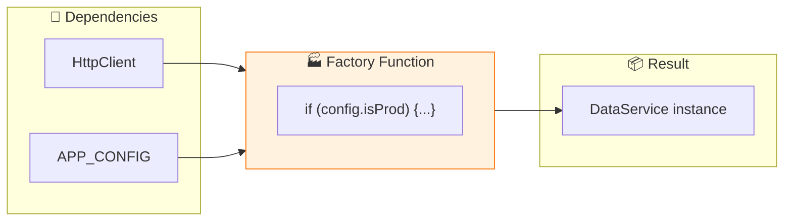
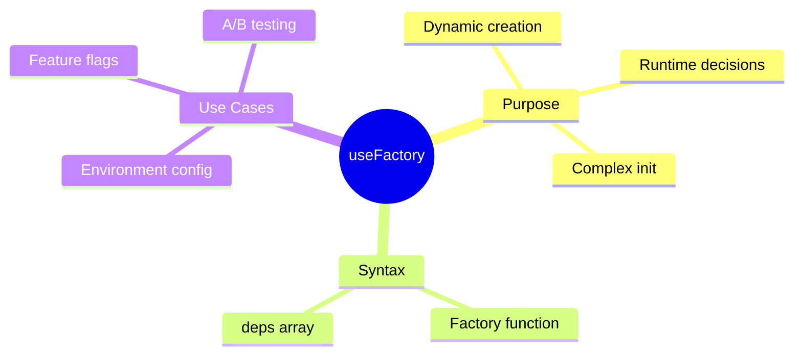

# 🏭 Use Case 3: useFactory Provider

> **💡 Lightbulb Moment**: useFactory lets you create dependencies dynamically based on runtime conditions!

---

## 1. 🔍 What is useFactory?

A factory function that returns the dependency value.

```typescript
providers: [
    {
        provide: Logger,
        useFactory: () => {
            return environment.production ? new ProductionLogger() : new DebugLogger();
        }
    }
]
```

---

## 2. 🚀 Factory with Dependencies

```typescript
providers: [
    {
        provide: DataService,
        useFactory: (http: HttpClient, config: AppConfig) => {
            return new DataService(http, config.apiUrl);
        },
        deps: [HttpClient, APP_CONFIG]  // Dependencies passed to factory
    }
]
```

### 📊 Data Flow Diagram



### 📦 Data Flow Summary (Visual Box Diagram)

```
┌─────────────────────────────────────────────────────────────┐
│  useFactory PROVIDER                                        │
│                                                             │
│   ① DEFINE FACTORY PROVIDER                                 │
│   ┌───────────────────────────────────────────────────────┐ │
│   │ providers: [                                          │ │
│   │   {                                                   │ │
│   │     provide: Logger,                                  │ │
│   │     useFactory: (isProd: boolean) => {                │ │
│   │       //                                              │ │
│   │       // 🏭 Factory runs at INJECTION TIME            │ │
│   │       //                                              │ │
│   │       if (isProd) {                                   │ │
│   │         return new ProductionLogger();  // 🔴         │ │
│   │       } else {                                        │ │
│   │         return new DebugLogger();       // 🟢         │ │
│   │       }                                               │ │
│   │     },                                                │ │
│   │     deps: [IS_PRODUCTION]  // ← Factory dependencies  │ │
│   │   }                                                   │ │
│   │ ]                                                     │ │
│   └───────────────────────────────────────────────────────┘ │
│                                                             │
│   ② AT INJECTION TIME                                       │
│   ┌───────────────────────────────────────────────────────┐ │
│   │                                                       │ │
│   │  deps: [IS_PRODUCTION]                                │ │
│   │        │                                              │ │
│   │        ▼                                              │ │
│   │  Angular injects: true                                │ │
│   │        │                                              │ │
│   │        ▼                                              │ │
│   │  Factory((isProd = true)) => ProductionLogger         │ │
│   │        │                                              │ │
│   │        ▼                                              │ │
│   │  inject(Logger) receives: ProductionLogger instance   │ │
│   │                                                       │ │
│   └───────────────────────────────────────────────────────┘ │
│                                                             │
│   useFactory vs useValue:                                   │
│   ┌───────────────────────────────────────────────────────┐ │
│   │ useValue:   📦 Static, same every time                │ │
│   │ useFactory: 🏭 Dynamic, runs logic to decide          │ │
│   │ useClass:   🏗️ Creates instance of specified class    │ │
│   └───────────────────────────────────────────────────────┘ │
└─────────────────────────────────────────────────────────────┘
```

**useFactory Use Cases:**
1. **Environment-based**: Different loggers for dev/prod
2. **Feature flags**: Enable/disable features dynamically
3. **Complex initialization**: Services needing setup logic
4. **Conditional dependencies**: Based on runtime config

> **Key Takeaway**: `useFactory` lets you run code to DECIDE what instance to create. Use `deps` to inject other services into your factory!

---

## 3. ❓ Interview Questions

### Basic Questions

#### Q1: When use useFactory vs useValue?
**Answer:**
| useValue | useFactory |
|----------|------------|
| Static value | Dynamic creation |
| Simple config | Complex initialization |
| No dependencies | Needs other services |

#### Q2: What is the deps array?
**Answer:** Lists dependencies that Angular should inject into the factory function.

---

### Scenario-Based Questions

#### Scenario: Feature Flag Service
**Question:** Create service that behaves differently based on environment.

**Answer:**
```typescript
{
    provide: FeatureService,
    useFactory: (http: HttpClient, config: AppConfig) => {
        if (config.useRemoteFeatures) {
            return new RemoteFeatureService(http);
        }
        return new LocalFeatureService();
    },
    deps: [HttpClient, APP_CONFIG]
}
```

---

## 🎰 Vending Machine Analogy (Easy to Remember!)

Think of useFactory like a **smart vending machine**:

| Concept | Vending Machine Analogy | Memory Trick |
|---------|------------------------|--------------| 
| **useFactory** | 🎰 **Vending machine**: Makes choices based on input | **"Dynamic creation"** |
| **Factory function** | ⚙️ **Machine logic**: Decides what to dispense | **"Decision function"** |
| **deps array** | 🪙 **Coins/buttons**: What machine needs to decide | **"Dependencies"** |
| **Return value** | 🥤 **Product dispensed**: The service you get | **"Instance created"** |
| **useValue** | 📦 **Pre-packaged box**: Same item every time | **"Static value"** |

### 📖 Story to Remember:

> 🎰 **The Smart Vending Machine**
>
> Your app needs a logger service:
>
> **Factory decides what you get:**
> ```typescript
> {
>   provide: Logger,
>   useFactory: (isProd: boolean) => {
>     // Machine checks: "Production mode?"
>     return isProd 
>       ? new ProductionLogger()   // 🔴 Red can
>       : new DebugLogger();       // 🟢 Green can
>   },
>   deps: [IS_PRODUCTION]  // 🪙 Coins inserted
> }
> ```
>
> **Machine makes the decision, not you!**

### 🎯 Quick Reference:
```
🎰 useFactory     = Vending machine (dynamic)
📦 useValue       = Pre-packaged (static)
⚙️ Factory fn     = Decision logic
🪙 deps           = Inputs needed
🥤 Return         = Service dispensed
```

---

## 🧠 Mind Map


