# 🌳 Use Case 3: providedIn Hierarchy

> **Goal**: Master the different `providedIn` options and understand Angular's injector hierarchy - knowing exactly where your service lives and who can access it.

---

## 1. 🔍 How It Works (The Concept)

### The Mechanism
Angular has a **hierarchical injector system**. When you request a dependency, Angular looks up the "injector tree" until it finds a provider. The `providedIn` option controls WHERE in this hierarchy your service is registered.

### The Three `providedIn` Options

| Option | Scope | Instance Count | Use Case |
|--------|-------|----------------|----------|
| `'root'` | Application-wide | 1 singleton | Auth, Config, HTTP |
| `'any'` | Per lazy module | 1 per lazy bundle | Feature-specific state |
| `'platform'` | Multi-app (rare) | 1 across all Angular apps | Micro-frontends |

### 📊 Injector Hierarchy Diagram

```mermaid
flowchart TB
    subgraph Platform["🌐 Platform Level"]
        PI["Platform Injector<br/>📦 providedIn: 'platform'"]
    end
    
    subgraph App["🅰️ Application Level"]
        RI["Root Injector<br/>📦 providedIn: 'root'"]
    end
    
    subgraph Lazy["📦 Lazy-Loaded Modules"]
        LM1["Module A Injector<br/>📦 providedIn: 'any'"]
        LM2["Module B Injector<br/>📦 providedIn: 'any'"]
    end
    
    subgraph Components["📱 Component Level"]
        C1["Component Injector<br/>📦 providers: [...]"]
    end
    
    Platform --> App
    App --> Lazy
    Lazy --> LM1
    Lazy --> LM2
    LM1 --> C1
    LM2 --> C1
    
    style PI fill:#e1bee7,stroke:#7b1fa2,stroke-width:2px
    style RI fill:#bbdefb,stroke:#1976d2,stroke-width:2px
    style LM1 fill:#c8e6c9,stroke:#388e3c,stroke-width:2px
    style LM2 fill:#c8e6c9,stroke:#388e3c,stroke-width:2px
    style C1 fill:#ffe0b2,stroke:#f57c00,stroke-width:2px
```



### Default vs. Optimized Behavior

| Aspect | No providedIn | providedIn: 'root' |
|--------|---------------|-------------------|
| **Registration** | Manual in module `providers` | Automatic |
| **Tree-shaking** | ❌ Always bundled | ✅ Removed if unused |
| **Discoverable** | Must check modules | Self-documenting |
| **Best Practice** | Legacy | Modern (Angular 6+) |

---

## 2. 🚀 Step-by-Step Implementation Guide

### Step 1: providedIn: 'root' (Most Common)

```typescript
// auth.service.ts
import { Injectable } from '@angular/core';

/**
 * 🛡️ CRITICAL: 'root' = Application-wide singleton
 * - Created at app startup
 * - Same instance everywhere
 * - Tree-shakable if not used
 */
@Injectable({
    providedIn: 'root'
})
export class AuthService {
    private currentUser: User | null = null;
    
    login(credentials: Credentials): Observable<User> {
        // All components see the same logged-in state
        return this.http.post<User>('/api/login', credentials).pipe(
            tap(user => this.currentUser = user)
        );
    }
    
    isAuthenticated(): boolean {
        return !!this.currentUser;
    }
}
```

### Step 2: providedIn: 'any' (Per Lazy Module)

```typescript
// feature-state.service.ts
import { Injectable } from '@angular/core';

/**
 * 🛡️ CRITICAL: 'any' = One instance per lazy-loaded module
 * - Each lazy bundle gets its own instance
 * - Eager modules share one instance
 * - Useful for feature-specific state
 */
@Injectable({
    providedIn: 'any'
})
export class FeatureStateService {
    readonly instanceId = Math.random().toString(36).substring(2, 6);
    
    private data: any[] = [];
    
    constructor() {
        console.log(`[FeatureState] Created: ${this.instanceId}`);
    }
    
    addData(item: any): void {
        this.data.push(item);
    }
}
```

**Module Structure:**
```
app/
├── app.module.ts          (eager - uses instance A)
├── feature-a/             (lazy - uses instance B)
│   └── feature-a.module.ts
└── feature-b/             (lazy - uses instance C)
    └── feature-b.module.ts
```

### Step 3: providedIn: 'platform' (Advanced)

```typescript
// shared-analytics.service.ts
import { Injectable, PLATFORM_ID, Inject } from '@angular/core';

/**
 * 🛡️ CRITICAL: 'platform' = Shared across multiple Angular apps
 * - Rare use case
 * - Used in micro-frontends
 * - Single instance across ALL Angular apps on the page
 */
@Injectable({
    providedIn: 'platform'
})
export class SharedAnalyticsService {
    private events: AnalyticsEvent[] = [];
    
    track(event: AnalyticsEvent): void {
        this.events.push(event);
        // Both App1 and App2 log to the same array
    }
}
```

### 📊 Resolution Flow Diagram

```mermaid
sequenceDiagram
    participant C as 🧩 Component
    participant CI as 📦 Component Injector
    participant MI as 📦 Module Injector
    participant RI as 🌍 Root Injector
    participant PI as 🌐 Platform Injector
    
    Note over C: Needs AuthService
    
    C->>CI: Do you have AuthService?
    CI-->>C: ❌ No
    
    C->>MI: Do you have AuthService?
    MI-->>C: ❌ No
    
    C->>RI: Do you have AuthService?
    RI-->>C: ✅ Yes! (providedIn: 'root')
    
    Note over C: Needs PlatformService
    
    C->>CI: Do you have PlatformService?
    CI-->>C: ❌ No
    C->>MI: Do you have PlatformService?
    MI-->>C: ❌ No
    C->>RI: Do you have PlatformService?
    RI-->>C: ❌ No
    C->>PI: Do you have PlatformService?
    PI-->>C: ✅ Yes! (providedIn: 'platform')
```



---

## 3. 🐛 Common Pitfalls & Debugging

### ❌ Pitfall 1: Thinking 'any' Creates Per-Component Instances

**Wrong Understanding:**
```typescript
@Injectable({ providedIn: 'any' })
export class DataService { }

// ❌ WRONG: Thinking each component gets its own
<app-widget></app-widget>  <!-- Instance 1? -->
<app-widget></app-widget>  <!-- Instance 2? -->
```

**Correct Understanding:**
```typescript
// ✅ CORRECT: 'any' means per LAZY MODULE, not per component
// All components in the same lazy module share ONE instance
// Different lazy modules get different instances
```

---

### ❌ Pitfall 2: Using 'platform' When 'root' Suffices

**Bad Code:**
```typescript
// ❌ Overkill - most apps don't need platform scope
@Injectable({ providedIn: 'platform' })
export class SimpleDataService { }
```

**Good Code:**
```typescript
// ✅ 'root' is correct for 99% of use cases
@Injectable({ providedIn: 'root' })
export class SimpleDataService { }
```

**Why it matters:** `'platform'` only makes sense when you have multiple Angular apps bootstrapped on the same page (micro-frontends).

---

### ❌ Pitfall 3: Circular Dependency with Module-based Providers

**Bad Code:**
```typescript
// ❌ Creates circular reference
@Injectable({
    providedIn: MyFeatureModule  // Don't do this!
})
export class FeatureService { }
```

**Good Code:**
```typescript
// ✅ Use 'root' or 'any' instead
@Injectable({ providedIn: 'root' })
export class FeatureService { }

// Or for lazy module isolation:
@Injectable({ providedIn: 'any' })
export class FeatureService { }
```

---

## 4. ⚡ Performance & Architecture

### Tree-Shaking Benefits

| providedIn | Tree-Shakable | Result |
|------------|---------------|--------|
| ✅ `'root'` | Yes | Removed if unused |
| ✅ `'any'` | Yes | Removed if unused |
| ✅ `'platform'` | Yes | Removed if unused |
| ❌ Module `providers` | No | Always bundled |

### Memory Footprint Comparison

```mermaid
flowchart LR
    subgraph Root["providedIn: 'root'"]
        R1["1 instance<br/>~1KB"]
    end
    
    subgraph Any["providedIn: 'any'"]
        A1["Eager: 1<br/>~1KB"]
        A2["Lazy A: 1<br/>~1KB"]
        A3["Lazy B: 1<br/>~1KB"]
        A4["Total: ~3KB"]
    end
    
    subgraph Component["providers: [...]"]
        C1["Comp 1: 1KB"]
        C2["Comp 2: 1KB"]
        C3["..."]
        C4["Comp N: 1KB"]
        C5["Total: N × 1KB"]
    end
    
    style Root fill:#e8f5e9,stroke:#2e7d32
    style Any fill:#fff3e0,stroke:#ef6c00
    style Component fill:#ffebee,stroke:#c62828
```



### Lazy Loading Architecture

```mermaid
flowchart TB
    subgraph Main["📦 Main Bundle"]
        AppMod["AppModule"]
        RootSvc["AuthService<br/>providedIn: 'root'"]
    end
    
    subgraph LazyA["📦 Feature A Bundle"]
        FeatureA["FeatureAModule"]
        AnySvcA["FeatureState<br/>providedIn: 'any'<br/>Instance A"]
    end
    
    subgraph LazyB["📦 Feature B Bundle"]
        FeatureB["FeatureBModule"]
        AnySvcB["FeatureState<br/>providedIn: 'any'<br/>Instance B"]
    end
    
    Main --> LazyA
    Main --> LazyB
    RootSvc -.->|"Shared"| FeatureA
    RootSvc -.->|"Shared"| FeatureB
    
    style RootSvc fill:#bbdefb,stroke:#1976d2
    style AnySvcA fill:#c8e6c9,stroke:#388e3c
    style AnySvcB fill:#c8e6c9,stroke:#388e3c
```



---

## 5. 🌍 Real World Use Cases

### 1. `'root'` - Global Authentication
```typescript
@Injectable({ providedIn: 'root' })
export class AuthService {
    // Navbar, guards, interceptors all need same auth state
    // MUST be a singleton
}
```

### 2. `'any'` - Feature-Specific State
```typescript
@Injectable({ providedIn: 'any' })
export class DashboardStateService {
    // Each lazy-loaded dashboard module has its own state
    // Admin dashboard vs User dashboard
}
```

### 3. `'platform'` - Micro-Frontend Analytics
```typescript
@Injectable({ providedIn: 'platform' })
export class AnalyticsService {
    // Single analytics pipe for multiple Angular apps
    // shell-app, mfe-1, mfe-2 all share this
}
```

---

## 6. 📝 The Analogy: "Office Building" 🏢

### Platform Injector = The Building
- Shared amenities: lobby, parking garage
- Multiple companies (apps) share these resources

### Root Injector = Your Company Floor
- Your company's shared resources: kitchen, conference rooms
- All departments (modules) on your floor share these

### Module Injector = Department
- Marketing department's own printer
- Each department has its own copy

### Component Injector = Your Desk
- Your personal supplies
- Only you use them

```mermaid
flowchart TB
    subgraph Building["🏢 Building (Platform)"]
        Lobby["🚪 Shared Lobby"]
        
        subgraph Floor["📍 Your Floor (Root)"]
            Kitchen["🍳 Shared Kitchen"]
            
            subgraph Dept1["📁 Marketing (Module)"]
                Printer1["🖨️ Dept Printer"]
                Desk1["🪑 Your Desk"]
            end
            
            subgraph Dept2["📁 Engineering (Module)"]
                Printer2["🖨️ Dept Printer"]
                Desk2["🪑 Dev's Desk"]
            end
        end
    end
    
    style Lobby fill:#e1bee7,stroke:#7b1fa2
    style Kitchen fill:#bbdefb,stroke:#1976d2
    style Printer1 fill:#c8e6c9,stroke:#388e3c
    style Printer2 fill:#c8e6c9,stroke:#388e3c
```



---

## 7. ❓ Interview & Concept Questions

### Core Concepts

**Q1: What are the three `providedIn` options and when to use each?**
> **A:**
> - `'root'`: App-wide singleton. Use for auth, config, global state.
> - `'any'`: One instance per lazy module. Use for feature isolation.
> - `'platform'`: Multi-app singleton. Use for micro-frontends.

**Q2: Why is `providedIn: 'root'` preferred over module `providers` array?**
> **A:**
> 1. **Tree-shakable**: Removed if unused
> 2. **Self-documenting**: Service declares its own scope
> 3. **No circular deps**: Doesn't reference module

### Debugging

**Q3: You have two lazy modules using `providedIn: 'any'`. Are their instances the same?**
> **A:** No. Each lazy-loaded module gets its own instance. That's the purpose of `'any'` - isolation per bundle boundary.

**Q4: A service marked `providedIn: 'root'` shows as undefined. Why?**
> **A:** Possible causes:
> 1. Circular dependency
> 2. Missing `@Injectable()` decorator
> 3. Service file not being imported anywhere (tree-shaken!)

### Performance

**Q5: How does `providedIn` affect bundle size?**
> **A:** `providedIn: 'root'` (and other options) enable tree-shaking. If a service is never injected anywhere, it's removed from the bundle entirely.

### Architecture

**Q6: When would you use `providedIn: 'platform'`?**
> **A:** Only for micro-frontend architectures where multiple Angular apps share the same browser page. Example: A shell app with several micro-frontend Angular apps, all needing shared analytics or auth.

**Q7: You're building a multi-tenant app where each tenant's module is lazy-loaded. How should services be scoped?**
> **A:**
> - Global auth: `'root'` (same user across tenants)
> - Tenant-specific data: `'any'` (isolated per tenant module)
> - Cross-cutting concerns: `'root'` (logging, analytics)

### Scenario-Based

**Q8: Your team split an app into micro-frontends. They need shared user session. Solution?**
> **A:** Use `providedIn: 'platform'` for the session service. All micro-frontend apps will share the same authenticated user.

**Q9: You notice a service is being created multiple times. You expected singleton. Diagnosis?**
> **A:** Check if:
> 1. It's `'any'` and called from different lazy modules
> 2. It's in component-level `providers`
> 3. It's in multiple module `providers` arrays

**Q10: What happens if you forget the `providedIn` option entirely?**
> **A:** You must manually add the service to a module's `providers` array. Without either, you get "No provider" error. Also, it won't be tree-shakable.
