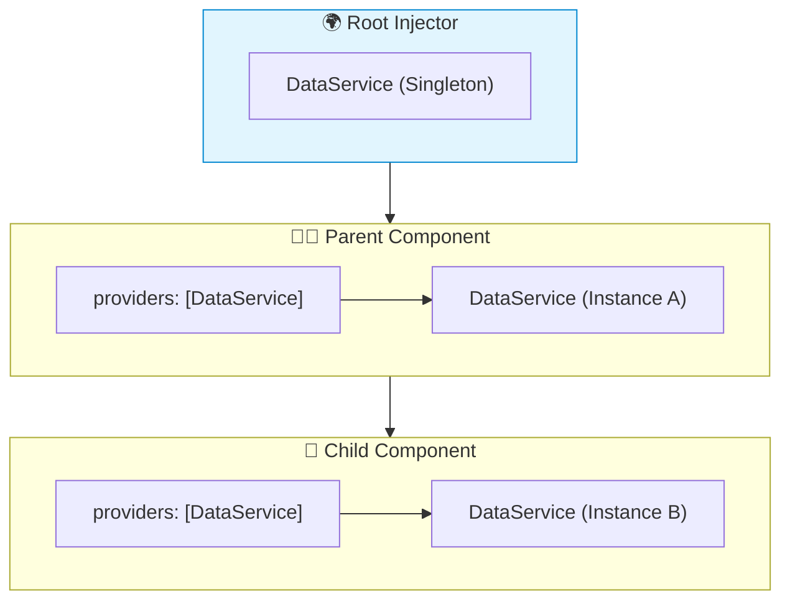
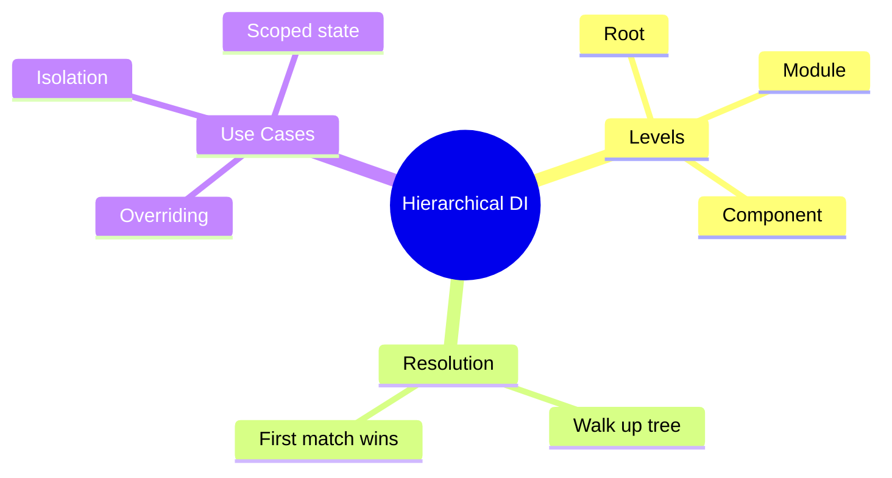

# 📦 Use Case 4: Hierarchical Injectors

> **💡 Lightbulb Moment**: Angular has a tree of injectors! Components can override services for themselves and children.

---

## 1. 🔍 Injector Hierarchy

```
Root Injector (providedIn: 'root')
    ↓
Module Injector
    ↓
Component Injector (providers: [...])
    ↓
Child Component Injectors
```

---

## 2. 🚀 Component-Level Providers

```typescript
@Component({
    providers: [LoggerService]  // New instance for this component tree
})
export class FeatureComponent {
    logger = inject(LoggerService);  // Gets local instance
}
```

### Override Parent Service
```typescript
// Parent provides base implementation
@Component({
    selector: 'app-parent',
    providers: [{ provide: DataService, useClass: BaseDataService }]
})

// Child can override
@Component({
    selector: 'app-child',
    providers: [{ provide: DataService, useClass: CachedDataService }]
})
```

### 📊 Data Flow Diagram



### 📦 Data Flow Summary (Visual Box Diagram)

```
┌─────────────────────────────────────────────────────────────┐
│  INJECTOR HIERARCHY (Resolution walks UP the tree)          │
│                                                             │
│   ① ROOT INJECTOR (providedIn: 'root')                      │
│   ┌───────────────────────────────────────────────────────┐ │
│   │ DataService: Instance #1 (SINGLETON)                  │ │
│   │                                                       │ │
│   │ // All app shares this unless overridden              │ │
│   └───────────────────────────────────────────────────────┘ │
│          │                                                  │
│          ▼                                                  │
│   ② PARENT COMPONENT (with providers array)                 │
│   ┌───────────────────────────────────────────────────────┐ │
│   │ @Component({                                          │ │
│   │   providers: [DataService]  // ⚡ NEW INSTANCE         │ │
│   │ })                                                    │ │
│   │                                                       │ │
│   │ DataService: Instance #2                              │ │
│   │  │                                                    │ │
│   │  │  // This component and ALL children get #2         │ │
│   │  │  // unless a child also overrides                  │ │
│   └──│────────────────────────────────────────────────────┘ │
│      │                                                      │
│      ├─────────────────┐                                    │
│      ▼                 ▼                                    │
│   ┌────────┐      ┌────────┐                                │
│   │Child A │      │Child B │  (with providers)              │
│   │        │      │        │                                │
│   │Gets #2 │      │Gets #3 │  ← NEW instance!               │
│   └────────┘      └────────┘                                │
│                                                             │
│   📋 RESOLUTION ALGORITHM:                                  │
│   ┌───────────────────────────────────────────────────────┐ │
│   │ inject(DataService):                                  │ │
│   │   1. Check MY component's providers → Found? Use it!  │ │
│   │   2. Check PARENT's providers       → Found? Use it!  │ │
│   │   3. Walk up to MODULE injector     → Found? Use it!  │ │
│   │   4. Walk up to ROOT injector       → Found? Use it!  │ │
│   │   5. Throw "No provider" error                        │ │
│   └───────────────────────────────────────────────────────┘ │
└─────────────────────────────────────────────────────────────┘
```

**Hierarchical DI Use Cases:**
1. **State isolation**: Each feature gets its own service instance
2. **Override for testing**: Provide mock at component level
3. **Different configs**: Each widget with unique settings
4. **Scoped caching**: Separate caches per component tree

> **Key Takeaway**: Component `providers: []` creates a NEW instance for that component tree. Children inherit parent's instance unless they also override!

---

## 3. ❓ Interview Questions

### Basic Questions

#### Q1: What's the difference between providedIn: 'root' and component providers?
**Answer:**
| providedIn: 'root' | Component providers |
|-------------------|---------------------|
| Singleton | Instance per component tree |
| Shared state | Isolated state |
| App-wide | Scoped |

#### Q2: When would you provide a service at component level?
**Answer:**
- Need separate instances for different features
- State isolation between widgets
- Testing component with mock service

---

### Scenario-Based Questions

#### Scenario: Multiple Instances
**Question:** You have 3 todo-list components on one page. Each needs its own TodoService instance.

**Answer:**
```typescript
@Component({
    selector: 'app-todo-list',
    providers: [TodoService]  // Each instance gets its own!
})
export class TodoListComponent {
    todos = inject(TodoService);
}
```

---

## 🧠 Mind Map


