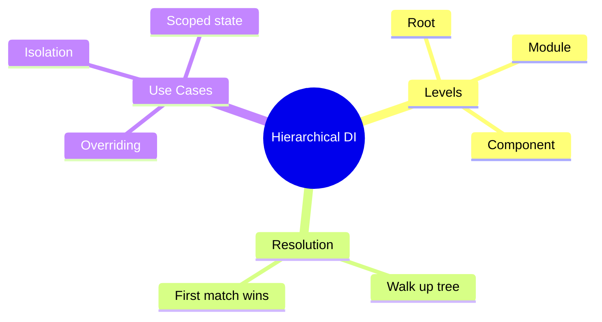

# 📦 Use Case 4: Hierarchical Injectors

> **💡 Lightbulb Moment**: Angular has a tree of injectors! Components can override services for themselves and children.

---

## 1. 🔍 Injector Hierarchy

```
Root Injector (providedIn: 'root')
    ↓
Module Injector
    ↓
Component Injector (providers: [...])
    ↓
Child Component Injectors
```

---

## 2. 🚀 Component-Level Providers

```typescript
@Component({
    providers: [LoggerService]  // New instance for this component tree
})
export class FeatureComponent {
    logger = inject(LoggerService);  // Gets local instance
}
```

### Override Parent Service
```typescript
// Parent provides base implementation
@Component({
    selector: 'app-parent',
    providers: [{ provide: DataService, useClass: BaseDataService }]
})

// Child can override
@Component({
    selector: 'app-child',
    providers: [{ provide: DataService, useClass: CachedDataService }]
})
```

---

## 3. ❓ Interview Questions

### Basic Questions

#### Q1: What's the difference between providedIn: 'root' and component providers?
**Answer:**
| providedIn: 'root' | Component providers |
|-------------------|---------------------|
| Singleton | Instance per component tree |
| Shared state | Isolated state |
| App-wide | Scoped |

#### Q2: When would you provide a service at component level?
**Answer:**
- Need separate instances for different features
- State isolation between widgets
- Testing component with mock service

---

### Scenario-Based Questions

#### Scenario: Multiple Instances
**Question:** You have 3 todo-list components on one page. Each needs its own TodoService instance.

**Answer:**
```typescript
@Component({
    selector: 'app-todo-list',
    providers: [TodoService]  // Each instance gets its own!
})
export class TodoListComponent {
    todos = inject(TodoService);
}
```

---

## 🧠 Mind Map


