# 📦 Use Case 4: Hierarchical Injectors

> **💡 Lightbulb Moment**: Angular has a tree of injectors! Components can override services for themselves and children.

---

## 1. 🔍 Injector Hierarchy

```
Root Injector (providedIn: 'root')
    ↓
Module Injector
    ↓
Component Injector (providers: [...])
    ↓
Child Component Injectors
```

---

## 2. 🚀 Component-Level Providers

```typescript
@Component({
    providers: [LoggerService]  // New instance for this component tree
})
export class FeatureComponent {
    logger = inject(LoggerService);  // Gets local instance
}
```

### Override Parent Service
```typescript
// Parent provides base implementation
@Component({
    selector: 'app-parent',
    providers: [{ provide: DataService, useClass: BaseDataService }]
})

// Child can override
@Component({
    selector: 'app-child',
    providers: [{ provide: DataService, useClass: CachedDataService }]
})
```

### 📊 Data Flow Diagram

```mermaid
flowchart TD
    subgraph Root["🌍 Root Injector"]
        RootService["DataService (Singleton)"]
    end
    
    subgraph Parent["👨‍💼 Parent Component"]
        ParentOverride["providers: [DataService]"]
        ParentInstance["DataService (Instance A)"]
    end
    
    subgraph Child["👶 Child Component"]
        ChildOverride["providers: [DataService]"]
        ChildInstance["DataService (Instance B)"]
    end
    
    Root --> Parent
    Parent --> Child
    ParentOverride --> ParentInstance
    ChildOverride --> ChildInstance
    
    style Root fill:#e1f5fe,stroke:#0288d1
```



### 📦 Data Flow Summary (Visual Box Diagram)

```
┌─────────────────────────────────────────────────────────────┐
│  INJECTOR HIERARCHY (Resolution walks UP the tree)          │
│                                                             │
│   ① ROOT INJECTOR (providedIn: 'root')                      │
│   ┌───────────────────────────────────────────────────────┐ │
│   │ DataService: Instance #1 (SINGLETON)                  │ │
│   │                                                       │ │
│   │ // All app shares this unless overridden              │ │
│   └───────────────────────────────────────────────────────┘ │
│          │                                                  │
│          ▼                                                  │
│   ② PARENT COMPONENT (with providers array)                 │
│   ┌───────────────────────────────────────────────────────┐ │
│   │ @Component({                                          │ │
│   │   providers: [DataService]  // ⚡ NEW INSTANCE         │ │
│   │ })                                                    │ │
│   │                                                       │ │
│   │ DataService: Instance #2                              │ │
│   │  │                                                    │ │
│   │  │  // This component and ALL children get #2         │ │
│   │  │  // unless a child also overrides                  │ │
│   └──│────────────────────────────────────────────────────┘ │
│      │                                                      │
│      ├─────────────────┐                                    │
│      ▼                 ▼                                    │
│   ┌────────┐      ┌────────┐                                │
│   │Child A │      │Child B │  (with providers)              │
│   │        │      │        │                                │
│   │Gets #2 │      │Gets #3 │  ← NEW instance!               │
│   └────────┘      └────────┘                                │
│                                                             │
│   📋 RESOLUTION ALGORITHM:                                  │
│   ┌───────────────────────────────────────────────────────┐ │
│   │ inject(DataService):                                  │ │
│   │   1. Check MY component's providers → Found? Use it!  │ │
│   │   2. Check PARENT's providers       → Found? Use it!  │ │
│   │   3. Walk up to MODULE injector     → Found? Use it!  │ │
│   │   4. Walk up to ROOT injector       → Found? Use it!  │ │
│   │   5. Throw "No provider" error                        │ │
│   └───────────────────────────────────────────────────────┘ │
└─────────────────────────────────────────────────────────────┘
```

**Hierarchical DI Use Cases:**
1. **State isolation**: Each feature gets its own service instance
2. **Override for testing**: Provide mock at component level
3. **Different configs**: Each widget with unique settings
4. **Scoped caching**: Separate caches per component tree

> **Key Takeaway**: Component `providers: []` creates a NEW instance for that component tree. Children inherit parent's instance unless they also override!

---

## 🎯 What Problem Does This Solve?

### The Problem: Global Singletons Aren't Always Enough
**Without Hierarchical Injectors (BAD):**
```typescript
// Only one list instance for the WHOLE app
@Injectable({providedIn: 'root'})
export class ListService { items = []; }

// If I have 2 lists on screen, they share the same data! 😱
// Deleting from List A deletes from List B.
```

**Problems:**
1.  **Shared State Issues**: Sometimes you want *separate* instances for separate components.
2.  **Lack of Isolation**: A child component might need to override a parent's service logic.
3.  **Memory Leaks**: A root service lives forever. A component service dies with the component.

### How Hierarchical DI Solves This
**With Component Providers (GOOD):**
```typescript
@Component({
  providers: [ListService] // ⚡ New instance per component!
})
class ListComponent {}
```

| Problem | Hierarchical Solution |
|---------|-----------------------|
| Shared State | **Isolation**: Each component gets its own fresh instance of the service. |
| Override Logic | **Polymorphism**: A child can provide a *different* implementation (Subclass) than the parent. |
| Memory | **Lifecycle**: Component-provided services are destroyed when the component is destroyed. |

---

## 📚 Key Classes & Types Explained

### 1. `ElementInjector`
The injector associated with a specific DOM element (Component/Directive). It checks its own `providers` array first.

### 2. `ModuleInjector`
The injector formed by `@NgModule` or `providedIn: 'root'`. It's a flat, app-wide hierarchy.

### 3. Resolution Rules
1.  **Step 1**: Check `ElementInjector` (Component).
2.  **Step 2**: Check Parent `ElementInjectors` (up the DOM tree).
3.  **Step 3**: Check `ModuleInjector` (Root).
4.  **Step 4**: Error (or null if Optional).

---

## 🌍 Real-World Use Cases

### 1. Isolated Widget State (e.g., Accordion, Tabs)
Each `TabComponent` needs its own state (isOpen, isActive), but they all use the same `TabStateService` class.
```typescript
@Component({
  selector: 'app-tab',
  providers: [TabStateService] // Each tab is independent
})
```

### 2. Data Tables with Pagination
If you have 2 tables on one page, they need separate `PaginationService` instances (Page 1 vs Page 5).
```typescript
@Component({
  selector: 'app-table',
  providers: [PaginationService]
})
```

### 3. Smart/Dumb Component Architecture
A "Smart" container provides a service to manage state for all its "Dumb" children. The children execute logic on the shared parent instance without knowing it came from the parent.

### 4. Overriding for specific sections
A "Dark Mode" section of the app overrides the `ThemeService` to strictly return dark colors, while the rest of the app uses the user's preference.

### 5. Services limited to a Route
Using `Route` providers to ensure a service exists only while that route is active.

---

## ❓ Complete Interview Questions (20+)

### Basic Questions

**Q1: What happens if I provide a service in a Component?**
> A: Angular creates a new instance of that service for that component and all its children.

**Q2: What is the difference between `@Injectable({providedIn: 'root'})` and `providers: []`?**
> A: `root` creates a Singleton. `providers: []` creates a non-singleton (scoped) instance.

**Q3: How do child components access the parent's service instance?**
> A: By standard injection `inject(Service)`. DI looks up the tree and finds the parent's instance.

**Q4: If a child also provides the service, which one does it get?**
> A: It gets its *own* instance (shadowing). It "hides" the parent's instance.

**Q5: Can I see the parent's instance if I override it?**
> A: Yes, using `@SkipSelf()`.

---

### Scenario-Based Questions

**Q6: Scenario: 3 Tabs on a page. Each needs separate state. How?**
> A: Provide the StateService in the `TabComponent` decorators.

**Q7: Scenario: A 'Settings' pane needs to temporarily override the global config.**
> A: Provide a custom `ConfigService` in the `SettingsComponent` providers array.

**Q8: Scenario: Memory leak suspect. A service holds data after component close.**
> A: Check if it's provided in `root`. If so, it lives forever. Move it to the Component's `providers` to destroy it with the component.

**Q9: Scenario: Two sibling components need to share data.**
> A: They CANNOT share if they both provide the service. They must use a service provided by their *Parent* (or Root).

**Q10: Scenario: Implementing a 'Wizard' form (Step 1, 2, 3).**
> A: Provide `WizardStateService` in the `WizardContainer`. Steps 1, 2, 3 inject it to share state.

---

### Advanced Questions

**Q11: What is the 'Host' in DI?**
> A: The component/element on which the provider is defined.

**Q12: How does `viewProviders` differ from `providers`?**
> A: `viewProviders` limits visibility to the View (template) only, NOT Content (projected content/ng-content).

**Q13: Why prefer `providedIn: 'root'` over Module providers?**
> A: Tree-shaking. Root services can be removed if unused. Module providers are always bundled.

**Q14: How does Lazy Loading affect DI?**
> A: Lazy modules create their own child injector. Services provided there are visible only to that module (and children).

**Q15: Can `ElementInjector` facilitate communication?**
> A: Yes, parent-child communication without Input/Output.

**Q16: What is the 'resolution path'?**
> A: The path Angular walks: Element -> Parent Element -> ... -> Root Module -> Platform.

**Q17: How to debug DI hierarchy?**
> A: Using Angular DevTools, you can inspect the provider tree for selected components.

**Q18: Performance cost of component providers?**
> A: Each component instance creates a service instance. 1000 rows = 1000 services. Be careful with memory!

**Q19: Can I restrict injection to the Host only?**
> A: Yes, using `@Host()` decorator.

**Q20: What is a Sandboxed Service?**
> A: A pattern where a component provides a service to isolate its state from the rest of the application.

---

## 🧠 Mind Map


