# 🎫 Use Case 4: Injection Tokens

> **Goal**: Master `InjectionToken` for injecting non-class dependencies like configuration objects, primitive values, and interfaces - enabling type-safe DI for anything.

---

## 1. 🔍 How It Works (The Concept)

### The Problem
Angular's DI system uses **class types** as tokens by default:
```typescript
constructor(private auth: AuthService) { }  // AuthService IS the token
```

But what if you need to inject:
- A **configuration object** (plain JS object)
- A **string** (API URL)
- An **interface** (no runtime type)
- A **function**?

Classes work as tokens because they exist at runtime. Interfaces and primitives don't!

### The Solution: InjectionToken
`InjectionToken` creates a unique identifier that can represent ANY value type.

### 📊 Token Comparison Diagram

```mermaid
flowchart TB
    subgraph ClassBased["📦 Class-Based Injection"]
        Service["AuthService (Class)"]
        ServiceToken["Token = AuthService.constructor"]
        ServiceInject["constructor(auth: AuthService)"]
    end
    
    subgraph TokenBased["🎫 Token-Based Injection"]
        Value["{ apiUrl: '...', timeout: 5000 }"]
        Token["Token = new InjectionToken()"]
        TokenInject["constructor(@Inject(TOKEN) config)"]
    end
    
    Service --> ServiceToken
    ServiceToken --> ServiceInject
    
    Value --> Token
    Token --> TokenInject
    
    style Service fill:#e8f5e9,stroke:#388e3c
    style Value fill:#fff3e0,stroke:#ff6f00
    style Token fill:#e3f2fd,stroke:#1976d2,stroke-width:2px
```



### Default vs. Token Behavior

| Aspect | Class Token | InjectionToken |
|--------|-------------|----------------|
| **What it can inject** | Only classes | Anything: objects, strings, functions |
| **Runtime existence** | Class exists at runtime | Must be imported |
| **Type safety** | Automatic from class | Generic type parameter |
| **Decorator needed** | No | Yes: `@Inject(TOKEN)` |

---

## 2. 🚀 Step-by-Step Implementation Guide

### Step 1: Define the Configuration Interface

```typescript
// config.model.ts

/**
 * 🛡️ CRITICAL: Define a TypeScript interface for type safety
 * This interface doesn't exist at runtime - just for compile time!
 */
export interface AppConfig {
    apiUrl: string;
    appName: string;
    version: string;
    features: {
        darkMode: boolean;
        analytics: boolean;
        notifications: boolean;
    };
    timeout: number;
}
```

### Step 2: Create the InjectionToken

```typescript
// config.token.ts
import { InjectionToken } from '@angular/core';
import { AppConfig } from './config.model';

/**
 * 🛡️ CRITICAL: InjectionToken<T> is the magic!
 * - Generic type T provides compile-time type checking
 * - The string is just for debugging ('app.config')
 * - This token is the UNIQUE KEY for this dependency
 */
export const APP_CONFIG = new InjectionToken<AppConfig>('app.config');

// You can also provide a default value:
export const API_URL = new InjectionToken<string>('api.url', {
    providedIn: 'root',
    factory: () => 'https://api.default.com'  // 🛡️ Default value!
});
```

### Step 3: Create the Configuration Value

```typescript
// config.values.ts
import { AppConfig } from './config.model';

/**
 * 🛡️ CRITICAL: This is a plain object, NOT a class!
 * It matches the AppConfig interface
 */
export const productionConfig: AppConfig = {
    apiUrl: 'https://api.production.com',
    appName: 'My Angular App',
    version: '1.0.0',
    features: {
        darkMode: true,
        analytics: true,
        notifications: true
    },
    timeout: 30000
};

export const developmentConfig: AppConfig = {
    apiUrl: 'https://api.dev.local',
    appName: 'My Angular App (DEV)',
    version: '1.0.0-dev',
    features: {
        darkMode: true,
        analytics: false,  // No tracking in dev
        notifications: false
    },
    timeout: 5000  // Shorter for debugging
};
```

### Step 4: Provide Using useValue

```typescript
// app.module.ts or app.config.ts
import { APP_CONFIG } from './config.token';
import { productionConfig, developmentConfig } from './config.values';
import { environment } from '../environments/environment';

/**
 * 🛡️ CRITICAL: useValue provides a static value
 * The token APP_CONFIG becomes the key
 * The value is what gets injected
 */
export const appConfig: ApplicationConfig = {
    providers: [
        {
            provide: APP_CONFIG,  // The token (key)
            useValue: environment.production 
                ? productionConfig 
                : developmentConfig  // The value
        }
    ]
};

// Or at component level:
@Component({
    providers: [
        { provide: APP_CONFIG, useValue: customConfig }
    ]
})
```

### Step 5: Inject with @Inject Decorator

```typescript
// http.service.ts
import { Injectable, Inject } from '@angular/core';
import { HttpClient } from '@angular/common/http';
import { APP_CONFIG } from './config.token';
import { AppConfig } from './config.model';

@Injectable({ providedIn: 'root' })
export class ApiService {
    /**
     * 🛡️ CRITICAL: @Inject() decorator required for tokens!
     * - Normal class injection: no decorator needed
     * - Token injection: MUST use @Inject(TOKEN)
     */
    constructor(
        private http: HttpClient,
        @Inject(APP_CONFIG) private config: AppConfig  // 🛡️ CRITICAL
    ) {
        console.log('API URL:', this.config.apiUrl);
    }
    
    get<T>(endpoint: string): Observable<T> {
        return this.http.get<T>(`${this.config.apiUrl}/${endpoint}`, {
            timeout: this.config.timeout
        });
    }
}
```

### 📊 Injection Flow Diagram

```mermaid
sequenceDiagram
    participant M as 📦 Module
    participant DI as 🔧 DI Container
    participant Token as 🎫 APP_CONFIG
    participant Value as 📋 Config Object
    participant Svc as 🛠️ ApiService
    
    Note over M: App Bootstrap
    M->>DI: Register provider
    DI->>Token: Create token entry
    DI->>Value: Store { apiUrl, ... }
    
    Note over Svc: Service Creation
    Svc->>DI: Need @Inject(APP_CONFIG)
    DI->>Token: Lookup APP_CONFIG
    Token-->>DI: Found!
    DI->>Value: Retrieve value
    Value-->>Svc: { apiUrl: 'https://...', ... }
    
    Note over Svc: ✅ Has type-safe config!
```



---

## 3. 🐛 Common Pitfalls & Debugging

### ❌ Pitfall 1: Forgetting @Inject Decorator

**Bad Code:**
```typescript
// ❌ Missing @Inject - will fail at runtime!
constructor(private config: AppConfig) { }
```

**Error:**
```
NullInjectorError: No provider for AppConfig!
```

**Good Code:**
```typescript
// ✅ With @Inject decorator
constructor(@Inject(APP_CONFIG) private config: AppConfig) { }
```

**Why it fails:** `AppConfig` is an interface - it doesn't exist at runtime. Angular can't use it as a token. You must explicitly provide the token via `@Inject()`.

---

### ❌ Pitfall 2: Creating Multiple Token Instances

**Bad Code:**
```typescript
// file-a.ts
export const CONFIG = new InjectionToken<Config>('config');

// file-b.ts  
export const CONFIG = new InjectionToken<Config>('config');  // ❌ Different token!

// These are TWO DIFFERENT tokens!
```

**Good Code:**
```typescript
// config.token.ts (single source of truth)
export const CONFIG = new InjectionToken<Config>('config');

// file-a.ts
import { CONFIG } from './config.token';

// file-b.ts
import { CONFIG } from './config.token';  // ✅ Same token!
```

**Why it fails:** Each `new InjectionToken()` creates a unique token. Even with the same description string, they're different tokens.

---

### ❌ Pitfall 3: Using useValue with Mutable Objects

**Bad Code:**
```typescript
const sharedConfig = { count: 0 };

providers: [
    { provide: CONFIG, useValue: sharedConfig }
]

// Component A
this.config.count++;  // ❌ Modifies shared object!

// Component B
console.log(this.config.count);  // 1 - Unexpected mutation!
```

**Good Code:**
```typescript
// Option 1: Deep freeze
const sharedConfig = Object.freeze({ count: 0 });

// Option 2: Use factory for fresh copies
providers: [
    { 
        provide: CONFIG, 
        useFactory: () => ({ count: 0 })  // ✅ New object each time
    }
]
```

---

## 4. ⚡ Performance & Architecture

### Performance Characteristics

| Aspect | Performance | Notes |
|--------|-------------|-------|
| **Token Lookup** | O(1) | Hash map lookup |
| **Value Creation** | Once | useValue is cached |
| **Memory** | Minimal | Single value reference |
| **Bundle Size** | Negligible | Token is tiny |

### Architecture Pattern: Configuration Hierarchy

```mermaid
flowchart TB
    subgraph Tokens["🎫 Configuration Tokens"]
        APP["APP_CONFIG<br/>Global settings"]
        API["API_CONFIG<br/>API endpoints"]
        FEATURE["FEATURE_FLAGS<br/>Feature toggles"]
    end
    
    subgraph Providers["📦 Provider Layers"]
        Env["Environment Layer<br/>(dev/stage/prod)"]
        Module["Module Layer<br/>(feature overrides)"]
        Component["Component Layer<br/>(local overrides)"]
    end
    
    subgraph Consumers["🛠️ Consumers"]
        Services["Services"]
        Components["Components"]
        Guards["Guards"]
    end
    
    Tokens --> Env
    Env --> Module
    Module --> Component
    Component --> Consumers
    
    style APP fill:#e3f2fd,stroke:#1976d2
    style API fill:#fff3e0,stroke:#ff6f00
    style FEATURE fill:#e8f5e9,stroke:#388e3c
```



### Type Safety Benefits

```typescript
// Without InjectionToken
const config = { apiUrl: 'http://...' };  // any type 😱

// With InjectionToken<AppConfig>
@Inject(APP_CONFIG) config: AppConfig
// TypeScript knows:
// - config.apiUrl is string ✅
// - config.timeout is number ✅
// - config.invalid is error ❌
```

---

## 5. 🌍 Real World Use Cases

### 1. Environment Configuration
```typescript
export const ENV_CONFIG = new InjectionToken<EnvConfig>('env');

providers: [
    {
        provide: ENV_CONFIG,
        useValue: environment  // Angular's environment.ts
    }
]
```

### 2. Feature Flags
```typescript
export const FEATURE_FLAGS = new InjectionToken<FeatureFlags>('features');

// Easily swap between flag sources:
{ provide: FEATURE_FLAGS, useValue: staticFlags }       // Hard-coded
{ provide: FEATURE_FLAGS, useClass: RemoteFlagService } // Server-fetched
```

### 3. Third-Party Library Configuration
```typescript
export const STRIPE_KEY = new InjectionToken<string>('stripe.key');
export const SENTRY_DSN = new InjectionToken<string>('sentry.dsn');

providers: [
    { provide: STRIPE_KEY, useValue: 'pk_live_xxx' },
    { provide: SENTRY_DSN, useValue: 'https://xxx@sentry.io/123' }
]
```

---

## 6. 📝 The Analogy: "Hotel Key Cards" 🏨

### Class = Your ID
- When you check in with your **passport** (class), the hotel recognizes you
- The passport IS your identity

### InjectionToken = A Key Card
- The hotel gives you a **key card** (token)
- The card unlocks a specific room (value)
- You could assign ANY room to that card
- The card is just a pointer, not the thing itself

```mermaid
flowchart LR
    subgraph Class["Passport Check-in"]
        ID["👤 Your Face"]
        You["You"]
    end
    
    subgraph Token["Key Card Check-in"]
        Card["🎫 Key Card"]
        Room["🛏️ Room 420"]
    end
    
    ID -->|"IS"| You
    Card -->|"OPENS"| Room
    
    style Card fill:#e3f2fd,stroke:#1976d2,stroke-width:2px
```



**Key insight:** The card (token) doesn't care what's in the room. You could put a presidential suite or a broom closet behind that card. The card just unlocks access.

---

## 7. ❓ Interview & Concept Questions

### Core Concepts

**Q1: Why can't we inject interfaces directly in Angular?**
> **A:** Interfaces are TypeScript-only constructs. They're erased during compilation and don't exist at runtime. Angular's DI needs a runtime token to look up dependencies.

**Q2: What's the purpose of the string in `new InjectionToken('name')`?**
> **A:** It's purely for debugging. It appears in error messages like "No provider for name". Multiple tokens can have the same string but are still unique.

### Implementation

**Q3: What are the three main provider types for InjectionToken?**
> **A:**
> - `useValue`: Provide a static value (objects, strings)
> - `useFactory`: Provide via function (dynamic creation)
> - `useClass`: Provide a class implementation
> - `useExisting`: Alias to another token

**Q4: Show how to provide a default value for an InjectionToken:**
> **A:**
> ```typescript
> export const API_URL = new InjectionToken<string>('api', {
>     providedIn: 'root',
>     factory: () => 'https://default.api.com'
> });
> ```

### Debugging

**Q5: You get "No provider for InjectionToken config". What should you check?**
> **A:** 
> 1. Is the token imported from the correct file?
> 2. Is there a provider for this token?
> 3. Is `@Inject(TOKEN)` used in the constructor?
> 4. Are you using the same token instance?

**Q6: Two modules provide the same token with different values. Which wins?**
> **A:** The hierarchically closest provider wins. Component-level beats module-level beats root-level.

### Architecture

**Q7: When should you use InjectionToken vs a ConfigService class?**
> **A:**
> - **InjectionToken**: Static config, feature flags, simple values
> - **ConfigService**: Dynamic config, needs to fetch from server, has methods

**Q8: How would you override configuration for testing?**
> **A:**
> ```typescript
> TestBed.configureTestingModule({
>     providers: [
>         { provide: APP_CONFIG, useValue: testConfig }
>     ]
> });
> ```

### Scenario-Based

**Q9: Design a system where API URL differs per environment.**
> **A:**
> ```typescript
> export const API_URL = new InjectionToken<string>('api');
> 
> // In app.config.ts
> { provide: API_URL, useValue: environment.apiUrl }
> 
> // In service
> constructor(@Inject(API_URL) private apiUrl: string) { }
> ```

**Q10: You need to inject a function, not an object. How?**
> **A:**
> ```typescript
> type LoggerFn = (msg: string) => void;
> export const LOGGER = new InjectionToken<LoggerFn>('logger');
> 
> { provide: LOGGER, useValue: (msg) => console.log(msg) }
> 
> constructor(@Inject(LOGGER) private log: LoggerFn) {
>     this.log('Hello!');
> }
> ```
